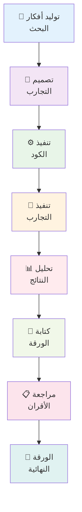

⏱️ **وقت القراءة المقدر**: 18 دقيقة

## مقدمة

تخيل وجود باحث ذكاء اصطناعي لا يكل ولا يمل يعمل على مدار 24/7، ينتج الأوراق البحثية، ويجري التجارب، ويدفع حدود الاكتشاف العلمي بينما أنت نائم. مع **عالم الذكاء الاصطناعي من SakanaAI** والبنية التحتية للنماذج اللغوية المحلية، لم تعد هذه خيالاً علمياً - بل واقع عملي يمكنك تنفيذه اليوم.

سيرشدك هذا الدليل الشامل خلال إعداد خط أنابيب بحث آلي باستخدام:
- **عالم الذكاء الاصطناعي من SakanaAI**: أول نظام في العالم للاكتشاف العلمي الآلي بالكامل
- **OrbStack Docker**: الحاويات خفيفة الوزن للنشر السلس
- **Ollama و LM Studio**: الاستدلال المحلي للنماذج اللغوية للبحث الفعال من حيث التكلفة والخصوصية
- **إدارة الطوابير**: التشغيل المستمر مع جدولة المهام الذكية

بحلول نهاية هذا البرنامج التعليمي، ستحصل على بيئة بحث قوية ومكتفية ذاتياً قادرة على إنتاج الأوراق العلمية عبر مجالات متعددة دون تدخل بشري مستمر.

## فهم عالم الذكاء الاصطناعي

### ما يجعل عالم الذكاء الاصطناعي ثورياً

يمثل [عالم الذكاء الاصطناعي من SakanaAI](https://github.com/SakanaAI/AI-Scientist) تغييراً جذرياً في البحث الآلي. على عكس أدوات الذكاء الاصطناعي التقليدية التي تساعد الباحثين، هذا النظام **يقوم بمشاريع بحثية كاملة بشكل مستقل**:

- **الأتمتة من البداية للنهاية**: من توليد الأفكار إلى كتابة الأوراق ومراجعة الأقران
- **دعم القوالب المتعددة**: مجالات بحث NanoGPT و 2D Diffusion و Grokking
- **التجريب الآلي**: يصمم وينفذ ويحلل التجارب
- **إنتاج أوراق LaTeX**: ينتج أوراقاً أكاديمية جاهزة للنشر
- **نظام مراجعة الأقران**: آليات تقييم مدمجة لتقييم الجودة

### نظرة عامة على هندسة النظام



## المتطلبات المسبقة وإعداد البيئة

### متطلبات النظام

```bash
# الحد الأدنى لمتطلبات الأجهزة
- الذاكرة: 16GB (32GB موصى به للنماذج الأكبر)
- التخزين: 50GB مساحة حرة
- المعالج: 8+ أنوية (Apple Silicon أو x86_64)
- وحدة معالجة الرسوميات: اختيارية لكن موصى بها (NVIDIA RTX 3080+ أو Apple M-series)

# التبعيات البرمجية
- macOS 13+ أو Linux Ubuntu 20.04+
- OrbStack أو Docker Desktop
- Python 3.8+
- Git
```

### تثبيت OrbStack

يوفر OrbStack أداءً فائقاً مقارنة بـ Docker Desktop، خاصة على macOS:

```bash
# تثبيت OrbStack عبر Homebrew
brew install orbstack

# بدء خدمة OrbStack
orbstack start

# التحقق من التثبيت
orbstack --version
```

### إعداد Ollama

يوفر Ollama حلاً ممتازاً للاستدلال المحلي للنماذج اللغوية:

```bash
# تثبيت Ollama
curl -fsSL https://ollama.ai/install.sh | sh

# بدء خدمة Ollama
ollama serve

# تنزيل النماذج الموصى بها للبحث
ollama pull llama2:70b          # نموذج السياق الكبير
ollama pull codellama:34b       # توليد الكود
ollama pull mistral:7b          # الاستدلال السريع
ollama pull deepseek-coder:33b  # البرمجة المتقدمة

# التحقق من التثبيت
ollama list
```

### إعداد بديل LM Studio

لإدارة النماذج القائمة على واجهة المستخدم الرسومية:

```bash
# تنزيل LM Studio من https://lmstudio.ai/
# تثبيت وتكوين خادم API
# نقطة النهاية الافتراضية لـ API: http://localhost:1234/v1
```

## تثبيت وتكوين عالم الذكاء الاصطناعي

### استنساخ وإعداد المستودع

```bash
# استنساخ مستودع عالم الذكاء الاصطناعي
git clone https://github.com/SakanaAI/AI-Scientist.git
cd AI-Scientist

# إنشاء دليل مخصص لإعدادنا
mkdir -p ~/ai-research-lab
cd ~/ai-research-lab

# نسخ ملفات عالم الذكاء الاصطناعي
cp -r /path/to/AI-Scientist/* .
```

### تكوين بيئة Docker

إنشاء إعداد Docker شامل:

```dockerfile
# Dockerfile لعالم الذكاء الاصطناعي مع دعم النموذج اللغوي المحلي
FROM python:3.9-slim

# تثبيت تبعيات النظام
RUN apt-get update && apt-get install -y \
    git \
    wget \
    curl \
    build-essential \
    texlive-full \
    pandoc \
    && rm -rf /var/lib/apt/lists/*

# تعيين دليل العمل
WORKDIR /app

# نسخ المتطلبات وتثبيت تبعيات Python
COPY requirements.txt .
RUN pip install --no-cache-dir -r requirements.txt

# تثبيت حزم إضافية للوظائف المحسنة
RUN pip install \
    ollama \
    openai \
    anthropic \
    tiktoken \
    matplotlib \
    seaborn \
    jupyter \
    notebook

# نسخ كود عالم الذكاء الاصطناعي
COPY . .

# إنشاء الأدلة الضرورية
RUN mkdir -p /app/results /app/logs /app/queue

# تعيين متغيرات البيئة
ENV PYTHONPATH=/app
ENV OLLAMA_HOST=host.docker.internal:11434
ENV LM_STUDIO_BASE_URL=http://host.docker.internal:1234/v1

# فتح المنافذ لـ Jupyter والمراقبة
EXPOSE 8888 8080

# إنشاء سكريبت البدء
COPY scripts/startup.sh /startup.sh
RUN chmod +x /startup.sh

CMD ["/startup.sh"]
```

### Docker Compose للمكدس الكامل

```yaml
# docker-compose.yml
version: '3.8'

services:
  ai-scientist:
    build: .
    container_name: ai-scientist-main
    volumes:
      - ./results:/app/results
      - ./logs:/app/logs
      - ./queue:/app/queue
      - ./templates:/app/templates
    ports:
      - "8888:8888"  # Jupyter
      - "8080:8080"  # لوحة المراقبة
    environment:
      - OLLAMA_HOST=host.docker.internal:11434
      - LM_STUDIO_BASE_URL=http://host.docker.internal:1234/v1
      - OPENAI_API_KEY=${OPENAI_API_KEY}
      - ANTHROPIC_API_KEY=${ANTHROPIC_API_KEY}
    depends_on:
      - redis
    networks:
      - ai-research-net

  redis:
    image: redis:7-alpine
    container_name: ai-scientist-redis
    ports:
      - "6379:6379"
    volumes:
      - redis_data:/data
    networks:
      - ai-research-net

  queue-manager:
    build: .
    container_name: ai-scientist-queue
    command: python scripts/queue_manager.py
    volumes:
      - ./queue:/app/queue
      - ./logs:/app/logs
    depends_on:
      - redis
      - ai-scientist
    networks:
      - ai-research-net

  monitoring:
    build: .
    container_name: ai-scientist-monitor
    command: python scripts/monitoring_dashboard.py
    ports:
      - "8081:8081"
    volumes:
      - ./logs:/app/logs
      - ./results:/app/results
    networks:
      - ai-research-net

volumes:
  redis_data:

networks:
  ai-research-net:
    driver: bridge
```

## تكامل النماذج اللغوية المحلية

### تكامل Ollama API

إنشاء عميل نموذج لغوي مخصص لـ Ollama:

```python
# scripts/ollama_client.py
import requests
import json
from typing import Dict, List, Optional
import logging

class OllamaClient:
    def __init__(self, base_url: str = "http://localhost:11434"):
        self.base_url = base_url
        self.logger = logging.getLogger(__name__)
    
    def generate(self, 
                model: str,
                prompt: str,
                temperature: float = 0.7,
                max_tokens: int = 4000,
                **kwargs) -> str:
        """توليد النص باستخدام Ollama API"""
        try:
            payload = {
                "model": model,
                "prompt": prompt,
                "stream": False,
                "options": {
                    "temperature": temperature,
                    "num_predict": max_tokens,
                    **kwargs
                }
            }
            
            response = requests.post(
                f"{self.base_url}/api/generate",
                json=payload,
                timeout=300
            )
            response.raise_for_status()
            
            result = response.json()
            return result.get("response", "")
            
        except Exception as e:
            self.logger.error(f"خطأ في توليد Ollama: {e}")
            raise
    
    def list_models(self) -> List[str]:
        """قائمة النماذج المتاحة"""
        try:
            response = requests.get(f"{self.base_url}/api/tags")
            response.raise_for_status()
            
            models = response.json().get("models", [])
            return [model["name"] for model in models]
            
        except Exception as e:
            self.logger.error(f"خطأ في سرد النماذج: {e}")
            return []
    
    def chat_completion(self,
                       model: str,
                       messages: List[Dict],
                       temperature: float = 0.7,
                       max_tokens: int = 4000) -> str:
        """إكمال المحادثة المتوافق مع OpenAI"""
        try:
            # تحويل الرسائل إلى مطالبة واحدة
            prompt = self._messages_to_prompt(messages)
            return self.generate(model, prompt, temperature, max_tokens)
            
        except Exception as e:
            self.logger.error(f"خطأ في إكمال المحادثة: {e}")
            raise
    
    def _messages_to_prompt(self, messages: List[Dict]) -> str:
        """تحويل تنسيق رسائل OpenAI إلى مطالبة"""
        prompt_parts = []
        
        for message in messages:
            role = message.get("role", "user")
            content = message.get("content", "")
            
            if role == "system":
                prompt_parts.append(f"النظام: {content}")
            elif role == "user":
                prompt_parts.append(f"المستخدم: {content}")
            elif role == "assistant":
                prompt_parts.append(f"المساعد: {content}")
        
        prompt_parts.append("المساعد:")
        return "\n\n".join(prompt_parts)

# اختبار العميل
if __name__ == "__main__":
    client = OllamaClient()
    print("النماذج المتاحة:", client.list_models())
    
    test_response = client.generate(
        model="llama2:7b",
        prompt="اشرح الحوسبة الكمية بمصطلحات بسيطة."
    )
    print("استجابة الاختبار:", test_response[:200] + "...")
```

### تكامل LM Studio

```python
# scripts/lm_studio_client.py
import openai
from typing import Dict, List
import logging

class LMStudioClient:
    def __init__(self, base_url: str = "http://localhost:1234/v1"):
        self.client = openai.OpenAI(
            base_url=base_url,
            api_key="lm-studio"  # مطلوب لكن يُتجاهل
        )
        self.logger = logging.getLogger(__name__)
    
    def generate(self, 
                model: str,
                prompt: str,
                temperature: float = 0.7,
                max_tokens: int = 4000,
                **kwargs) -> str:
        """توليد النص باستخدام LM Studio API"""
        try:
            messages = [{"role": "user", "content": prompt}]
            
            response = self.client.chat.completions.create(
                model=model,
                messages=messages,
                temperature=temperature,
                max_tokens=max_tokens,
                **kwargs
            )
            
            return response.choices[0].message.content
            
        except Exception as e:
            self.logger.error(f"خطأ في توليد LM Studio: {e}")
            raise
    
    def chat_completion(self,
                       model: str,
                       messages: List[Dict],
                       temperature: float = 0.7,
                       max_tokens: int = 4000) -> str:
        """إكمال المحادثة المباشر"""
        try:
            response = self.client.chat.completions.create(
                model=model,
                messages=messages,
                temperature=temperature,
                max_tokens=max_tokens
            )
            
            return response.choices[0].message.content
            
        except Exception as e:
            self.logger.error(f"خطأ في إكمال المحادثة: {e}")
            raise
    
    def list_models(self) -> List[str]:
        """قائمة النماذج المتاحة"""
        try:
            models = self.client.models.list()
            return [model.id for model in models.data]
            
        except Exception as e:
            self.logger.error(f"خطأ في سرد النماذج: {e}")
            return []

# اختبار العميل
if __name__ == "__main__":
    client = LMStudioClient()
    print("النماذج المتاحة:", client.list_models())
    
    test_response = client.generate(
        model="local-model",
        prompt="اشرح التعلم الآلي بمصطلحات بسيطة."
    )
    print("استجابة الاختبار:", test_response[:200] + "...")
```

## نظام إدارة الطوابير

### تنفيذ الطابور القائم على Redis

```python
# scripts/queue_manager.py
import redis
import json
import time
import logging
from datetime import datetime, timedelta
from typing import Dict, List, Optional, Any
from dataclasses import dataclass, asdict
from enum import Enum

class TaskStatus(Enum):
    PENDING = "pending"
    RUNNING = "running"
    COMPLETED = "completed"
    FAILED = "failed"
    CANCELLED = "cancelled"

@dataclass
class ResearchTask:
    id: str
    template: str
    model: str
    num_ideas: int
    priority: int = 1
    created_at: datetime = None
    started_at: datetime = None
    completed_at: datetime = None
    status: TaskStatus = TaskStatus.PENDING
    progress: int = 0
    error_message: str = ""
    results_path: str = ""
    
    def __post_init__(self):
        if self.created_at is None:
            self.created_at = datetime.now()

class QueueManager:
    def __init__(self, redis_host: str = "localhost", redis_port: int = 6379):
        self.redis_client = redis.Redis(
            host=redis_host, 
            port=redis_port, 
            decode_responses=True
        )
        self.logger = logging.getLogger(__name__)
        
        # مفاتيح الطابور
        self.pending_queue = "ai_scientist:pending"
        self.running_queue = "ai_scientist:running"
        self.completed_queue = "ai_scientist:completed"
        self.failed_queue = "ai_scientist:failed"
        self.task_data = "ai_scientist:tasks"
    
    def add_task(self, task: ResearchTask) -> str:
        """إضافة مهمة بحث جديدة إلى الطابور"""
        try:
            # تخزين بيانات المهمة
            task_json = json.dumps(asdict(task), default=str)
            self.redis_client.hset(self.task_data, task.id, task_json)
            
            # إضافة إلى طابور الانتظار مع الأولوية
            self.redis_client.zadd(
                self.pending_queue, 
                {task.id: task.priority}
            )
            
            self.logger.info(f"تم إضافة المهمة {task.id} إلى الطابور")
            return task.id
            
        except Exception as e:
            self.logger.error(f"خطأ في إضافة المهمة: {e}")
            raise
    
    def get_next_task(self) -> Optional[ResearchTask]:
        """الحصول على المهمة التالية ذات الأولوية العليا"""
        try:
            # الحصول على مهمة الأولوية العليا
            task_ids = self.redis_client.zrevrange(
                self.pending_queue, 0, 0
            )
            
            if not task_ids:
                return None
            
            task_id = task_ids[0]
            
            # الانتقال إلى طابور التشغيل
            self.redis_client.zrem(self.pending_queue, task_id)
            self.redis_client.sadd(self.running_queue, task_id)
            
            # الحصول على بيانات المهمة
            task_data = self.redis_client.hget(self.task_data, task_id)
            if not task_data:
                return None
            
            task_dict = json.loads(task_data)
            task = ResearchTask(**task_dict)
            task.status = TaskStatus.RUNNING
            task.started_at = datetime.now()
            
            # تحديث المهمة
            self.update_task(task)
            
            return task
            
        except Exception as e:
            self.logger.error(f"خطأ في الحصول على المهمة التالية: {e}")
            return None
    
    def update_task(self, task: ResearchTask):
        """تحديث حالة وبيانات المهمة"""
        try:
            task_json = json.dumps(asdict(task), default=str)
            self.redis_client.hset(self.task_data, task.id, task_json)
            
        except Exception as e:
            self.logger.error(f"خطأ في تحديث المهمة: {e}")
    
    def complete_task(self, task_id: str, results_path: str = ""):
        """وضع علامة على المهمة كمكتملة"""
        try:
            task = self.get_task(task_id)
            if not task:
                return
            
            # الانتقال إلى طابور المكتملة
            self.redis_client.srem(self.running_queue, task_id)
            self.redis_client.sadd(self.completed_queue, task_id)
            
            # تحديث المهمة
            task.status = TaskStatus.COMPLETED
            task.completed_at = datetime.now()
            task.progress = 100
            task.results_path = results_path
            
            self.update_task(task)
            self.logger.info(f"تم إكمال المهمة {task_id}")
            
        except Exception as e:
            self.logger.error(f"خطأ في إكمال المهمة: {e}")
    
    def fail_task(self, task_id: str, error_message: str = ""):
        """وضع علامة على المهمة كفاشلة"""
        try:
            task = self.get_task(task_id)
            if not task:
                return
            
            # الانتقال إلى طابور الفاشلة
            self.redis_client.srem(self.running_queue, task_id)
            self.redis_client.sadd(self.failed_queue, task_id)
            
            # تحديث المهمة
            task.status = TaskStatus.FAILED
            task.completed_at = datetime.now()
            task.error_message = error_message
            
            self.update_task(task)
            self.logger.error(f"فشلت المهمة {task_id}: {error_message}")
            
        except Exception as e:
            self.logger.error(f"خطأ في فشل المهمة: {e}")
    
    def get_task(self, task_id: str) -> Optional[ResearchTask]:
        """الحصول على المهمة بواسطة ID"""
        try:
            task_data = self.redis_client.hget(self.task_data, task_id)
            if not task_data:
                return None
            
            task_dict = json.loads(task_data)
            return ResearchTask(**task_dict)
            
        except Exception as e:
            self.logger.error(f"خطأ في الحصول على المهمة: {e}")
            return None
    
    def get_queue_stats(self) -> Dict[str, int]:
        """الحصول على إحصائيات الطابور"""
        try:
            return {
                "pending": self.redis_client.zcard(self.pending_queue),
                "running": self.redis_client.scard(self.running_queue),
                "completed": self.redis_client.scard(self.completed_queue),
                "failed": self.redis_client.scard(self.failed_queue)
            }
            
        except Exception as e:
            self.logger.error(f"خطأ في الحصول على إحصائيات الطابور: {e}")
            return {}
    
    def list_tasks(self, status: TaskStatus = None) -> List[ResearchTask]:
        """قائمة المهام حسب الحالة"""
        try:
            if status == TaskStatus.PENDING:
                task_ids = self.redis_client.zrevrange(self.pending_queue, 0, -1)
            elif status == TaskStatus.RUNNING:
                task_ids = list(self.redis_client.smembers(self.running_queue))
            elif status == TaskStatus.COMPLETED:
                task_ids = list(self.redis_client.smembers(self.completed_queue))
            elif status == TaskStatus.FAILED:
                task_ids = list(self.redis_client.smembers(self.failed_queue))
            else:
                # الحصول على جميع المهام
                task_ids = list(self.redis_client.hkeys(self.task_data))
            
            tasks = []
            for task_id in task_ids:
                task = self.get_task(task_id)
                if task:
                    tasks.append(task)
            
            return tasks
            
        except Exception as e:
            self.logger.error(f"خطأ في سرد المهام: {e}")
            return []

# عملية العامل
class ResearchWorker:
    def __init__(self, queue_manager: QueueManager):
        self.queue_manager = queue_manager
        self.logger = logging.getLogger(__name__)
        self.running = False
    
    def start(self):
        """بدء عملية العامل"""
        self.running = True
        self.logger.info("تم بدء عامل البحث")
        
        while self.running:
            try:
                task = self.queue_manager.get_next_task()
                
                if task:
                    self.logger.info(f"معالجة المهمة: {task.id}")
                    self.process_task(task)
                else:
                    # لا توجد مهام متاحة، انتظار
                    time.sleep(10)
                    
            except KeyboardInterrupt:
                self.logger.info("تم مقاطعة العامل")
                break
            except Exception as e:
                self.logger.error(f"خطأ في العامل: {e}")
                time.sleep(30)
    
    def process_task(self, task: ResearchTask):
        """معالجة مهمة البحث"""
        try:
            # استيراد وحدات عالم الذكاء الاصطناعي
            import subprocess
            import os
            
            # تحضير الأمر
            cmd = [
                "python", "launch_scientist.py",
                "--model", task.model,
                "--experiment", task.template,
                "--num-ideas", str(task.num_ideas),
                "--out-dir", f"results/{task.id}"
            ]
            
            # تحديث التقدم
            task.progress = 10
            self.queue_manager.update_task(task)
            
            # تنفيذ عالم الذكاء الاصطناعي
            result = subprocess.run(
                cmd,
                capture_output=True,
                text=True,
                timeout=3600  # مهلة زمنية ساعة واحدة
            )
            
            if result.returncode == 0:
                # نجح
                results_path = f"results/{task.id}"
                self.queue_manager.complete_task(task.id, results_path)
                self.logger.info(f"تم إكمال المهمة {task.id} بنجاح")
            else:
                # فشل
                error_msg = result.stderr or "خطأ غير معروف"
                self.queue_manager.fail_task(task.id, error_msg)
                self.logger.error(f"فشلت المهمة {task.id}: {error_msg}")
                
        except subprocess.TimeoutExpired:
            self.queue_manager.fail_task(task.id, "انتهت مهلة المهمة")
        except Exception as e:
            self.queue_manager.fail_task(task.id, str(e))
    
    def stop(self):
        """إيقاف عملية العامل"""
        self.running = False
        self.logger.info("تم إيقاف عامل البحث")

# التنفيذ الرئيسي
if __name__ == "__main__":
    logging.basicConfig(level=logging.INFO)
    
    # تهيئة مدير الطابور
    queue_manager = QueueManager()
    
    # إنشاء وبدء العامل
    worker = ResearchWorker(queue_manager)
    
    try:
        worker.start()
    except KeyboardInterrupt:
        worker.stop()
```

## المراقبة والإدارة

### لوحة المعلومات في الوقت الفعلي

```python
# scripts/monitoring_dashboard.py
import streamlit as st
import plotly.express as px
import plotly.graph_objects as go
import pandas as pd
import time
from datetime import datetime, timedelta
from queue_manager import QueueManager, TaskStatus

st.set_page_config(
    page_title="لوحة معلومات عالم الذكاء الاصطناعي",
    page_icon="🧑‍🔬",
    layout="wide"
)

class MonitoringDashboard:
    def __init__(self):
        self.queue_manager = QueueManager()
    
    def render_header(self):
        """عرض رأس لوحة المعلومات"""
        st.title("🧑‍🔬 لوحة معلومات بحث عالم الذكاء الاصطناعي")
        st.markdown("مراقبة في الوقت الفعلي لخط أنابيب البحث الآلي")
        
        # زر التحديث
        if st.button("🔄 تحديث", key="refresh"):
            st.rerun()
    
    def render_queue_stats(self):
        """عرض إحصائيات الطابور"""
        stats = self.queue_manager.get_queue_stats()
        
        col1, col2, col3, col4 = st.columns(4)
        
        with col1:
            st.metric("⏳ في الانتظار", stats.get("pending", 0))
        
        with col2:
            st.metric("🔄 قيد التشغيل", stats.get("running", 0))
        
        with col3:
            st.metric("✅ مكتملة", stats.get("completed", 0))
        
        with col4:
            st.metric("❌ فاشلة", stats.get("failed", 0))
    
    def render_task_timeline(self):
        """عرض مخطط الجدول الزمني للمهام"""
        st.subheader("📊 الجدول الزمني للمهام")
        
        # الحصول على جميع المهام
        all_tasks = self.queue_manager.list_tasks()
        
        if not all_tasks:
            st.info("لم يتم العثور على مهام")
            return
        
        # تحضير البيانات للجدول الزمني
        timeline_data = []
        for task in all_tasks:
            timeline_data.append({
                "معرف المهمة": task.id[:8],
                "القالب": task.template,
                "النموذج": task.model,
                "الحالة": task.status.value,
                "تم الإنشاء": task.created_at,
                "تم البدء": task.started_at,
                "تم الإكمال": task.completed_at,
                "المدة": self._calculate_duration(task)
            })
        
        df = pd.DataFrame(timeline_data)
        
        # مخطط دائري لتوزيع الحالة
        col1, col2 = st.columns(2)
        
        with col1:
            status_counts = df["الحالة"].value_counts()
            fig_pie = px.pie(
                values=status_counts.values,
                names=status_counts.index,
                title="توزيع حالة المهام"
            )
            st.plotly_chart(fig_pie, use_container_width=True)
        
        with col2:
            # هيستوغرام المدة
            completed_tasks = df[df["الحالة"] == "completed"]
            if not completed_tasks.empty:
                fig_hist = px.histogram(
                    completed_tasks,
                    x="المدة",
                    title="توزيع مدة المهام (دقائق)",
                    nbins=20
                )
                st.plotly_chart(fig_hist, use_container_width=True)
            else:
                st.info("لا توجد مهام مكتملة بعد")
    
    def render_task_list(self):
        """عرض قائمة المهام التفصيلية"""
        st.subheader("📋 تفاصيل المهام")
        
        # فلتر الحالة
        status_filter = st.selectbox(
            "تصفية حسب الحالة",
            ["الكل", "pending", "running", "completed", "failed"]
        )
        
        # الحصول على المهام المفلترة
        if status_filter == "الكل":
            tasks = self.queue_manager.list_tasks()
        else:
            tasks = self.queue_manager.list_tasks(TaskStatus(status_filter))
        
        if not tasks:
            st.info(f"لم يتم العثور على مهام {status_filter}")
            return
        
        # إنشاء جدول المهام
        task_data = []
        for task in tasks:
            task_data.append({
                "المعرف": task.id[:8] + "...",
                "القالب": task.template,
                "النموذج": task.model,
                "الأفكار": task.num_ideas,
                "الحالة": task.status.value.title(),
                "التقدم": f"{task.progress}%",
                "تم الإنشاء": task.created_at.strftime("%Y-%m-%d %H:%M") if task.created_at else "غير متاح",
                "المدة": self._calculate_duration(task),
                "الخطأ": task.error_message[:50] + "..." if len(task.error_message) > 50 else task.error_message
            })
        
        df = pd.DataFrame(task_data)
        st.dataframe(df, use_container_width=True)
    
    def render_resource_usage(self):
        """عرض مقاييس استخدام الموارد"""
        st.subheader("💻 استخدام الموارد")
        
        # يجب أن يتصل بمقاييس النظام الفعلية
        # لأغراض العرض التوضيحي، عرض بيانات وهمية
        col1, col2, col3 = st.columns(3)
        
        with col1:
            # محاكاة استخدام المعالج
            cpu_usage = 65  # يجب أن يأتي من المراقبة الفعلية
            fig_cpu = go.Figure(go.Indicator(
                mode="gauge+number",
                value=cpu_usage,
                domain={'x': [0, 1], 'y': [0, 1]},
                title={'text': "استخدام المعالج %"},
                gauge={'axis': {'range': [None, 100]},
                       'bar': {'color': "darkblue"},
                       'steps': [
                           {'range': [0, 50], 'color': "lightgray"},
                           {'range': [50, 80], 'color': "yellow"},
                           {'range': [80, 100], 'color': "red"}
                       ]}
            ))
            fig_cpu.update_layout(height=250)
            st.plotly_chart(fig_cpu, use_container_width=True)
        
        with col2:
            # محاكاة استخدام الذاكرة
            mem_usage = 78
            fig_mem = go.Figure(go.Indicator(
                mode="gauge+number",
                value=mem_usage,
                domain={'x': [0, 1], 'y': [0, 1]},
                title={'text': "استخدام الذاكرة %"},
                gauge={'axis': {'range': [None, 100]},
                       'bar': {'color': "darkgreen"},
                       'steps': [
                           {'range': [0, 50], 'color': "lightgray"},
                           {'range': [50, 80], 'color': "yellow"},
                           {'range': [80, 100], 'color': "red"}
                       ]}
            ))
            fig_mem.update_layout(height=250)
            st.plotly_chart(fig_mem, use_container_width=True)
        
        with col3:
            # محاكاة استخدام وحدة معالجة الرسوميات (إن وجدت)
            gpu_usage = 45
            fig_gpu = go.Figure(go.Indicator(
                mode="gauge+number",
                value=gpu_usage,
                domain={'x': [0, 1], 'y': [0, 1]},
                title={'text': "استخدام وحدة معالجة الرسوميات %"},
                gauge={'axis': {'range': [None, 100]},
                       'bar': {'color': "darkred"},
                       'steps': [
                           {'range': [0, 50], 'color': "lightgray"},
                           {'range': [50, 80], 'color': "yellow"},
                           {'range': [80, 100], 'color': "red"}
                       ]}
            ))
            fig_gpu.update_layout(height=250)
            st.plotly_chart(fig_gpu, use_container_width=True)
    
    def render_logs(self):
        """عرض السجلات الأخيرة"""
        st.subheader("📜 السجلات الأخيرة")
        
        # يجب أن يقرأ من ملفات السجل الفعلية
        # لأغراض العرض التوضيحي، عرض البيانات الوهمية
        log_entries = [
            "2025-09-02 14:30:15 - معلومات - بدأت معالجة المهمة 12345678",
            "2025-09-02 14:28:42 - معلومات - تم تحميل نموذج Ollama llama2:70b بنجاح",
            "2025-09-02 14:25:10 - معلومات - تم إضافة مهمة جديدة إلى الطابور: nanoGPT_lite",
            "2025-09-02 14:22:33 - معلومات - تم إكمال المهمة 87654321 بنجاح",
            "2025-09-02 14:20:15 - خطأ - فشلت المهمة 11111111: انتهت مهلة الاتصال"
        ]
        
        for entry in log_entries:
            level = "معلومات" if "معلومات" in entry else "خطأ" if "خطأ" in entry else "تحذير"
            if level == "معلومات":
                st.info(entry)
            elif level == "خطأ":
                st.error(entry)
            else:
                st.warning(entry)
    
    def _calculate_duration(self, task) -> str:
        """حساب مدة المهمة"""
        if task.completed_at and task.started_at:
            duration = task.completed_at - task.started_at
            return f"{duration.total_seconds() / 60:.1f} دقيقة"
        elif task.started_at:
            duration = datetime.now() - task.started_at
            return f"{duration.total_seconds() / 60:.1f} دقيقة (جارية)"
        else:
            return "لم تبدأ"
    
    def run(self):
        """تشغيل لوحة المعلومات"""
        self.render_header()
        
        # تحديث تلقائي كل 30 ثانية
        if "last_refresh" not in st.session_state:
            st.session_state.last_refresh = time.time()
        
        if time.time() - st.session_state.last_refresh > 30:
            st.session_state.last_refresh = time.time()
            st.rerun()
        
        # المحتوى الرئيسي
        self.render_queue_stats()
        st.divider()
        
        self.render_task_timeline()
        st.divider()
        
        self.render_task_list()
        st.divider()
        
        self.render_resource_usage()
        st.divider()
        
        self.render_logs()

# تشغيل لوحة المعلومات
if __name__ == "__main__":
    dashboard = MonitoringDashboard()
    dashboard.run()
```

## أمثلة التنفيذ العملي

### المثال 1: بحث متعدد القوالب على مدار 24/7

```bash
#!/bin/bash
# scripts/deploy_ai_scientist_24_7.sh

echo "🚀 نشر خط أنابيب بحث عالم الذكاء الاصطناعي على مدار 24/7"

# تعيين متغيرات البيئة
export OLLAMA_HOST="localhost:11434"
export LM_STUDIO_BASE_URL="http://localhost:1234/v1"

# بدء OrbStack
echo "بدء OrbStack..."
orbstack start

# بدء Ollama
echo "بدء Ollama..."
ollama serve &
OLLAMA_PID=$!

# انتظار حتى يصبح Ollama جاهزاً
echo "انتظار حتى يصبح Ollama جاهزاً..."
sleep 10

# سحب النماذج المطلوبة إذا لم تكن موجودة
echo "التأكد من توفر النماذج..."
ollama pull llama2:70b &
ollama pull codellama:34b &
ollama pull mistral:7b &
ollama pull deepseek-coder:33b &
wait

# بدء مكدس Docker Compose
echo "بدء مكدس عالم الذكاء الاصطناعي..."
cd ~/ai-research-lab
docker-compose up -d

# انتظار حتى تصبح الخدمات جاهزة
echo "انتظار تهيئة الخدمات..."
sleep 30

# إرسال دفعة البحث الأولية
echo "إرسال مهام البحث الأولية..."
python scripts/task_submitter.py --batch

# بدء الجدولة الذكية
echo "بدء الجدولة الذكية..."
python scripts/intelligent_scheduler.py &
SCHEDULER_PID=$!

# بدء مراقبة الموارد
echo "بدء مراقبة الموارد..."
python scripts/resource_monitor.py &
MONITOR_PID=$!

echo "✅ تم نشر خط أنابيب عالم الذكاء الاصطناعي على مدار 24/7 بنجاح!"
echo ""
echo "🌐 نقاط الوصول:"
echo "  - لوحة المراقبة: http://localhost:8081"
echo "  - دفتر Jupyter: http://localhost:8888"
echo "  - إحصائيات الطابور: راجع السجلات أو لوحة المعلومات"
echo ""
echo "📊 للمراقبة:"
echo "  docker-compose logs -f"
echo "  tail -f logs/scheduler.log"
echo "  tail -f logs/resource_monitor.log"
echo ""
echo "🛑 للتوقف:"
echo "  docker-compose down"
echo "  kill $OLLAMA_PID $SCHEDULER_PID $MONITOR_PID"

# حفظ PIDs للتنظيف
echo "$OLLAMA_PID $SCHEDULER_PID $MONITOR_PID" > .ai_scientist_pids

echo "خط الأنابيب يعمل الآن على مدار 24/7. اضغط Ctrl+C للتوقف."

# انتظار المقاطعة
trap 'echo "إيقاف خط أنابيب عالم الذكاء الاصطناعي..."; docker-compose down; kill $OLLAMA_PID $SCHEDULER_PID $MONITOR_PID; exit' INT
while true; do sleep 1; done
```

## حل المشاكل والتحسين

### المشاكل الشائعة والحلول

#### المشكلة 1: فشل اتصال Ollama

```bash
# تشخيص اتصال Ollama
curl http://localhost:11434/api/tags

# فحص سجلات Ollama
journalctl -u ollama --follow

# إعادة تشغيل خدمة Ollama
sudo systemctl restart ollama

# البديل: إعادة التشغيل اليدوي
pkill ollama
ollama serve
```

#### المشكلة 2: مشاكل ذاكرة Docker

```yaml
# docker-compose.override.yml
version: '3.8'

services:
  ai-scientist:
    deploy:
      resources:
        limits:
          memory: 16G
          cpus: '8'
        reservations:
          memory: 8G
          cpus: '4'
    environment:
      - MALLOC_ARENA_MAX=2
      - PYTHONHASHSEED=0
```

### نصائح تحسين الأداء

1. **استراتيجية اختيار النموذج**:
   ```python
   # استخدام نماذج أصغر للتجارب الأولية
   quick_models = ["mistral:7b", "llama2:13b"]
   
   # استخدام نماذج أكبر للتحقق النهائي
   powerful_models = ["llama2:70b", "deepseek-coder:33b"]
   ```

2. **إدارة الموارد**:
   ```bash
   # تحديد المهام المتزامنة حسب قدرة النظام
   export MAX_CONCURRENT_TASKS=2
   
   # استخدام تخزين سريع للملفات المؤقتة
   export TMPDIR=/tmp/ai-scientist-fast
   mkdir -p $TMPDIR
   ```

## الخلاصة

يوفر هذا الدليل الشامل كل ما تحتاجه لإعداد خط أنابيب بحث متطور وآلي باستخدام عالم الذكاء الاصطناعي من SakanaAI. إن الجمع بين النماذج اللغوية المحلية وإدارة الطوابير الذكية وتخصيص الموارد التكيفي ينشئ نظاماً قوياً قادراً على إجراء البحوث على مدار الساعة.

### الفوائد الرئيسية المحققة

1. **تشغيل البحث على مدار 24/7**: اكتشاف علمي مستمر دون تدخل بشري
2. **فعالية من حيث التكلفة**: الاستدلال المحلي للنماذج اللغوية يلغي تكاليف API للبحث واسع النطاق
3. **الذكاء التكيفي**: النظام يتكيف تلقائياً مع ظروف الأداء
4. **المراقبة الشاملة**: رؤية في الوقت الفعلي لتقدم البحث وصحة النظام
5. **الهندسة القابلة للتطوير**: قابلة للتوسع بسهولة لاستيعاب مجالات البحث الجديدة

مستقبل البحث العلمي الآلي هنا، ومع هذا الإعداد، أنت في المقدمة من هذه الثورة التكنولوجية. ابدأ ماراثون البحث اليوم ودع الذكاء الاصطناعي يدفع حدود المعرفة البشرية بينما أنت نائم! 🧑‍🔬🚀
