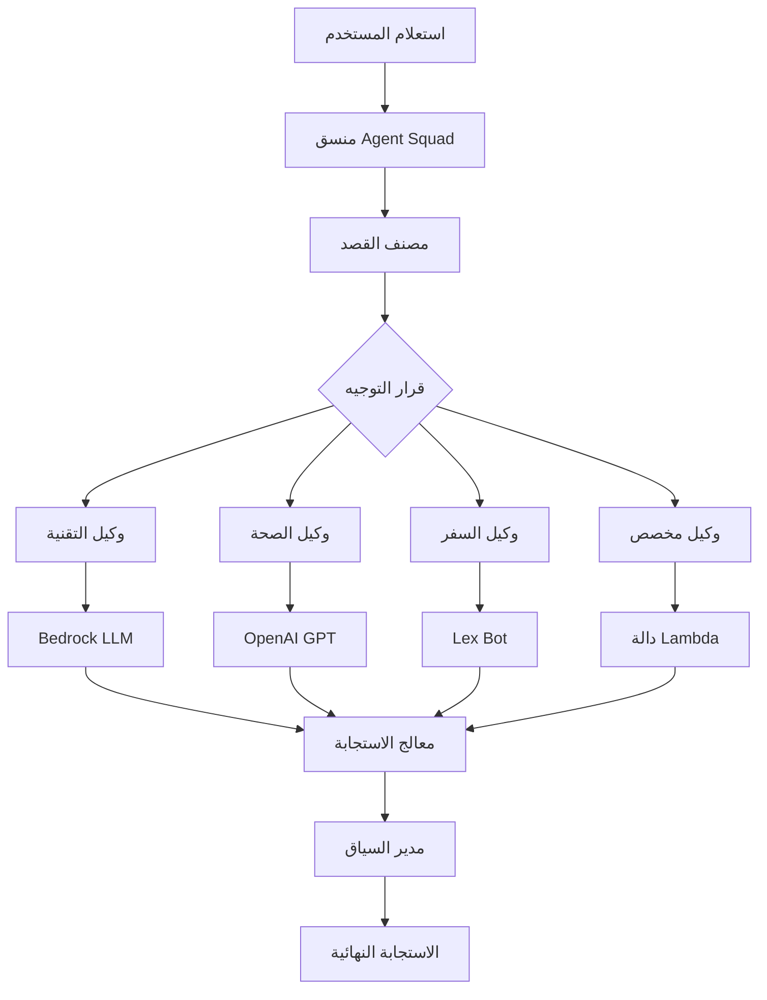

⏱️ **وقت القراءة المتوقع**: 15 دقيقة

## مقدمة حول Agent Squad

**Agent Squad** من AWS Labs (المعروف سابقاً باسم Multi-Agent Orchestrator) هو إطار عمل مفتوح المصدر مرن وخفيف الوزن مصمم لتنسيق وكلاء الذكاء الاصطناعي المتعددة للتعامل مع المحادثات المعقدة. مع أكثر من 6.6 ألف نجمة على GitHub ودعم مجتمعي متنامٍ، يمثل تقدماً مهماً في أنظمة الذكاء الاصطناعي متعددة الوكلاء.

### ما يجعل Agent Squad مميزاً

يعالج Agent Squad الحاجة المتزايدة للتوجيه الذكي للمحادثات في تطبيقات الذكاء الاصطناعي. بدلاً من وجود وكيل ذكاء اصطناعي واحد يتعامل مع جميع الاستعلامات، يقوم بتوزيع المحادثات بذكاء على وكلاء متخصصين بناءً على السياق والقصد.

## الميزات والقدرات الرئيسية

### 🧠 تصنيف القصد الذكي
يوجه الإطار الاستعلامات ديناميكياً إلى الوكيل الأنسب بناءً على:
- **تحليل السياق**: فهم تدفق المحادثة والتاريخ
- **تقييم المحتوى**: تحليل دلالات الاستعلام والقصد
- **تخصص الوكيل**: مطابقة الاستعلامات مع خبرة الوكيل

### 🔤 دعم لغة مزدوجة
تطبيق كامل في كل من **Python** و **TypeScript**:
- وظائف متطابقة عبر اللغات
- تحسينات خاصة باللغة
- تكامل سلس مع قواعد الكود الموجودة

### 🌊 معالجة استجابة مرنة
دعم للاستجابات المتدفقة وغير المتدفقة:
- **التدفق في الوقت الفعلي**: للمحادثات التفاعلية
- **المعالجة المجمعة**: للمهام التحليلية
- **دعم الوضع المختلط**: وكلاء مختلفون يمكنهم استخدام أنواع استجابة مختلفة

### 📚 إدارة السياق
معالجة سياق المحادثة المتطورة:
- **ذاكرة عبر الوكلاء**: الحفاظ على السياق عند التبديل بين الوكلاء
- **استمرارية الجلسة**: تذكر تاريخ المحادثة
- **وراثة السياق**: تمرير المعلومات ذات الصلة بين الوكلاء

## نظرة عامة على البنية المعمارية



تتكون البنية من:
1. **المنسق**: التوجيه والإدارة المركزية
2. **المصنفات**: اكتشاف القصد واختيار الوكيل
3. **الوكلاء**: مكونات الذكاء الاصطناعي المتخصصة
4. **مدير السياق**: إدارة الذاكرة والحالة
5. **معالج الاستجابة**: معالجة وتنسيق الإخراج

## التثبيت والإعداد

### تثبيت Python

يوفر Agent Squad خيارات تثبيت معيارية بناءً على احتياجات التكامل:

```bash
# التكامل الأساسي مع AWS (الأكثر شيوعاً)
pip install "agent-squad[aws]"

# تكامل OpenAI
pip install "agent-squad[openai]"

# تكامل Anthropic
pip install "agent-squad[anthropic]"

# التثبيت الكامل مع جميع التكاملات
pip install "agent-squad[all]"
```

### إعداد البيئة

إنشاء بيئة افتراضية للعزل:

```bash
# إنشاء بيئة افتراضية
python -m venv agent-squad-env
source agent-squad-env/bin/activate  # في Windows: agent-squad-env\Scripts\activate

# التثبيت مع دعم AWS
pip install "agent-squad[aws]"
```

### تثبيت TypeScript/Node.js

```bash
# تهيئة مشروع جديد
npm init -y

# تثبيت Agent Squad
npm install @awslabs/agent-squad

# تثبيت AWS SDK (عند استخدام تكاملات AWS)
npm install @aws-sdk/client-bedrock-runtime
```

## دليل التطبيق الأساسي

### تطبيق Python

لننشئ نظام وكلاء متعددة أساسي مع وكلاء متخصصين:

```python
import sys
import asyncio
from agent_squad.orchestrator import AgentSquad
from agent_squad.agents import BedrockLLMAgent, BedrockLLMAgentOptions, AgentStreamResponse

class AgentSquadTutorial:
    def __init__(self):
        # تهيئة المنسق
        self.orchestrator = AgentSquad()
        
        # إعداد الوكلاء
        self._setup_agents()
    
    def _setup_agents(self):
        """إعداد وكلاء متخصصين لمجالات مختلفة"""
        
        # وكيل متخصص في التقنية
        tech_agent = BedrockLLMAgent(BedrockLLMAgentOptions(
            name="خبير التقنية",
            streaming=True,
            description="""خبير في تطوير البرمجيات، الحوسبة السحابية، الذكاء الاصطناعي/تعلم الآلة، 
                         الأمن السيبراني، البلوك تشين، والتقنيات الناشئة. 
                         يقدم إرشادات تقنية، نصائح معمارية، وتحليل تكلفة 
                         للحلول التقنية.""",
            model_id="anthropic.claude-3-sonnet-20240229-v1:0",
        ))
        
        # وكيل الصحة والعافية
        health_agent = BedrockLLMAgent(BedrockLLMAgentOptions(
            name="خبير الصحة والعافية",
            streaming=True,
            description="""متخصص في الصحة، العافية، التغذية، اللياقة البدنية، 
                         الصحة النفسية، والمعلومات الطبية. يقدم 
                         إرشادات صحية قائمة على الأدلة ونصائح العافية.""",
            model_id="anthropic.claude-3-sonnet-20240229-v1:0",
        ))
        
        # وكيل الأعمال والمالية
        business_agent = BedrockLLMAgent(BedrockLLMAgentOptions(
            name="خبير الأعمال والمالية",
            streaming=True,
            description="""خبير في استراتيجية الأعمال، التخطيط المالي، 
                         تحليل السوق، ريادة الأعمال، وعمليات الأعمال. 
                         يقدم رؤى الأعمال الاستراتيجية.""",
            model_id="anthropic.claude-3-sonnet-20240229-v1:0",
        ))
        
        # إضافة الوكلاء إلى المنسق
        self.orchestrator.add_agent(tech_agent)
        self.orchestrator.add_agent(health_agent)
        self.orchestrator.add_agent(business_agent)
    
    async def process_query(self, user_input, user_id="user123", session_id="session456"):
        """معالجة استعلام المستخدم عبر فريق الوكلاء"""
        
        try:
            # توجيه الطلب إلى الوكيل المناسب
            response = await self.orchestrator.route_request(
                user_input=user_input,
                user_id=user_id,
                session_id=session_id,
                additional_params={},
                streaming=True
            )
            
            # معالجة الاستجابة
            await self._handle_response(response)
            
        except Exception as e:
            print(f"خطأ في معالجة الاستعلام: {e}")
    
    async def _handle_response(self, response):
        """معالجة الاستجابات المتدفقة وغير المتدفقة"""
        
        if response.streaming:
            print("\n🤖 **استجابة متدفقة**\n")
            
            # عرض البيانات الوصفية
            self._print_metadata(response.metadata)
            
            print("\n📝 **الاستجابة:**")
            
            # تدفق المحتوى
            async for chunk in response.output:
                if isinstance(chunk, AgentStreamResponse):
                    print(chunk.text, end='', flush=True)
                else:
                    print(f"نوع جزء غير متوقع: {type(chunk)}", file=sys.stderr)
            
            print("\n")  # سطر جديد بعد التدفق
            
        else:
            # معالجة الاستجابة غير المتدفقة
            print("\n🤖 **استجابة**\n")
            self._print_metadata(response.metadata)
            print(f"\n📝 **الاستجابة:** {response.output.content}")
    
    def _print_metadata(self, metadata):
        """طباعة البيانات الوصفية للاستجابة بشكل منسق"""
        print(f"🎯 **الوكيل:** {metadata.agent_name} (المعرف: {metadata.agent_id})")
        print(f"👤 **المستخدم:** {metadata.user_id}")
        print(f"🔗 **الجلسة:** {metadata.session_id}")
        print(f"❓ **الاستعلام:** {metadata.user_input}")
        if metadata.additional_params:
            print(f"⚙️ **المعاملات:** {metadata.additional_params}")

# مثال على الاستخدام والاختبار
async def main():
    """الدالة الرئيسية لعرض قدرات Agent Squad"""
    
    # تهيئة نظام الدليل
    agent_system = AgentSquadTutorial()
    
    # استعلامات اختبار لمجالات مختلفة
    test_queries = [
        "ما هي أفضل الممارسات لتطبيق معمارية الخدمات المصغرة؟",
        "كيف يمكنني تحسين صحة القلب والأوعية الدموية من خلال النظام الغذائي والتمارين؟",
        "ما الذي يجب مراعاته عند إنشاء خطة عمل لشركة تقنية ناشئة؟",
        "اشرح الاختلافات بين حاويات Docker والأجهزة الافتراضية",
        "ما هي تقنيات إدارة الضغط الفعالة للمهنيين المشغولين؟"
    ]
    
    print("🚀 **عرض توضيحي لدليل Agent Squad**\n")
    print("=" * 50)
    
    for i, query in enumerate(test_queries, 1):
        print(f"\n**استعلام الاختبار {i}:**")
        print("-" * 30)
        await agent_system.process_query(query)
        print("=" * 50)

if __name__ == "__main__":
    asyncio.run(main())
```

### تطبيق TypeScript

إليك التطبيق المكافئ في TypeScript:

```typescript
import { AgentSquad } from '@awslabs/agent-squad';
import { BedrockLLMAgent, BedrockLLMAgentOptions } from '@awslabs/agent-squad';

class AgentSquadTutorial {
    private orchestrator: AgentSquad;
    
    constructor() {
        this.orchestrator = new AgentSquad();
        this.setupAgents();
    }
    
    private setupAgents(): void {
        // وكيل خبير التقنية
        const techAgent = new BedrockLLMAgent({
            name: 'خبير التقنية',
            streaming: true,
            description: `خبير في تطوير البرمجيات، الحوسبة السحابية، الذكاء الاصطناعي/تعلم الآلة، 
                         الأمن السيبراني، البلوك تشين، والتقنيات الناشئة.`,
            modelId: 'anthropic.claude-3-sonnet-20240229-v1:0',
        } as BedrockLLMAgentOptions);
        
        // وكيل الصحة والعافية
        const healthAgent = new BedrockLLMAgent({
            name: 'خبير الصحة والعافية',
            streaming: true,
            description: `متخصص في الصحة، العافية، التغذية، اللياقة البدنية، 
                         الصحة النفسية، والمعلومات الطبية.`,
            modelId: 'anthropic.claude-3-sonnet-20240229-v1:0',
        } as BedrockLLMAgentOptions);
        
        // إضافة الوكلاء إلى المنسق
        this.orchestrator.addAgent(techAgent);
        this.orchestrator.addAgent(healthAgent);
    }
    
    async processQuery(
        userInput: string, 
        userId: string = 'user123', 
        sessionId: string = 'session456'
    ): Promise<void> {
        try {
            const response = await this.orchestrator.routeRequest(
                userInput,
                userId,
                sessionId,
                {},
                true
            );
            
            await this.handleResponse(response);
            
        } catch (error) {
            console.error('خطأ في معالجة الاستعلام:', error);
        }
    }
    
    private async handleResponse(response: any): Promise<void> {
        if (response.streaming) {
            console.log('\n🤖 **استجابة متدفقة**\n');
            
            // عرض البيانات الوصفية
            this.printMetadata(response.metadata);
            
            console.log('\n📝 **الاستجابة:**');
            
            // معالجة الاستجابة المتدفقة
            for await (const chunk of response.output) {
                if (chunk.text) {
                    process.stdout.write(chunk.text);
                }
            }
            
            console.log('\n');
            
        } else {
            console.log('\n🤖 **استجابة**\n');
            this.printMetadata(response.metadata);
            console.log(`\n📝 **الاستجابة:** ${response.output.content}`);
        }
    }
    
    private printMetadata(metadata: any): void {
        console.log(`🎯 **الوكيل:** ${metadata.agentName} (المعرف: ${metadata.agentId})`);
        console.log(`👤 **المستخدم:** ${metadata.userId}`);
        console.log(`🔗 **الجلسة:** ${metadata.sessionId}`);
        console.log(`❓ **الاستعلام:** ${metadata.userInput}`);
    }
}

// مثال على الاستخدام
async function main() {
    const agentSystem = new AgentSquadTutorial();
    
    const testQueries = [
        "ما هي أحدث الاتجاهات في الحوسبة السحابية؟",
        "كيف يمكنني الحفاظ على صحة نفسية جيدة أثناء العمل عن بُعد؟"
    ];
    
    console.log('🚀 **عرض توضيحي لدليل Agent Squad (TypeScript)**\n');
    
    for (const query of testQueries) {
        await agentSystem.processQuery(query);
        console.log('='.repeat(50));
    }
}

main().catch(console.error);
```

## التكوين المتقدم

### إنشاء وكيل مخصص

يمكنك إنشاء وكلاء مخصصين عن طريق توسيع فئة الوكيل الأساسية:

```python
from agent_squad.agents import Agent, AgentOptions
from typing import Optional, Dict, Any

class CustomDatabaseAgent(Agent):
    def __init__(self, options: AgentOptions):
        super().__init__(options)
        # تهيئة اتصالات قاعدة البيانات، الأدوات، إلخ.
        
    async def process_request(
        self, 
        input_text: str, 
        user_id: str, 
        session_id: str, 
        chat_history: list,
        additional_params: Optional[Dict[str, Any]] = None
    ):
        # منطق المعالجة المخصص
        # استعلام قواعد البيانات، إجراء الحسابات، إلخ.
        
        # إرجاع استجابة منظمة
        return {
            "content": "نتائج استعلام قاعدة البيانات...",
            "metadata": {
                "query_time": "0.5 ثانية",
                "records_found": 42
            }
        }
```

### تكوين المنسق المتقدم

```python
from agent_squad.orchestrator import AgentSquad
from agent_squad.classifiers import BedrockClassifier, BedrockClassifierOptions

# إنشاء منسق مع مصنف مخصص
classifier = BedrockClassifier(BedrockClassifierOptions(
    model_id="anthropic.claude-3-haiku-20240307-v1:0",
    inference_config={
        "maxTokens": 1000,
        "temperature": 0.1
    }
))

orchestrator = AgentSquad(
    classifier=classifier,
    logger=custom_logger,
    config={
        "LOG_AGENT_CHAT": True,
        "LOG_CLASSIFIER_CHAT": True,
        "LOG_CLASSIFIER_RAW_OUTPUT": True,
        "LOG_CLASSIFIER_OUTPUT": True,
        "LOG_EXECUTION_TIMES": True,
        "MAX_RETRIES": 3,
        "USE_DEFAULT_AGENT_IF_NONE_IDENTIFIED": True,
        "MAX_TOKENS": 1000,
        "TEMPERATURE": 0.1
    }
)
```

## حالات الاستخدام الواقعية والأمثلة

### أتمتة خدمة العملاء

```python
async def setup_customer_service_agents():
    """إعداد وكلاء خدمة العملاء المتخصصين"""
    
    orchestrator = AgentSquad()
    
    # وكيل الدعم التقني
    tech_support = BedrockLLMAgent(BedrockLLMAgentOptions(
        name="الدعم التقني",
        description="يتعامل مع المشاكل التقنية، استكشاف الأخطاء، ودعم المنتجات",
        model_id="anthropic.claude-3-sonnet-20240229-v1:0",
    ))
    
    # وكيل الفوترة والحساب
    billing_agent = BedrockLLMAgent(BedrockLLMAgentOptions(
        name="دعم الفوترة",
        description="يتعامل مع استفسارات الفوترة، إدارة الحساب، ومشاكل الدفع",
        model_id="anthropic.claude-3-sonnet-20240229-v1:0",
    ))
    
    # وكيل المعلومات العامة
    info_agent = BedrockLLMAgent(BedrockLLMAgentOptions(
        name="وكيل المعلومات",
        description="يقدم معلومات الشركة العامة، السياسات، والاستفسارات الأساسية",
        model_id="anthropic.claude-3-sonnet-20240229-v1:0",
    ))
    
    orchestrator.add_agent(tech_support)
    orchestrator.add_agent(billing_agent)
    orchestrator.add_agent(info_agent)
    
    return orchestrator
```

### منصة تعليمية

```python
async def setup_educational_agents():
    """إعداد وكلاء لمواد أكاديمية مختلفة"""
    
    orchestrator = AgentSquad()
    
    subjects = [
        ("الرياضيات", "خبير في الرياضيات، التفاضل والتكامل، الإحصاء، وحل المشاكل"),
        ("العلوم", "متخصص في الفيزياء، الكيمياء، الأحياء، والمفاهيم العلمية"),
        ("الأدب", "خبير في تحليل الأدب، الكتابة، وفنون اللغة"),
        ("التاريخ", "متخصص في التاريخ العالمي، التحليل التاريخي، والدراسات الاجتماعية")
    ]
    
    for name, description in subjects:
        agent = BedrockLLMAgent(BedrockLLMAgentOptions(
            name=f"مدرس {name}",
            description=description,
            model_id="anthropic.claude-3-sonnet-20240229-v1:0",
            streaming=True
        ))
        orchestrator.add_agent(agent)
    
    return orchestrator
```

## تحسين الأداء

### تجميع الاتصالات والتخزين المؤقت

```python
from agent_squad.orchestrator import AgentSquad
import asyncio
from functools import lru_cache

class OptimizedAgentSquad:
    def __init__(self):
        self.orchestrator = AgentSquad()
        self._connection_pool = self._setup_connection_pool()
        self._setup_caching()
    
    def _setup_connection_pool(self):
        """إعداد تجميع الاتصالات لأداء أفضل"""
        # تكوين تجمعات الاتصال لخدمات مختلفة
        return {
            'bedrock': self._create_bedrock_pool(),
            'openai': self._create_openai_pool(),
        }
    
    @lru_cache(maxsize=1000)
    def _cached_classification(self, query_hash: str):
        """تخزين مؤقت لنتائج التصنيف للاستعلامات المشابهة"""
        # تطبيق التخزين المؤقت لنتائج التصنيف
        pass
    
    async def batch_process_queries(self, queries: list):
        """معالجة استعلامات متعددة بشكل متزامن"""
        tasks = [
            self.orchestrator.route_request(query, f"user_{i}", f"session_{i}")
            for i, query in enumerate(queries)
        ]
        
        results = await asyncio.gather(*tasks, return_exceptions=True)
        return results
```

### المراقبة والتسجيل

```python
import logging
import time
from functools import wraps

class AgentSquadMonitor:
    def __init__(self, orchestrator):
        self.orchestrator = orchestrator
        self.logger = logging.getLogger('agent_squad_monitor')
        self._setup_monitoring()
    
    def _setup_monitoring(self):
        """إعداد مراقبة شاملة"""
        self.metrics = {
            'total_requests': 0,
            'successful_requests': 0,
            'failed_requests': 0,
            'average_response_time': 0,
            'agent_usage': {}
        }
    
    def monitor_request(self, func):
        """مزخرف لمراقبة أداء الطلبات"""
        @wraps(func)
        async def wrapper(*args, **kwargs):
            start_time = time.time()
            self.metrics['total_requests'] += 1
            
            try:
                result = await func(*args, **kwargs)
                self.metrics['successful_requests'] += 1
                
                # تتبع استخدام الوكيل
                agent_name = result.metadata.agent_name
                self.metrics['agent_usage'][agent_name] = \
                    self.metrics['agent_usage'].get(agent_name, 0) + 1
                
                return result
                
            except Exception as e:
                self.metrics['failed_requests'] += 1
                self.logger.error(f"فشل الطلب: {e}")
                raise
                
            finally:
                # تحديث متوسط وقت الاستجابة
                response_time = time.time() - start_time
                self._update_average_response_time(response_time)
        
        return wrapper
    
    def _update_average_response_time(self, response_time):
        """تحديث المتوسط الجاري لأوقات الاستجابة"""
        current_avg = self.metrics['average_response_time']
        total_requests = self.metrics['total_requests']
        
        self.metrics['average_response_time'] = \
            (current_avg * (total_requests - 1) + response_time) / total_requests
    
    def get_performance_report(self):
        """إنتاج تقرير الأداء"""
        return {
            'summary': self.metrics,
            'success_rate': self.metrics['successful_requests'] / self.metrics['total_requests'] * 100,
            'most_used_agent': max(self.metrics['agent_usage'], 
                                 key=self.metrics['agent_usage'].get) if self.metrics['agent_usage'] else None
        }
```

## استراتيجيات النشر

### نشر AWS Lambda

```python
import json
import asyncio
from agent_squad.orchestrator import AgentSquad
from agent_squad.agents import BedrockLLMAgent, BedrockLLMAgentOptions

# مثيل منسق عام لإعادة استخدام حاوية Lambda
orchestrator = None

def lambda_handler(event, context):
    """معالج AWS Lambda لـ Agent Squad"""
    
    global orchestrator
    
    # تهيئة المنسق في البداية الباردة
    if orchestrator is None:
        orchestrator = setup_orchestrator()
    
    # استخراج بيانات الطلب
    body = json.loads(event['body'])
    user_input = body['message']
    user_id = body.get('user_id', 'anonymous')
    session_id = body.get('session_id', 'default')
    
    # معالجة الطلب
    loop = asyncio.new_event_loop()
    asyncio.set_event_loop(loop)
    
    try:
        response = loop.run_until_complete(
            orchestrator.route_request(user_input, user_id, session_id)
        )
        
        return {
            'statusCode': 200,
            'headers': {
                'Content-Type': 'application/json',
                'Access-Control-Allow-Origin': '*'
            },
            'body': json.dumps({
                'response': response.output.content,
                'agent': response.metadata.agent_name,
                'success': True
            })
        }
        
    except Exception as e:
        return {
            'statusCode': 500,
            'body': json.dumps({
                'error': str(e),
                'success': False
            })
        }
    
    finally:
        loop.close()

def setup_orchestrator():
    """إعداد المنسق مع تكوين الإنتاج"""
    squad = AgentSquad()
    
    # إضافة وكلاء الإنتاج
    tech_agent = BedrockLLMAgent(BedrockLLMAgentOptions(
        name="وكيل التقنية للإنتاج",
        description="وكيل دعم تقني جاهز للإنتاج",
        model_id="anthropic.claude-3-sonnet-20240229-v1:0",
    ))
    
    squad.add_agent(tech_agent)
    return squad
```

### نشر Docker

```dockerfile
# Dockerfile لتطبيق Agent Squad
FROM python:3.11-slim

WORKDIR /app

# تثبيت تبعيات النظام
RUN apt-get update && apt-get install -y \
    gcc \
    && rm -rf /var/lib/apt/lists/*

# نسخ requirements وتثبيت تبعيات Python
COPY requirements.txt .
RUN pip install --no-cache-dir -r requirements.txt

# نسخ كود التطبيق
COPY . .

# كشف المنفذ
EXPOSE 8000

# تعيين متغيرات البيئة
ENV PYTHONPATH=/app
ENV AWS_DEFAULT_REGION=us-east-1

# تشغيل التطبيق
CMD ["uvicorn", "main:app", "--host", "0.0.0.0", "--port", "8000"]
```

## أفضل الممارسات والنصائح

### 1. مبادئ تصميم الوكيل

- **المسؤولية الواحدة**: كل وكيل يجب أن يكون له مجال محدد بوضوح
- **الأوصاف الواضحة**: كتابة أوصاف وكيل مفصلة لتوجيه أفضل
- **تحسين الأداء**: استخدام أحجام نماذج مناسبة لمهام مختلفة
- **معالجة الأخطاء**: تنفيذ معالجة أخطاء قوية وآليات احتياطية

### 2. إدارة السياق

```python
# إدارة سياق المحادثة الفعالة
async def manage_conversation_context(orchestrator, user_id, session_id):
    """أفضل الممارسات لإدارة السياق"""
    
    # تخزين معلومات السياق المهمة
    context = {
        'user_preferences': get_user_preferences(user_id),
        'conversation_history': get_conversation_history(session_id),
        'current_task': 'information_gathering'
    }
    
    # تمرير السياق عبر additional_params
    response = await orchestrator.route_request(
        user_input="تابع مناقشتنا السابقة",
        user_id=user_id,
        session_id=session_id,
        additional_params=context
    )
    
    return response
```

### 3. اعتبارات الأمان

```python
# التحقق من صحة المدخلات وتطهيرها
def validate_input(user_input: str) -> bool:
    """التحقق من صحة مدخلات المستخدم للأمان"""
    
    # فحص المحتوى الضار
    forbidden_patterns = [
        r'<script.*?</script>',
        r'javascript:',
        r'on\w+\s*='
    ]
    
    import re
    for pattern in forbidden_patterns:
        if re.search(pattern, user_input, re.IGNORECASE):
            return False
    
    # فحص طول المدخل
    if len(user_input) > 10000:
        return False
    
    return True

# تنفيذ تحديد المعدل
from collections import defaultdict
import time

class RateLimiter:
    def __init__(self, max_requests=100, time_window=3600):
        self.max_requests = max_requests
        self.time_window = time_window
        self.requests = defaultdict(list)
    
    def is_allowed(self, user_id: str) -> bool:
        now = time.time()
        user_requests = self.requests[user_id]
        
        # إزالة الطلبات القديمة
        self.requests[user_id] = [
            req_time for req_time in user_requests 
            if now - req_time < self.time_window
        ]
        
        # فحص ما إذا كان تحت الحد
        if len(self.requests[user_id]) < self.max_requests:
            self.requests[user_id].append(now)
            return True
        
        return False
```

## دليل استكشاف الأخطاء وإصلاحها

### المشاكل الشائعة والحلول

1. **مشاكل اختيار الوكيل**
   ```python
   # تتبع اختيار الوكيل
   orchestrator.config['LOG_CLASSIFIER_OUTPUT'] = True
   orchestrator.config['LOG_CLASSIFIER_RAW_OUTPUT'] = True
   ```

2. **مشاكل الذاكرة مع السياقات الكبيرة**
   ```python
   # تطبيق قطع السياق
   def truncate_context(context, max_length=8000):
       if len(context) > max_length:
           return context[-max_length:]
       return context
   ```

3. **اختناقات الأداء**
   ```python
   # تطبيق المعالجة غير المتزامنة
   import asyncio
   
   async def process_multiple_requests(requests):
       tasks = [process_single_request(req) for req in requests]
       return await asyncio.gather(*tasks)
   ```

## اختبار التطبيق

إنشاء مجموعة اختبار شاملة:

```python
import pytest
import asyncio
from agent_squad.orchestrator import AgentSquad

class TestAgentSquad:
    @pytest.fixture
    async def orchestrator(self):
        """إعداد منسق الاختبار"""
        squad = AgentSquad()
        # إضافة وكلاء الاختبار
        return squad
    
    @pytest.mark.asyncio
    async def test_tech_query_routing(self, orchestrator):
        """اختبار أن الاستعلامات التقنية توجه إلى الوكيل التقني"""
        response = await orchestrator.route_request(
            "كيف أنشر حاوية Docker؟",
            "test_user",
            "test_session"
        )
        
        assert "tech" in response.metadata.agent_name.lower()
    
    @pytest.mark.asyncio
    async def test_streaming_response(self, orchestrator):
        """اختبار وظيفة التدفق"""
        response = await orchestrator.route_request(
            "اشرح تعلم الآلة",
            "test_user",
            "test_session",
            streaming=True
        )
        
        assert response.streaming is True
        
        # جمع المحتوى المتدفق
        content = ""
        async for chunk in response.output:
            content += chunk.text
        
        assert len(content) > 0
```

## الخلاصة

يمثل Agent Squad تطوراً قوياً في أنظمة الذكاء الاصطناعي متعددة الوكلاء، ويوفر:

- **التوجيه الذكي** لتجارب مستخدم أفضل
- **الهندسة المرنة** التي تدعم موفري ذكاء اصطناعي متنوعين
- **ميزات جاهزة للإنتاج** لعمليات النشر المؤسسية
- **دعم مجتمعي قوي** وتطوير نشط

دعم الإطار للغة المزدوجة (Python/TypeScript) والتصميم المعياري يجعله خياراً ممتازاً لكل من النماذج الأولية وعمليات النشر الإنتاجية. سواء كنت تبني أنظمة خدمة العملاء، أو منصات تعليمية، أو تطبيقات ذكاء اصطناعي محادثة معقدة، يوفر Agent Squad الأساس لتنسيق الوكلاء المتعددة المتطور.

### الخطوات التالية

1. **جرب** التطبيق الأساسي
2. **خصص الوكلاء** لحالة الاستخدام المحددة
3. **نفذ المراقبة** وتحسين الأداء
4. **انشر** على منصة السحابة المفضلة لديك
5. **ساهم** في مجتمع المصدر المفتوح

للحصول على ميزات متقدمة ودعم المؤسسات، استكشف [الوثائق الرسمية](https://awslabs.github.io/agent-squad/) وانضم إلى المجتمع المتنامي من مطوري Agent Squad.

---

*يوفر هذا الدليل أساساً شاملاً للعمل مع AWS Agent Squad. مع استمرار تطور الإطار، تابع أحدث الميزات وأفضل الممارسات من خلال المستودع الرسمي والوثائق.*
