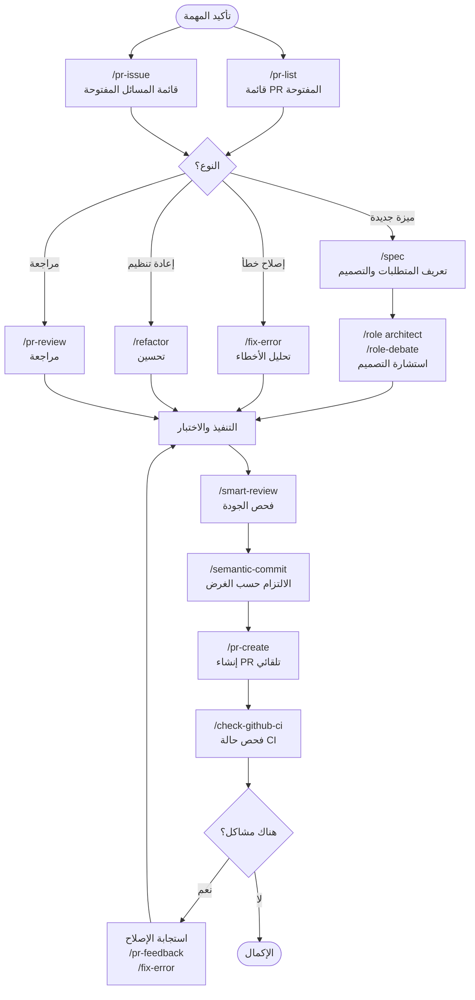

⏱️ **وقت القراءة المتوقع**: 18 دقيقة

## المقدمة

يمثل [Claude Code Cookbook](https://github.com/foreveryh/claude-code-cookbook) مجموعة رائدة من أكثر من 60 أمراً وأدواراً متخصصة وخطافات أتمتة مصممة لتعزيز سير العمل التطويري بقدرات الذكاء الاصطناعي المتقدمة. هذه الأدوات الشاملة تحول طريقة تفاعل المطورين مع الكود وإدارة المشاريع والتعاون من خلال الأتمتة الذكية.

في عصر يعيد فيه الذكاء الاصطناعي تشكيل تطوير البرمجيات، يبرز Claude Code Cookbook كحل عملي ومختبر يسد الفجوة بين قدرات الذكاء الاصطناعي المتقدمة ومهام التطوير اليومية. سواء كنت تتعامل مع التعديل المعقد أو إدارة سير عمل GitHub أو إجراء مراجعات شاملة للكود، توفر هذه الأدوات أنماطاً منظمة وموثوقة لاستغلال الذكاء الاصطناعي في عملية التطوير.

## ما هو Claude Code Cookbook؟

### نظرة عامة

Claude Code Cookbook هو مجموعة منتقاة من الأوامر والأدوار ونصوص الأتمتة المصممة لتعزيز قدرات Claude Code لتطوير البرمجيات. نُسخ أصلاً من مستودع wasabeef وتم تحسينه من قبل المجتمع، ويوفر نهجاً منهجياً لدمج الذكاء الاصطناعي في سير العمل التطويري.

### المكونات الرئيسية

تتكون هذه الأدوات من ثلاثة مكونات رئيسية:

1. **الأوامر**: أكثر من 60 أمراً متخصصاً لمهام تطوير محددة
2. **الأدوار**: شخصيات خبراء تقدم وجهات نظر وتحليلات متخصصة
3. **الخطافات**: نصوص أتمتة تتكامل بسلاسة مع سير العمل التطويري

### الفلسفة الأساسية

يتبع الكتاب مبدأ "المساعدة المنظمة للذكاء الاصطناعي" - بدلاً من الأوامر العامة، يوفر أوامر محددة وسياقية تنتج نتائج متسقة وعالية الجودة للسيناريوهات التطويرية الشائعة.

## فئات الأوامر والاستخدام

### 1. أوامر سير عمل GitHub

يتفوق الكتاب في أتمتة سير عمل GitHub بأوامر تبسط عمليات Git الشائعة:

#### إدارة طلبات السحب (Pull Requests)
```bash
# قائمة وترتيب أولويات PR المفتوحة
/pr-list

# إنشاء PR مع التحليل التلقائي
/pr-create

# مراجعة شاملة لـ PR
/pr-review

# تحديث تلقائي لمحتوى PR
/pr-auto-update

# دمج تلقائي لـ PR مع التحقق من الجودة
/pr-merge
```

#### إدارة المسائل
```bash
# عرض المسائل مرتبة حسب الأولوية
/pr-issue

# إنشاء تقارير أخطاء مفصلة
/bug-report

# كتابة مواصفات ميزات شاملة
/feature-request
```

#### عمليات Git المتقدمة
```bash
# الالتزام الدلالي بوحدات ذات معنى
/semantic-commit

# فحص حالة CI/CD
/check-github-ci

# التعامل الذكي مع تضارب الدمج
/merge-conflict
```

### 2. أوامر جودة وتحليل الكود

تركز هذه الأوامر على الحفاظ على جودة الكود وتحسينها:

#### مراجعة وتحليل الكود
```bash
# مراجعة متقدمة لجودة الكود
/smart-review

# تعديل آمن خطوة بخطوة
/refactor

# تحليل الديون التقنية
/tech-debt

# تحليل شامل للأخطاء
/fix-error
```

#### الهيكل والتصميم
```bash
# كتابة مواصفات مفصلة
/spec

# إنشاء وثائق شاملة
/generate-docs

# تحليل تحسين الأداء
/optimize
```

### 3. أوامر سير العمل التطويري

أوامر تعزز الأنشطة التطويرية اليومية:

#### إدارة المشاريع
```bash
# كتابة خطط التنفيذ
/plan

# تتبع تقدم التنفيذ
/show-plan

# تحديث الوثائق متعددة اللغات
/update-doc-string
```

#### إدارة التبعيات
```bash
# تحديث آمن لتبعيات Flutter
/update-flutter-deps

# إدارة تبعيات Node.js
/update-node-deps

# تحديث تبعيات Rust
/update-rust-deps
```

## التحليل الخبير القائم على الأدوار

### الأدوار المتاحة

يتضمن الكتاب أدواراً متخصصة تقدم وجهات نظر خبراء:

| الدور | مجال الخبرة | حالات الاستخدام |
|------|-----------|-----------|
| `/role analyzer` | خبير تحليل الأنظمة | مراجعة الهيكل، تصميم الأنظمة |
| `/role architect` | هيكل البرمجيات | أنماط التصميم، القابلية للتوسع |
| `/role frontend` | واجهة المستخدم والأداء | تحسين الواجهة الأمامية، تجربة المستخدم |
| `/role mobile` | تطوير iOS/Android | أفضل الممارسات المحمولة، نصائح خاصة بالمنصة |
| `/role performance` | تحسين الأداء | تحسينات السرعة والذاكرة |
| `/role qa` | ضمان الجودة | تخطيط الاختبار، مقاييس الجودة |
| `/role reviewer` | متخصص مراجعة الكود | جودة الكود، قابلية الصيانة |
| `/role security` | خبير الأمان | تقييم الثغرات، أفضل ممارسات الأمان |

### تنفيذ العوامل الفرعية

يمكن تنفيذ الأدوار كعوامل فرعية مستقلة للتحليل المتوازي:

```bash
# الوضع العادي (التنفيذ في السياق الرئيسي)
/role security
"فحص الأمان لهذا المشروع"

# وضع العامل الفرعي (التنفيذ في سياق مستقل)
/role security --agent
"إجراء تدقيق أمني شامل للمشروع"

# تحليل متوازي مع أدوار متعددة
/multi-role security,performance --agent
"تحليل شامل لأمان وأداء النظام"
```

### ميزة مناقشة الأدوار

يتيح أمر `/role-debate` التعاون بين وجهات نظر خبراء متعددة:

```bash
/role-debate
"هل يجب استخدام بنية الخدمات المصغرة أم الهيكل الأحادي لهذا المشروع؟"
```

هذا الأمر ينسق المناقشات بين أدوار مختلفة، مقدماً تحليلاً متوازناً من وجهات نظر خبراء متعددة.

## خطافات الأتمتة

### أتمتة التطوير

يتضمن الكتاب خطافات متطورة تؤتمت مهام التطوير الشائعة:

#### خطافات إدارة الملفات
- **preserve-file-permissions.sh**: الحفاظ على أذونات الملفات أثناء التحرير
- **ja-space-format.sh**: تنسيق تلقائي لمسافات النص الياباني
- **auto-comment.sh**: حث على التوثيق عند إنشاء ملفات جديدة

#### خطافات الأمان والجودة
- **deny-check.sh**: منع تنفيذ الأوامر الخطيرة
- **check-ai-commit.sh**: التحقق من جودة رسائل الالتزام
- **check-continue.sh**: تحديد المهام القابلة للاستمرار

#### خطافات الإشعارات
- **notify-waiting**: إشعارات macOS لتأكيدات المستخدم
- **osascript**: إشعارات الإكمال

### تكوين الخطافات

تُكوّن الخطافات في `settings.json` وتُنفذ تلقائياً في نقاط محددة:

- **PreToolUse**: التنفيذ قبل عمليات الأدوات
- **PostToolUse**: التنفيذ بعد عمليات الأدوات
- **Notification**: معالجة إشعارات المستخدم
- **Stop**: التنفيذ عند إكمال المهام

## الميزات المتقدمة

### الدعم متعدد اللغات

يدعم الكتاب التوثيق الشامل بلغات متعددة:

```bash
# تحديث سلاسل الوثائق بلغات متعددة
/update-doc-string

# إدارة وثائق خاصة بـ Dart
/update-dart-doc
```

### البحث والتحليل

قدرات بحث متقدمة للتحليل الشامل للكود:

```bash
# تكامل البحث الويب
/search-gemini

# التفكير المتسلسل للمشاكل المعقدة
/sequential-thinking

# عمليات التفكير فائقة التنظيم
/ultrathink
```

### تحسين الكتابة بالذكاء الاصطناعي

أدوات لتحسين المحتوى المُولد بالذكاء الاصطناعي:

```bash
# اكتشاف وتصحيح أنماط النص المُولد بالذكاء الاصطناعي
/style-ai-writing

# تفويض المهام للعوامل المتخصصة
/task
```

## تكامل سير العمل التطويري

### سير التطوير النموذجي

يمكّن الكتاب من سير عمل تطويري مبسط:



### أفضل الممارسات

1. **البدء بالتخطيط**: استخدم `/spec` لتخطيط الميزات و `/show-plan` للتتبع
2. **الاستفادة من الأدوار**: استخدم الأدوار المتخصصة للتحليل الخاص بالمجال
3. **أتمتة المراجعات**: ادمج `/smart-review` و `/pr-review` في سير عملك
4. **الحفاظ على الجودة**: استخدم الخطافات لجودة الكود والأمان المتسق
5. **التحليل المتوازي**: استفد من العوامل الفرعية للتحليل الشامل متعدد الزوايا

## التثبيت والإعداد

### المتطلبات المسبقة

- Claude Code (أحدث إصدار)
- Git مُكوّن بالأذونات المناسبة
- Node.js (لأوامر إدارة التبعيات المحددة)

### خطوات التثبيت

1. **استنساخ المستودع**:
```bash
git clone https://github.com/foreveryh/claude-code-cookbook.git
cd claude-code-cookbook
```

2. **تكوين Claude Code**:
أضف أوامر الكتاب إلى تكوين Claude Code:
```json
{
  "commands_directory": "./commands",
  "roles_directory": "./agents/roles",
  "hooks_directory": "./.claude/hooks"
}
```

3. **إعداد الخطافات**:
كوّن الخطافات التلقائية في `settings.json`:
```json
{
  "hooks": {
    "PreToolUse": ["deny-check.sh", "preserve-file-permissions.sh"],
    "PostToolUse": ["auto-comment.sh", "ja-space-format.sh"],
    "Notification": ["notify-waiting"],
    "Stop": ["check-continue.sh"]
  }
}
```

### التحقق

اختبر التثبيت بتشغيل:
```bash
/role-help  # يجب أن يعرض قائمة الأدوار المتاحة
/pr-list    # يجب أن يعرض PR الحالية (إذا كان في مستودع git)
```

## حالات الاستخدام والأمثلة

### 1. مراجعة شاملة للكود

السيناريو: مراجعة طلب سحب معقد بمكونات متعددة.

```bash
# الخطوة 1: الحصول على نظرة عامة للـ PR
/pr-list

# الخطوة 2: تحليل متعدد الأدوار
/multi-role security,performance,reviewer --agent
"تحليل PR #123 للثغرات الأمنية ومشاكل الأداء وجودة الكود"

# الخطوة 3: مراجعة مفصلة
/pr-review

# الخطوة 4: تقديم ملاحظات منظمة
/pr-feedback
```

### 2. سير عمل تطوير الميزات

السيناريو: تطوير نظام مصادقة مستخدم جديد مع تكامل OAuth.

```bash
# الخطوة 1: إنشاء المواصفات
/spec
"نظام مصادقة المستخدم مع تكامل OAuth"

# الخطوة 2: استشارة الهيكل
/role-debate
"OAuth مقابل JWT مقابل المصادقة القائمة على الجلسة لحالة الاستخدام لدينا"

# الخطوة 3: تخطيط التنفيذ
/plan

# الخطوة 4: تتبع التقدم
/show-plan

# الخطوة 5: ضمان الجودة
/role qa --agent
"إنشاء استراتيجية اختبار شاملة لنظام المصادقة"
```

### 3. إدارة الديون التقنية

السيناريو: معالجة الديون التقنية المتراكمة في قاعدة كود قديمة.

```bash
# الخطوة 1: تحليل الديون التقنية
/tech-debt

# الخطوة 2: ترتيب أولويات التحسينات
/role architect --agent
"إنشاء خطة تقليل الديون التقنية مرتبة حسب الأولوية"

# الخطوة 3: إعادة تنظيم آمنة
/refactor

# الخطوة 4: التحقق من التغييرات
/smart-review
```

## التكوين المتقدم

### الأوامر المخصصة

يمكنك توسيع الكتاب بأوامر مخصصة باتباع هيكل القالب:

```markdown
# قالب الأمر المخصص
## الغرض
وصف موجز لما يفعله الأمر

## الاستخدام
/custom-command [المعاملات]

## التنفيذ
منطق التنفيذ المفصل
```

### خطافات خاصة بالبيئة

تكوين الخطافات لبيئات التطوير المختلفة:

```bash
# بيئة التطوير
export CLAUDE_ENV="development"

# خطافات أمان الإنتاج
export CLAUDE_ENV="production"
```

### تكوين متعدد المشاريع

للفرق التي تعمل عبر مشاريع متعددة:

```json
{
  "projects": {
    "project1": {
      "commands": ["./project1-commands"],
      "roles": ["./project1-roles"]
    },
    "project2": {
      "commands": ["./project2-commands"],
      "roles": ["./project2-roles"]
    }
  }
}
```

## الأداء والتحسين

### تحسين تنفيذ الأوامر

1. **التنفيذ المتوازي**: استخدم العوامل الفرعية للتحليل المستقل
2. **إدارة السياق**: حافظ على نطاق السياق المناسب للأوامر
3. **التخزين المؤقت**: استفد من التخزين المؤقت المدمج في Claude Code للعمليات المتكررة

### إدارة الذاكرة والموارد

- **تحسين الرموز**: الأوامر مصممة لاستخدام الرموز بكفاءة
- **الحفاظ على السياق**: الخطافات تحافظ على السياق عبر العمليات
- **تنظيف الموارد**: تنظيف تلقائي للموارد المؤقتة

## استكشاف الأخطاء وإصلاحها

### المشاكل الشائعة

1. **الأمر غير موجود**: تأكد من التثبيت والتكوين الصحيح
2. **أخطاء الأذونات**: تحقق من أذونات الملفات وتكوين Git
3. **فشل الخطافات**: تحقق من أن نصوص الخطافات لديها أذونات التنفيذ

### وضع التصحيح

فعّل وضع التصحيح للحصول على معلومات تنفيذ مفصلة:
```bash
export CLAUDE_DEBUG=true
```

### دعم المجتمع

- **مسائل GitHub**: الإبلاغ عن الأخطاء وطلبات الميزات
- **الوثائق**: وثائق شاملة متاحة في المستودع
- **المجتمع**: مجتمع نشط للدعم والمساهمات

## اعتبارات الأمان

### تنفيذ الأوامر الآمن

يتضمن الكتاب عدة ميزات أمنية:

- **التحقق من الأوامر**: `deny-check.sh` يمنع العمليات الخطيرة
- **الحفاظ على الأذونات**: يحافظ على أذونات الملفات الأصلية
- **مسار التدقيق**: تسجيل شامل لجميع العمليات

### أفضل الممارسات

1. **مراجعة الأوامر**: راجع دائماً الأوامر المُولدة قبل التنفيذ
2. **استخدام الخطافات**: نفّذ خطافات الأمان لبيئتك
3. **التحكم في الوصول**: كوّن ضوابط الوصول المناسبة لاستخدام الفريق
4. **التحديثات المنتظمة**: حافظ على تحديث الكتاب لرقع الأمان

## التطورات المستقبلية

### خارطة الطريق

يستمر Claude Code Cookbook في التطور مع:

- **أوامر جديدة**: إضافة منتظمة للأوامر المطلوبة من المجتمع
- **أدوار محسنة**: أدوار خبراء أكثر تخصصاً
- **تحسينات التكامل**: تكامل أفضل مع IDE والمنصات
- **تحسينات الأداء**: تحسين مستمر للسرعة والكفاءة

### مساهمات المجتمع

يرحب المشروع بالمساهمات:

- **تطوير الأوامر**: إنشاء أوامر جديدة لحالات استخدام محددة
- **تحسين الأدوار**: تطوير أدوار خبراء متخصصة
- **التوثيق**: تحسين وترجمة الوثائق
- **إصلاح الأخطاء**: معالجة المشاكل وتحسين الاستقرار

## الخلاصة

يمثل Claude Code Cookbook تقدماً مهماً في أدوات التطوير المعتمدة على الذكاء الاصطناعي. من خلال توفير أنماط منظمة وموثوقة للمهام التطويرية الشائعة، يمكّن المطورين من تسخير القوة الكاملة للذكاء الاصطناعي مع الحفاظ على جودة الكود وأفضل ممارسات التطوير.

سواء كنت مطوراً فردياً يسعى لتعزيز الإنتاجية أو فريقاً يسعى لتوحيد ممارسات التطوير المساعدة بالذكاء الاصطناعي، يوفر الكتاب الأدوات والأنماط اللازمة للنجاح. مجموعة الأوامر الشاملة والأدوار الخبيرة وخطافات الأتمتة تخلق بيئة تطوير حيث يعزز الذكاء الاصطناعي الخبرة البشرية بدلاً من استبدالها.

مستقبل تطوير البرمجيات يكمن في التعاون الذكي بين الإبداع البشري وقدرات الذكاء الاصطناعي. يوفر Claude Code Cookbook الإطار لهذا التعاون، مضموناً أن المساعدة بالذكاء الاصطناعي ليست قوية فحسب، بل موثوقة وآمنة ومتوافقة مع أفضل ممارسات هندسة البرمجيات.

ابدأ في استكشاف الكتاب اليوم، وحوّل سير العمل التطويري بقوة المساعدة المنظمة للذكاء الاصطناعي. الاستثمار في تعلم هذه الأنماط سيؤتي ثماره في زيادة الإنتاجية وتحسين جودة الكود وتعزيز التعاون عبر فريق التطوير.

---

*مستعد لثورة في سير العمل التطويري؟ استنسخ [Claude Code Cookbook](https://github.com/foreveryh/claude-code-cookbook) وابدأ في تجربة مستقبل التطوير المعتمد على الذكاء الاصطناعي اليوم.*
