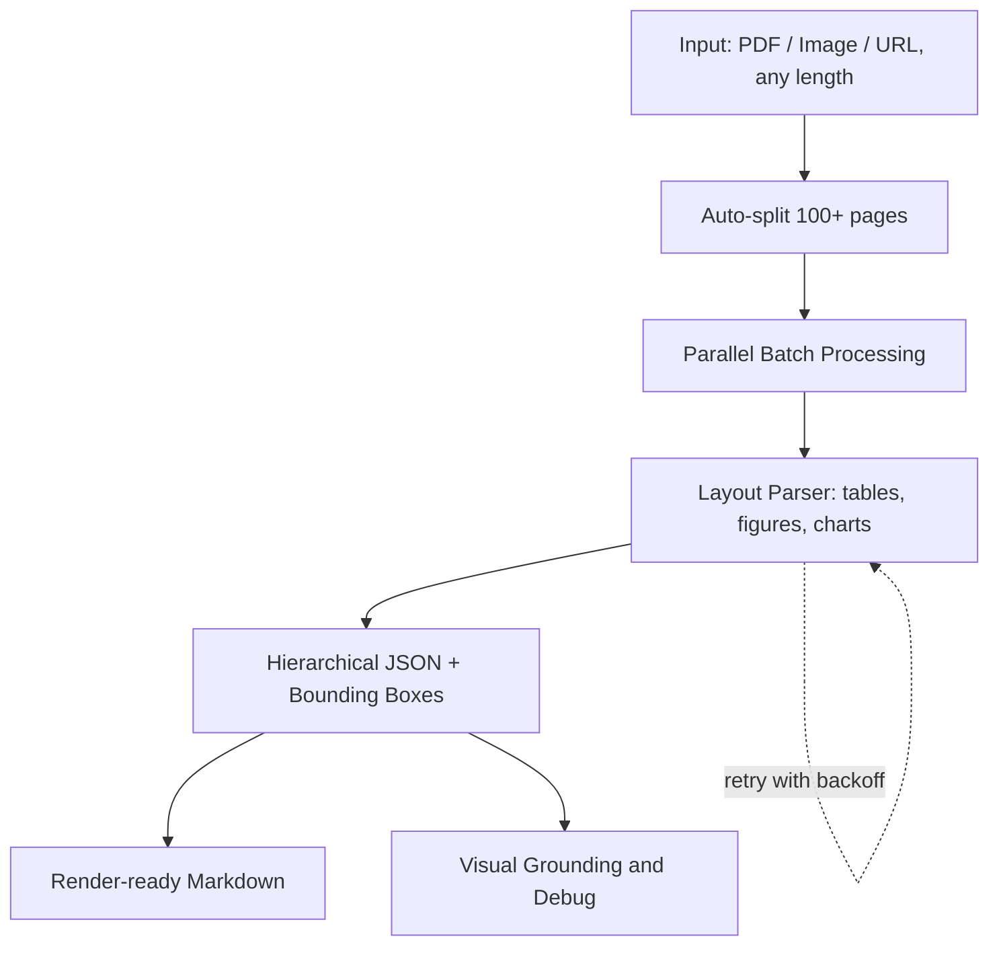

⏱️ **وقت القراءة المقدر**: 12 دقيقة

## مقدمة

في عالم اليوم المعتمد على البيانات، يُعد استخراج المعلومات المنظمة من المستندات المعقدة مثل ملفات PDF والصور والمخططات تحدياً حاسماً للشركات والمطورين. غالباً ما تواجه حلول OCR التقليدية صعوبات في التعامل مع التخطيطات المعقدة بصرياً والجداول وأنواع المحتوى المختلط. هنا تأتي مكتبة **LandingAI's Agentic Document Extraction** للإنقاذ.

إن Agentic Document Extraction API هي مكتبة Python قوية تستفيد من الذكاء الاصطناعي المتقدم لاستخراج البيانات المنظمة من المستندات المعقدة بصرياً وتُرجع JSON هرمي مع مواقع العناصر الدقيقة. سواء كنت تتعامل مع التقارير المالية أو الأوراق البحثية أو الوثائق التقنية متعددة الصفحات، توفر هذه المكتبة قدرات معالجة المستندات على مستوى المؤسسات.

## ما هو Agentic Document Extraction؟

إن LandingAI's Agentic Document Extraction هي مكتبة معالجة المستندات المدعومة بالذكاء الاصطناعي التي تتفوق في:

- **فهم التخطيط المعقد**: التعامل مع الجداول والصور والمخططات وتخطيطات المحتوى المختلط
- **دعم المستندات الطويلة**: معالجة ملفات PDF بأكثر من 100 صفحة في استدعاء واحد
- **الإخراج المنظم**: إرجاع JSON هرمي مع مواقع العناصر الدقيقة
- **التأسيس البصري**: توفير معلومات الصندوق المحيط للمحتوى المستخرج
- **المعالجة المجمعة**: التعامل مع مستندات متعددة بشكل متزامن مع المعالجة المتوازية

**الشكل 1. خط معالجة Agentic Document Extraction.**



### الميزات الرئيسية

- 📦 **تثبيت بسيط**: تثبيت بسطر واحد من pip بدون تبعيات إضافية
- 🗂️ **دعم الملفات الشامل**: ملفات PDF بأي طول، صور، وروابط URL
- 📚 **نطاق المؤسسة**: تقسيم تلقائي ومعالجة متوازية للمستندات بأكثر من 1000 صفحة
- 🧩 **إخراج منظم**: JSON هرمي بالإضافة إلى Markdown جاهز للعرض
- 👁️ **تصحيح بصري**: مقاطع الصندوق المحيط وتصورات الصفحة الكاملة
- 🏃 **معالجة متوازية**: معالجة مجمعة قابلة للتكوين مع إدارة الخيوط
- 🔄 **مرونة**: إعادة محاولة تلقائية مع تراجع أسي لأخطاء API
- ⚙️ **تكوين مرن**: إعدادات قائمة على البيئة للنشر الإنتاجي

## المتطلبات الأساسية والإعداد

### متطلبات النظام

- Python 3.9, 3.10, 3.11, أو 3.12
- مفتاح LandingAI API (احصل عليه من [LandingAI](https://landing.ai/))
- اتصال بالإنترنت لاستدعاءات API

### التثبيت

عملية التثبيت مباشرة باستخدام pip:

```bash
# تثبيت مكتبة agentic-doc
pip install agentic-doc

# التحقق من التثبيت
python -c "import agentic_doc; print('تم التثبيت بنجاح!')"
```

### تكوين مفتاح API

بعد الحصول على مفتاح LandingAI API، قم بتكوينه كمتغير بيئة:

```bash
# تعيين مفتاح API كمتغير بيئة
export VISION_AGENT_API_KEY=your-api-key-here

# أو إنشاء ملف .env في دليل مشروعك
echo "VISION_AGENT_API_KEY=your-api-key-here" > .env
```

للبيئات الإنتاجية، فكر في استخدام أنظمة إدارة الأسرار الآمنة بدلاً من متغيرات البيئة النصية العادية.

## أمثلة الاستخدام الأساسي

### تحليل المستندات البسيط

لنبدأ بالاستخدام الأساسي - تحليل مستند واحد:

```python
from agentic_doc.parse import parse

# تحليل ملف PDF محلي
results = parse("path/to/your/document.pdf")

# تحليل من URL
results = parse("https://example.com/document.pdf")

# تحليل صورة
results = parse("path/to/your/image.jpg")

# الوصول إلى المحتوى المحلل
parsed_doc = results[0]
print(f"عنوان المستند: {parsed_doc.title}")
print(f"عدد القطع: {len(parsed_doc.chunks)}")
print(f"محتوى Markdown: {parsed_doc.markdown}")
```

### فهم هيكل النتيجة

تُرجع المكتبة نتيجة منظمة مع المكونات الرئيسية التالية:

```python
from agentic_doc.parse import parse

results = parse("document.pdf")
parsed_doc = results[0]

# بيانات وصفية للمستند
print(f"العنوان: {parsed_doc.title}")
print(f"عدد الصفحات: {parsed_doc.page_count}")
print(f"وقت المعالجة: {parsed_doc.processing_time}")

# التكرار عبر قطع المحتوى
for i, chunk in enumerate(parsed_doc.chunks):
    print(f"القطعة {i}:")
    print(f"  النوع: {chunk.chunk_type}")
    print(f"  المحتوى: {chunk.content[:100]}...")  # أول 100 حرف
    print(f"  الصفحة: {chunk.page}")
    print(f"  الصندوق المحيط: {chunk.grounding[0].bbox if chunk.grounding else 'غير متوفر'}")
    print("---")

# الحصول على تمثيل Markdown الكامل
markdown_content = parsed_doc.markdown
print("المستند الكامل كـ Markdown:")
print(markdown_content)
```

## الميزات المتقدمة

### معالجة ملفات PDF الكبيرة

إحدى الميزات البارزة للمكتبة هي قدرتها على التعامل مع المستندات الكبيرة تلقائياً:

```python
from agentic_doc.parse import parse

# تتعامل المكتبة تلقائياً مع ملفات PDF الكبيرة
# عن طريق تقسيمها إلى قطع قابلة للإدارة ومعالجتها بالتوازي
results = parse("very-large-document.pdf")

parsed_doc = results[0]
print(f"تمت معالجة {parsed_doc.page_count} صفحة بنجاح")

# التحقق من أخطاء المعالجة
if parsed_doc.errors:
    print("تم مواجهة أخطاء في المعالجة:")
    for error in parsed_doc.errors:
        print(f"  الصفحة {error.page}: {error.message}")
```

### معالجة مستندات متعددة بالدفعات

معالجة مستندات متعددة بشكل متزامن مع التوازي القابل للتكوين:

```python
from agentic_doc.parse import parse

# معالجة مستندات متعددة بالدفعات
document_paths = [
    "document1.pdf",
    "document2.pdf", 
    "https://example.com/document3.pdf",
    "image.jpg"
]

# معالجة بالدفعات مع الإعدادات الافتراضية
results = parse(document_paths)

# معالجة النتائج
for i, parsed_doc in enumerate(results):
    print(f"المستند {i+1}: {parsed_doc.title}")
    print(f"  الصفحات: {parsed_doc.page_count}")
    print(f"  القطع: {len(parsed_doc.chunks)}")
    
    # التحقق من الأخطاء
    if parsed_doc.errors:
        print(f"  الأخطاء: {len(parsed_doc.errors)}")
```

### التأسيس البصري وتصحيح الأخطاء

استخراج وحفظ المناطق البصرية حيث تم العثور على المحتوى:

```python
from agentic_doc.parse import parse

# تحليل المستند وحفظ صور التأسيس
results = parse(
    "document.pdf",
    grounding_save_dir="./grounding_images"
)

parsed_doc = results[0]

# طباعة مسارات صور التأسيس المحفوظة
for chunk in parsed_doc.chunks:
    for grounding in chunk.grounding:
        if grounding.image_path:
            print(f"تم حفظ التأسيس في: {grounding.image_path}")
```

### تصور المستندات

إنشاء تصورات مشروحة تُظهر نتائج الاستخراج:

```python
from agentic_doc.parse import parse
from agentic_doc.utils import viz_parsed_document
from agentic_doc.config import VisualizationConfig
from agentic_doc.schema import ChunkType

# تحليل المستند
results = parse("document.pdf")
parsed_doc = results[0]

# إنشاء تصورات مع الإعدادات الافتراضية
images = viz_parsed_document(
    "document.pdf",
    parsed_doc,
    output_dir="./visualizations"
)

# تخصيص مظهر التصور
viz_config = VisualizationConfig(
    thickness=3,  # صناديق محيطة أكثر سمكاً
    text_bg_opacity=0.9,  # خلفية نص أكثر عتامة
    font_scale=0.8,  # نص أكبر
    color_map={
        ChunkType.TITLE: (255, 0, 0),    # أحمر للعناوين
        ChunkType.TEXT: (0, 255, 0),     # أخضر للنص
        ChunkType.TABLE: (0, 0, 255),    # أزرق للجداول
    }
)

# إنشاء تصورات مخصصة
custom_images = viz_parsed_document(
    "document.pdf",
    parsed_doc,
    output_dir="./custom_visualizations",
    viz_config=viz_config
)

print(f"تم إنشاء {len(custom_images)} صورة تصور")
```

## التكوين والتحسين

### تكوين البيئة

إنشاء ملف `.env` لتخصيص سلوك المكتبة:

```bash
# تكوين ملف .env
VISION_AGENT_API_KEY=your-api-key-here

# إعدادات التوازي
BATCH_SIZE=4          # عدد الملفات للمعالجة بالتوازي
MAX_WORKERS=5         # الخيوط لكل ملف لمعالجة المستندات الكبيرة

# تكوين إعادة المحاولة
MAX_RETRIES=100       # الحد الأقصى لمحاولات إعادة المحاولة
MAX_RETRY_WAIT_TIME=60  # الحد الأقصى لوقت الانتظار لكل إعادة محاولة (ثواني)

# تكوين التسجيل
RETRY_LOGGING_STYLE=log_msg  # الخيارات: log_msg, inline_block, none
```

### تحسين الأداء

```python
import os
from agentic_doc.parse import parse

# تكوين إعدادات الأداء برمجياً
os.environ['BATCH_SIZE'] = '6'
os.environ['MAX_WORKERS'] = '8'
os.environ['MAX_RETRIES'] = '50'

# معالجة المستندات مع الإعدادات المحسنة
results = parse(["doc1.pdf", "doc2.pdf", "doc3.pdf"])
```

### خيارات التحليل المتقدمة

```python
from agentic_doc.parse import parse

# تحليل متقدم مع خيارات مخصصة
results = parse(
    "document.pdf",
    include_marginalia=False,        # استبعاد الرؤوس/التذييلات
    include_metadata_in_markdown=False,  # إخراج markdown نظيف
    grounding_save_dir="./groundings"    # حفظ التأسيس البصري
)

parsed_doc = results[0]
print(f"تم استخراج محتوى نظيف: {len(parsed_doc.chunks)} قطعة")
```

## معالجة الأخطاء واستكشاف الأخطاء وإصلاحها

### معالجة أخطاء قوية

```python
from agentic_doc.parse import parse
import logging

# تفعيل التسجيل المفصل
logging.basicConfig(level=logging.INFO)

try:
    results = parse("problematic-document.pdf")
    parsed_doc = results[0]
    
    # التحقق من أخطاء التحليل
    if parsed_doc.errors:
        print("تمت معالجة المستند مع أخطاء:")
        for error in parsed_doc.errors:
            print(f"  الصفحة {error.page}: {error.error_code} - {error.message}")
    else:
        print("تمت معالجة المستند بنجاح!")
        
except Exception as e:
    print(f"فشل في معالجة المستند: {e}")
    # التعامل مع مشاكل مفتاح API، مشاكل الشبكة، إلخ.
```

### المشاكل الشائعة والحلول

```python
# التعامل مع تحديد المعدل بأناقة
import os
from agentic_doc.parse import parse

# تقليل التوازي للحسابات محدودة المعدل
os.environ['BATCH_SIZE'] = '1'
os.environ['MAX_WORKERS'] = '2'
os.environ['RETRY_LOGGING_STYLE'] = 'inline_block'

try:
    results = parse("large-document.pdf")
    print("اكتملت المعالجة بنجاح")
except Exception as e:
    if "rate limit" in str(e).lower():
        print("تم تجاوز حد المعدل. فكر في تقليل BATCH_SIZE و MAX_WORKERS")
    elif "api key" in str(e).lower():
        print("مشكلة في مفتاح API. تحقق من متغير البيئة VISION_AGENT_API_KEY")
    else:
        print(f"خطأ غير متوقع: {e}")
```

## حالات الاستخدام الواقعية

### معالجة المستندات المالية

```python
from agentic_doc.parse import parse
import json

def process_financial_reports(report_paths):
    """معالجة التقارير المالية واستخراج المعلومات الرئيسية."""
    results = parse(report_paths)
    
    financial_data = []
    for i, parsed_doc in enumerate(results):
        doc_data = {
            'filename': report_paths[i],
            'title': parsed_doc.title,
            'page_count': parsed_doc.page_count,
            'tables': [],
            'key_figures': []
        }
        
        # استخراج الجداول والبيانات الرقمية
        for chunk in parsed_doc.chunks:
            if chunk.chunk_type.name == 'TABLE':
                doc_data['tables'].append(chunk.content)
            elif any(keyword in chunk.content.lower() 
                    for keyword in ['إيرادات', 'ربح', 'خسارة', 'دولار', '%']):
                doc_data['key_figures'].append(chunk.content)
        
        financial_data.append(doc_data)
    
    return financial_data

# معالجة التقارير الربعية
reports = ['q1_report.pdf', 'q2_report.pdf', 'q3_report.pdf']
financial_analysis = process_financial_reports(reports)

# حفظ البيانات المنظمة
with open('financial_analysis.json', 'w', encoding='utf-8') as f:
    json.dump(financial_analysis, f, indent=2, ensure_ascii=False)
```

### تحليل الأوراق البحثية

```python
from agentic_doc.parse import parse
import re

def analyze_research_papers(paper_urls):
    """تحليل الأوراق البحثية واستخراج الملخصات والخلاصات."""
    results = parse(paper_urls)
    
    analysis = []
    for i, parsed_doc in enumerate(results):
        paper_analysis = {
            'url': paper_urls[i],
            'title': parsed_doc.title,
            'abstract': None,
            'conclusion': None,
            'references_count': 0,
            'figures_count': 0
        }
        
        for chunk in parsed_doc.chunks:
            content_lower = chunk.content.lower()
            
            # استخراج الملخص
            if 'abstract' in content_lower and not paper_analysis['abstract']:
                paper_analysis['abstract'] = chunk.content
            
            # استخراج الخلاصة
            if any(word in content_lower for word in ['conclusion', 'summary', 'findings']):
                paper_analysis['conclusion'] = chunk.content
            
            # عد المراجع والأشكال
            if 'reference' in content_lower or 'bibliography' in content_lower:
                paper_analysis['references_count'] += len(re.findall(r'\[\d+\]', chunk.content))
            
            if chunk.chunk_type.name in ['FIGURE', 'IMAGE']:
                paper_analysis['figures_count'] += 1
        
        analysis.append(paper_analysis)
    
    return analysis

# تحليل الأوراق البحثية
paper_urls = [
    'https://arxiv.org/pdf/2301.00001.pdf',
    'https://arxiv.org/pdf/2301.00002.pdf'
]

research_analysis = analyze_research_papers(paper_urls)
for paper in research_analysis:
    print(f"العنوان: {paper['title']}")
    print(f"الأشكال: {paper['figures_count']}")
    print(f"المراجع: {paper['references_count']}")
    print("---")
```

## أفضل الممارسات والنصائح

### تحسين الأداء

1. **المعالجة بالدفعات**: معالجة مستندات متعددة معاً لإنتاجية أفضل
2. **تكوين التوازي**: ضبط `BATCH_SIZE` و `MAX_WORKERS` حسب حدود API الخاصة بك
3. **معالجة الأخطاء**: تحقق دائماً من أخطاء المعالجة في النتائج
4. **إدارة الموارد**: استخدم صور التأسيس فقط عند الحاجة لتصحيح الأخطاء

### النشر الإنتاجي

```python
import os
from agentic_doc.parse import parse
import logging

# تكوين الإنتاج
def setup_production_config():
    """تكوين المكتبة للاستخدام الإنتاجي."""
    os.environ['BATCH_SIZE'] = '2'  # محافظ للاستقرار
    os.environ['MAX_WORKERS'] = '3'
    os.environ['MAX_RETRIES'] = '10'
    os.environ['RETRY_LOGGING_STYLE'] = 'none'  # تقليل ضوضاء السجل
    
    # إعداد التسجيل
    logging.basicConfig(
        level=logging.WARNING,
        format='%(asctime)s - %(levelname)s - %(message)s'
    )

def process_documents_safely(document_paths):
    """معالجة المستندات بأمان مع معالجة شاملة للأخطاء."""
    setup_production_config()
    
    successful_results = []
    failed_documents = []
    
    try:
        results = parse(document_paths)
        
        for i, result in enumerate(results):
            if result.errors:
                failed_documents.append({
                    'path': document_paths[i],
                    'errors': result.errors
                })
            else:
                successful_results.append(result)
                
    except Exception as e:
        logging.error(f"فشلت المعالجة بالدفعات: {e}")
        return None, document_paths
    
    return successful_results, failed_documents

# الاستخدام في الإنتاج
documents = ['doc1.pdf', 'doc2.pdf', 'doc3.pdf']
success, failures = process_documents_safely(documents)

if success:
    print(f"تمت معالجة {len(success)} مستندات بنجاح")
if failures:
    print(f"فشل في معالجة {len(failures)} مستندات")
```

## الخلاصة

تمثل مكتبة LandingAI's Agentic Document Extraction تقدماً مهماً في معالجة المستندات المدعومة بالذكاء الاصطناعي. قدرتها على التعامل مع التخطيطات المعقدة ومعالجة المستندات الكبيرة وتوفير إخراج منظم مع التأسيس البصري يجعلها أداة لا تقدر بثمن لسير عمل استخراج البيانات الحديثة.

### النقاط الرئيسية

- **جاهز للمؤسسة**: يتعامل مع المستندات بأي حجم مع التوسع التلقائي
- **مدعوم بالذكاء الاصطناعي**: فهم متقدم لتخطيطات المستندات المعقدة
- **صديق للمطور**: API بسيط مع خيارات تكوين قوية
- **جاهز للإنتاج**: آليات إعادة المحاولة المدمجة ومعالجة الأخطاء
- **إخراج مرن**: تنسيقات JSON منظمة و Markdown

### الخطوات التالية

1. **التجريب**: جرب المكتبة مع مستنداتك الخاصة
2. **التحسين**: ضبط التكوين لحالة الاستخدام المحددة الخاصة بك
3. **التكامل**: بناء المكتبة في سير العمل الموجود لديك
4. **التوسع**: الاستفادة من المعالجة بالدفعات لأحمال العمل الإنتاجية

مستقبل معالجة المستندات هنا، ومع LandingAI's Agentic Document Extraction، أنت مجهز للتعامل مع أكثر تحديات معالجة المستندات تعقيداً بثقة.

---

**الموارد:**
- [LandingAI Agentic Document Extraction GitHub](https://github.com/landing-ai/agentic-doc)
- [الوثائق الرسمية](https://landing.ai/agentic-document-extraction)
- [وثائق API](https://landing.ai/docs)
- [احصل على مفتاح API](https://landing.ai/)

*معالجة مستندات سعيدة! 🚀*
