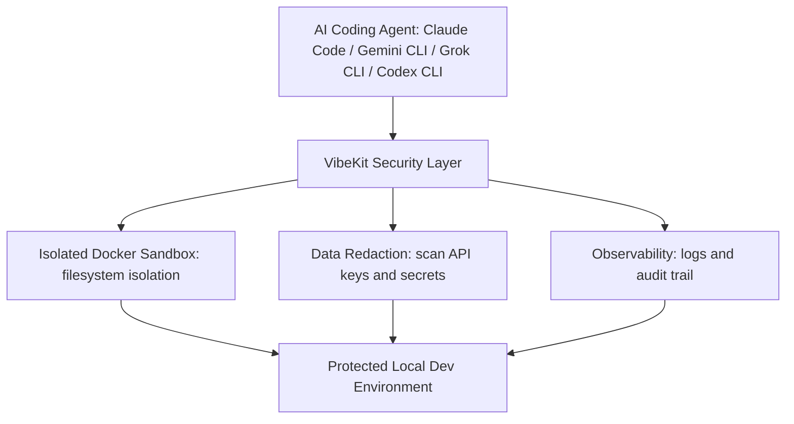

⏱️ **وقت القراءة المتوقع**: 12 دقيقة

## مقدمة

مع تزايد قوة وكلاء البرمجة بالذكاء الاصطناعي مثل Claude Code وGemini CLI وCodex، أصبحت الحاجة إلى بيئات تنفيذ آمنة أكثر أهمية من أي وقت مضى. يظهر **VibeKit** كطبقة أمان أساسية تتيح لك الاستفادة من الإمكانات الكاملة لهذه الأدوات الذكية مع الحفاظ على الأمان والمراقبة الكاملة.

في هذا الدليل الشامل، سنستكشف كيف ينشئ VibeKit بيئات Docker معزولة، ويحرر البيانات الحساسة تلقائياً، ويوفر مراقبة فورية لجميع عمليات البرمجة بالذكاء الاصطناعي.

## ما هو VibeKit؟

VibeKit هو إطار عمل أمني مفتوح المصدر مصمم خصيصاً لوكلاء البرمجة بالذكاء الاصطناعي. يعمل كحاجز وقائي بين الكود المُولد بالذكاء الاصطناعي وبيئة التطوير المحلية، مما يضمن:

- عدم قدرة **الكود الضار** على التأثير على نظامك
- **اكتشاف وتحرير البيانات الحساسة** تلقائياً
- **تسجيل ومراقبة جميع العمليات** في الوقت الفعلي
- **التوافق الشامل** مع أدوات البرمجة الذكية الشائعة

### نظرة عامة على الميزات الرئيسية

🐳 **بيئة الحماية المحلية**
- تشغيل جميع الأكواد المُولدة بالذكاء الاصطناعي في حاويات Docker معزولة
- خطر صفر على إعداد التطوير المحلي
- عزل كامل لنظام الملفات

🔒 **تحرير البيانات المدمج**
- اكتشاف وإزالة مفاتيح API وكلمات المرور والأسرار تلقائياً
- قواعد تحرير قابلة للتكوين لأنماط البيانات الحساسة المخصصة
- فحص فوري لجميع إكمالات الكود

📊 **مراقبة شاملة**
- سجلات فورية وتتبع التنفيذ
- مقاييس الأداء ومراقبة استخدام الموارد
- مسار تدقيق كامل لجميع عمليات الذكاء الاصطناعي

🌐 **دعم الوكلاء الشامل**
- يعمل مع Claude Code وGemini CLI وGrok CLI وCodex CLI
- متوافق مع OpenCode ووكلاء الذكاء الاصطناعي المخصصة
- هيكل إضافات لتوسيع الدعم

💻 **التشغيل دون اتصال**
- لا يتطلب اعتماديات سحابية
- يعمل بالكامل على جهازك المحلي
- خصوصية كاملة وسيادة البيانات

**الشكل 1. معمارية بيئة الحماية الأمنية لـ VibeKit.**



## المتطلبات المسبقة

قبل البدء، تأكد من تثبيت ما يلي على نظامك:

### متطلبات النظام

- **Node.js**: الإصدار 16 أو أحدث
- **Docker**: أحدث إصدار مستقر
- **npm**: يأتي مع تثبيت Node.js
- **نظام التشغيل**: macOS أو Linux أو Windows مع WSL2

### أوامر التحقق

```bash
# فحص إصدار Node.js
node --version

# فحص تثبيت Docker
docker --version

# فحص إصدار npm
npm --version
```

## دليل التثبيت

### الخطوة 1: تثبيت VibeKit CLI

أسهل طريقة للبدء مع VibeKit هي من خلال تثبيت CLI العام:

```bash
# تثبيت VibeKit CLI عالمياً
npm install -g vibekit

# التحقق من التثبيت
vibekit --version
```

### الخطوة 2: التحقق من إعداد Docker

يعتمد VibeKit على Docker لإنشاء بيئات الحماية المعزولة. دعنا نتأكد من تكوين Docker بشكل صحيح:

```bash
# اختبار وظائف Docker
docker run hello-world

# فحص صور Docker المتاحة
docker images

# التحقق من تشغيل Docker daemon
docker info
```

### الخطوة 3: التكوين الأولي

إنشاء ملف تكوين أساسي لـ VibeKit:

```bash
# إنشاء دليل تكوين VibeKit
mkdir -p ~/.vibekit

# توليد التكوين الافتراضي
vibekit init
```

هذا ينشئ ملف تكوين `.vibekit.json` مع الإعدادات الافتراضية:

```json
{
  "sandbox": {
    "timeout": 30000,
    "memory_limit": "512m",
    "cpu_limit": "1.0"
  },
  "redaction": {
    "enabled": true,
    "patterns": [
      "api_key",
      "password",
      "secret",
      "token"
    ]
  },
  "logging": {
    "level": "info",
    "output": "console"
  }
}
```

## دليل الاستخدام الأساسي

### تشغيل Claude Code مع VibeKit

حالة الاستخدام الأكثر شيوعاً هي تشغيل Claude Code من خلال طبقة الأمان في VibeKit:

```bash
# تشغيل Claude Code مع حماية VibeKit
vibekit claude

# التشغيل مع تسجيل مفصل
vibekit claude --verbose

# التشغيل مع مهلة زمنية مخصصة
vibekit claude --timeout 60000
```

### مثال: تنفيذ سكريبت Python آمن

دعنا نتابع مثالاً عملياً لتشغيل كود Python مُولد بالذكاء الاصطناعي بأمان:

1. **بدء VibeKit مع Claude Code:**
```bash
vibekit claude --language python
```

2. **طلب توليد كود من الذكاء الاصطناعي:**
```
أنشئ سكريبت Python يحلل بيانات CSV وينشئ تصورات بيانية
```

3. **VibeKit يقوم تلقائياً بـ:**
   - استقبال الكود المُولد بالذكاء الاصطناعي
   - فحص أنماط البيانات الحساسة
   - إنشاء حاوية Docker معزولة
   - تنفيذ الكود بأمان
   - إرجاع النتائج مع سجلات الأمان

### العمل مع وكلاء ذكاء اصطناعي مختلفين

يدعم VibeKit عدة وكلاء برمجة بالذكاء الاصطناعي. إليك كيفية استخدامها:

```bash
# تكامل Gemini CLI
vibekit gemini

# تكامل Codex CLI  
vibekit codex

# تكامل وكيل مخصص
vibekit custom --agent-command "your-ai-agent"
```

## التكوين المتقدم

### أنماط التحرير المخصصة

يمكنك تعريف أنماط مخصصة لاكتشاف البيانات الحساسة:

```json
{
  "redaction": {
    "enabled": true,
    "patterns": [
      {
        "name": "custom_api_key",
        "regex": "sk-[a-zA-Z0-9]{32}",
        "replacement": "[مفتاح_API_محرر]"
      },
      {
        "name": "database_url",
        "regex": "postgresql://[^\\s]+",
        "replacement": "[رابط_قاعدة_البيانات_محرر]"
      }
    ]
  }
}
```

### حدود موارد بيئة الحماية

تكوين حدود الموارد للأمان المعزز:

```json
{
  "sandbox": {
    "memory_limit": "1g",
    "cpu_limit": "2.0",
    "disk_limit": "500m",
    "network_access": false,
    "timeout": 45000
  }
}
```

### إعداد التسجيل والمراقبة

تمكين التسجيل الشامل لمسارات التدقيق:

```json
{
  "logging": {
    "level": "debug",
    "output": "file",
    "file_path": "~/.vibekit/logs/vibekit.log",
    "max_file_size": "10mb",
    "max_files": 5
  }
}
```

## تكامل SDK

للمطورين الذين يبنون تطبيقات مع VibeKit، يوفر SDK وصولاً برمجياً:

### التثبيت

```bash
npm install @vibe-kit/sdk
```

### الاستخدام الأساسي لـ SDK

```javascript
import { VibeKit } from '@vibe-kit/sdk';

const vibekit = new VibeKit({
  sandbox: {
    timeout: 30000,
    memory_limit: '512m'
  },
  redaction: {
    enabled: true
  }
});

// تنفيذ كود في بيئة الحماية
const result = await vibekit.execute({
  code: 'print("مرحباً، عالم آمن!")',
  language: 'python'
});

console.log('نتيجة التنفيذ:', result.output);
console.log('سجلات الأمان:', result.security_logs);
```

### ميزات SDK المتقدمة

```javascript
// قواعد تحرير مخصصة
vibekit.addRedactionRule({
  name: 'credit_card',
  pattern: /\b\d{4}[\s-]?\d{4}[\s-]?\d{4}[\s-]?\d{4}\b/g,
  replacement: '[بطاقة_ائتمان_محررة]'
});

// المراقبة الفورية
vibekit.on('execution_start', (event) => {
  console.log('بدء تنفيذ الكود:', event.timestamp);
});

vibekit.on('security_alert', (alert) => {
  console.log('تنبيه أمني:', alert.message);
});
```

## أفضل الممارسات الأمنية

### 1. التحديثات المنتظمة

حافظ على تحديث VibeKit لتلقي أحدث تصحيحات الأمان:

```bash
# تحديث VibeKit CLI
npm update -g vibekit

# تحديث SDK
npm update @vibe-kit/sdk
```

### 2. تقوية التكوين

استخدم إعدادات بيئة حماية مقيدة للأمان الأقصى:

```json
{
  "sandbox": {
    "network_access": false,
    "file_system_access": "read-only",
    "environment_isolation": true,
    "resource_monitoring": true
  }
}
```

### 3. إدارة سجلات التدقيق

تنفيذ دوران السجلات والمراقبة المناسبة:

```bash
# إعداد دوران السجلات
vibekit config set logging.rotation.enabled true
vibekit config set logging.rotation.max_size "50mb"
vibekit config set logging.rotation.max_files 10
```

### 4. سياسات الأمان المخصصة

تعريف سياسات أمان خاصة بالمؤسسة:

```json
{
  "security_policies": {
    "allowed_languages": ["python", "javascript", "bash"],
    "blocked_imports": ["os", "subprocess", "socket"],
    "max_execution_time": 30000,
    "require_approval": ["file_operations", "network_requests"]
  }
}
```

## استكشاف الأخطاء وإصلاحها

### مشاكل اتصال Docker

```bash
# فحص حالة Docker daemon
sudo systemctl status docker

# إعادة تشغيل خدمة Docker
sudo systemctl restart docker

# اختبار اتصال Docker
docker run --rm hello-world
```

### مشاكل الصلاحيات

```bash
# إضافة المستخدم إلى مجموعة docker (Linux)
sudo usermod -aG docker $USER

# إعادة تحميل عضوية المجموعة
newgrp docker
```

### مشاكل الذاكرة والموارد

```bash
# فحص موارد النظام
docker system df

# تنظيف الحاويات غير المستخدمة
docker system prune

# مراقبة استخدام الموارد
docker stats
```

### التحقق من صحة التكوين

```bash
# التحقق من تكوين VibeKit
vibekit config validate

# إعادة تعيين إلى التكوين الافتراضي
vibekit config reset

# عرض التكوين الحالي
vibekit config show
```

## تحسين الأداء

### تحسين صور الحاويات

استخدم صور أساسية خفيفة لأداء أفضل:

```json
{
  "sandbox": {
    "base_images": {
      "python": "python:3.11-alpine",
      "node": "node:18-alpine",
      "general": "ubuntu:22.04"
    }
  }
}
```

### ضبط تخصيص الموارد

تحسين تخصيص الموارد بناءً على حالة الاستخدام:

```json
{
  "performance": {
    "parallel_executions": 3,
    "container_reuse": true,
    "image_caching": true,
    "memory_optimization": true
  }
}
```

## المراقبة والمراقبة

### لوحة المراقبة الفورية

يوفر VibeKit واجهة مراقبة قائمة على الويب:

```bash
# بدء لوحة المراقبة
vibekit monitor --port 8080

# الوصول للوحة على http://localhost:8080
```

### جمع المقاييس

تمكين جمع المقاييس الشامل:

```json
{
  "metrics": {
    "enabled": true,
    "collection_interval": 5000,
    "export_format": "prometheus",
    "custom_metrics": [
      "execution_time",
      "memory_usage",
      "security_events"
    ]
  }
}
```

### التكامل مع المراقبة الخارجية

```javascript
// تصدير المقاييس إلى أنظمة خارجية
const metrics = await vibekit.getMetrics();

// إرسال إلى خدمة المراقبة
await monitoringService.send({
  timestamp: Date.now(),
  metrics: metrics,
  tags: ['vibekit', 'ai-agents']
});
```

## حالات الاستخدام والأمثلة

### 1. أتمتة مراجعة الكود الآمنة

```bash
# مراجعة طلبات السحب بمساعدة الذكاء الاصطناعي
vibekit claude --mode review --input "path/to/pr.diff"
```

### 2. تحليل التبعيات الآمن

```bash
# تحليل package.json للمشاكل الأمنية
vibekit gemini --task security-audit --file package.json
```

### 3. توليد الاختبارات التلقائي

```bash
# توليد اختبارات الوحدة بأمان
vibekit codex --generate tests --source-dir src/
```

### 4. توليد الوثائق

```bash
# إنشاء وثائق من الكود
vibekit claude --task documentation --input-dir src/
```

## المجتمع والدعم

### الحصول على المساعدة

- **مستودع GitHub**: [https://github.com/superagent-ai/vibekit](https://github.com/superagent-ai/vibekit)
- **الوثائق**: الوثائق الرسمية في vibekit.sh
- **مجتمع Discord**: انضم للنقاش
- **متتبع المشاكل**: الإبلاغ عن الأخطاء وطلبات الميزات

### المساهمة

VibeKit مفتوح المصدر ويرحب بالمساهمات:

```bash
# استنساخ المستودع
git clone https://github.com/superagent-ai/vibekit.git

# تثبيت تبعيات التطوير
cd vibekit
npm install

# تشغيل الاختبارات
npm test

# تقديم طلب سحب
```

## الخلاصة

يمثل VibeKit تحولاً جذرياً في كيفية تعاملنا مع أمان وكلاء البرمجة بالذكاء الاصطناعي. من خلال توفير بيئات تنفيذ معزولة وتحرير البيانات التلقائي والمراقبة الشاملة، يمكّن المطورين من الاستفادة من القوة الكاملة لأدوات البرمجة الذكية دون التنازل عن الأمان.

النقاط الرئيسية من هذا الدليل:

1. **الأمان أولاً**: قم دائماً بتشغيل الكود المُولد بالذكاء الاصطناعي في بيئات معزولة
2. **حماية البيانات**: نفذ التحرير التلقائي للمعلومات الحساسة
3. **المراقبة**: حافظ على سجلات ومقاييس شاملة لجميع عمليات الذكاء الاصطناعي
4. **أفضل الممارسات**: اتبع إرشادات الأمان وحافظ على تحديث الأنظمة
5. **المجتمع**: استفد من مجتمع المصدر المفتوح للدعم والمساهمات

مع استمرار تطور وكلاء البرمجة بالذكاء الاصطناعي، يضمن VibeKit أن الأمان والمراقبة يتطوران معها، مما يوفر أساساً قوياً لمستقبل التطوير بمساعدة الذكاء الاصطناعي.

## الخطوات التالية

1. **ثبت VibeKit** وجرب الأمثلة الأساسية
2. **كوّن قواعد التحرير المخصصة** لحالة الاستخدام الخاصة بك
3. **ادمج SDK** في سير عمل التطوير الحالي
4. **أعد المراقبة** ولوحات المراقبة
5. **انضم للمجتمع** وساهم في المشروع

ابدأ رحلة البرمجة الآمنة بالذكاء الاصطناعي مع VibeKit اليوم!
