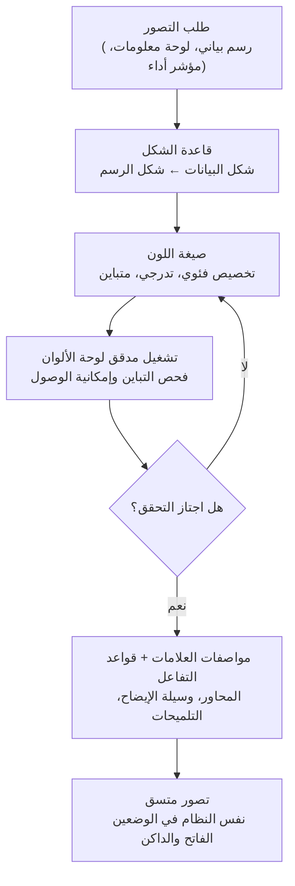

## نظرة عامة

بإمكان أي شخص أن يكتب كوداً يرسم رسماً بيانياً. استخراج رسم أعمدة من `matplotlib` أو ربط لوحة معلومات باستخدام Recharts لا يتطلب أكثر من بضعة أسطر. المشكلة أن معظم ما ينتج عن هذه العملية لا يُقرأ فعلياً. محور لا يبدأ من الصفر يبالغ في الفروقات، ولون مختلف لكل سلسلة بيانات يضطرك لمراجعة وسيلة الإيضاح ثلاث مرات، والانتقال إلى الوضع الداكن يفقد التباين حتى تختفي الحروف. الكود يعمل، لكن الصورة لا تساعد أحداً على اتخاذ قرار.

أضاف Claude Code في إصداره 2.1.198 مهارة مدمجة باسم `/dataviz` تستهدف هذه الفجوة تحديداً. سجل التغييرات الرسمي وصفها في سطر واحد مختصر بأنها تقدّم "إرشادات تصميم الرسوم البيانية ولوحات المعلومات"، لكن ما تفعله فعلياً هو إعادة الرسم البياني من مشكلة برمجية إلى مشكلة تصميم. قبل كتابة أي سطر كود، تحمّل إلى السياق إرشادات حول أي شكل يُختار، وكيف يُخصص اللون، وكيف تُحمى إمكانية الوصول. تستحق هذه المهارة وقفة متأنية لأنها تقلب الترتيب المعتاد "ارسم أولاً ثم حسّن لاحقاً"، وهو الترتيب الذي كان يتكرر كلما بنينا لوحة استهلاك وحدات معالجة رسومية أو تقرير تقييم نموذج داخل ThakiCloud.

## ما هي مهارة /dataviz

`/dataviz` هي مهارة مرجعية يُفترض قراءتها قبل بناء أي رسم بياني أو رسم أو لوحة معلومات، في أي وسيط إخراج. لا يهم إن كانت الوجهة عنصر HTML أو React، أو SVG مضمّن، أو كوداً في مكتبة مثل `matplotlib` أو `plotly` أو d3 أو Recharts، أو صورة PNG سيتم عرضها ورفعها، أو رسماً بياناً سيُشارَك في Slack. صُممت لتُحمَّل قبل كتابة أول سطر من كود الرسم، وقبل اختيار ألوان الرسم، وقبل ترتيب بطاقة مؤشر أداء أو مقياس أو صف من المؤشرات.

النقطة الجوهرية أنها غير مرتبطة بأي نظام تصميم محدد. تقدّم المهارة لوحة ألوان محايدة العلامة التجارية كقيمة افتراضية، وتوجّهك لاستبدال تلك القيم بألوان علامتك التجارية الخاصة. بعبارة أخرى، هي أقرب إلى "استخدم هذه الطريقة في اختيار الألوان" من "استخدم هذا اللون". ولأنها تعلّم منهجية، ينطبق الانضباط نفسه حتى وإن اختلفت لوحة الألوان من مشروع لآخر.

يتضح نطاق المهارة عند النظر إلى ما يستدعيها. فكلمات مثل رسم بياني، رسم، مخطط، تصور بيانات، ولوحة معلومات تستدعيها، وكذلك كل عنصر فردي من عناصر التصور: اللون الفئوي، اللوحات التدرجية والمتباينة، بطاقات المؤشرات، الرسوم النبضية، الخرائط الحرارية، وسائل الإيضاح، المحاور، والتلميحات. سواء كنت ترسم رسماً بياناً كاملاً أو تضع صفاً واحداً من مؤشرات الأداء، فإنك تمر بالإرشادات نفسها في الحالتين.

## ما الذي تحمّله هذه المهارة إلى السياق

تنقسم الإرشادات التي تحمّلها `/dataviz` إلى أربع كتل: قاعدة الشكل، وصيغة اللون، ومدقق قابل للتشغيل، ومواصفات العلامات مع قواعد التفاعل.

**قاعدة الشكل** هي مجموعة القواعد التي تحدد شكل الرسم البياني بناءً على شكل البيانات. فإن كانت البيانات سلسلة زمنية، أو توزيعاً، أو علاقة جزء بكل، أو بيانات جغرافية، فإن العلامة المناسبة تختلف تبعاً لذلك. وجود هذه الخطوة هو ما يسمح بكسر عادة اللجوء تلقائياً إلى الرسم الدائري. المبادئ المتراكمة منذ زمن طويل في مجال تصور البيانات، مثل سبب كون الرسم الدائري خياراً سيئاً في معظم الحالات، وسبب وجوب بدء محور رسم الأعمدة من الصفر، مُقننة هنا كقواعد عملية. إنها في جوهرها المعايير التي وضعها أشخاص مثل إدوارد تافتي وكول نوسباومر كنافليك، منقولة إلى قواعد عمل ضمن مهارة.

**صيغة اللون** تعامل اللون كجزء من البيانات لا كزخرفة. تُخصص ألواناً متمايزة بوضوح للبيانات الفئوية، وألواناً تتدرج تدريجياً في السطوع للبيانات التدرجية، وألواناً تتباعد من نقطة مركزية في اتجاهين للبيانات المتباينة. بدلاً من اختيار لون عشوائي لكل سلسلة، تُوائم اللون مع البنية المعنوية للبيانات.

**مدقق لوحة الألوان القابل للتشغيل** هو نقطة التمايز الحقيقية لهذه المهارة. لا تتوقف عند تقديم إرشاد لاختيار الألوان، بل تفحص بالكود ما إذا كانت اللوحة المختارة تُقرأ فعلياً. يفحص المدقق تباين الألوان وإمكانية الوصول ليحدد ما إذا كان النص والعلامات متمايزين بما يكفي في كل من الوضع الفاتح والوضع الداكن. ولأن فحصاً حتمياً هو من يملك قرار النجاح أو الفشل بدلاً من تقدير بشري عابر، يُستبعد الحكم الذاتي من نوع "يبدو جيداً". اللوحة الافتراضية موثقة في `references/palette.md` بقيم اجتازت التحقق فعلاً، وكل ما يلزم هو استبدال تلك القيم بألوان علامتك التجارية.

**مواصفات العلامات وقواعد التفاعل** توحّد تفاصيل الرسم البياني. قرارات مثل كيفية رسم المحاور، وأين توضع وسيلة الإيضاح، وماذا يُدرج في التلميح، تُثبَّت كقواعد بدلاً من اتخاذها من جديد في كل مرة. والنتيجة أن رسوماً بيانية صنعها أشخاص مختلفون بمكتبات مختلفة تبدو وكأنها نظام واحد.

## كيف تُستخدم فعلياً

الاستخدام بحد ذاته بسيط. حمّل المهارة قبل البدء في بناء رسم بياني أو لوحة معلومات، فتدخل إرشادات الكتل الأربع أعلاه إلى السياق. بعد ذلك، أياً كانت المكتبة المستخدمة، يُولَّد الكود على أساس الانضباط نفسه.

النقطة التي يجب الانتباه إليها هي الترتيب. ما يؤكده وصف المهارة مراراً هو قراءتها "قبل كتابة أول سطر من كود الرسم". تصحيح اللون بعد كتابة الكود بالكامل يأتي متأخراً جداً. تصحيح رسم أعمدة لم يبدأ محوره من الصفر بعد الانتهاء منه يعني عادة إعادة العمل على المقياس والتخطيط من جديد، ومشكلات تباين الوضع الداكن غالباً ما تعني إعادة بناء لوحة الألوان بأكملها. وضع قرار التصميم في المقدمة يجعل هذا التكرار في العمل يختفي.

كون الإرشادات نفسها تنطبق على الرسوم البيانية المشاركة عبر Slack أمر مفيد بشكل خاص في الممارسة العملية. الرسم البياني المرتجل الملصق في قناة الفريق عادة ما يعاني من إشكالية مزدوجة: الأكثر إهمالاً في صنعه والأكثر انتشاراً في قراءته. وحين يمر عبر هذه المهارة، حتى هذا النوع من الرسوم يخضع للقواعد نفسها التي تخضع لها لوحة معلومات رسمية.

## دلالات على منتجات ThakiCloud

الرسالة التي تحملها `/dataviz` تتطابق تماماً مع المبدأ الذي تمارسه ThakiCloud بالفعل في منتجَين: عدم ترك التنسيق والجودة لارتجال النموذج، بل جعله يملأ هيكلاً مُتحقَّقاً منه.

من **زاوية ai-platform**، نقوم باستمرار بتصور مؤشرات مثل استهلاك وحدات معالجة الرسومات، وحالة طابور Kueue، وزمن استجابة تقديم النماذج، والتكلفة لكل مستأجر، فوق بنيتنا التحتية للذكاء الاصطناعي والتعلم الآلي القائمة على K8s. لوحات المراقبة هذه هي شاشات يحتاج فيها المشغّل إلى رصد أي خلل خلال ثوانٍ، لذا فإن التسلسل الهرمي البصري يترجم مباشرة إلى سرعة الاستجابة. تدفق يختار رسماً بيانياً يلائم طبيعة كل مؤشر عبر قاعدة الشكل، ويميّز الحالات الطبيعية والتحذيرية وحالات العطل عبر معنى اللون بواسطة صيغة اللون، ويضمن تباين الوضع الداكن عبر المدقق، يرفع مباشرة من موثوقية لوحة العمليات. انضباط استخدام اللون كإشارة حالة لا كزخرفة يقلل من سوء التقدير أثناء الاستجابة أثناء المناوبة.

من **زاوية Paxis**، تمثل `/dataviz` بحد ذاتها نموذجاً مصغراً لما نبنيه من سحابة أصيلة للعملاء الوكلاء. Paxis هو مستوى تحكم الوكلاء الذي يعمل فوق ai-platform، يعامل المهارات كموارد من الدرجة الأولى ويختار من بين نحو 960 مهارة باستخدام BM25 لتشغيلها في بيئة معزولة. الطريقة التي تحزم بها `/dataviz` "القدرة على رسم رسم بياني" في مهارة واحدة وتحمّلها إلى السياق عند الحاجة هي البنية نفسها التي يعتمدها Skill Harness في Paxis، والذي يجمع المعرفة والانضباط في وحدات مهارات قابلة لإعادة الاستخدام. ومدقق لوحة الألوان القابل للتشغيل تحديداً هو النسخة الخاصة بتصور البيانات من مبدأ حافظنا عليه عبر عدة مهارات دفعية: الأرقام والأحكام لا يدّعيها النموذج، بل يملكها الكود الحتمي. النموذج يقترح لوناً، والكود يفحص ما إذا كان هذا اللون يُقرأ فعلياً. من دون هذا الفصل، لا يمكن للمخرجات التي ينتجها أشخاص متعددون ووكلاء متعددون أن تتقارب في نظام واحد.

الزاويتان تكمّلان بعضهما. ai-platform يستخرج المؤشرات، وPaxis يشغّل بأمان المهارة التي تعرض تلك المؤشرات بلغة بصرية متسقة. البنية التحتية منخفضة التكلفة تجعل قابلية المراقبة رخيصة، وحاضنة المهارات تحوّل تلك المراقبة إلى صورة يمكن قراءتها فعلاً.

## الحدود والحجج المضادة

`/dataviz` ليست حلاً سحرياً. ما تحمّله المهارة هو إرشاد، وليس إكمالاً تلقائياً، لذا لا يزال على إنسان أو وكيل أن يكتب الرسم البياني فعلياً. وإن تجاهل أحدهم الإرشاد وكتب الكود أولاً على أي حال، يفقد استدعاء المهارة معناه. انضباط الترتيب ليس شيئاً تفرضه الأداة من تلقاء نفسها.

هناك أيضاً كلفة في استهلاك السياق. تحميل المهارة يستهلك رموزاً. تحميل الإرشاد الكامل في كل مرة من أجل رسم بياني يكفي رسمه بسرعة قد يكون مبالغاً فيه. تستحق قيمتها في لوحات المعلومات والتقارير حيث الجودة هي جوهر المخرج، لكن لا مبرر لفرضها قسراً على رسم مؤقت لمرة واحدة.

كون اللوحة الافتراضية محايدة العلامة التجارية سيف ذو حدين أيضاً. استخدامها كما هي من دون استبدال يعطي رسماً بيانياً باهتاً لا هوية له، لا يمكن تمييز الشركة التي أنتجته. تخطي خطوة استبدال قيم `references/palette.md` بعلامتك التجارية يمنحك الاتساق لكنه يفقدك الهوية. المهارة تمنح المنهجية، والقرار الأخير بإضفاء العلامة التجارية يبقى مسؤوليتنا.

## المصادر

- [سجل تغييرات Claude Code CLI 2.1.198 (ClaudeCodeLog على X)](https://github.com/anthropics/claude-code/blob/main/CHANGELOG.md)
- وصف مهارة `dataviz` المدمجة في Claude Code وملف `references/palette.md`
