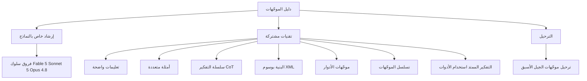

*تصوير لكيفية تجمّع التعليمات الواضحة والبنية في مخرَج يمكن التنبّؤ به.*

## نظرة عامة

كتابة الموجّهات جيداً لا تزال ثمانية أعشار حسن استخدام النموذج. مع ازدياد قوة النماذج تتبع التعليمات المرنة إلى حدّ ما، لكن انتزاع شكل وجودة مستقرّين لا يزال يحتاج إلى عقد واضح.

تحتفظ Anthropic بمستند رسمي لأفضل ممارسات الموجّهات لنماذجها الأحدث. يغطّي هذا الدليل النماذج الحالية بما فيها Claude Fable 5 وClaude Sonnet 5 وClaude Opus 4.8، ويفصل أين يتصرّف كل نموذج بشكل مختلف، وأي التقنيات تنطبق عموماً على كل النماذج، وما ينبغي إصلاحه عند الانتقال من جيل أسبق. في هذه المقالة نعرض بنيته وتقنياته الأساسية، ونربطه بكيفية تعامل ThakiCloud مع الموجّهات كعقود لا كارتجال داخل منصة الوكلاء Paxis.

## ما هذا الدليل

مستند الموجّهات من Anthropic منظّم في ثلاثة أجزاء كبيرة.

الأول إرشاد خاص بالنماذج. يشير إلى أين يستجيب Fable 5 وSonnet 5 وOpus 4.8 بشكل مختلف، لتعرف أن الموجّه نفسه قد يحتاج إلى تعديل بحسب النموذج. الثاني تقنيات تنطبق عموماً على كل النماذج الحالية. يغطّي مدى واسعاً من المبادئ العامة إلى تنسيق المخرجات واستخدام الأدوات والتفكير وتصميم الأنظمة الوكيلة. الثالث اعتبارات الترحيل، يرشد إلى كيفية مراجعة الموجّهات المنقولة من جيل أسبق.

مرسومة كصورة، تبدو هذه البنية الثلاثية هكذا.

بمعزل عن المستند، تنشر Anthropic أيضاً دليلاً تفاعلياً لهندسة الموجّهات في تسعة فصول، لتتعلّم بتشغيل الأمثلة والتمارين مباشرة.

## التقنيات الأساسية

التقنيات التي يشدّد عليها الدليل ليست حيلاً برّاقة بل أساسيات مكرّرة. مرتّبة بحسب الأثر العملي:

التعليمات الواضحة أولاً. اكتب تحديداً ماذا تفعل، وبأي شكل تنتجه، وما تتّخذه معياراً للتقييم. بدلاً من طلب غامض مثل "ساعدني"، حدّد نتيجة واحدة لكل فعل. تحديد شكل المخرَج وحده يرفع الجودة أكثر من غيره.

الأمثلة المتعددة ثانياً. أظهر النبرة والصيغة اللتين تريدهما في مثالين أو ثلاثة فيتّبع النموذج ذلك الإيقاع. حين يكون شكل المخرَج معقّداً بخاصة، فإن إرفاق مثال واحد أدقّ بكثير من وصفه بالكلمات.

سلسلة التفكير ثالثاً. طلب استدلال خطوة بخطوة قبل الجواب يرفع الدقة في الاستدلال المعقّد. غير أن التفكير يكلّف رموزاً، فاستخدمه فقط للعمل الذي يحتاج فعلاً إلى استدلال.

البنية بوسوم XML رابعاً. فصل التعليمات والسياق والأمثلة وبيانات الإدخال بوسوم يمنع النموذج من الخلط بين دور كل جزء. الأثر كبير بخاصة عند التعامل مع سياق طويل.

موجّهات الأدوار خامساً. إعطاء النموذج منظوراً محدّداً أو دور خبير ينتج مفردات وحكماً يلائمان ذلك السياق. وهو مفيد للمراجعة والتدقيق وتحليل مجال محدّد.

تسلسل الموجّهات سادساً. تقسيم طلب كبير واحد إلى عدة مراحل وتمرير مخرَج كل مرحلة إلى التالية يثبّت جودة كل مرحلة أكثر من مطالبة كل شيء دفعة واحدة.

أخيراً هناك التفكير الممتد واستخدام الأدوات وتصميم الأنظمة الوكيلة. التفكير الممتد ميزة تخصّص ميزانية للاستدلال الداخلي، ويغطّي استخدام الأدوات وتصميم الوكلاء الحلقة التي يستدعي فيها النموذج أدوات خارجية ويأخذ النتيجة ليقرّر الفعل التالي. هذه المنطقة التي كبر وزنها في الدليل الأحدث.

## دلالات لمنتجات ThakiCloud

هذا الدليل عملي لنا لأن منصة الوكلاء Paxis من ThakiCloud تتعامل مع الموجّهات بهذه الطريقة بالضبط. Paxis مستوى تحكّم Agent-Native Cloud يعمل فوق ai-platform، ويدير المهارات والأدوات والسياسات وسجلات التدقيق كموارد من الدرجة الأولى. وضمنها، الموجّه ليس شيئاً مرتجلاً يُؤلَّف من جديد كل مرة بل عقد مُحزَّم في مهارة وخاضع للتحكّم في الإصدارات.

تقنية الدليل الأولى، التعليمات الواضحة، تتداخل مباشرة مع مبدأ تصميم مِهاز مهارات Paxis. تتراكم القدرات لا في مِهاز رفيع بل في مهارات سميكة، وتحدّد كل مهارة صراحةً الإدخال والمعالجة والمخرَج وحتى التعافي من الفشل. إذا جعلت الشيفرة تملك شكل المخرَج ومعايير تقييمه، ركّز النموذج على توليد المحتوى فقط ولم يتذبذب التنسيق.

البنية بـ XML وتسلسل الموجّهات يلامسان تنسيق DAG متعدد الوكلاء. تختار Paxis من أكثر من 960 مهارة بواسطة BM25 وتشغّلها في صناديق رمل معزولة، والتسلسل الذي يقسّم مهمة كبيرة إلى مراحل ويمرّر مخرَج كل مرحلة إلى الأمام هو القواعد الأساسية لهذا التنسيق. جعل كل مرحلة مهارة مستقلة يتيح إعادة تشغيل المرحلة الفاشلة فقط، ما يرفع دقة التعافي.

موجّهات الأدوار واستخدام الأدوات يتّحدان مع بوّابات السياسة وسجلات التدقيق. الحلقة التي يستدعي فيها وكيل فرعي أُعطي دوراً محدّداً أدوات ويأخذ النتائج ليقرّر الفعل التالي تصبح مستقلّة بأمان فقط حين يمرّ كل فعل عبر بوّابات سياسة وسجلات تدقيق. ما يسمّيه الدليل تصميم الأنظمة الوكيلة يُترجَم لنا إلى مشكلة التنفيذ المستقلّ القابل للتدقيق.

باختصار، مبادئ الموجّهات الجيدة ومبادئ تصميم منصة وكلاء متينة تشير إلى المكان نفسه جوهرياً. قلّل درجات الحرية واملأ هيكلاً مُتحقَّقاً منه بالمحتوى لترفع متوسط الجودة. يمارس هذا الدليل ذلك المبدأ على مستوى الموجّه، وتمارسه Paxis على مستوى المنصة.

## القيود والاعتراضات

لهذا الدليل تحفّظات أيضاً. أولاً، الإرشاد الخاص بالنماذج يشيخ مع الوقت. حين يُطلَق نموذج أو يُحدَّث، قد يستجيب موجّه نجح بالأمس بشكل مختلف اليوم، فاقرأ الدليل كلقطة للحظة الحالية لا كعقيدة.

ثانياً، معرفة تقنيات كثيرة لا تصنع موجّهاً جيداً. تكديس وسوم XML وسلسلة التفكير وموجّهات الأدوار دفعة واحدة قد يجعل التعليمات ثقيلة ويزيد الرموز فقط. لكل تقنية، معرفة متى لا تستخدمها مهمّة بقدر معرفة متى تستخدمها.

ثالثاً، التفكير الممتد ليس مجانياً. رموز التفكير كلفة، وتشغيل أقصى تفكير لكل مهمة إهدار. كما في منظور توجيه النماذج المتناول سابقاً، يجب أيضاً تخصيص ميزانية التفكير بحسب صعوبة المهمة.

في الختام، قيمة هذا الدليل ليست في تعليم سحر جديد. إنها في شحذ الحكم على متى وكيف تجمع الأساسيات. وتصليب ذلك الحكم في مهارات وسياسة كي لا تعيده كل مرة هو مهمّة المنصة.

## المصادر

- "Prompting best practices"، Claude Platform Docs: [platform.claude.com/docs/en/build-with-claude/prompt-engineering/claude-prompting-best-practices](https://platform.claude.com/docs/en/build-with-claude/prompt-engineering/claude-prompting-best-practices)
- "Prompt engineering overview"، Anthropic Docs: [docs.anthropic.com/en/docs/build-with-claude/prompt-engineering/overview](https://docs.anthropic.com/en/docs/build-with-claude/prompt-engineering/overview)
- "Anthropic's Interactive Prompt Engineering Tutorial"، GitHub: [github.com/anthropics/prompt-eng-interactive-tutorial](https://github.com/anthropics/prompt-eng-interactive-tutorial)
