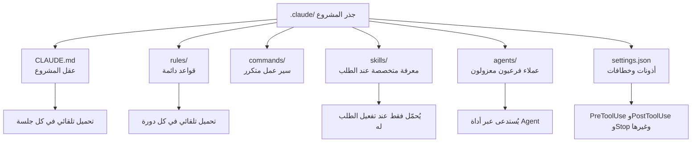

*عندما تُنظَّم التعليمات والقواعد والأدوات المتناثرة ضمن بنية مجلدات واضحة، يصبح سلوك العميل الذكي قابلًا للتنبؤ.*

## نظرة عامة

أكثر خطأ شائع عند بدء العمل مع Claude Code هو تخطي مرحلة الإعداد والانتقال مباشرة إلى كتابة الأوامر النصية (prompts). قد ينجح هذا لبضع مرات، لكن مع نمو المشروع تجد نفسك تكرر التعليمات ذاتها في كل مرة، بينما يبدأ النموذج كل جلسة من صفحة بيضاء تمامًا. عندها تصبح جودة النتيجة رهينة لحظّ ذلك اليوم، لا لمهارتك في كتابة الأوامر.

الحل لهذه المشكلة ليس استبدال النموذج بآخر أفضل، بل **تحويل المشروع نفسه إلى بنية تعاقدية واحدة**. في Claude Code، يعيش هذا التعاقد في مجلد `.claude/` عند جذر المشروع. سلسلة منشورات على منصة X لـ Akshay Pachaar بعنوان "تشريح مجلد .claude/" انتشرت مؤخرًا وقدّمت خلاصة جيدة لهذه البنية. في هذا المقال نتبع الهيكل نفسه، لكن مع إضافة **أرقام مقاسة فعليًا من مشروع إنتاجي حقيقي يعمل عليه Claude Code ويحتوي 1,671 مهارة (skill)**، لنرى كيف تُستخدم كل طبقة على أرض الواقع من حيث الحجم. ثم نربط ذلك بالطريقة التي حوّلت بها ThakiCloud هذا النمط إلى منتج فعلي، وهو سحابتها الموجّهة نحو العملاء الأذكياء (Agent-Native Cloud) باسم Paxis.

## ما هو مجلد .claude/

مجلد `.claude/` هو مجموعة الاتفاقيات التي تُخبر Claude Code كيف يعمل ضمن هذا المشروع تحديدًا. الفكرة الجوهرية هي أنه ليس أمرًا نصيًا ضخمًا واحدًا، بل مجموعة طبقات لكل منها دور مختلف. تختلف هذه الطبقات في توقيت تحميلها وفي كلفتها.



إذا قسّمنا دور كل طبقة، تصبح الصورة كالتالي.

**CLAUDE.md** هو عقل المشروع. يُحمَّل تلقائيًا في كل جلسة، ويجيب فقط على أربعة أمور: لمحة عامة عن البنية المعمارية، والحزمة التقنية، والاتفاقيات المتّبعة، وقواعد سير العمل. إذا حشرت فيه معرفة "تُحتاج أحيانًا فقط"، فأنت تهدر جزءًا من سعة السياق في كل جلسة. لهذا يجب أن يبقى CLAUDE.md خفيفًا كمبدأ أساسي.

**rules/** هي القواعد الدائمة التي تُطبَّق في كل دورة (turn). هنا توضع القواعد الثابتة التي تخص جميع الأعمال، مثل أسلوب كتابة الشيفرة وسياسات الأمان وسير عمل git وبوابات الجودة. عندما يصبح CLAUDE.md مثقلًا، يُنقل جزء منه إلى هنا.

**commands/** هي سير عمل متكرر يُختزل في أوامر شرطة مائلة (slash commands). أمر واحد مثل `/review` أو `/ship` يستدعي سلسلة خطوات محددة مسبقًا.

**skills/** هي معرفة متخصصة تُحمَّل فقط عند تفعيل الطلب لها. هنا توضع خطوط أنابيب (pipelines) خاصة بمجال معيّن أو وصفات تحليل لا تُحتاج دائمًا. تبقى المهارة مجرد اسم ووصف في الفهرس حتى يصل طلب ذو صلة، عندها فقط يُحمَّل محتواها الكامل.

**agents/** هي تعريفات لخبراء مستقلين لكل منهم دوره وأدواته ونموذجه الخاص. يُستدعون عبر أداة Agent، فيُوجَّه الاستكشاف إلى نموذج رخيص، والتنفيذ إلى نموذج متوازن، والقرارات المعمارية إلى نموذج قوي.

**settings.json** يضبط الأذونات والخطافات (hooks). تسمح الخطافات بإدخال شيفرة حتمية قبل استدعاء الأداة وبعده (`PreToolUse`/`PostToolUse`) أو عند إنهاء الجلسة (`Stop`)، بحيث تصبح الشيفرة، لا النموذج، هي المسؤولة عن التنسيق والتحقق.

إضافة إلى ذلك، يوجد نسختان من مجلد `.claude/`: واحدة تُحفظ ضمن المستودع (repository) وتُشارَك مع الفريق بأكمله، وأخرى عامة (global) موجودة في `~/.claude/` تحتفظ بالتفضيلات الشخصية وبذاكرة تلقائية مشتركة بين المشاريع.

## التثبيت والإعداد

أسرع طريقة للبدء هي التهيئة (initialization) من جذر المشروع.

```bash
# من جذر المشروع
claude
# داخل الجلسة، إنشاء مسودة عقل المشروع
/init
```

يقوم `/init` بمسح المستودع وإنشاء مسودة لملف `CLAUDE.md`. بعد ذلك تُنقَّح المسودة يدويًا. يمكن أيضًا إنشاء هيكل المجلدات يدويًا كما يلي.

```bash
mkdir -p .claude/rules .claude/commands .claude/skills .claude/agents .claude/hooks
```

مثال على ربط خطاف (hook) داخل `settings.json`. هذا خطاف من نوع PostToolUse يُشغّل تنسيقًا تلقائيًا بعد التعديل.

```json
{
  "hooks": {
    "PostToolUse": [
      {
        "matcher": "Write|Edit",
        "command": "python3 .claude/hooks/format-on-save.py",
        "description": "تنسيق تلقائي للملف الذي تم تعديله"
      }
    ]
  }
}
```

الشكل الأدنى لأي مهارة هو ترويسة (frontmatter) في ملف `SKILL.md`. بما أن حقل `description` هو ما يشغّل عملية البحث، يجب وضع كلمات مفتاحية بالإنجليزية والعربية/الكورية معًا، وتوضيح "متى لا تُستخدم هذه المهارة" حتى لا يقع الخلط مع مهارات مجاورة.

```yaml
---
name: my-pipeline
description: >-
  Does X in one sentence. Use when <english + local trigger phrases>.
  Do NOT use for <anti-pattern> (use other-skill).
---
```

القاعدة الجوهرية واحدة فقط: **القدرات تُبنى في المهارات (skills)، لا في الهيكل التنفيذي (harness)**. يُبقى CLAUDE.md وrules خفيفين، بينما تُحشى المهارات بالمعرفة الخاصة بالمجال والأحكام والقوالب وحالات الفشل السابقة. الهدف أن تعمل المهارة نفسها عبر Claude Code أو أي هيكل تنفيذي آخر دون تغيير.

## قياس فعلي: تشريح مشروع إنتاجي حقيقي لـ Claude Code

المستودع الذي كُتب فيه هذا المقال نفسه هو مشروع Claude Code مُعدّ بشكل مكثف. قسنا كل طبقة عبر عدّ الملفات فعليًا لنرى حجم استخدامها على أرض الواقع. الأرقام أدناه جميعها قيم مقاسة فعلًا.

| الطبقة | العدد الفعلي المقاس | وقت التحميل | الدور |
|---|---|---|---|
| CLAUDE.md | 94 سطرًا | كل جلسة | عقل المشروع (يُبقى خفيفًا) |
| rules/ | 49 | كل دورة | قواعد دائمة |
| commands/ | 22 | عند الاستدعاء | سير عمل متكرر |
| skills/ | 1,671 | عند التفعيل | معرفة متخصصة عند الطلب |
| agents/ | 60 | عند الاستدعاء | عملاء فرعيون معزولون |
| hooks/ | 12 | قبل/بعد استخدام الأداة | بوابات حتمية (deterministic) |

مبدأ التصميم الذي يظهر هنا واضح تمامًا. ملف CLAUDE.md خفيف جدًا بـ94 سطرًا فقط. بما أنه يُحمَّل في كل جلسة، فهو يدفع "إيجارًا" مستمرًا، ولذلك لا يُحمَّل فيه إلا الحد الأدنى الضروري. في المقابل، عدد المهارات ضخم جدًا ويبلغ 1,671. بما أن المهارات لا تُحمَّل إلا عند تفعيلها، فهذا الحجم الهائل لا يفرض أي كلفة في كل دورة.

أظهر القياس أن أحداث الخطافات المسجَّلة كانت خمسة أنواع: `PreToolUse` و`PostToolUse` و`Stop` و`SessionStart` و`UserPromptSubmit`، وأن ملف `settings.json` كان مبنيًا على ثلاثة محاور: `permissions` و`hooks` و`env`. أي أن كل ما يعمل بشكل دائم (rules وhooks) يُبقى عدده صغيرًا عمدًا، بينما كل ما يُستدعى عند الحاجة فقط (skills وagents) يُسمح له بالتوسّع بلا حدود تقريبًا.

لكن حين يصل عدد المهارات إلى 1,671، تنشأ مشكلة جديدة. لا يستطيع لا الإنسان ولا النموذج تصفّح هذه القائمة كاملة لاختيار "المهارة المناسبة الآن". وهذا بالضبط ما يقودنا إلى القسم التالي.

## دلالات التطبيق على منتجات ThakiCloud

بمجرد أن يصل عدد المهارات إلى الآلاف، لم تعد إدارة ملفات مجلد `.claude/` مسألة تنظيم شخصي، بل تتحول إلى **مشكلة توجيه (routing) في وقت التشغيل (runtime)**. حوّلت ThakiCloud هذا النمط إلى منتج فعلي تحت اسم **Paxis**، وهي سحابتها الموجّهة نحو العملاء الأذكياء (Agent-Native Cloud).

Paxis هو مستوى تحكّم للعملاء الأذكياء يعمل فوق البنية التحتية للذكاء الاصطناعي في ThakiCloud (ai-platform)، ويتعامل مع Skills وTools وPolicies وAudit Logs كموارد من الدرجة الأولى (first-class resources). الجزء الذي يتقاطع مباشرة مع تشريح مجلد `.claude/` هو **Skill Harness**. كما رأينا أعلاه، مهما أنشأت مهارات كثيرة، فإن تحميلها كلها في كل دورة يُفجّر السياق. عندما يصل طلب ما، يختار Paxis من مجموعة المهارات الضخمة فقط المهارات ذات الصلة عبر بحث BM25، ويحمّلها، ثم ينفّذها ضمن بيئة معزولة (sandbox). ولهذا يظل التوجيه فعالًا حتى عندما يتجاوز عدد المهارات 1,000 كما رأينا في القياس الفعلي في هذا المقال.

إلى جانب ذلك، يرتقي Paxis بما تقوم به الخطافات (بوابات حتمية) إلى مستوى بوابات سياسات (policy gates) وسجلات تدقيق (audit logs). تمامًا كما يمنع خطاف PreToolUse في `.claude/settings.json` أمرًا خطيرًا، يمرر Paxis كل سلوك لأي عميل ذكي عبر بوابة سياسات وسجل تدقيق، مسجّلًا "من نفّذ ماذا ومتى". هذا تحويل لخطاف مشروع شخصي إلى آلية يمكن الوثوق بها حتى في بيئة متعددة المستأجرين (multi-tenant).

طبقة agents/ تمتد إلى تنسيق Paxis متعدد العملاء الأذكياء عبر رسم بياني موجّه غير دوري (DAG). النمط المحلي الذي يفصل بين عملاء فرعيين حسب الدور والنموذج يتوسّع هنا ليصبح بنية تربط عدة عملاء ضمن رسم بياني للاعتماديات، تُنفَّذ بالتوازي وتُغلَق بمرحلة تحقق (verification).

هذا له معنى أيضًا من منظور البنية التحتية (عدسة ai-platform). كل تنفيذ لهذه المهارات والعملاء يستهلك في النهاية موارد GPU وكلفة استدلال (inference). منصة ai-platform التابعة لـ ThakiCloud، القائمة على K8s وKueue للجدولة وvLLM للخدمة، تدعم هذا التنفيذ بتكلفة منخفضة، وتتيح للبيئات التي لديها متطلبات سيادة بيانات أو استضافة محلية (on-premise) تشغيل الهيكل التنفيذي نفسه ذاتيًا (self-hosting). الخدمة منخفضة الكلفة هي التي تجعل اقتصاديات العميل الذكي ممكنة، وفوقها يعمل هيكل مهارات Paxis.

## الحدود ووجهات النظر المعارضة

هذا النهج ليس دائمًا الإجابة الصحيحة. أولًا، فرض بنية `.claude/` الثقيلة على سكربت صغير أو عمل لمرة واحدة هو مبالغة. قبل إضافة قاعدة واحدة في rules، يجب أن تسأل "هل هذه حقًا مطلوبة في كل دورة؟"، وإن لم تكن كذلك، فيجب تنزيلها إلى مستوى مهارة. لا ينبغي أن يتحول الإعداد نفسه إلى الهدف.

ثانيًا، عندما يصل عدد المهارات إلى الآلاف، يصبح ضجيج البحث عنق زجاجة جديدًا. كلما زاد عدد المهارات ذات الأسماء المتشابهة، تنخفض دقة التوجيه، ويزداد خطر تحميل مهارة غير مناسبة. هذه المشكلة لا تُحل برفع درجة النموذج، بل فقط عبر العمل الدؤوب والممل لضبط محفزات (triggers) وحدود (boundaries) وصف المهارة (description).

ثالثًا، يجب ألا يحتوي مجلد `.claude/` المُحفَّظ (committed) إلا على الإعدادات المشتركة مع الفريق، بينما تُترك المسارات الشخصية والرموز (tokens) واختصارات التصحيح إلى `~/.claude/` أو `CLAUDE.local.md`. عدم الالتزام بهذا الفصل يعني تعرّض معلومات شخصية للانكشاف في المستودع.

خلاصة القول، إعداد مجلد `.claude/` ليس عملًا يهدف إلى "جعل النموذج أفضل"، بل إلى "جعل سلوك النموذج قابلًا للتنبؤ". عندما يكون المشروع صغيرًا، يكفي ملف CLAUDE.md واحد، وكلما كبر المشروع يمكن تقسيمه إلى rules وskills وagents وhooks. وعندما يصل عدد المهارات إلى مقياس الآلاف، لم تعد المسألة تنظيم مجلدات، بل تصبح مشكلة بنية توجيه (routing infrastructure) بحتة. وهذه بالضبط النقطة التي يتعامل معها Paxis كمنتج.

## المصادر

- [Akshay Pachaar, "How to setup your Claude code project?" (X)](https://x.com/akshay_pachaar/status/2035706568142893229)
- [Builder.io, "Setting Up a New Claude Code Project: The Complete Guide"](https://www.builder.io/blog/setting-up-claude-code-project)
- [Claude Code Docs: Quickstart](https://code.claude.com/docs/en/quickstart)
