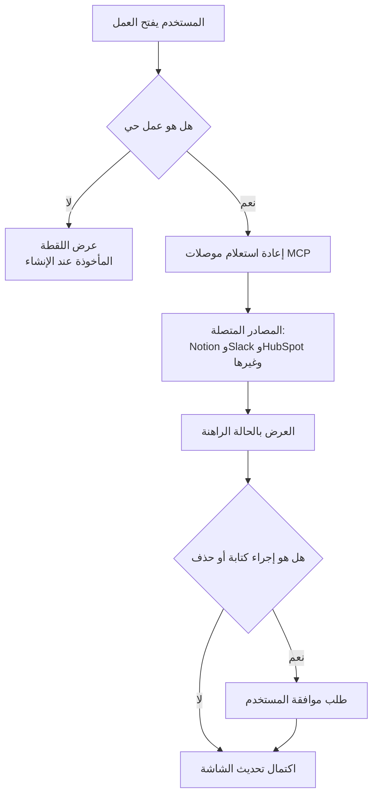

حتى وقت قريب، كانت أعمال Claude Code وسيلة لالتقاط نتائج جلسة عمل وتجميدها في صفحة ويب واحدة قابلة للمشاركة. وصف طلب سحب مع فرق مُعلّق، ملخص حادثة، قائمة مهام: كل هذه كانت مخرجات ثابتة تحافظ على حالة اللحظة التي أُنشئت فيها. مع هذا التحديث، تتقدم الأعمال خطوة أخرى. أصبحت الأعمال قادرة الآن على **استدعاء موصلات MCP مباشرة** لجلب البيانات، بل وتنفيذ الإجراءات أيضًا. بمعنى آخر، بدلًا من صفحة متحجرة عند لحظة إنشائها، نحصل على **تطبيق حي يعيد استعلام الموصلات في كل مرة يُفتح فيها ويعرض الحالة الراهنة**. هذا المقال موجّه للمطورين الذين سئموا كتابة نفس لوحات المعلومات الداخلية وأدوات التشغيل يدويًا مرارًا وتكرارًا. والخلاصة المختصرة: يمكن الآن استبدال جزء كبير من تلك اللوحات بعمل واحد فقط، دون الحاجة إلى نشر واجهة أمامية.

## نظرة عامة

التحول الجوهري هو أن الأعمال انتقلت من "مخرج للقراءة فقط" إلى "عميل قابل للتنفيذ". بينما كان العمل القديم يعرض لقطة من البيانات، فإن العمل الحي يرسل استعلامات إلى المصدر الفعلي عبر موصل. حالات الاستخدام التي يفتحها هذا واضحة: عرض خط أنابيب علاقات العملاء، متتبعات المشاريع، الإحاطات الصباحية، لوحات المؤشرات الأسبوعية؛ أي شاشة **تتغير بياناتها الأساسية باستمرار**. ولأنه يسحب بيانات جديدة في كل مرة يُفتح فيها، لا يحتاج أحد إلى الضغط على زر التحديث، ولا يحتاج أي نظام خلفي منفصل إلى دفع البيانات عبر مهمة مجدولة.

يمثّل MCP خط الأنابيب خلف هذه الصورة. MCP بروتوكول مفتوح يتيح لـ Claude التحدث مع أدوات خارج نافذة المحادثة، والموصلات هي التكاملات بنقرة واحدة التي بنتها Anthropic وشركاؤها فوق هذا البروتوكول. حين يستدعي عمل موصلًا، فهذا يعني أن العمل أصبح قادرًا الآن على قراءة وكتابة البيانات مباشرة في الأنظمة الخارجية المرتبطة بخادم MCP ذاك.

## ما هي أعمال Claude Code وموصلات MCP

لنبدأ بالأعمال. يحوّل العمل نتاج جلسة Claude Code إلى صفحة مرئية حية قابلة للمشاركة. وصف طلب سحب مع فرق مُعلّق، لوحة معلومات مُجمّعة من بيانات الجلسة، خط زمني يُملأ تدريجيًا مع تقدّم تحقيق ما؛ كل هذه يمكن أن تكون أعمالًا. يذهب العمل الحي خطوة أبعد ويُحدّث نفسه تلقائيًا. في كل مرة يُفتح فيها، يعيد استعلام الموصلات المرتبط بها ويعرض الحالة الراهنة.

الموصلات هي طبقة التكامل المبنية فوق خوادم MCP. تُضاف موصلات المكتبة بنقرة واحدة وتسجيل دخول عبر OAuth من قسم Connectors تحت Customize. من بينها Notion وGmail وSlack وHubSpot وLinear وCanva وAtlassian وMicrosoft 365. يضم دليل الموصلات أكثر من 375 تكاملًا يغطي الملفات والبريد الإلكتروني وإدارة المشاريع والتحليلات والتصميم والمبيعات وأدوات المطورين.

يوضّح المخطط أدناه الفرق في تدفق البيانات بين عمل ثابت وعمل حي.



## كيف يعمل

تتلخص الآلية في ثلاث قواعد.

أولًا، **يعيد الاستعلام في كل مرة يُفتح فيها.** يعيش العمل الحي في تبويب منفصل داخل الشريط الجانبي لـ Cowork، وفي كل مرة يُفتح فيها يعيد استعلام موصلاته ويرسم الحالة الراهنة. يمكن ربطه بموصل واحد فقط، أو دمج عدة موصلات معًا في شاشة واحدة. ومن هنا تأتي فكرة لوحة معلومات موحّدة تسحب من مصادر متعددة.

ثانيًا، **الكتابة والحذف تمرّان عبر بوابة موافقة.** حين لا يكتفي الموصل بقراءة البيانات بل ينفّذ إجراءً يغيّر فعليًا بيانات المصدر المتصل، يُطلب من Claude أن يطلب موافقة المستخدم أولًا. إنها آلية حماية تمنع الأتمتة من المساس بمصدر الحقيقة بصمت. عند إعداد أداة ما، أول ما يجب التحقق منه هو ما إذا كانت أدوات الكتابة والحذف تخضع لموافقة إلزامية.

ثالثًا، **نطاق الوصول مرتبط بالفرد.** في مؤسسات Team أو Enterprise، يمكن للمالكين فقط إضافة موصل إلى المؤسسة، لكن الاتصال والتفعيل الفعليين يتمّان لكل مستخدم على حدة. لذلك لا يصل Claude إلا إلى الأدوات والبيانات التي يملك ذلك المستخدم الصلاحية عليها أصلًا. من ميزات خطتي Team وEnterprise أنه عند استخدام عمل مشترك من قِبل زميل في الفريق، لا تترتب تكلفة إضافية على من أنشأه.

من زاوية إدارة المؤسسات، أُضيف أيضًا مسار لتوفير الموصلات على مستوى المؤسسة. بمجرد أن يسجّل المسؤول موصلًا عبر مزوّد هوية مثل Okta، يحصل المستخدمون على وصول الموصل تلقائيًا عند تسجيل الدخول الأول دون أي إعداد إضافي. يُهيَّأ التوثيق مركزيًا على مستوى المؤسسة، وتُشارك هذه الصلاحية عبر محادثة Claude وClaude Code وCowork.

## مثال إعداد عملي

إضافة خادم MCP في Claude Code تتطلب أمرًا واحدًا وملف إعدادات واحدًا. إليك الأمر الفعلي لإضافة خادم MCP محلي.

```bash
# تسجيل خادم MCP في Claude Code
claude mcp add my-metrics --command "python3" --args "servers/metrics_mcp.py"

# التحقق من الخوادم المسجَّلة
claude mcp list
```

يمكن الإعلان عن خوادم MCP المرتبطة بمشروع في `.mcp.json` في جذر المستودع ومشاركتها مع الفريق. البنية كالتالي.

```json
{
  "mcpServers": {
    "my-metrics": {
      "command": "python3",
      "args": ["servers/metrics_mcp.py"],
      "env": { "METRICS_DB_URL": "postgres://..." }
    }
  }
}
```

بالنسبة للموصلات البعيدة، يُستخدم نقطة نهاية MCP بعيدة وتدفق OAuth. أما موصلات المكتبة فهي أبسط: انتقل إلى قسم Connectors تحت Customize في الواجهة، اضغط زر الإضافة، وابحث عن التطبيق الذي تريد ربطه. داخل العمل، يُستدعى الموصل المرتبط كأنه دالة لجلب البيانات، وتُعرض النتيجة كمكوّن في لوحة المعلومات. ما نحتاج إلى كتابته ليس خط أنابيب نشر لواجهة أمامية، بل تعليمات بلغة طبيعية تحدد أي الموصلات نستعلم عنها وبأي ترتيب، وماذا نرسم بالنتيجة.

## دلالات على منتجات ThakiCloud

هذه الميزة هي النسخة الموجّهة للمستهلك من مشكلة نعمل عليها منذ فترة طويلة في Paxis. Paxis هو Agent-Native Cloud الخاص بـ ThakiCloud، ويتعامل مع المهارات والأدوات والسياسات كموارد من الدرجة الأولى. من أهم أجزاء طبقة الأدوات تلك خط الأنابيب الذي **يدير موصلات MCP مع إعادة اتصال OAuth تلقائية**. خطوة Anthropic في السماح للأعمال باستدعاء الموصلات تشير بالضبط إلى النقطة ذاتها التي يستهدفها تصميمنا: الوكلاء الذين يتحدثون مع أنظمة خارجية يحتاجون إلى ترقية الموصلات لتصبح موارد من الدرجة الأولى.

ما يلفت انتباهنا بشكل خاص هو **بوابة الموافقة ونطاق الوصول**. الطريقة التي تفرض بها الأعمال الحية موافقة على إجراءات الكتابة والحذف، وتربط الوصول بصلاحيات الفرد، تنبع من نفس الاهتمام الكامن وراء انضباط Paxis في تمرير كل إجراء وكيل عبر بوابة سياسة وسجل تدقيق. كلما ازدادت قوة الموصلات، وجب أن تزداد بالمثل قوة مستوى التحكم الذي يسجّل ما لمسه الموصل ومتى، ويؤجّل الإجراءات الخطرة إلى ما بعد موافقة بشرية. فبمجرد أن يصبح العمل تطبيقًا حيًا، تتحول لوحة معلومات واحدة إلى مسار تنفيذ نحو بيانات الإنتاج.

من الناحية التحتية، تمثّل ai-platform الطبقة التي تخدم خوادم MCP التي يستعلم عنها عمل حي، بشكل موثوق فوق K8s. حين يعرض فريق ما البيانات التي يراجعها كثيرًا كخوادم MCP، مثل MCP للمؤشرات الداخلية أو MCP لحالة النشر أو MCP للتكلفة، يستطيع المطورون تجميع لوحات تشغيل خاصة بهم عبر أعمال حية دون كتابة سطر واحد من الواجهة الأمامية. كون خلفية MCP موثوقة ومنخفضة التكلفة هو ما يجعل اقتصاديات الوكلاء ممكنة، ولهذا تتحرك طبقة الخدمة في ai-platform وطبقة الموصلات في Paxis ككيان واحد.

## القيود والحجج المضادة

هناك بضع نقاط يجب توضيحها قبل التبني.

أولًا، جزء كبير من هذه الميزة مرتبط بخطتي Team وEnterprise، وببيئة Cowork. لا تُستنسخ الأعمال الحية والموصلات المُدارة على مستوى المؤسسة كما هي في الخطط الفردية، لذا يجب أن يفترض حساب القيمة تبنّيًا على مستوى المؤسسة كخط أساس.

ثانيًا، كون العمل الحي يعيد استعلام الموصلات في كل مرة يُفتح فيها يعني أن كل مشاهدة تولّد طلبًا على نظام خارجي. إذا كان عدة أشخاص يفتحون بتكرار لوحة معلومات تحمل استعلامات ثقيلة، فيجب مراقبة حدود المعدل والتكلفة على النظام المصدر أيضًا. لا تزال هناك شاشات تكون فيها اللقطة الثابتة الخيار الأفضل.

ثالثًا، بوابات الموافقة قوية لكنها ليست حلًا شاملًا. قد يبدو استعلام ما للقراءة فقط، لكنه في الواقع يسحب بيانات حسّاسة إلى سطح قابل للمشاركة مثل العمل. يجب أن تسبق سياسة المؤسسة بشأن ما يُسمح بكشفه في عمل مشترك بوابةَ الموافقة، لا أن تتبعها. كلما ازدادت هذه الميزة سهولة، ازدادت الحاجة إلى التساؤل عن أي ضبط تتجاوزه تلك السهولة. هذه هي الطريقة الآمنة لاستخدامها.

## المصادر

- Claude Code now supports artifacts, Anthropic: [claude.com/blog/artifacts-in-claude-code](https://claude.com/blog/artifacts-in-claude-code)
- Connect Claude Code to tools via MCP, Claude Code Docs: [code.claude.com/docs/en/mcp](https://code.claude.com/docs/en/mcp)
- Get started with custom connectors using remote MCP, Claude Help Center: [support.claude.com/en/articles/11175166](https://support.claude.com/en/articles/11175166)
- Anthropic Claude Code Artifacts update, VentureBeat: [venturebeat.com/data/anthropics-claude-code-artifacts-update-brings-live-shared-dashboards-and-interactive-workspaces-to-enterprises](https://venturebeat.com/data/anthropics-claude-code-artifacts-update-brings-live-shared-dashboards-and-interactive-workspaces-to-enterprises)
