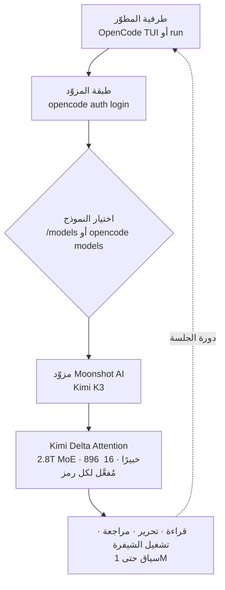

خلال الأيام القليلة الماضية امتلأت الخطوط الزمنية للمطورين بمواضيع بعنوان "كيف تبرمج باستخدام
Kimi K3". انقسمت الردود إلى اتجاهين. الأول أن نتائج القياس قوية فعلًا. والثاني أنه يمكنك تشغيل
هذا النموذج من طرفيتك الخاصة، داخل وكيل برمجة اخترته أنت، بدلًا من أداة مغلقة تابعة لشركة واحدة.
يتناول هذا المقال الاتجاه الثاني. القارئ المستهدف هو مطوّر يفضّل تبديل النماذج داخل أداة مفتوحة
المصدر بدلًا من الارتباط بواجهة رسومية لمزوّد بعينه. باختصار: اربط Kimi K3 من Moonshot AI كمزوّد
بوكيل الطرفية مفتوح المصدر OpenCode، وستتمكن من البرمجة بنموذج من فئة 2.8 تريليون معامل دون
الارتباط بأي بيئة تطوير واحدة.

## نظرة عامة

أصدرت Moonshot AI نموذج Kimi K3 في 16 يوليو 2026. وفق الشركة، فهو نموذج Mixture-of-Experts بحجم
2.8 تريليون معامل ومن بين أكبر النماذج مفتوحة الأوزان الصادرة حتى الآن. الجزء المثير للاهتمام ليس
النتائج فحسب. فهذا النموذج غير محصور داخل روبوت محادثة مملوك؛ بل يتصل كمزوّد بوكيل برمجة مفتوح
المصدر يعمل في الطرفية. بعبارة أخرى، أصبح بالإمكان الفصل بين "أي بيئة تطوير تستخدم" و"أي نموذج
تبرمج به".

من منظور ThakiCloud، يهمّ هذا الاقتران لسببين. أولًا، وكيل برمجة قادر على تبديل النماذج بحرية بدلًا
من الارتباط بمزوّد يتوافق مع الفرضية الأساسية لتصميم منصات الوكلاء. ثانيًا، نموذج مفتوح الأوزان بحجم
2.8 تريليون معامل يجب أن يخدمه أحدهم على وحدات GPU حقيقية، وتكلفة تلك الخدمة ومتطلبات التشغيل المحلي
تعود مباشرةً كأسئلة بنية تحتية. فيما يلي نثبّت الأداة عمليًا للتحقق من مسار الاتصال، ثم نعالج المنظورين.

## ما هي هذه الأدوات

OpenCode هو وكيل برمجة مفتوح المصدر يعمل في الطرفية. يقرأ ملفات قاعدة الشيفرة، ويشرح البنية، ويحرّر
الشيفرة، ويراجع التغييرات، وينفّذ المهام عبر مزوّد LLM متصل. ولأنه غير مرتبط بنموذج واحد بل يبدّل
المزوّدين، يمكنك الاحتفاظ بسير العمل نفسه وتغيير النموذج تحته فقط.

Kimi K3 هو النموذج الذي يشغل خانة المزوّد تلك. وفق إعلان Moonshot AI، المواصفات الأساسية كالتالي.
إنه نموذج MoE بحجم 2.8 تريليون معامل، يُفعَّل منه 16 خبيرًا من أصل 896 لكل رمز (token). ويستخدم
الانتباه آلية Kimi Delta Attention (KDA)، وهي انتباه خطي هجين. يُضاف إلى ذلك تقنية Attention
Residuals (بديل عن الوصلات المتبقية)، وفهم بصري أصيل، ونافذة سياق تصل إلى مليون رمز. ومن المقرر
إصدار أوزان النموذج الكاملة في 27 يوليو 2026.

يبدو مسار ربط الأداتين كالتالي.



الفرق عن النهج المعتاد واضح. وكيل الواجهة الرسومية لمزوّد ما يأتي بالنموذج والأداة كحزمة واحدة. أما
وكيل مفتوح المصدر مثل OpenCode فيثبّت الأداة ويبدّل المزوّد فقط. نموذج ذاتي الاستضافة بالأمس، و Kimi
K3 اليوم، ونموذج آخر غدًا، عبر واجهة الأوامر نفسها.

## التثبيت والتكامل

تحققنا من مسار التثبيت والاتصال عمليًا في بيئة معزولة. الأوامر والإصدارات أدناه قيم فعلية التقطناها
أثناء إعادة الإنتاج.

أولًا ثبّت OpenCode. نجح التثبيت العام عبر npm فورًا.

```bash
npm install -g opencode-ai
opencode --version
# 1.18.3
```

فحصنا سطح الأوامر الذي توفّره الأداة المثبّتة. من تشغيل واجهة TUI إلى التنفيذ بلا واجهة، وإدارة
المزوّدين، وسرد النماذج، وإدارة خوادم MCP، فهي تغطي ما يحتاجه وكيل البرمجة.

```bash
opencode --help
# opencode [project]        start opencode tui              [default]
# opencode run [message..]  run opencode with a message
# opencode providers        manage AI providers and credentials   [aliases: auth]
# opencode models [provider]  list all available models
# opencode mcp              manage MCP (Model Context Protocol) servers
# opencode agent            manage agents
# opencode serve            starts a headless opencode server
```

تتولّى الأوامر الفرعية `opencode auth` مصادقة المزوّد.

```bash
opencode auth --help
# opencode auth list    list providers and credentials   [aliases: ls]
# opencode auth login   log in to a provider
# opencode auth logout  log out from a configured provider
```

ترتيب ربط Kimi K3 كالتالي، وفق دليل OpenCode الرسمي من Moonshot AI.

1. أنشئ مفتاح API على منصة Kimi المفتوحة واحتفظ به بشكل خاص.
2. شغّل `opencode auth login`، واختر **Moonshot AI** كمزوّد، ثم أدخل مفتاح API.
3. داخل OpenCode، استخدم `/models` (أو `opencode models moonshotai` في الصدفة) لاختيار **Kimi K3**.
4. تحقق من الاتصال بمهمة منخفضة المخاطر.

```bash
opencode run "اشرح بنية مجلدات هذا المشروع وأوصِ بأول ثلاثة ملفات ينبغي قراءتها."
```

حقيقة تستحق التثبيت: بعد التثبيت مباشرةً، لم يتضمن كتالوج النماذج الافتراضي مزوّد Moonshot. أثناء
إعادة الإنتاج، أعادت تصفية `opencode models` بحثًا عن Moonshot/Kimi نتيجة فارغة، ما يعني أنه يجب
إضافة المزوّد صراحةً عبر `auth login` قبل ظهوره في الكتالوج. لذا فالخطوة 2 أعلاه ليست اختيارية بل
إلزامية.

## النتائج الفعلية

نفصل القيم التي التقطناها مباشرةً عن الأرقام المنشورة للنموذج. تثبيت الأداة ومسار الاتصال قِيَما
مُقاسة عمليًا؛ أما درجات القياس فهي أرقام مُبلَّغ عنها من Moonshot وطرف ثالث (Artificial Analysis).

النتائج المقاسة مباشرةً:

- نجح تثبيت OpenCode، الإصدار 1.18.3 (npm `opencode-ai`، رمز الخروج 0).
- تأكدنا أن الأداة توفّر مصادقة المزوّد (`auth`)، وسرد النماذج (`models`)، والتنفيذ بلا واجهة
  (`run`)، وإدارة MCP (`mcp`)، وإدارة الوكلاء (`agent`).
- بعد التثبيت مباشرةً، لم يتضمن الكتالوج الافتراضي مزوّد Moonshot، فوجب إضافته صراحةً عبر `auth login`.

لم نشغّل استدلال Kimi K3 المباشر. يتطلب استدعاء Kimi K3 مفتاح API مدفوعًا برصيد (لا يمكن استخدام
قسائم التحقق للمستخدمين الجدد مع K3)، ولم يتوفّر مثل هذا المفتاح في بيئة إعادة الإنتاج. لذا نرسم الحد
عند "تثبيت واتصال مُقاسان، وجودة توليد الشيفرة الفعلية مُقتبسة من أرقام منشورة". لا نختلق أرقامًا لم نرصدها.

المقاييس المنشورة للنموذج أدناه. هذه الدرجات أرقام مُبلَّغ عنها وفق Artificial Analysis، ولأن الأوزان
لم تُنشر بالكامل بعد، فإنها لم تُتحقق عبر إعادة إنتاج مستقلة.

| المقياس | Kimi K3 | الترتيب | النماذج الأعلى / للمقارنة |
|---|---|---|---|
| GDPval-AA v2 | 1,687 | الثالث | Fable 5 Max 1,815 · GPT-5.6 Sol Max 1,747.8 · (Opus 4.8 1,600) |
| AA-Briefcase | 1,527 | الثاني | Fable 5 Max 1,587 · GPT-5.6 Sol Max 1,495 |

بقراءة الأرقام كما هي، يقع Kimi K3 في النطاق أسفل النماذج الحدّية العليا مباشرةً. واحتلاله المركز
الثاني في AA-Briefcase، الذي يقيس العمل المعرفي طويل الأمد، إشارة إلى أنه صالح لمهام الوكلاء متعددة
الخطوات مثل البرمجة. مع ذلك، هذه أرقام مُبلَّغ عنها، ويبقى الإحساس الفعلي في سير عمل برمجي حقيقيًا
أدق عند التحقق منه على قاعدة شيفرتك الخاصة.

## دلالات على منصة ThakiCloud

يمسّ هذا الاقتران عدستَي منتجَي ThakiCloud معًا. الأولى عدسة منصة الوكلاء، والثانية عدسة خدمة البنية
التحتية.

**عدسة Paxis (الوكلاء والأدوات والنماذج القابلة للاستبدال).** Paxis هو مستوى التحكم في سحابة ThakiCloud
الأصلية للوكلاء (Agent-Native Cloud)، ويعامل Skills و Tools و Policies و Audit Logs كموارد من الدرجة
الأولى. البنية التي يظهرها OpenCode، أي "ثبّت الأداة وبدّل المزوّد"، تتطابق تمامًا مع فلسفة تصميم Paxis.
في Paxis، يختار وكيل البرمجة من أكثر من 960 مهارة عبر BM25، ويشغّلها في صناديق رمل معزولة، ويمرّر كل
إجراء عبر بوابات السياسات وسجلات التدقيق. اربط نموذجًا مفتوح الأوزان مثل Kimi K3 كمزوّد، وستتمكن من
تبديل دماغ الوكيل حسب التكلفة والأداء مع الحفاظ على عزل التنفيذ والتدقيق. كما أن احتواء OpenCode على
إدارة مدمجة لخوادم MCP (`opencode mcp`) يتصل بطبيعة الحال بمعاملة Paxis لموصّلات MCP كموارد من الدرجة الأولى.

**عدسة ai-platform (خدمة نموذج بحجم 2.8T).** مفتوح الأوزان يعني أن على أحدهم خدمة هذا النموذج على وحدات
GPU حقيقية. نموذج MoE بحجم 2.8 تريليون معامل يُفعّل 16 خبيرًا فقط لكل رمز، فالمعاملات النشطة أصغر بكثير
من الإجمالي، لكن البنية ما تزال تتطلب إبقاء جميع الخبراء الـ896 في الذاكرة، لذا فعتبة الخدمة المحلية
ليست منخفضة. هنا تجيب منصة ThakiCloud ai-platform عن السؤال. عندما تجتمع جدولة GPU المبنية على K8s و
Kueue، وخدمة vLLM/SGLang، والتكميم (quantization) لتوفير الذاكرة، يمكن تشغيل نماذج مفتوحة كبيرة كهذه
اقتصاديًا في بيئة متعددة المستأجرين. وحين تصدر الأوزان في 27 يوليو، يمكن مقارنة منحنى تكلفة الاستضافة
الذاتية مقابل استدعاءات API فعليًا. وتكلفة الخدمة المنخفضة تُترجَم إلى اقتصاديات الوكلاء، وهذا بدوره
يخفّض تكلفة تشغيل الوكلاء العاملين على Paxis. كلتا العدستين تشيران إلى الاتجاه نفسه.

## الحدود والاعتراضات

نذكر بعض الاعتراضات الرصينة معًا.

أولًا، درجات القياس تختلف عن الإحساس الفعلي بالبرمجة. المركز الثاني في AA-Briefcase لا يضمن "الأفضل على
قاعدة شيفرتي". فقد يكون النموذج الأعلى ترتيبًا أضعف في لغة أو إطار عمل أو عُرف داخلي بعينه، لذا يجب
التحقق من التبنّي على عملك الفعلي.

ثانيًا، تصل قياسات هذا المقال إلى التثبيت ومسار الاتصال. لم يُشغَّل استدلال Kimi K3 المباشر بسبب قيد
مفتاح API المدفوع. تبقى جودة التوليد الفعلية والكمون وتكلفة الرموز أمورًا عليك إعادة قياسها بمفتاحك الخاص.

ثالثًا، "مفتوح الأوزان" لا يعني "مجاني" أو "سهل التشغيل". حتى مع نشر الأوزان، فإن خدمة نموذج MoE بحجم
2.8T بثبات تتطلب موارد GPU كبيرة وكفاءة تشغيلية. ونقطة التعادل بين الاستضافة الذاتية واستدعاءات API
تعتمد على الاستخدام ومتطلبات الكمون.

رابعًا، تحتاج واجهة Kimi K3 إلى رصيد، ولا يمكن استخدام قسائم المستخدمين الجدد مع K3. لا تتوقع استخدامًا
مجانيًا غير محدود لنموذج من الطبقة العليا. ومع ذلك، فإن الحرية البنيوية في اختيار الأداة والنموذج بشكل
مستقل موقع أفضل على المدى الطويل من الارتباط بمزوّد واحد.

## المصادر

- [MarkTechPost, "Moonshot AI Releases Kimi K3: A 2.8 Trillion Parameter Open MoE Model With Kimi Delta Attention and 1M Context" (2026-07-16)](https://www.marktechpost.com/2026/07/16/moonshot-ai-releases-kimi-k3-a-2-8-trillion-parameter-open-moe-model-with-kimi-delta-attention-and-1m-context/)
- [Fortune, "Moonshot's Kimi K3 pushes Chinese AI into Fable-level territory" (2026-07-16)](https://fortune.com/2026/07/16/moonshots-kimi-k3-pushes-chinese-ai-into-fable-level-territory/)
- [Artificial Analysis, صفحة نموذج "Kimi K3" (مصدر أرقام معياري GDPval-AA v2 و AA-Briefcase في هذا المقال)](https://artificialanalysis.ai/models/kimi-k3)
- [Kimi API Platform, "Use Kimi Models in OpenCode"](https://platform.kimi.ai/docs/guide/open-code)
- [OpenCode (sst/opencode), إصدار v1.18.3](https://github.com/sst/opencode)
- [Simon Willison, "Kimi K3, and what we can still learn from the pelican benchmark" (2026-07-16)](https://simonwillison.net/2026/Jul/16/kimi-k3/)
- VentureBeat, "China's Moonshot AI releases Kimi K3, the largest open-source model ever" (المقال موجود، لكن لم يتم التحقق من استجابة الرابط في هذه الجلسة)
- OpenCode 1.18.3 (`npm install -g opencode-ai`): الأوامر والإصدار قيم إعادة إنتاج مُلتقطة مباشرةً
