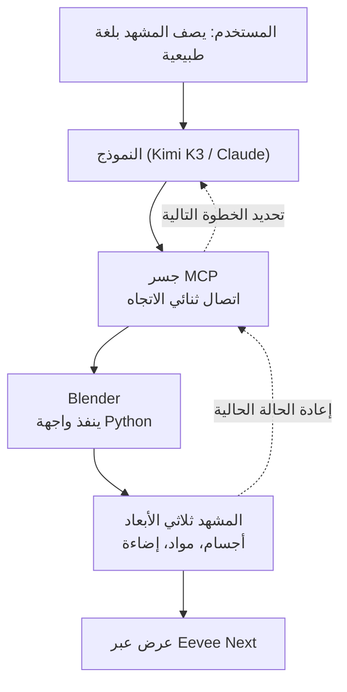

## لماذا تستحق هذه القصة القراءة

إذا كنت مطوراً يريد أن تشغّل الوكلاء برمجيات حقيقية، فقراءة قصة Blender MCP كمجرد عرض ثلاثي الأبعاد تفوّت الفكرة الأساسية. الخلاصة أولاً: **MCP هو المعيار الذي يحول تطبيقات الواجهة الرسومية مثل Blender إلى صناديق أوامر بلغة طبيعية، وربط Kimi K3 بـ Blender مثال حي يوضح إلى أي مدى وصلت هذه القدرة.** هذا المقال لا يتحدث عن كيفية بناء مشاهد ثلاثية الأبعاد، بل عن كيف أصبح بإمكان الوكلاء تشغيل أي تطبيق تقريباً، وكيف يمكن تشغيل ذلك بأمان.

## نظرة عامة

حتى الآن، كانت معظم الصور التي تنتجها الذكاء الاصطناعي عبارة عن بكسلات. النموذج يرسم صورة، لكن تعديل النتيجة مجدداً يتطلب من الإنسان البدء من الصفر. Blender MCP يلامس طبقة مختلفة تماماً. فبدلاً من إنتاج بكسلات، يقوم النموذج **بتشغيل Blender، وهو برنامج ثلاثي الأبعاد حقيقي**. أعطه جملة مثل "ابنِ زنزانة منخفضة التفاصيل يحرسها تنين يحمي إناءً ذهبياً"، فيقوم النموذج بوضع الأجسام وتطبيق المواد وضبط الإضاءة. النتيجة ليست بكسلات، بل ملف مشهد قابل للتعديل.

المهم هنا ليس التصميم ثلاثي الأبعاد بحد ذاته. استبدل Blender بتطبيق آخر وستحصل على القصة نفسها. أدوات الجداول، برامج التصميم، لوحات الإدارة الداخلية، كلها تصبح "صناديق أوامر" محتملة. Blender MCP ليس سوى المثال الذي يجعل هذا التحول مرئياً.

## ما هي هذه التقنية

MCP (بروتوكول سياق النموذج) هو بروتوكول معياري يربط النماذج بالبرامج الخارجية. يستخدم Blender MCP هذا البروتوكول لإنشاء **جسر ثنائي الاتجاه** بين Blender والنموذج. يرسل النموذج الأوامر إلى Blender عبر الجسر، ويعيد Blender حالة المشهد الحالية إلى النموذج. هذا التبادل هو ما يتيح للنموذج معرفة ما تم وضعه بالفعل وتحديد خطوته التالية.

النقطة الجوهرية هي أن النموذج ينفذ في النهاية **واجهة برمجة Python الخاصة ببرنامج Blender**. يمكن التحكم في Blender بشكل شبه كامل عبر Python داخلياً، ويقوم النموذج بترجمة الطلبات باللغة الطبيعية إلى تلك الاستدعاءات البرمجية. بدلاً من النقر على القوائم، يكتب النموذج نصوصاً برمجية تبني الأشكال الهندسية وتطبق المواد وتشغّل عملية العرض.

## كيف تعمل الآلية

تسير العملية كاملة على النحو التالي. يبدأ المستخدم بوصف المشهد المطلوب بجملة عادية، وأحياناً انطلاقاً من رسم تخطيطي واحد فقط. يفسر النموذج هذا الطلب ويحوله إلى نص برمجي بلغة Python يقوم Blender بتنفيذه. بمجرد تنفيذ النص البرمجي، تظهر الأجسام في المشهد، ويتحقق النموذج من الحالة المتغيرة عبر الجسر. إذا كانت الإضاءة ناقصة يضيفها، وإذا بدا الموضع غير مناسب ينقله. وفي النهاية، يقوم محرك عرض مثل Eevee Next برسم النتيجة النهائية.

دور Kimi K3 هنا هو تحديداً تلك المهمة، "الترجمة والحكم". فهو يحول الطلبات باللغة الطبيعية إلى عمليات منظمة، ويتولى الاستدلال الذي يقرأ حالة المشهد ليحدد الخطوة التالية. سواء كان النموذج Claude أو Kimi K3، يبقى التدفق تحت الجسر واحداً لأن MCP هو البروتوكول المشترك. ولهذا السبب يقول مبتدئون لا يعرفون Blender تقريباً إنهم استطاعوا بناء نماذج باستخدام اللغة الطبيعية وحدها.

## ما الجديد في هذا

الجديد هنا هو الانتقال من "التوليد" إلى "التشغيل". نماذج توليد الصور تخرج نتيجة نهائية دفعة واحدة، وفتحها لاحقاً لإصلاح شيء ما أمر صعب. أما تشغيل تطبيق فيعني أن **النتيجة تبقى بصيغة التطبيق الأصلية**. في حالة Blender، هذه الصيغة ملف مشهد يمكن للإنسان إعادة فتحه ومواصلة صقله. وهذا يجعل من الطبيعي أن يضع الذكاء الاصطناعي المسودة الأولى ويتولى الإنسان إتمامها.

ما يجعل هذا النمط مقلقاً هو قابليته للتوسع. أي تطبيق يمكن ربطه بخادم MCP يصبح أداة يستطيع الوكيل الإمساك بها. وإذا نجحت هذه الفكرة مع أداة ثلاثية الأبعاد، فقد تكون الأداة الداخلية في شركتك هي التالية.

## دلالات الاستخدام في منتجات ThakiCloud

توضح هذه الحالة بدقة ما تقوم به منصتنا **Paxis**. Paxis هي طبقة تحكم Agent-Native Cloud تعمل فوق ai-platform، وتتعامل مع موصلات MCP كموارد من الدرجة الأولى. ما يظهره Blender MCP، وهو تحويل التطبيق إلى أداة للوكيل، هو بالضبط ما تقوم به Paxis عبر أدوات متعددة.

لكن ما تركز عليه Paxis هو نقطة تمر عليها هذه القصة بخفة. كون النموذج ينفذ كوداً برمجياً بلغة Python بحرية يعني أن سوء الاستخدام قد يؤدي إلى تنفيذ كود تعسفي. تشغّل Paxis عمليات تنفيذ الأدوات هذه داخل **صندوق رمل معزول**، وتمرر كل إجراء عبر بوابات سياسات وسجلات تدقيق. يمكن دائماً تتبع ما نفذه الوكيل بالضبط، وتُحظر الإجراءات غير المصرح بها عند البوابة. تشغيل Blender على حاسوب شخصي وتشغيل وكلاء عديدين لأدوات متعددة في بيئة متعددة المستأجرين يتطلبان متطلبات أمان مختلفة تماماً. عزل صندوق الرمل وبوابات السياسات في Paxis مصممة تحديداً لسد هذه الفجوة.

هناك أيضاً زاوية بنية تحتية عبر منظور **ai-platform**. العرض ثلاثي الأبعاد وتنفيذ الأدوات يستهلكان قدراً كبيراً من المعالج المركزي ووحدة معالجة الرسوميات. وعندما يشغل وكلاء متعددون أدوات في الوقت نفسه، ينشأ تنافس على الموارد، وجدولة هذا العمل عبر K8s و Kueue تتيح توزيع الموارد بعدالة. معاملة تنفيذ الأدوات كحمل عمل وإدارته على المجموعة العنقودية هو بالضبط ما نجيده.

## الحدود والحجج المضادة

أكبر مخاطرة هي مسألة الأمان التي ذُكرت للتو. خلف راحة التحكم بتطبيق عبر لغة طبيعية يكمن تنفيذ كود تعسفي. إذا دخل أمر نصي غير موثوق، قد يكتب النموذج نصاً برمجياً خطيراً، لذا فإن ربط هذا بالإنتاج دون عزل وقيود صلاحيات أمر محفوف بالمخاطر.

حدود الجودة والحتمية واضحة أيضاً. المشاهد البسيطة تنجح جيداً، لكن كلما ازداد المشهد دقة وتعقيداً، أخطأ النموذج في فهم القصد أكثر أو أنتج نتائج غير متطابقة. الأمر النصي نفسه لا يعطي بالضرورة النتيجة نفسها في كل مرة. في العمل الذي يتطلب مخرجات دقيقة، ينتهي الأمر بالحاجة إلى تدخل بشري كبير للتشذيب.

هناك أيضاً تكلفة للتعديل التكراري. تبادل حالة المشهد عبر إصلاحات متكررة يراكم استدعاءات النموذج، وإضافة العرض بدون واجهة يزيد من العبء على الموارد. وفي المهام النمطية التي لا تحتاج أصلاً إلى حرية إبداعية كبيرة، قد يكون قالب أو نص برمجي جيد الصنع أسرع وأكثر استقراراً من التشغيل باللغة الطبيعية. أداة جديدة لامعة لا تعني أنه يجب تسليم كل سير عمل إلى وكيل.

## خلاصة

القول بأن Blender تحول إلى صندوق أوامر يعني في جوهره أن MCP أصبح المعيار الذي يحول البرمجيات الحقيقية إلى أداة بيد الوكيل. مزيج Kimi K3 و Blender مثال جيد يجعل هذه القدرة مرئية، وليس نهاية القصة. الأداة التالية هي التي تستخدمها كل يوم.

لذا فإن الشيء الذي يستحق تجربته الآن ليس تجربة ثلاثية الأبعاد، بل تحولاً في المنظور. اختر تطبيقاً واحداً في سير عملك يكرر فيه شخص ما النقر على نفس الخطوات، وارسم أولاً ما ستوكله للوكيل وأين ستضع الحدود. الراحة يمنحها MCP، لكن الأمان يصنعه صندوق الرمل والسياسات. تصميم الاثنين معاً يسبق تسليم الأداة للوكيل.

## المصادر

- [irinatoxi (@irinatoxi)، "Blender just became a prompt box" (X)](https://x.com/hjguyhan/status/2080679191104946236)
- [الموقع الرسمي لـ Blender MCP](https://blender-mcp.com/)
- [Kimi K3 + Blender: Turn a Sketch Into a 3D Scene (YouTube)](https://www.youtube.com/watch?v=U3E03pwk0RE)
