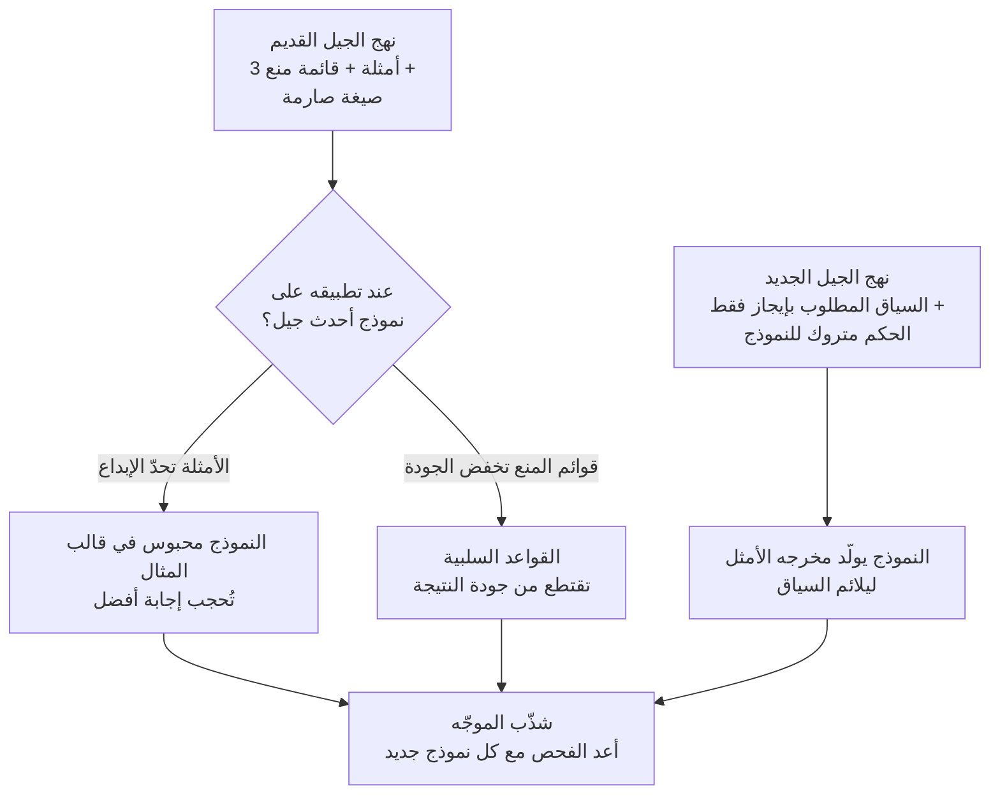

إن كنت تكتب موجّهات النظام وتصونها بنفسك، فقد شعرت على الأرجح في وقت ما أن النتائج تتحسن كلما حشوت مزيداً من الأمثلة والقواعد. غير أن الاتجاه الذي شاركته Anthropic مؤخراً يقلب ذلك الحدس رأساً على عقب. الخلاصة أولاً: متى صار النموذج ذكياً بما يكفي، تصبح الأمثلة وقواعد المنع لا عوناً بل قيداً يقتطع من الأداء فعلاً، ولذا فالممارسة الفضلى الجديدة هي الحذف من الموجّه لا الإضافة إليه. طبّقت Anthropic هذا المبدأ ذاته على منتجها فخفضت موجّه نظام Claude Code بأكثر من 80%. يعرض هذا المقال لماذا حدث ذلك وكيف يجب أن نُعيد كتابة موجّهاتنا.

## لماذا تقرأ هذا

هذا المقال موجّه للمطورين الذين يصممون موجّهات النظام ويصونونها، ولمسؤولي المنصات الذين يُشغّلون تجهيز وكيل. الخلاصة الجوهرية: عند التعامل مع أحدث جيل من النماذج، تحصل على نتائج أفضل بنقل السياق الموجز للنتيجة التي تريدها فقط وترك الباقي لحكم النموذج، بدلاً من إرفاق أمثلة وإطالة قوائم "لا تفعل هذا ولا تفعل ذاك". معرفة هذا تتيح لك كسر عادة توريث الموجّه مع كل نموذج جديد ومواصلة الإضافة إليه، وجعل تشذيب الموجّه بنداً دورياً في قائمة الفحص.

## نظرة عامة

خلال السنوات القليلة الماضية كانت حكمة هندسة الموجّهات الشائعة "كن محدداً وكن وافراً". إرفاق مثالين أو ثلاثة للمخرَج المطلوب، وتعداد ما لا يُفعل، وتثبيت الصيغة، كانت تُعدّ طريق النتائج المستقرة. وللجيل السابق من النماذج نجح هذا النهج جيداً، لأن الإنسان كان يملأ بالأمثلة والقواعد الفجوات التي لم يستطع النموذج ملأها بنفسه.

لكن مع ازدياد ذكاء النماذج عبر الأجيال، تقلصت تلك الفجوات. شذّبت Anthropic موجّه نظام Claude Code بأكثر من 80% لأحدث جيل من النماذج وأفادت بعدم وجود انخفاض قابل للقياس في تقييمات البرمجة. حتى بعد إزالة كمّ كبير من الأمثلة والقواعد، لم تسوأ النتائج. وفي بعض الحالات كان التشخيص أن الأمثلة كانت تحبس النموذج في قالب معيّن وتحجب إجابة أفضل.

## لماذا تصبح الأمثلة قيداً

جوهر تفسير Anthropic بسيط. كلما ازداد النموذج ذكاءً، احتاج تعليمات أقل وقيوداً أقل وأمثلة أقل. حين تُرفق مثالاً، يقرؤه النموذج على أنه "إذن هذا هو الشكل الذي تريده" ويوائم نفسه مع ذلك الشكل. تنشأ المشكلة حين يكون أحدث نموذج أكثر إبداعاً من ذلك المثال. يصير المثال سقفاً يجرّ إجابة النموذج الأفضل إلى الأسفل.

تحمل قواعد المنع فخاً مشابهاً. تعداد "لا تفعل هذا ولا تفعل ذاك" مطوّلاً قد يخفض جودة النتيجة فعلاً على أحدث النماذج. تقول Anthropic الآن إنها توجّه النماذج نحو الاتجاه المرغوب عبر السياق بدل حجبها بقواعد منع صارمة. بدل بناء جدران بالقواعد، تعطي سياق ما تريد وتترك النموذج يحكم داخله.

لذا حين يصل نموذج جديد، النصيحة هي تشذيب الموجّه لا إطالته. كثير من الأمثلة والقواعد المتراكمة للنموذج السابق هي، للنموذج الجديد، عبء غير ضروري، أو، أسوأ، قيد يقتطع من الأداء.

## هذا لا يعني رمي كل قاعدة

هنا يجب ملاحظة توازن مهم. هذه النصيحة تخص التعامل مع أقوى وأحدث جيل من النماذج. أما لمستويات نماذج أرخص، أو لعمل الدفعات حيث يجب أن تكون صيغة المخرَج نفسها تماماً في كل استدعاء، فالقصة مختلفة. في المخرجات المجدولة التي يجب ألا يتذبذب شكلها، كتقرير يجب أن يخرج بالشكل نفسه كل يوم، أو عقد JSON، لا يزال الهيكل الحتمي مطلوباً.

داخل ThakiCloud نتعامل مع هذين المحورين على حدة. في العمل الذي يكون إبداع المحتوى فيه هو المُخرَج، نعطي النموذج القوي سياقاً فقط ونوسّع درجات حريته؛ لكن الأرقام والقيم المعدودة وصيغة العرض تملكها شيفرة حتمية لا النموذج. أي إن نصيحة إزالة الأمثلة ونظام تثبيت الصيغة بالشيفرة لا يتعارضان. الأول مجال الحكم والإبداع؛ والثاني مجال الصيغة والتجميع. اجمع الاثنين في موجّه واحد بلا تمييز، تحصل على أسوأ تركيبة: أمثلة تقيّد النموذج القوي وصيغة تتذبذب للضعيف.

## دلالات لمنتجات ThakiCloud

يقود هذا النقاش مباشرة إلى الممارسة من منظور Paxis لدينا. Paxis هو Agent-Native Cloud من ThakiCloud، مستوى تحكّم يتعامل مع Skills وTools وPolicies كموارد من الدرجة الأولى. يختار من أكثر من 960 مهارة عبر BM25 ويشغّلها في صناديق رمل معزولة. هنا، مواصفة كل مهارة وموجّه نظامها هما بالضبط موضوع هندسة السياق التي يصفها هذا المقال.

نقل درس هذا المقال إلى تجهيز مهارات Paxis يعطي ممارستين. أولاً، في المهارات التي تتعامل مع نماذج قوية، قلّل الأمثلة وقوائم المنع واترك السياق الموجز وحدود النتيجة المرجوة فقط. أبقِ التجهيز رفيعاً والمعرفة كثيفة، لكن اجعل تلك المعرفة مجموعة معايير حكم مستخلصة من الإخفاقات، لا استعراضاً للأمثلة. ثانياً، عند إدخال نموذج جديد، لا تورّث مواصفات المهارات تلقائياً وتواصل الإضافة؛ بل شغّل فحصاً يشذّب الأمثلة والقواعد التي صارت غير ضرورية. هذا هو المعنى نفسه لنصيحة Anthropic بتشذيب الموجّه مع كل نموذج جديد.

ثمة مكسب من عدسة البنية التحتية ai-platform أيضاً. موجّه نظام أقصر يعني رموز إدخال أقل لكل استدعاء، ما يُترجم مباشرة إلى توفير في التكلفة في بيئة خدمة متعددة المستأجرين قائمة على K8s. تشذيب الموجّه عمل نادر يحسّن الجودة والتكلفة في آنٍ.

## القيود والحجج المضادة

قبول هذه النصيحة دون نقد خطر. أولاً، "أزل الأمثلة" مقيّد بالنماذج القوية الأحدث ولا ينتقل كما هو إلى النماذج الأدنى قدرة أو إلى العمل ذي متطلبات الصيغة الصارمة. ثانياً، ما إذا كان الأداء يصمد فعلاً بعد إزالة الأمثلة يجب تأكيده بالتقييم. تقرير Anthropic بعدم انخفاض تقييمات البرمجة كان بذاته نتيجة مقيسة، لا قراراً اتُّخذ بالحدس وحده. تجاوز التقييم أثناء تقليص الموجّه، وقد تفوتك انخفاضات جودة غير مرئية. ثالثاً، يستند هذا الاتجاه إلى خصائص عائلة نماذج بعينها، لذا لا يمكن الجزم بأن الهامش نفسه يصمد لنماذج بائعين آخرين أو لنماذج مفتوحة الأوزان.

## الخلاصة

اختصاراً في جملة واحدة، القاعدة الجديدة لهندسة السياق هي: عند التعامل مع أحدث النماذج، لا تحاول ملء الموجّه بإطالته؛ شذّبه واترك الأمر لحكم النموذج. كانت الأمثلة وقوائم المنع شبكة أمان للجيل السابق، لكنها لهذا الجيل قد تكون سقفاً يحجب إجابة أفضل. مع ذلك، هذه النصيحة مقيّدة بالنماذج القوية ومجال الإبداع؛ وللعمل الذي يجب ألا تتذبذب صيغته، لا يزال الهيكل الحتمي مطلوباً. في المرة القادمة التي تُدخل فيها نموذجاً جديداً، قبل أن تقلق بشأن ما تضيفه إلى الموجّه، افحص أولاً ما يمكنك إزالته. وبعد الإزالة، أكّد دائماً بالتقييم. هكذا تجعل هذا التحول لك، بأمان.

## المصادر

- The new rules of context engineering for Claude 5 generation models، Anthropic (<https://claude.com/blog/the-new-rules-of-context-engineering-for-claude-5-generation-models>)
- A Fireside Chat with Cat and Thariq from the Claude Code team، Simon Willison (<https://simonwillison.net/2026/Jul/21/cat-and-thariq/>)
