## 개요

"AI가 짜준 코드를 무조건 믿고 올리는 것은 문제다." 이런 말을 들어본 적 있나요? 2025년 현재, 개발팀에서 가장 뜨거운 논쟁 중 하나입니다. 하지만 이 논쟁 자체가 **구시대적 사고의 산물**일 수 있습니다. 

GitHub Octoverse 2024 보고서에 따르면 **오픈소스 기여자의 73%**가 AI 코딩 도구를 사용하고 있으며, JetBrains 조사에서는 **개발자 10명 중 7명**이 ChatGPT를 활용하고 있습니다. 이미 AI 코딩은 선택이 아닌 **필수 역량**이 되었습니다.

문제는 "AI를 쓰느냐 마느냐"가 아니라 **"어떻게 쓸 것이냐"**입니다. 이 글에서는 Vibe Coding과 Agentic Coding 시대에 걸맞은 새로운 개발 문화를 어떻게 구축할지 탐구해보겠습니다.

## 현재 개발 문화의 딜레마

### 🚫 **구시대적 반응 패턴**

```markdown
# 전형적인 "AI 코드 거부" 시나리오

개발자 A: "이 함수는 왜 만들었나요? 쓰이지도 않는데..."
개발자 B: "ChatGPT가 제안해서..."
개발자 A: "AI가 짜준 코드를 검토도 없이 올리시면 안 되죠!"

→ 결과: B는 AI 도구 사용을 주저하게 됨
→ 팀 전체의 생산성 저하
→ 혁신 기회 상실
```

### 📊 **현실적 데이터가 말하는 진실**

| 지표 | 수치 | 출처 |
|------|------|------|
| AI 코딩 도구 사용률 | 73% | GitHub Octoverse 2024 |
| ChatGPT 정기 사용 개발자 | 70% | JetBrains Developer Survey 2024 |
| AI 도구로 인한 품질 저하 | **검증되지 않음** | GitHub 품질 분석 |
| 개발 속도 향상 | 평균 35-50% | 다수 연구 결과 |

**핵심 인사이트**: AI 사용 자체가 문제가 아니라, **사용 방식과 검증 프로세스**가 핵심입니다.

## 새로운 문화 패러다임: "협력적 AI 개발"

### 🎯 **문화 전환의 핵심 원칙**

#### 1. **비난에서 가이드로**

```typescript
// ❌ 구시대적 반응
interface OldCultureResponse {
  reaction: "AI 코드라서 신뢰할 수 없다";
  action: "사용 금지";
  result: "혁신 억제";
}

// ✅ 새로운 문화적 접근
interface NewCultureResponse {
  reaction: "AI 제안을 어떻게 검증하고 개선할까?";
  action: "프로세스 개선";
  result: "품질 + 생산성 향상";
}
```

#### 2. **심리적 안전망 구축**

```markdown
# AI-Friendly 팀 문화 가이드라인

## DO: 권장사항
- AI 도구 실험을 격려하고 지원
- 실패를 학습 기회로 전환
- 협업적 문제 해결 접근
- 지속적인 프로세스 개선

## DON'T: 금지사항  
- AI 사용 자체를 비난
- 완벽주의적 기준 강요
- 개인 공격적 피드백
- 변화 저항 정당화
```

### 🔄 **실용적 문화 전환 전략**

#### **Before vs After 비교**

| 상황 | 기존 문화 반응 | 새로운 문화 반응 |
|------|---------------|-----------------|
| 미사용 함수 발견 | "왜 이런 걸 올렸냐!" | "자동 dead code 제거 프로세스를 추가하자" |
| 복잡한 AI 코드 | "이해 안 되는 코드 금지" | "코드 리뷰에 AI 설명 섹션을 추가하자" |
| 버그 발생 | "AI 때문이다" | "어떤 프롬프트가 더 나은 결과를 낼까?" |
| 새로운 패턴 | "검증되지 않은 방식" | "팀 학습 기회로 활용하자" |

## 실전 문화 구축 프레임워크

### 🛠 **1. AI-Aware 개발 프로세스**

#### **스마트 PR 템플릿**

```markdown
# AI-Enhanced Pull Request Template

## 🤖 AI 활용 정보
- [ ] AI 도구 사용 여부: ChatGPT / Cursor / GitHub Copilot / 기타
- [ ] AI 생성 코드 비율: _%
- [ ] 주요 프롬프트 요약: [간단히 기록]

## 🔍 품질 검증 체크리스트
- [ ] 단위 테스트 통과 (커버리지 80% 이상)
- [ ] 린터 규칙 준수
- [ ] 미사용 코드 제거 확인
- [ ] 보안 취약점 스캔 통과
- [ ] 성능 영향 분석 완료

## 💡 학습 포인트
- AI가 제안한 새로운 패턴이나 라이브러리
- 팀이 참고할 만한 프롬프트 기법
- 개선이 필요한 부분

## 🎯 리뷰어 가이드
- 코드 로직의 정확성과 효율성 중점 검토
- AI 생성 부분의 이해도 확인
- 더 나은 AI 활용 방안 제안
```

#### **자동화된 품질 게이트**

```yaml
# .github/workflows/ai-code-quality.yml
name: AI-Enhanced Code Quality Check

on: [pull_request]

jobs:
  quality-gate:
    runs-on: ubuntu-latest
    steps:
      - name: Dead Code Detection
        run: |
          # 미사용 함수/변수 자동 탐지
          npx ts-unused-exports tsconfig.json
          
      - name: AI Code Analysis
        run: |
          # AI 생성 코드 패턴 분석
          # 과도한 추상화, 불필요한 복잡성 검사
          
      - name: Security Scan
        run: |
          # AI 코드의 보안 취약점 특별 검사
          npm audit --audit-level moderate
          
      - name: Performance Impact
        run: |
          # 번들 크기, 실행 성능 영향 분석
          npm run build:analyze
```

### 🎨 **2. Vibe Coding 문화 구축**

#### **창의적 협업 환경 조성**

```typescript
// 팀 Vibe Coding 세션 구조

interface VibeCodingSession {
  // 1. 아이디어 브레인스토밍 (15분)
  ideation: {
    participants: ["개발자", "디자이너", "PM"];
    tools: ["ChatGPT", "Claude", "Cursor"];
    output: "프로토타입 방향성";
  };
  
  // 2. 실시간 협업 코딩 (45분)
  collaboration: {
    method: "페어 프로그래밍 + AI";
    roles: {
      driver: "AI와 대화하며 코드 생성";
      navigator: "로직 검증 및 개선 제안";
    };
  };
  
  // 3. 즉시 피드백 (15분)
  feedback: {
    focus: ["창의성", "실용성", "학습 효과"];
    format: "건설적 제안 중심";
  };
}
```

#### **학습 중심 문화**

```markdown
# 팀 학습 프로그램: "AI 코딩 마스터클래스"

## 주간 세션 구성
### 월요일: 프롬프트 엔지니어링 워크숍
- 성공한 프롬프트 패턴 공유
- 도메인별 전문 프롬프트 개발
- 팀 프롬프트 라이브러리 구축

### 수요일: AI 코드 리뷰 클리닉
- 실제 PR 사례 분석
- 품질 개선 방안 토론
- 베스트 프랙티스 정립

### 금요일: 혁신 실험실
- 새로운 AI 도구 체험
- 창의적 활용 사례 발굴
- 미래 기술 트렌드 탐구
```

### 🤖 **3. Agentic Coding 거버넌스**

#### **자율적 AI 에이전트 관리 체계**

```yaml
# team-ai-governance.yml
# 팀 차원의 AI 에이전트 운영 정책

governance_framework:
  autonomy_levels:
    level_1_basic:
      authority: "코드 생성, 기본 테스트"
      human_oversight: "실시간 모니터링"
      
    level_2_intermediate:
      authority: "리팩터링, 문서화"
      human_oversight: "주기적 검토"
      
    level_3_advanced:
      authority: "아키텍처 제안, CI/CD"
      human_oversight: "승인 기반"

  safety_mechanisms:
    - mandatory_human_review: ["보안 관련", "데이터베이스 스키마"]
    - automatic_rollback: ["빌드 실패", "테스트 실패"]
    - escalation_triggers: ["예상 외 동작", "성능 저하"]

  collaboration_protocols:
    agent_to_agent: "API 기반 정보 교환"
    agent_to_human: "구조화된 리포트"
    conflict_resolution: "인간 중재자 개입"
```

#### **신뢰 구축 메커니즘**

```python
# AI 에이전트 신뢰도 측정 시스템

class AgentTrustManager:
    def __init__(self):
        self.trust_metrics = {
            "code_quality": 0.0,
            "security_compliance": 0.0,
            "performance_impact": 0.0,
            "maintainability": 0.0
        }
    
    def evaluate_agent_performance(self, agent_id: str, task_results: dict):
        """에이전트 성과를 다각도로 평가"""
        
        # 1. 코드 품질 평가
        quality_score = self.assess_code_quality(task_results['code'])
        
        # 2. 보안 준수도 평가  
        security_score = self.check_security_compliance(task_results['code'])
        
        # 3. 성능 영향 평가
        performance_score = self.measure_performance_impact(task_results['metrics'])
        
        # 4. 유지보수성 평가
        maintainability_score = self.evaluate_maintainability(task_results['structure'])
        
        # 종합 신뢰도 계산
        overall_trust = self.calculate_trust_score({
            "quality": quality_score,
            "security": security_score, 
            "performance": performance_score,
            "maintainability": maintainability_score
        })
        
        return self.update_agent_trust_level(agent_id, overall_trust)
    
    def recommend_autonomy_level(self, agent_id: str) -> str:
        """신뢰도 기반 자율성 수준 추천"""
        trust_level = self.get_agent_trust_level(agent_id)
        
        if trust_level >= 0.9:
            return "high_autonomy"  # 최소 감독
        elif trust_level >= 0.7:
            return "medium_autonomy"  # 주기적 검토
        else:
            return "low_autonomy"  # 실시간 감독
```

## 문화 전환의 실제 사례

### 🏢 **Case Study 1: 스타트업 "빠른 혁신" 문화**

#### **Before: 전통적 개발 문화**
```markdown
문제점:
- 완벽주의로 인한 개발 속도 저하
- AI 도구 사용에 대한 부정적 인식
- 실험적 시도를 억제하는 분위기

결과:
- 경쟁사 대비 출시 속도 30% 느림
- 개발자 만족도 하락
- 혁신적 아이디어 부족
```

#### **After: AI-First 협업 문화**
```markdown
변화:
- "빠르게 실패, 빠르게 학습" 원칙 도입
- AI 도구를 "창의적 파트너"로 인식
- 실험과 반복을 장려하는 환경

결과:
- MVP 개발 시간 50% 단축
- 개발자 창의성 지수 40% 향상  
- 월간 신기능 출시 3배 증가
```

### 🏭 **Case Study 2: 대기업 "안정성 중심" 문화**

#### **Before: 위험 회피 중심**
```markdown
문제점:
- AI 코드에 대한 과도한 불신
- 복잡한 승인 프로세스
- 변화에 대한 조직적 저항

결과:
- 기술 부채 누적
- 개발 생산성 정체
- 인재 유출 증가
```

#### **After: 점진적 AI 도입**
```markdown
변화:
- 단계적 AI 도구 도입 로드맵
- 엄격한 품질 게이트와 AI 활용 병행
- 리스크 관리 중심의 거버넌스

결과:
- 코드 품질 유지하며 개발 속도 25% 향상
- 레거시 시스템 현대화 가속
- 개발자 역량 강화 및 만족도 증가
```

## 문화 전환 로드맵

### 📅 **4단계 점진적 도입 전략**

#### **Phase 1: 인식 전환 (1-2개월)**
```markdown
목표: AI 도구에 대한 올바른 이해 형성

주요 활동:
- AI 코딩 도구 교육 세션
- 성공 사례 공유 워크숍  
- 우려사항 해결 토론회
- 기본 가이드라인 수립

성공 지표:
- 팀원 80% 이상 AI 도구 체험
- 부정적 인식 50% 감소
- 기본 프롬프트 스킬 습득
```

#### **Phase 2: 실험적 도입 (2-3개월)**
```markdown
목표: 안전한 환경에서 AI 활용 경험 축적

주요 활동:
- 샌드박스 환경에서 AI 코딩 실습
- 페어 프로그래밍 + AI 세션
- 품질 검증 프로세스 테스트
- 초기 성과 측정

성공 지표:
- 주요 기능 개발에 AI 활용 30%
- 코드 품질 지표 유지
- 개발 속도 15% 향상
```

#### **Phase 3: 체계적 통합 (3-4개월)**
```markdown
목표: AI 도구를 정규 워크플로에 완전 통합

주요 활동:
- 표준화된 AI 활용 프로세스 구축
- 자동화된 품질 게이트 구현
- 팀별 전문 프롬프트 라이브러리 구축
- 지속적 개선 체계 확립

성공 지표:
- AI 활용률 70% 이상
- 품질 지표 개선
- 개발자 만족도 증가
```

#### **Phase 4: 혁신적 발전 (지속적)**
```markdown
목표: AI와의 협업을 통한 지속적 혁신

주요 활동:
- Agentic Coding 패턴 도입
- 크로스팀 AI 협업 체계 구축
- 혁신적 AI 활용 사례 발굴
- 업계 베스트 프랙티스 기여

성공 지표:
- 업계 선도적 AI 활용 사례 창출
- 개발 생산성 50% 이상 향상
- 혁신적 제품/서비스 출시
```

## 문화 변화의 측정과 개선

### 📊 **정량적 지표**

```python
# 문화 변화 측정 대시보드

class CultureTransformationMetrics:
    def __init__(self):
        self.metrics = {
            "adoption_rate": 0.0,      # AI 도구 채택률
            "quality_index": 0.0,      # 코드 품질 지수
            "productivity_gain": 0.0,  # 생산성 향상률
            "satisfaction_score": 0.0, # 개발자 만족도
            "innovation_count": 0      # 혁신 사례 수
        }
    
    def calculate_culture_health(self) -> dict:
        """문화 건강도 종합 평가"""
        
        # 1. 기술 채택 건강도
        adoption_health = self.assess_adoption_patterns()
        
        # 2. 품질 유지 건강도  
        quality_health = self.assess_quality_trends()
        
        # 3. 팀 협업 건강도
        collaboration_health = self.assess_collaboration_quality()
        
        # 4. 혁신 창출 건강도
        innovation_health = self.assess_innovation_capacity()
        
        return {
            "overall_score": self.weighted_average([
                adoption_health, quality_health, 
                collaboration_health, innovation_health
            ]),
            "recommendations": self.generate_improvement_suggestions(),
            "risk_areas": self.identify_risk_factors()
        }
```

### 🎯 **정성적 평가**

```markdown
# 문화 변화 인터뷰 가이드

## 개발자 개별 인터뷰 (월 1회)
1. AI 도구 사용 경험과 변화
2. 팀 협업 방식의 개선점
3. 학습과 성장에 미친 영향
4. 우려사항과 개선 제안

## 팀 회고 세션 (주 1회)  
1. AI 활용 성공/실패 사례 공유
2. 프로세스 개선 아이디어
3. 문화적 변화 체감도
4. 다음 주 실험 계획

## 리더십 평가 (분기 1회)
1. 조직 차원의 변화 관찰
2. 비즈니스 임팩트 분석
3. 장기 전략 방향성 검토
4. 투자 우선순위 조정
```

## 미래 지향적 문화 비전

### 🚀 **2030년 AI 네이티브 개발 문화**

```typescript
// 미래 개발 문화의 모습

interface FutureDevelopmentCulture {
  // 1. 인간-AI 하이브리드 팀
  hybridTeams: {
    composition: "인간 리더 + AI 에이전트들";
    roles: {
      human: ["전략 수립", "창의적 문제 해결", "윤리적 판단"];
      ai: ["코드 생성", "테스트 자동화", "성능 최적화"];
    };
    collaboration: "실시간 멀티모달 인터페이스";
  };
  
  // 2. 자가 진화하는 코드베이스
  selfEvolvingCodebase: {
    characteristics: "AI가 스스로 개선하는 코드";
    humanRole: "방향성 제시 및 품질 감독";
    safeguards: "윤리적 제약 및 비즈니스 규칙";
  };
  
  // 3. 예측적 개발 프로세스
  predictiveDevelopment: {
    capability: "사용자 니즈 예측 및 선제적 기능 개발";
    dataSource: "사용자 행동, 시장 트렌드, 기술 발전";
    validation: "A/B 테스트 및 점진적 배포";
  };
}
```

### 🌟 **지속가능한 혁신 생태계**

```markdown
# AI 시대 개발 문화의 핵심 가치

## 1. 인간 중심성 (Human-Centricity)
- AI는 도구, 인간은 의사결정자
- 창의성과 윤리적 판단의 중요성 강조
- 개발자의 성장과 만족을 최우선 고려

## 2. 지속적 학습 (Continuous Learning)  
- 변화하는 기술에 대한 적응력
- 실패를 통한 학습 문화
- 지식 공유와 집단 지성 활용

## 3. 협력적 혁신 (Collaborative Innovation)
- 인간-AI 파트너십 극대화
- 다양성과 포용성 기반 창의성
- 오픈소스 정신과 커뮤니티 기여

## 4. 책임감 있는 개발 (Responsible Development)
- 윤리적 AI 활용 원칙 준수
- 보안과 프라이버시 보호
- 사회적 영향에 대한 고려
```

## 실행 가이드: 당장 시작할 수 있는 것들

### ✅ **이번 주에 할 수 있는 것**

```markdown
# 즉시 실행 가능한 액션 아이템

## 개인 차원
- [ ] AI 코딩 도구 하나 선택해서 일주일 사용해보기
- [ ] 팀원과 AI 활용 경험 공유 세션 제안
- [ ] 개인 프롬프트 노트 작성 시작
- [ ] AI 생성 코드 리뷰 체크리스트 만들기

## 팀 차원  
- [ ] 다음 스프린트에 "AI 실험 시간" 배정
- [ ] PR 템플릿에 AI 활용 섹션 추가
- [ ] 팀 회고에 "AI 활용 개선점" 아젠다 포함
- [ ] AI 도구 사용 가이드라인 초안 작성

## 조직 차원
- [ ] AI 코딩 교육 프로그램 기획
- [ ] 품질 게이트에 AI 관련 체크 추가
- [ ] 성공 사례 수집 및 공유 체계 구축
- [ ] 문화 변화 측정 지표 정의
```

### 🎯 **3개월 로드맵**

```mermaid
gantt
    title AI 코딩 문화 전환 3개월 로드맵
    dateFormat  YYYY-MM-DD
    section Phase 1: 기반 구축
    교육 및 인식 개선     :2025-07-01, 3w
    도구 도입 및 실험     :2025-07-15, 2w
    초기 가이드라인 수립   :2025-07-22, 1w
    
    section Phase 2: 프로세스 통합
    워크플로 개선        :2025-08-01, 3w
    품질 게이트 강화      :2025-08-15, 2w
    성과 측정 시작       :2025-08-22, 1w
    
    section Phase 3: 문화 정착
    베스트 프랙티스 정립  :2025-09-01, 2w
    팀간 지식 공유       :2025-09-08, 2w
    지속적 개선 체계 구축 :2025-09-15, 2w
```



## 결론: 변화의 리더가 되자

AI 코딩 시대의 문화 혁신은 **선택이 아닌 필수**입니다. 문제는 "AI를 받아들일 것인가?"가 아니라 **"어떻게 현명하게 활용할 것인가?"**입니다.

### 🎯 **핵심 메시지**

1. **저항보다 적응**: 과거의 완벽주의를 고집하기보다 새로운 시대에 맞는 품질 기준을 만들어가야 합니다.

2. **개인보다 팀**: AI 도구의 진정한 힘은 개인의 생산성 향상이 아니라 **팀 전체의 협업 능력 증대**에 있습니다.

3. **도구보다 문화**: 최신 AI 도구보다 중요한 것은 **그 도구를 활용하는 문화와 프로세스**입니다.

4. **완벽보다 진보**: 100% 완벽한 AI 코드를 기대하기보다 **지속적인 개선과 학습**에 집중해야 합니다.

### 🚀 **행동 촉구**

오늘부터 여러분의 팀에서 작은 실험을 시작해보세요. ChatGPT로 간단한 함수를 만들어보고, Cursor AI로 리팩터링을 시도해보세요. 그리고 그 과정에서 배운 것들을 팀원들과 나누어보세요.

**새로운 문화는 거창한 선언이 아니라 작은 실천에서 시작됩니다.** 

AI 코딩 시대의 선구자가 되어, 더 창의적이고 생산적이며 즐거운 개발 문화를 함께 만들어나가시기 바랍니다. 🌟 