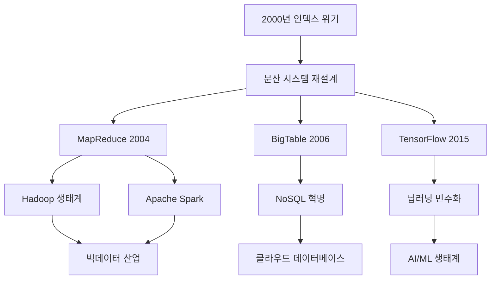

구글의 검색 인덱스가 5개월이나 뒤처진 절체절명의 위기 상황에서, 두 명의 엔지니어가 5일 밤낮을 함께 코딩하며 구글을 구원한 이야기가 있습니다. **Jeff Dean**과 **Sanjay Ghemawat** - 구글에서 단 두 명뿐인 "레벨 11 Google Senior Fellow"인 이들의 독특한 짝코딩(pair programming) 방식은 MapReduce, BigTable, TensorFlow 등 오늘날 빅데이터와 클라우드 생태계의 기반이 된 핵심 기술들을 탄생시켰습니다.

## 두 거인의 운명적 만남

### DEC에서 시작된 인연

Jeff Dean과 Sanjay Ghemawat의 인연은 구글보다 훨씬 이전인 **DEC Western Research Lab**에서 시작되었습니다. 1999년 Jeff Dean이 먼저 구글에 합류했고, 2000년 초 Sanjay Ghemawat이 뒤따라 합류하면서 두 사람의 전설적인 파트너십이 본격적으로 시작되었습니다.

### 완벽한 보완관계

동료들은 두 사람의 관계를 이렇게 묘사했습니다:

> "뇌의 좌반구와 우반구처럼 움직인다. 서로의 사고방식이 완벽히 보완된다."

두 사람 스스로도 이 독특한 협업 방식에 대해 다음과 같이 말했습니다:

**Sanjay Ghemawat**: *"대부분의 사람이 왜 짝코딩을 꺼리는지 모르겠다."*

**Jeff Dean**: *"생각이 맞춰지는 파트너를 찾으면 두 사람이 하나보다 훨씬 강력해진다."*

## 2000년 3월: 구글 인덱스 대란

### 위기의 시작

2000년 3월, 구글에 치명적인 위기가 찾아왔습니다. 웹 크롤러와 인덱서가 완전히 멈춰버리면서 검색 결과가 **5개월이나 뒤처진** 상태가 되었습니다. 설상가상으로 이때는 Larry Page와 Sergey Brin이 야후와의 대형 계약을 협상 중인 중요한 시점이었습니다.

### 워 룸(War Room) 가동

위기 상황에서 Jeff Dean과 Sanjay Ghemawat은 6명의 핵심 엔지니어들과 함께 즉석 **'워 룸'**을 차렸습니다. 이들은 5일 밤낮을 쉬지 않고 디버깅에 매달렸습니다.

### 진짜 범인은 하드웨어

놀랍게도 문제의 원인은 소프트웨어 버그가 아니었습니다. **불량 메모리 칩에서 비트가 뒤집히는 현상**(0→1)이 전체 시스템을 마비시킨 것이었습니다.

당시 구글은 비용 절약을 위해 저가 하드웨어를 대량으로 사용하고 있었는데, 이러한 하드웨어 장애를 소프트웨어적으로 극복해야 하는 상황이었습니다.

### 혁신적 해결책

두 사람은 고장 난 하드웨어를 우회하는 **체크포인트와 복구 로직**을 작성해 새로운 인덱스를 완성했습니다. 더 중요한 것은 이 경험을 통해 구글 시스템이 대규모 장애에도 **자동으로 복구되는 설계**를 갖추게 되었다는 점입니다.

## 독특한 짝코딩 방식

### 물리적 환경

Jeff Dean과 Sanjay Ghemawat의 작업 환경은 매우 독특했습니다:

- **듀얼 모니터 + 하나의 키보드**
- 한 명이 '드라이버' 역할로 타이핑
- 다른 한 명이 실시간으로 설계 검토와 아이디어 제공
- **즉시 코드 리뷰**가 자연스럽게 이뤄짐

### 전설적인 개발 속도

동료들의 증언에 따르면:

> "팀 전체가 두 사람과 페어 프로그래밍을 하는 느낌이었다. 그들의 속도는 가히 전설적이었다."

### 문화적 파급 효과

이들의 짝코딩 문화는 구글 내부에 다음과 같은 변화를 가져왔습니다:

- **코드 품질 우선** 문화
- **빠른 실험과 롤백** 문화
- **협업과 지식 공유** 문화

## MapReduce의 탄생과 기술적 유산

### MapReduce 논문 발표

워 룸 사건 이후 두 사람은 분산 인프라를 근본적으로 재설계하기 시작했습니다. 그 결과 **2004년 OSDI**에서 역사적인 논문 ['MapReduce: Simplified Data Processing on Large Clusters'](https://research.google.com/archive/mapreduce-osdi04.pdf)를 발표했습니다.

### MapReduce의 혁신성

MapReduce는 다음과 같은 혁신을 가져왔습니다:

```python
# MapReduce 개념 예시
def map_function(input_data):
    """데이터를 키-값 쌍으로 변환"""
    for item in input_data:
        emit(process(item), 1)

def reduce_function(key, values):
    """같은 키의 값들을 집계"""
    return sum(values)

# 거대한 클러스터에서 자동으로 병렬 처리
# 장애 발생 시 자동 복구
# 복잡한 분산 처리를 단순한 인터페이스로 추상화
```

### 기술적 파급 효과

MapReduce는 이후 다음과 같은 생태계를 만들어냈습니다:

1. **Hadoop**: 오픈소스 MapReduce 구현체
2. **Apache Spark**: 메모리 기반 빠른 처리
3. **빅데이터 혁명**: 페타바이트급 데이터 처리 가능
4. **클라우드 컴퓨팅**: 탄력적 리소스 활용

### 이후 혁신들

같은 짝코딩 방식으로 계속해서 혁신적인 기술들을 개발했습니다:

| 기술 | 연도 | 영향 |
|------|------|------|
| **Google File System** | 2003 | 분산 파일 시스템의 기초 |
| **BigTable** | 2006 | NoSQL 데이터베이스 패러다임 |
| **MapReduce** | 2004 | 빅데이터 처리 혁명 |
| **TensorFlow** | 2015 | 딥러닝 민주화 |

## 개발 문화에 미친 영향

### 1. 짝코딩의 가치 재조명

Jeff Dean과 Sanjay Ghemawat의 사례는 다음과 같은 중요한 메시지를 전달했습니다:

> "두 명의 10× 엔지니어보다는 **1+1>2 시너지**가 더 중요하다"

이로 인해 많은 기술 팀들이 고난도 문제 해결 시 **전략적으로 페어 프로그래밍을 채택**하게 되었습니다.

### 2. 효과적인 짝코딩 원칙

그들의 성공사례에서 도출한 짝코딩 원칙들:

```markdown
## 성공적인 짝코딩을 위한 핵심 원칙

### 🤝 파트너십
- 상호 보완적인 강점을 가진 파트너 선택
- 서로의 사고방식을 존중하고 수용
- 자아를 내려놓고 팀의 목표에 집중

### ⚡ 실시간 피드백
- 즉시 코드 리뷰와 설계 검토
- 빠른 실험과 반복 개선
- 실시간 지식 공유

### 🎯 목표 집중
- 명확한 문제 정의와 해결 목표
- 긴급도와 중요도에 따른 우선순위
- 완벽함보다는 동작하는 솔루션 우선
```

### 3. 하드웨어 장애를 소프트웨어로 극복

2000년 인덱스 위기에서 얻은 교훈:

- **저가 하드웨어 수천 대** + **소프트웨어 신뢰성**
- **장애 전제 설계**: 언제든 고장날 수 있다고 가정
- **자동 복구 메커니즘**: 인간의 개입 없이 시스템 복구

이는 오늘날 **클라우드 네이티브 설계의 원형**이 되었습니다.

## 현대 개발팀이 배울 수 있는 교훈

### 1. 위기를 기회로 전환

2000년 위기는 구글에게 다음과 같은 기회가 되었습니다:

- **시스템 아키텍처의 근본적 재설계**
- **장애 대응 능력 강화**
- **분산 시스템 전문성 축적**

### 2. 문화의 힘

기술적 성과만큼 중요한 것이 **문화적 변화**였습니다:

```python
# 구글의 엔지니어링 문화 DNA
google_culture = {
    'fail_fast': '빠른 실패를 통한 빠른 학습',
    'scale_thinking': '처음부터 대규모를 고려한 설계',
    'automation': '반복 작업의 자동화',
    'data_driven': '데이터 기반 의사결정',
    'collaboration': '지식 공유와 협업 우선'
}
```

### 3. 현대적 적용 방안

오늘날 개발팀들이 적용할 수 있는 실용적 방법들:

**짝코딩 도입 전략:**

```bash
# 1단계: 제한적 도입
- 복잡한 알고리즘 구현 시
- 새로운 기술 학습 시
- 코드 리뷰가 어려운 레거시 시스템 작업 시

# 2단계: 팀 문화 조성
- 정기적인 짝코딩 세션
- 지식 공유 문화 구축
- 실패를 학습으로 인식하는 마인드셋

# 3단계: 도구와 환경 개선
- 원격 짝코딩 도구 (VS Code Live Share, 등)
- 듀얼 모니터 환경 구축
- 집중할 수 있는 물리적 공간 확보
```

## 기술사적 의미와 미래 전망

### 빅데이터 생태계의 출발점

Jeff Dean과 Sanjay Ghemawat의 협업으로 탄생한 기술들:



### 현재까지의 영향

20년이 지난 지금도 그들의 영향력은 계속되고 있습니다:

1. **클라우드 컴퓨팅**: AWS, GCP, Azure의 기반 기술
2. **빅데이터 플랫폼**: Databricks, Snowflake 등
3. **AI/ML 프레임워크**: TensorFlow, PyTorch 생태계
4. **DevOps 문화**: 자동화와 복구 시스템 설계

### 미래에 대한 시사점

```python
# 2025년 현재, 우리가 배울 수 있는 것들
future_lessons = {
    'pair_programming': {
        'ai_assisted': 'AI 코딩 어시스턴트와의 협업',
        'remote_first': '원격 환경에서의 효과적인 짝코딩',
        'cross_functional': '개발자-디자이너-PM 간 협업'
    },
    'crisis_management': {
        'proactive_monitoring': '사전 장애 감지 시스템',
        'chaos_engineering': '의도적 장애 주입 테스트',
        'rapid_response': '빠른 대응을 위한 자동화'
    },
    'scalable_architecture': {
        'microservices': '마이크로서비스 아키텍처',
        'serverless': '서버리스 컴퓨팅',
        'edge_computing': '엣지 컴퓨팅 분산 처리'
    }
}
```

## 실무에 적용하는 방법

### 팀 차원에서의 적용

```markdown
## 짝코딩 도입 체크리스트

### 👥 팀 구성
- [ ] 상호 보완적 스킬셋을 가진 페어 구성
- [ ] 정기적인 페어 로테이션 일정
- [ ] 짝코딩 가이드라인 문서화

### 🛠️ 환경 설정
- [ ] 듀얼 모니터 + 공유 키보드 환경
- [ ] 원격 협업 도구 (VS Code Live Share, 등)
- [ ] 집중할 수 있는 독립적인 공간

### 📊 성과 측정
- [ ] 코드 품질 메트릭 (버그 발생률, 코드 복잡도)
- [ ] 개발 속도 (스토리 포인트/스프린트)
- [ ] 팀 만족도 및 학습 효과 측정
```

### 개인 차원에서의 학습

```python
# 개인 성장을 위한 실천 방안
personal_growth_plan = {
    'technical_skills': [
        '다양한 프로그래밍 패러다임 학습',
        '시스템 설계 원리 이해',
        '분산 시스템 개념 숙지'
    ],
    'soft_skills': [
        '효과적인 커뮤니케이션',
        '건설적인 피드백 주고받기',
        '갈등 상황에서의 문제 해결'
    ],
    'collaboration': [
        '코드 리뷰 문화 체화',
        '지식 공유 습관화',
        '멘토링과 멘티 경험'
    ]
}
```

## 결론: 협업의 힘으로 만든 기적

Jeff Dean과 Sanjay Ghemawat의 이야기는 단순히 두 명의 뛰어난 엔지니어의 성공담이 아닙니다. 이는 **진정한 협업의 힘**이 무엇인지, 그리고 **위기를 기회로 전환하는 엔지니어링 마인드셋**이 얼마나 중요한지를 보여주는 현대 기술사의 중요한 사례입니다.

### 핵심 교훈

1. **1+1 > 2의 시너지**: 적절한 파트너와의 협업은 개인 역량의 단순 합보다 훨씬 강력합니다
2. **위기는 혁신의 어머니**: 2000년의 위기가 없었다면 MapReduce도, 현재의 빅데이터 생태계도 없었을 것입니다
3. **문화가 기술을 만든다**: 개방적이고 협업적인 문화가 혁신적인 기술을 탄생시킵니다
4. **지속적인 영향력**: 20년이 지난 지금도 그들의 작업 방식과 기술적 유산이 산업 전반에 영향을 미치고 있습니다

### 우리가 실천할 수 있는 것들

- 어려운 문제에 직면했을 때 **협업의 힘**을 믿고 활용하기
- **짝코딩**을 통한 지식 공유와 품질 향상
- 장애와 위기를 **학습과 개선의 기회**로 인식하기
- **자동화와 복구**를 고려한 시스템 설계

오늘날 우리가 당연하게 사용하는 클라우드 서비스, 빅데이터 플랫폼, AI/ML 도구들 뒤에는 25년 전 한 키보드 앞에서 밤새 함께 코딩한 두 엔지니어의 우정과 협업이 있었습니다. 그들의 유산은 계속해서 새로운 혁신을 만들어가는 모든 개발자들에게 영감을 주고 있습니다.

## 참고 자료

- **핵심 기사**: [The Friendship That Made Google Huge - The New Yorker](https://www.newyorker.com/magazine/2018/12/10/the-friendship-that-made-google-huge)
- **기술 문서**: [MapReduce: Simplified Data Processing on Large Clusters](https://research.google.com/archive/mapreduce-osdi04.pdf)
- **심층 분석**: [If Xerox PARC Invented the PC, Google Invented the Internet - Wired](https://www.wired.com/2012/08/google-as-xerox-parc)
- **회고록**: [Jeff Dean's legendary life: Super engineers save Google](https://www.programmersought.com/article/3923247643/)

---

*이 포스트는 2025년 6월 11일 기준으로 작성되었으며, 기술 발전과 함께 지속적으로 업데이트될 예정입니다.*
