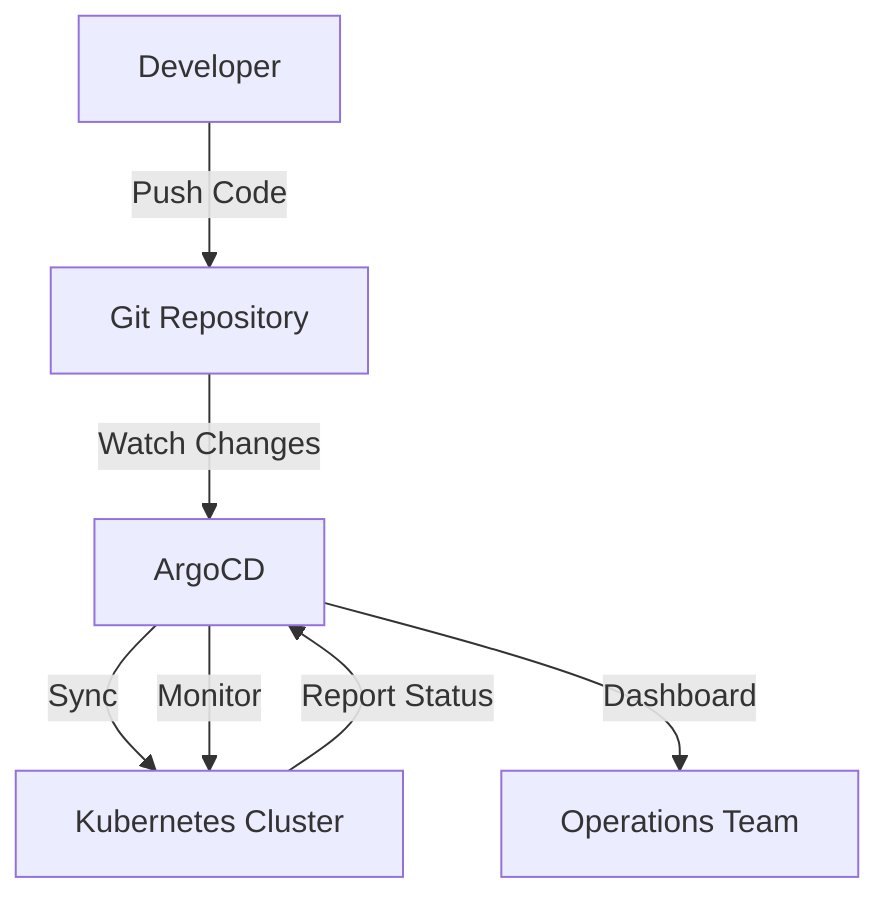

## 개요

현대 소프트웨어 개발에서 CI/CD는 필수 요소가 되었습니다. 최근 Kubernetes 환경이 주류가 되면서 GitOps라는 새로운 패러다임이 주목받고 있습니다. 특히 ArgoCD와 같은 도구가 인기를 얻으면서 기존 CI/CD 방식과 어떤 차이가 있는지, 언제 어떤 방식을 선택해야 하는지에 대한 궁금증이 높아지고 있습니다.

이 글에서는 전통적인 CI/CD 파이프라인과 GitOps 기반 접근법을 실무 관점에서 비교 분석하고, 각각의 장단점과 도입 시 고려사항을 자세히 살펴보겠습니다.

## GitOps란 무엇인가?

### GitOps의 핵심 원칙

GitOps는 Git을 운영의 단일 진실 공급원(Single Source of Truth)으로 사용하는 운영 모델입니다. 핵심 원칙은 다음과 같습니다:

1. **선언적 구성**: 시스템의 원하는 상태를 Git에 선언적으로 정의
2. **버전 관리**: 모든 변경사항이 Git 히스토리로 추적 가능
3. **자동 동기화**: Git 상태와 실제 시스템 상태의 자동 일치
4. **관찰가능성**: 시스템 상태의 지속적인 모니터링과 drift 감지

### GitOps vs DevOps

| 측면 | DevOps | GitOps |
|------|--------|--------|
| **배포 방식** | Push (CI가 클러스터에 배포) | Pull (클러스터가 Git에서 가져옴) |
| **진실 공급원** | CI/CD 도구 + 런타임 상태 | Git Repository |
| **변경 추적** | CI/CD 로그 + 모니터링 | Git 커밋 히스토리 |
| **롤백 방식** | 스크립트 또는 수동 | Git revert |

## 전통적 CI/CD 파이프라인 분석

### GitHub Actions 기반 워크플로우

전통적인 CI/CD 파이프라인의 일반적인 구조를 살펴보겠습니다:

```yaml
# .github/workflows/deploy.yml
name: Build and Deploy
on:
  push:
    branches: [main]

jobs:
  build-and-deploy:
    runs-on: ubuntu-latest
    steps:
    - uses: actions/checkout@v3
    
    - name: Build Docker Image
      run: |
        docker build -t myapp:${{ github.sha }} .
        docker push myregistry/myapp:${{ github.sha }}
    
    - name: Deploy to Kubernetes
      run: |
        kubectl set image deployment/myapp myapp=myregistry/myapp:${{ github.sha }}
        kubectl rollout status deployment/myapp
```

### 특징 및 워크플로우

1. **소스 코드 변경** → Git Push
2. **CI 트리거** → GitHub Actions 실행
3. **빌드 단계** → Docker 이미지 생성 및 레지스트리 푸시
4. **배포 단계** → kubectl/helm으로 직접 클러스터 업데이트
5. **검증** → 배포 상태 확인

### 장점

**빠른 설정과 익숙함**

```bash
# 간단한 배포 명령어
kubectl apply -f k8s/
helm upgrade myapp ./chart
```

**유연한 커스터마이징**

- 복잡한 배포 로직 구현 가능
- 조건부 배포, A/B 테스트 등 손쉽게 구현
- 기존 도구와의 통합 용이

**즉시 피드백**

- CI에서 배포 성공/실패 즉시 확인
- 로그와 메트릭의 중앙화된 관리

### 단점

**보안 취약점**

```yaml
# 클러스터 접근 권한이 CI에 노출
env:
  KUBECONFIG: ${{ secrets.KUBECONFIG }}
  # 또는
  KUBE_TOKEN: ${{ secrets.KUBE_TOKEN }}
```

**상태 관리의 어려움**

- Git에 정의된 상태 vs 실제 클러스터 상태 불일치 가능
- 수동 변경사항 추적 어려움
- Drift 감지 및 복구가 수동적

**운영 복잡성**

- 여러 환경별 배포 스크립트 관리
- 롤백 시 복잡한 절차 필요

## ArgoCD 기반 GitOps 분석

### ArgoCD 아키텍처 이해

ArgoCD는 다음과 같은 구조로 작동합니다:



### 워크플로우 세부 분석

**1. 애플리케이션 정의**

```yaml
# argocd-app.yaml
apiVersion: argoproj.io/v1alpha1
kind: Application
metadata:
  name: myapp
spec:
  source:
    repoURL: https://github.com/myorg/myapp-config
    path: k8s/overlays/production
    targetRevision: HEAD
  destination:
    server: https://kubernetes.default.svc
    namespace: myapp
  syncPolicy:
    automated:
      prune: true
      selfHeal: true
```

**2. 자동 동기화 프로세스**

- ArgoCD가 Git 저장소를 주기적으로 폴링 (기본 3분)
- Webhook을 통한 즉시 동기화도 가능
- 변경 감지 시 자동으로 클러스터 상태 업데이트

**3. 상태 모니터링**

```bash
# ArgoCD CLI를 통한 상태 확인
argocd app get myapp
argocd app sync myapp
argocd app rollback myapp
```

### ArgoCD의 주요 장점

**강화된 보안**

- 클러스터 내부에서 실행되어 외부 접근 최소화
- RBAC 기반 세밀한 권한 관리
- Git 기반 감사 추적

**자동 상태 관리**

```yaml
# 자동 복구 설정
syncPolicy:
  automated:
    prune: true     # 불필요한 리소스 자동 삭제
    selfHeal: true  # 수동 변경사항 자동 복구
```

**직관적인 UI**

- 실시간 애플리케이션 상태 시각화
- 의존성 그래프 표시
- 원클릭 롤백 및 동기화

**멀티 클러스터 지원**

```yaml
# 여러 클러스터 관리
destination:
  name: production-cluster
  namespace: myapp
---
destination:
  name: staging-cluster
  namespace: myapp
```

### ArgoCD의 제한사항

**초기 설정 복잡성**

```bash
# ArgoCD 설치 및 설정
kubectl create namespace argocd
kubectl apply -n argocd -f https://raw.githubusercontent.com/argoproj/argo-cd/stable/manifests/install.yaml

# RBAC 구성
kubectl patch configmap argocd-rbac-cm -n argocd --patch='
data:
  policy.default: role:readonly
  policy.csv: |
    p, role:admin, applications, *, */*, allow
    p, role:admin, clusters, get, *, allow
    g, myorg:team-alpha, role:admin
'
```

**CI 통합의 복잡성**

- 이미지 태그 업데이트를 위한 별도 프로세스 필요
- 동적 값 처리를 위한 추가 도구 필요 (예: Kustomize, Helm)

## 실무 구현 패턴

### 패턴 1: 하이브리드 접근법

많은 조직에서 사용하는 실용적인 접근법입니다:

```yaml
# CI 파이프라인 (이미지 빌드 + 매니페스트 업데이트)
name: CI Pipeline
on: [push]
jobs:
  build:
    steps:
    - name: Build and Push Image
      run: |
        docker build -t myapp:${{ github.sha }} .
        docker push myapp:${{ github.sha }}
    
    - name: Update Manifest
      run: |
        git clone https://github.com/myorg/myapp-config
        cd myapp-config
        sed -i "s|myapp:.*|myapp:${{ github.sha }}|" k8s/deployment.yaml
        git commit -am "Update image to ${{ github.sha }}"
        git push
```

이후 ArgoCD가 매니페스트 변경을 감지하여 자동 배포합니다.

### 패턴 2: App of Apps

여러 애플리케이션을 효율적으로 관리하는 패턴:

```yaml
# apps/app-of-apps.yaml
apiVersion: argoproj.io/v1alpha1
kind: Application
metadata:
  name: app-of-apps
spec:
  source:
    repoURL: https://github.com/myorg/argocd-apps
    path: apps
  destination:
    server: https://kubernetes.default.svc
    namespace: argocd
  syncPolicy:
    automated: {}
```

### 패턴 3: 환경별 분리

```
├── environments/
│   ├── dev/
│   │   ├── kustomization.yaml
│   │   └── values.yaml
│   ├── staging/
│   │   ├── kustomization.yaml
│   │   └── values.yaml
│   └── production/
│       ├── kustomization.yaml
│       └── values.yaml
└── base/
    ├── deployment.yaml
    ├── service.yaml
    └── kustomization.yaml
```

## 성능 및 확장성 비교

### 배포 속도 비교

| 시나리오 | 전통적 CI/CD | ArgoCD |
|---------|-------------|--------|
| **소규모 변경** | 2-5분 | 3-6분 |
| **대규모 배포** | 5-15분 | 5-12분 |
| **롤백** | 3-10분 | 1-3분 |
| **다중 환경** | 선형 증가 | 병렬 처리 |

### 리소스 사용량

**ArgoCD 클러스터 요구사항:**

```yaml
resources:
  limits:
    cpu: 500m
    memory: 256Mi
  requests:
    cpu: 250m
    memory: 128Mi
```

**대규모 환경에서의 고려사항:**

- 100+ 애플리케이션 관리 시 ArgoCD 인스턴스 샤딩 고려
- Git 저장소 크기가 성능에 직접적 영향
- 네트워크 지연이 동기화 주기에 영향

## 보안 관점 심화 분석

### 전통적 CI/CD 보안 이슈

**Credential 관리:**

```yaml
# 취약한 예시
env:
  KUBECONFIG: ${{ secrets.KUBECONFIG_BASE64 }}

# 개선된 예시
- name: Configure AWS credentials
  uses: aws-actions/configure-aws-credentials@v1
  with:
    role-to-assume: arn:aws:iam::123456789012:role/GitHubActions
    aws-region: us-east-1
```

### ArgoCD 보안 모범 사례

**RBAC 세밀 설정:**

```yaml
# argocd-rbac-cm
policy.csv: |
  # 개발팀은 dev 네임스페이스만 접근
  p, role:dev-team, applications, get, dev/*, allow
  p, role:dev-team, applications, sync, dev/*, allow
  
  # 운영팀은 모든 환경 접근
  p, role:ops-team, applications, *, */*, allow
  
  # 외부 사용자는 읽기만 가능
  p, role:readonly, applications, get, */*, allow
```

**Git 저장소 보안:**

```yaml
# Private 저장소 접근
spec:
  source:
    repoURL: git@github.com:myorg/private-repo.git
  # SSH Key 또는 GitHub App을 통한 인증
```

## 모니터링 및 관찰가능성

### ArgoCD 메트릭 활용

```yaml
# Prometheus 모니터링
apiVersion: v1
kind: Service
metadata:
  name: argocd-metrics
spec:
  ports:
  - name: metrics
    port: 8082
  selector:
    app.kubernetes.io/name: argocd-application-controller
```

**주요 메트릭:**

- `argocd_app_health_status`: 애플리케이션 건강 상태
- `argocd_app_sync_total`: 동기화 횟수
- `argocd_git_request_duration`: Git 요청 응답 시간

### 알림 설정

# ArgoCD 알림 구성

```yaml

apiVersion: v1
kind: ConfigMap
metadata:
  name: argocd-notifications-cm
data:
  service.slack: |
    token: $slack-token
  template.app-deployed: |
    message: Application {{.app.metadata.name}} deployed to {{.context.destination.name}}
  trigger.on-deployed: |
    - when: app.status.operationState.phase in ['Succeeded']
      send: [app-deployed]

```

## 트러블슈팅 가이드

### 일반적인 ArgoCD 문제들

**1. 동기화 실패**

```bash
# 문제 진단
kubectl logs -n argocd deployment/argocd-application-controller

# 수동 동기화 강제 실행
argocd app sync myapp --force
```

**2. Git 접근 권한 문제**

```bash
# Repository 연결 상태 확인
argocd repo list

# 새 저장소 등록
argocd repo add https://github.com/myorg/myapp-config \
  --username myuser \
  --password mytoken
```

**3. RBAC 권한 문제**

```yaml
# 사용자 권한 확인
apiVersion: v1
kind: ConfigMap
metadata:
  name: argocd-rbac-cm
data:
  policy.csv: |
    p, role:admin, applications, *, */*, allow
    g, john.doe@company.com, role:admin
```

### 성능 최적화 팁

**Git 저장소 최적화:**

```bash
# 대용량 저장소 최적화
git config --global core.preloadindex true
git config --global core.fscache true
git config --global gc.auto 256
```

**ArgoCD 설정 튜닝:**

```yaml
# 대규모 환경을 위한 설정
apiVersion: v1
kind: ConfigMap
metadata:
  name: argocd-cmd-params-cm
data:
  application.instanceLabelKey: argocd.argoproj.io/instance
  controller.repo.server.timeout.seconds: "300"
  controller.self.heal.timeout.seconds: "120"
```

## 비용 분석

### 인프라 비용 비교

| 구성요소 | 전통적 CI/CD | ArgoCD GitOps |
|---------|-------------|---------------|
| **CI 러너** | $100-500/월 | $100-500/월 |
| **ArgoCD 클러스터** | - | $50-200/월 |
| **모니터링** | $50-100/월 | $30-80/월 |
| **스토리지** | $20-50/월 | $30-70/월 |

### 운영 비용 고려사항

**학습 곡선:**

- 전통적 CI/CD: 1-2주 (기존 경험 활용)
- ArgoCD: 2-4주 (새로운 패러다임 학습)

**유지보수 시간:**

- 전통적 CI/CD: 주당 5-10시간
- ArgoCD: 주당 2-5시간 (안정화 후)

## 마이그레이션 전략

### 단계별 도입 방안

**Phase 1: 평가 및 준비 (2-4주)**

```bash
# ArgoCD 테스트 환경 구축
kubectl create namespace argocd-test
kubectl apply -n argocd-test -f https://raw.githubusercontent.com/argoproj/argo-cd/stable/manifests/install.yaml
```

**Phase 2: 파일럿 프로젝트 (4-6주)**

- 중요도가 낮은 애플리케이션으로 시작
- 기존 CI/CD와 병렬 운영
- 팀 교육 및 피드백 수집

**Phase 3: 점진적 확산 (8-12주)**

- 성공 사례를 기반으로 다른 팀 확산
- 표준화된 템플릿 및 가이드라인 구축
- 모니터링 및 알림 체계 구축

**Phase 4: 전면 전환 (12-16주)**

- 모든 애플리케이션 마이그레이션
- 기존 CI/CD 파이프라인 정리
- 운영 프로세스 최적화

### 마이그레이션 체크리스트

**기술적 준비사항:**

- [ ] Git 저장소 구조 재설계
- [ ] Kubernetes 매니페스트 표준화
- [ ] 비밀 정보 관리 방안 수립
- [ ] 모니터링 및 로깅 체계 구축

**조직적 준비사항:**

- [ ] 팀 교육 계획 수립
- [ ] 역할 및 책임 재정의
- [ ] 승인 프로세스 재설계
- [ ] 문서화 및 가이드라인 작성

## 최종 선택 가이드

### ArgoCD를 선택해야 하는 경우

**조직 규모 및 복잡성:**

- 10개 이상의 마이크로서비스
- 다중 환경 (dev/staging/prod)
- 다중 클러스터 운영

**보안 요구사항:**

- 엄격한 감사 추적 필요
- 최소 권한 원칙 적용
- 규제 준수 요구사항

**운영 성숙도:**

- DevOps 문화 정착
- Kubernetes 운영 경험
- 자동화 우선 철학

### 전통적 CI/CD를 유지해야 하는 경우

**프로젝트 특성:**

- 소규모 팀 (5명 이하)
- 단순한 배포 요구사항
- 레거시 시스템 통합 필요

**기술적 제약:**

- Kubernetes 미도입
- 기존 도구에 대한 높은 의존성
- 단기 프로젝트

## 결론

GitOps와 ArgoCD는 현대적인 클라우드 네이티브 환경에서 강력한 도구입니다. 하지만 만능 해결책은 아닙니다. 조직의 현재 상황, 기술적 성숙도, 비즈니스 요구사항을 종합적으로 고려하여 선택해야 합니다.

**핵심 결정 요인:**

1. **보안이 최우선이라면** → ArgoCD
2. **빠른 시작이 필요하다면** → 전통적 CI/CD
3. **장기적 확장성을 고려한다면** → ArgoCD
4. **팀의 학습 의지가 높다면** → ArgoCD
5. **기존 투자를 보호해야 한다면** → 하이브리드 접근

무엇보다 중요한 것은 팀의 준비도와 점진적 전환입니다. 하루아침에 완벽한 GitOps 환경을 구축하기보다는, 작은 성공을 쌓아가며 조직 전체의 역량을 키워나가는 것이 성공의 열쇠입니다.

GitOps는 단순한 기술 도입이 아닌 문화적 변화입니다. 기술적 우수성뿐만 아니라 팀워크, 학습 의지, 그리고 지속적인 개선에 대한 의지가 뒷받침될 때 진정한 가치를 발휘할 수 있습니다.
