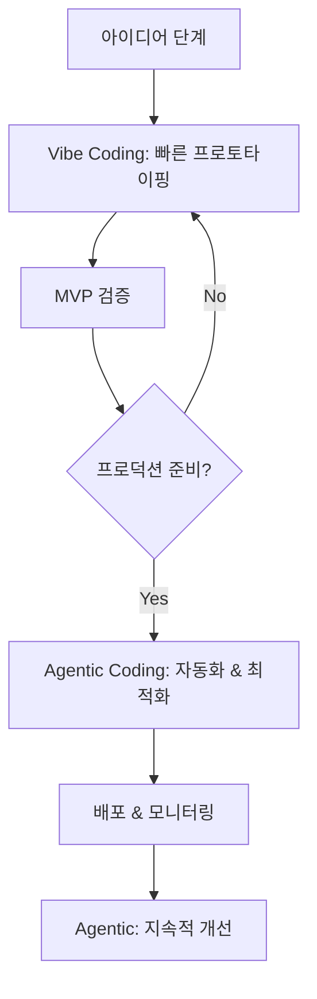

## 개요

Cornell 대학의 최신 연구 [*"Vibe Coding vs. Agentic Coding: Fundamentals and Practical Implications of Agentic AI"*](https://arxiv.org/pdf/2505.19443)에서 제시된 두 가지 혁신적인 AI 코딩 패러다임을 실제 개발 환경에서 활용하는 완전한 실전 가이드입니다. 안드레이 카르파티가 제안한 **Vibe Coding**과 차세대 **Agentic Coding**의 핵심 원리를 이해하고, ChatGPT와 Cursor AI를 활용한 구체적인 구현 전략을 제시합니다.

## 두 패러다임의 핵심 이해

### 🎨 **Vibe Coding: 직관적 협업 코딩**

```
개발자 의도 → 자연어 프롬프트 → AI 코드 생성 → 즉시 검토/수정 → 반복
```

- **철학**: "무엇을 만들지" 의도를 자연어로 전달하고 AI와 대화하며 코딩
- **역할**: 개발자는 **Creative Director**, AI는 **고속 코파일럿**
- **특징**: 빠른 프로토타이핑, 창의적 탐색, 학습 친화적
- **적합 분야**: 아이디어 검증, UI/UX 프로토타입, 교육, MVP 개발

### 🤖 **Agentic Coding: 자율적 에이전트 코딩**

```
목표 설정 → AI 에이전트 자율 계획 → 도구 실행 → 자동 테스트 → 결과 보고
```

- **철학**: 고수준 목표만 제시하면 AI가 독립적으로 계획-실행-검증
- **역할**: 개발자는 **Strategic Supervisor**, AI는 **자율적 동료**
- **특징**: 대규모 자동화, 일관된 품질, 엔터프라이즈급 신뢰성
- **적합 분야**: CI/CD 자동화, 레거시 마이그레이션, 대규모 리팩터링

## ChatGPT 활용 전략

### 1. **Vibe Coding with ChatGPT**

#### 🎯 **효과적인 프롬프트 설계**

```markdown
# 기본 Vibe Coding 프롬프트 템플릿

**맥락 설정**
저는 [프로젝트 유형]을 개발하고 있습니다.
기술 스택: [React/Python/Node.js 등]
현재 상황: [간단한 현재 상태 설명]

**의도 전달**
다음과 같은 기능을 구현하고 싶습니다:
- [구체적인 기능 1]
- [예상되는 사용자 경험]
- [고려해야 할 제약사항]

**협업 요청**
코드를 단계별로 생성해주시고, 각 단계마다 설명과 개선점을 알려주세요.
```

#### 실전 예시: React 대시보드 프로토타이핑

```markdown
# 단계 1: 초기 아이디어 구체화
**프롬프트:**
```
저는 데이터 분석 대시보드를 만들고 있습니다.
React + TypeScript + Chart.js를 사용합니다.

다음과 같은 느낌의 대시보드를 원합니다:
- 깔끔하고 모던한 디자인
- 실시간 차트 3개 (선그래프, 바차트, 파이차트)
- 다크모드 지원
- 반응형 레이아웃

먼저 기본 구조부터 시작해서 점진적으로 발전시켜 주세요.
```

**ChatGPT 응답 활용법:**
1. 생성된 코드를 즉시 로컬에서 테스트
2. 문제점 발견 시 구체적 피드백 제공
3. "이 부분을 더 우아하게 만들 수 있을까요?" 같은 개선 요청

```markdown
# 단계 2: 반복적 개선
**피드백 프롬프트:**
```
차트 애니메이션이 너무 딱딱해 보입니다. 
더 부드럽고 매력적인 전환 효과를 추가해주세요.
또한 데이터 포인트에 호버 시 툴팁이 나타나도록 해주세요.
```

#### 🛠 **Vibe Coding 베스트 프랙티스**

```javascript
// 1. 맥락 유지를 위한 코드 스니펫 공유
const currentCode = `
// 현재 작업 중인 컴포넌트
function Dashboard() {
  const [data, setData] = useState([]);
  // 여기에 차트 로직 추가 예정
}
`;

// 2. 단계별 검증 포인트 설정
const checkpoints = [
  "기본 레이아웃 완성",
  "데이터 바인딩 구현", 
  "차트 렌더링 확인",
  "스타일링 적용",
  "반응형 테스트"
];

// 3. 컨텍스트 창 최대 활용 (16k-32k 토큰)
// 전체 프로젝트 구조를 한 번에 보여주기
```

### 2. **Agentic Coding with ChatGPT Advanced Data Analysis**

#### 🎯 **고수준 목표 설정 프롬프트**

```markdown
# Agentic 프롬프트 템플릿

**미션 정의**
프로젝트: [프로젝트명]
최종 목표: [완결형 결과물 명시]
성공 기준: [정량적 성공 지표]

**제약 조건**
- 기술 스택: [고정된 기술 제약]
- 시간 제한: [데드라인]
- 품질 요구사항: [테스트 커버리지, 성능 등]

**자율 실행 권한**
다음 작업들을 독립적으로 수행해주세요:
1. [세부 작업 1]
2. [세부 작업 2]
3. [자동 검증 방법]

각 단계별 진행 상황과 최종 결과를 보고해주세요.
```

#### 실전 예시: API 마이그레이션 자동화

```markdown
**Agentic 미션 프롬프트:**
```
레거시 REST API를 GraphQL로 마이그레이션하는 프로젝트입니다.

**목표:**
- 50개 REST 엔드포인트를 GraphQL 스키마로 변환
- 기존 응답 형식과 100% 호환성 유지
- 자동화된 테스트 스위트 생성

**제약 조건:**
- Node.js + Apollo Server 사용
- 기존 데이터베이스 스키마 변경 금지
- 성능 저하 없이 마이그레이션

**자율 실행 요청:**
1. REST API 분석 및 GraphQL 스키마 설계
2. Resolver 함수 자동 생성
3. 통합 테스트 작성 및 실행
4. 성능 벤치마크 비교
5. 문서화 자동 생성

각 단계별 진행률과 발견된 이슈, 해결 방안을 단계별로 보고해주세요.
```

#### 🔄 **자율 실행 모니터링**

```python
# ChatGPT Advanced Data Analysis 활용
# 실행 로그 자동 분석 및 리포팅

class AgenticMonitor:
    def __init__(self):
        self.execution_log = []
        self.checkpoints = []
        
    def track_progress(self, task, status, details):
        """에이전트 진행 상황 추적"""
        log_entry = {
            "timestamp": datetime.now(),
            "task": task,
            "status": status,  # SUCCESS, FAILED, IN_PROGRESS
            "details": details,
            "next_action": self.determine_next_action(status)
        }
        self.execution_log.append(log_entry)
        
    def generate_report(self):
        """자동 진행 리포트 생성"""
        return {
            "overall_progress": self.calculate_progress(),
            "blocking_issues": self.identify_blockers(),
            "recommended_actions": self.suggest_interventions()
        }
```

## Cursor AI 활용 전략

### 1. **Vibe Coding with Cursor AI**

#### 🎨 **실시간 협업 워크플로**

```typescript
// Cursor AI와의 효과적인 Vibe Coding 패턴

// 1. 컨텍스트 설정 (Ctrl+K)
/*
Context: Building a modern e-commerce checkout flow
Tech Stack: Next.js 14, TypeScript, Stripe, Tailwind
Current Goal: Create a multi-step checkout with form validation
*/

// 2. 의도 기반 생성 (Ctrl+I)
// "Create a checkout form with shipping, payment, and confirmation steps"

interface CheckoutStep {
  id: string;
  title: string;
  component: React.ComponentType;
  validation: (data: any) => boolean;
}

// 3. 점진적 개선 (Tab 자동완성 + 수정)
const checkoutSteps: CheckoutStep[] = [
  // Cursor가 제안한 구조를 즉시 검토하고 수정
];
```

#### 🛠 **Cursor 특화 Vibe Coding 기법**

```javascript
// 1. Chat 창 활용 패턴
// @codebase 태그로 전체 프로젝트 맥락 공유
/*
@codebase 현재 React 컴포넌트들의 스타일링 패턴을 분석해서
일관된 디자인 시스템으로 개선해주세요.

특히 버튼, 폼 요소, 카드 컴포넌트의 통일성을 중점적으로 봐주세요.
*/

// 2. Inline Chat (Ctrl+L) 활용
// 특정 함수나 블록에 대한 즉시 개선 요청
function processPayment(paymentData) {
  // Ctrl+L: "이 함수에 에러 핸들링과 로딩 상태 관리를 추가해주세요"
}

// 3. Command Palette (Ctrl+Shift+P) 워크플로
// "Cursor: Generate commit message" 등으로 개발 플로우 최적화
```

### 2. **Agentic Coding with Cursor AI Rules**

#### 🤖 **자율 실행 환경 구성**

```yaml
# .cursorrules 파일 설정
# Agentic 행동 패턴 정의

system_prompt: |
  You are an autonomous coding agent working on a TypeScript/React project.
  
  AUTONOMOUS BEHAVIORS:
  1. Always write tests before implementing features
  2. Follow established project patterns without asking
  3. Automatically handle error cases and edge conditions
  4. Generate comprehensive TypeScript types
  5. Optimize performance by default
  
  DECISION AUTHORITY:
  - Code structure and architecture choices
  - Library selection within approved list
  - Testing strategy implementation
  - Performance optimization techniques
  
  REPORTING REQUIREMENTS:
  - Log all significant decisions made
  - Report any breaking changes
  - Summarize test coverage achieved
  - Note any security considerations

coding_standards:
  - Use functional programming patterns
  - Prefer composition over inheritance
  - Implement proper error boundaries
  - Follow SOLID principles
  
auto_actions:
  - Generate types for all API responses
  - Create unit tests for pure functions
  - Add JSDoc for public APIs
  - Implement accessibility features
```

#### 🎯 **미션 기반 개발 프로세스**

```typescript
// 1. 미션 정의 파일 (mission.md)
/*
# E-commerce Platform Migration Mission

## Objective
Migrate legacy jQuery e-commerce site to modern React/Next.js stack

## Success Criteria
- [ ] 100% feature parity with legacy system
- [ ] 90%+ lighthouse performance score
- [ ] Zero accessibility violations
- [ ] Full TypeScript coverage

## Autonomous Agent Tasks
1. Analyze existing jQuery codebase structure
2. Create React component hierarchy
3. Implement state management with Zustand
4. Build responsive UI with Tailwind
5. Set up testing infrastructure
6. Create CI/CD pipeline

## Constraints
- Must maintain existing API contracts
- No breaking changes to user experience
- Database schema cannot be modified
- Must support IE11 compatibility layer
*/

// 2. 자율 실행 모니터링
class MissionTracker {
  private tasks: Task[] = [];
  private completedTasks: Task[] = [];
  
  async executeAutonomously() {
    for (const task of this.tasks) {
      try {
        // Cursor AI가 자율적으로 작업 수행
        const result = await this.executeTask(task);
        this.logProgress(task, result);
        
        // 자동 품질 검증
        await this.validateTask(task, result);
        
        this.completedTasks.push(task);
      } catch (error) {
        // 자율적 에러 복구 시도
        await this.handleTaskFailure(task, error);
      }
    }
    
    // 최종 보고서 생성
    return this.generateMissionReport();
  }
}
```

## 하이브리드 워크플로: 두 패러다임의 조화

### 🔄 **단계별 전환 전략**



#### 실전 하이브리드 예시: SaaS 대시보드 개발

```typescript
// Phase 1: Vibe Coding (아이디어 → MVP)
// ChatGPT/Cursor Chat으로 빠른 프로토타이핑

/*
사용자 피드백 분석 대시보드를 만들고 싶습니다.
- 차트 라이브러리 비교 및 선택
- 기본 레이아웃과 컴포넌트 구조
- 샘플 데이터로 빠른 시각화

창의적이고 매력적인 UI/UX로 만들어주세요!
*/

// Phase 2: Transition (검증 → 안정화)
// 점진적으로 Agentic 패턴 도입

const transitionTasks = [
  "TypeScript 타입 안전성 강화",
  "컴포넌트 테스트 자동 생성", 
  "성능 최적화 자동 적용",
  "에러 처리 표준화"
];

// Phase 3: Agentic Coding (프로덕션 운영)
// 완전 자율 시스템으로 전환

/*
Mission: Production-Ready Dashboard System

Autonomous Tasks:
1. Implement comprehensive error tracking
2. Set up monitoring and alerting
3. Create automated testing pipeline
4. Optimize bundle size and performance
5. Generate API documentation
6. Set up CI/CD with automated deployments

Success Metrics:
- 99.9% uptime
- <2s page load time
- 95%+ test coverage
- Zero critical vulnerabilities
*/
```

### 📊 **성과 측정 및 최적화**

```python
# 하이브리드 워크플로 성과 분석

class HybridPerformanceTracker:
    def __init__(self):
        self.vibe_metrics = {
            "idea_to_prototype_time": [],
            "iteration_count": [],
            "developer_satisfaction": []
        }
        
        self.agentic_metrics = {
            "automation_coverage": [],
            "bug_detection_rate": [],
            "deployment_success_rate": []
        }
    
    def analyze_workflow_efficiency(self):
        """워크플로 효율성 분석"""
        return {
            "optimal_transition_point": self.find_transition_sweet_spot(),
            "cost_benefit_analysis": self.calculate_roi(),
            "recommended_improvements": self.suggest_optimizations()
        }
    
    def find_transition_sweet_spot(self):
        """Vibe → Agentic 최적 전환 시점 탐지"""
        factors = [
            "code_complexity_threshold",
            "team_confidence_level", 
            "requirement_stability",
            "test_coverage_readiness"
        ]
        
        return self.calculate_transition_score(factors)
```

## 도구별 특화 활용법

### 📱 **ChatGPT 모바일 앱 활용**

```markdown
# 이동 중 아이디어 캡처 워크플로

**Voice Input 활용:**
"Hey ChatGPT, 카페에서 커피 주문 앱을 만들고 싶어. 
QR코드 스캔해서 메뉴 보고, 카카오페이로 결제하는 플로우로.
React Native로 만들 때 필요한 라이브러리들과 
기본 화면 구조를 정리해줘."

**이미지 분석 활용:**
[UI 스케치 사진 업로드]
"이 손그림 와이어프레임을 실제 React 컴포넌트로 만들어줘.
Tailwind CSS 사용해서 반응형으로 구현해주고."
```

### 🖥 **Cursor AI 고급 기능 활용**

```typescript
// 1. Multi-file editing (Ctrl+Click)
// 여러 파일을 동시에 수정하여 일관된 변경사항 적용

// 2. Codebase-wide refactoring
// @codebase "모든 컴포넌트에서 PropTypes를 TypeScript interface로 마이그레이션"

// 3. AI Review 기능 활용
/*
Apply the following review criteria to my recent changes:
1. TypeScript best practices
2. React performance patterns  
3. Accessibility compliance
4. Security vulnerabilities
5. Code maintainability

Provide specific suggestions for each file changed.
*/

// 4. Terminal integration
// Ctrl+` 터미널에서 AI 명령어 자동 생성
// "create a build script that optimizes for production"
```

## 실전 시나리오별 가이드

### 🚀 **시나리오 1: 스타트업 MVP 개발**

#### Week 1-2: Vibe Coding 집중

```markdown
**ChatGPT 활용 패턴:**
- 매일 30분 브레인스토밍 세션
- 빠른 프로토타입 검증
- UI/UX 아이디어 시각화
- 기술 스택 의사결정 지원

**Cursor 활용 패턴:**
- 실시간 코드 생성 및 수정
- 컴포넌트 라이브러리 빠른 구축
- API 인터페이스 목업 생성
```

#### Week 3-4: 하이브리드 전환

```typescript
// 검증된 기능을 Agentic 패턴으로 안정화
const productionReadyTasks = [
  "사용자 인증 시스템 구현",
  "데이터베이스 스키마 최적화", 
  "API 에러 처리 표준화",
  "모바일 반응형 완성도 향상"
];

// Cursor Rules로 품질 기준 자동화
```

### 🏢 **시나리오 2: 엔터프라이즈 마이그레이션**

#### Phase 1: 현황 분석 (Agentic)

```markdown
**자율 분석 미션:**
```
Legacy codebase analysis mission:

1. Scan entire PHP/jQuery codebase
2. Identify business logic patterns
3. Map database dependencies
4. Generate architecture documentation
5. Estimate migration complexity
6. Propose modernization roadmap

Auto-generate comprehensive report with:
- Code quality metrics
- Security vulnerability assessment
- Performance bottleneck identification
- Breaking change impact analysis
```

#### Phase 2: 단계적 모던화 (Hybrid)

```typescript
// 1. API 레이어 분리 (Agentic)
// 자율적으로 REST API 엔드포인트 생성

// 2. 프론트엔드 점진적 교체 (Vibe)
// 페이지별로 React 컴포넌트로 대체

// 3. 테스트 및 배포 자동화 (Agentic)
// CI/CD 파이프라인 완전 자율 구성
```

## 보안 및 품질 관리

### 🔒 **Vibe Coding 보안 체크리스트**

```javascript
// 1. 프롬프트 보안 가이드라인
const securePromptTemplate = `
보안 요구사항:
- API 키나 시크릿을 하드코딩하지 말 것
- 사용자 입력 검증 로직 포함
- HTTPS 통신만 사용
- SQL 인젝션 방지 코드 적용

생성된 코드를 보안 관점에서 검토하고 
잠재적 취약점을 지적해주세요.
`;

// 2. 코드 리뷰 자동화
const reviewChecklist = [
  "하드코딩된 크리덴셜 검사",
  "입력 검증 누락 확인", 
  "에러 메시지 정보 노출 점검",
  "권한 검증 로직 확인"
];
```

### 🛡 **Agentic Coding 거버넌스**

```yaml
# .cursor-governance.yml
# 자율 에이전트 행동 제약

security_constraints:
  - no_external_api_calls_without_approval
  - require_input_validation_all_endpoints
  - mandatory_error_logging
  - enforce_https_only
  
quality_gates:
  - minimum_test_coverage: 80%
  - max_cyclomatic_complexity: 10
  - require_typescript_strict_mode: true
  - accessibility_compliance: WCAG_2.1_AA

approval_required:
  - database_schema_changes
  - external_dependency_additions
  - environment_variable_modifications
  - deployment_configuration_updates
```

## 성능 최적화 전략

### ⚡ **Vibe Coding 성능 패턴**

```typescript
// 1. 성능 중심 프롬프트 설계
/*
다음 React 컴포넌트를 성능 최적화해주세요:

현재 이슈:
- 불필요한 리렌더링이 많음
- 번들 크기가 큼
- 첫 페이지 로딩이 느림

최적화 목표:
- Lighthouse 성능 점수 90+ 달성
- 번들 크기 50% 감소
- 첫 로딩 시간 2초 이내

React 18 최신 기능과 모범 사례를 적용해주세요.
*/

// 2. 점진적 최적화 검증
const performanceCheckpoints = [
  "React.memo 적용 확인",
  "useMemo/useCallback 최적화",
  "Code splitting 구현", 
  "이미지 최적화 적용",
  "번들 분석 리포트 생성"
];
```

### 🚀 **Agentic 성능 모니터링**

```typescript
// 자율적 성능 최적화 에이전트
class PerformanceAgent {
  async optimizeAutonomously() {
    const tasks = [
      this.analyzeBundle(),
      this.optimizeImages(), 
      this.implementCaching(),
      this.setupCDN(),
      this.configureCompression()
    ];
    
    const results = await Promise.all(tasks);
    
    return this.generateOptimizationReport(results);
  }
  
  async analyzeBundle() {
    // Webpack Bundle Analyzer 자동 실행
    // 불필요한 의존성 식별 및 제거 제안
  }
  
  async optimizeImages() {
    // 이미지 포맷 최적화 (WebP 변환)
    // 반응형 이미지 자동 생성
  }
}
```

## 팀 협업 및 지식 공유

### 👥 **Vibe Coding 팀 워크플로**

```markdown
# 팀 Vibe Coding 가이드라인

## 일일 스탠드업 패턴
1. 어제의 "vibe" 공유 (어떤 느낌으로 코딩했는지)
2. 오늘의 의도 발표 (무엇을 만들고 싶은지)
3. AI 협업에서 막힌 부분 공유
4. 성공한 프롬프트 패턴 공유

## 코드 리뷰 체크리스트
- [ ] 프롬프트 의도가 코드에 잘 반영되었는가?
- [ ] AI 제안을 맹목적으로 수용하지 않았는가?
- [ ] 비즈니스 로직이 명확하게 표현되었는가?
- [ ] 사람이 읽기 쉬운 코드인가?

## 프롬프트 라이브러리 구축
성공한 프롬프트를 팀 위키에 카테고리별 정리:
- UI 컴포넌트 생성 프롬프트
- API 통합 프롬프트  
- 테스트 코드 생성 프롬프트
- 디버깅 지원 프롬프트
```

### 🤖 **Agentic 팀 오케스트레이션**

```yaml
# team-agentic-config.yml
# 팀 차원의 자율 에이전트 협업 설정

team_agents:
  frontend_agent:
    role: "React/TypeScript UI development"
    authority_level: "component_creation"
    collaboration_protocol: "sync_with_backend_agent"
    
  backend_agent:
    role: "API and database management"
    authority_level: "schema_modification"
    collaboration_protocol: "notify_frontend_changes"
    
  devops_agent:
    role: "CI/CD and infrastructure"
    authority_level: "deployment_automation"
    collaboration_protocol: "coordinate_with_all_agents"

conflict_resolution:
  - escalate_to_human_lead: true
  - require_consensus: ["schema_changes", "breaking_api_changes"]
  - auto_merge: ["code_formatting", "documentation_updates"]

reporting:
  frequency: "daily"
  format: "structured_markdown"
  recipients: ["tech_lead", "product_manager"]
```

## 미래 로드맵 및 발전 방향

### 🔮 **다음 세대 AI 코딩 도구**

```typescript
// 예상되는 발전 방향

interface NextGenAICoding {
  // 1. 멀티모달 입력
  multiModalInput: {
    voice: "자연어 음성 코딩",
    sketch: "손그림 → 코드 자동 변환",
    gesture: "제스처 기반 코드 조작"
  };
  
  // 2. 실시간 협업
  realTimeCollaboration: {
    humanAIPairing: "페어 프로그래밍 고도화",
    multiAgentOrchestration: "여러 AI 에이전트 협업",
    liveCodeReview: "실시간 코드 품질 검증"
  };
  
  // 3. 자가 진화 시스템
  selfEvolvingSystems: {
    continuousLearning: "프로젝트별 학습 적응",
    patternRecognition: "팀 코딩 패턴 자동 학습",
    predictiveCoding: "다음 단계 예측 및 준비"
  };
}
```

### 📈 **ROI 측정 및 최적화**

```python
# AI 코딩 투자 수익률 분석

class AICodingROI:
    def __init__(self):
        self.metrics = {
            "development_speed": 0,
            "code_quality": 0, 
            "developer_satisfaction": 0,
            "maintenance_cost": 0,
            "time_to_market": 0
        }
    
    def calculate_vibe_coding_roi(self):
        """Vibe Coding ROI 계산"""
        benefits = {
            "faster_prototyping": 300,  # 3배 빠른 프로토타이핑
            "reduced_syntax_errors": 80,  # 80% 문법 오류 감소
            "improved_creativity": 150   # 창의성 향상 (정성적)
        }
        
        costs = {
            "chatgpt_subscription": 20,  # 월 구독료
            "learning_curve": 40,        # 학습 비용
            "prompt_engineering": 30     # 프롬프트 최적화 시간
        }
        
        return self.calculate_roi(benefits, costs)
    
    def calculate_agentic_roi(self):
        """Agentic Coding ROI 계산"""
        benefits = {
            "automation_savings": 500,   # 자동화로 절약된 시간
            "quality_improvement": 200,  # 품질 향상 효과
            "scalability_gains": 400     # 확장성 개선
        }
        
        costs = {
            "infrastructure_setup": 100,  # 인프라 구축 비용
            "monitoring_overhead": 50,    # 모니터링 비용
            "agent_management": 80        # 에이전트 관리 비용
        }
        
        return self.calculate_roi(benefits, costs)
```

## 실전 체크리스트

### ✅ **Vibe Coding 마스터 체크리스트**

```markdown
## 기초 단계 (1-2주)
- [ ] ChatGPT/Cursor 기본 인터페이스 숙지
- [ ] 효과적인 프롬프트 템플릿 5개 이상 확보
- [ ] 간단한 컴포넌트를 프롬프트로 생성해보기
- [ ] 코드 검토 및 수정 프로세스 확립

## 중급 단계 (3-4주)  
- [ ] 복잡한 비즈니스 로직을 자연어로 표현 가능
- [ ] 다양한 프레임워크별 프롬프트 패턴 보유
- [ ] AI 제안의 품질을 빠르게 판단할 수 있음
- [ ] 팀원과 프롬프트 지식 공유 체계 구축

## 고급 단계 (1-2개월)
- [ ] 도메인별 전문 프롬프트 라이브러리 구축
- [ ] AI와의 협업으로 창의적 문제 해결 가능
- [ ] 프로젝트 전반의 아키텍처를 AI와 설계 가능
- [ ] Agentic 패턴으로의 전환 시점 판단 가능
```

### ✅ **Agentic Coding 마스터 체크리스트**

```markdown
## 기초 단계 (2-3주)
- [ ] 명확한 목표 설정 및 제약 조건 정의 가능
- [ ] 기본적인 자율 실행 환경 구성
- [ ] 에이전트 실행 결과 모니터링 체계 구축
- [ ] 실패 시 적절한 개입 타이밍 파악

## 중급 단계 (1-2개월)
- [ ] 복잡한 다단계 작업을 에이전트에게 위임 가능
- [ ] 품질 게이트 및 안전 장치 설정 숙련
- [ ] 에이전트 간 협업 오케스트레이션 구현
- [ ] 자동화 범위 최적화 및 ROI 측정

## 고급 단계 (3-6개월)
- [ ] 엔터프라이즈급 거버넌스 정책 수립
- [ ] 완전 자율 CI/CD 파이프라인 운영
- [ ] 예측적 유지보수 시스템 구축
- [ ] 하이브리드 워크플로 최적화 완료
```

## 결론

Cornell 대학의 연구가 제시한 **Vibe Coding**과 **Agentic Coding**은 단순히 새로운 도구가 아닌, **개발자와 AI의 협업 방식을 근본적으로 재정의하는 패러다임**입니다.

### 🎯 **핵심 인사이트**

1. **상호 보완적 관계**: 두 패러다임은 경쟁자가 아닌 협력자
2. **단계적 적용**: 프로젝트 라이프사이클에 따른 적절한 전환
3. **인간 중심성**: AI가 발전해도 인간의 창의성과 판단력이 핵심
4. **지속적 학습**: 도구보다 사고방식의 전환이 더 중요

### 🚀 **성공을 위한 핵심 원칙**

- **Vibe Coding**: "무엇을 만들까?"에 집중하고 AI와 창의적 대화
- **Agentic Coding**: "어떻게 자동화할까?"를 고민하고 AI에게 권한 위임
- **하이브리드 접근**: 상황에 맞는 최적의 패러다임 선택과 전환

미래의 소프트웨어 개발은 **인간의 직관과 창의성**을 **AI의 자동화와 일관성**으로 증폭시키는 방향으로 발전할 것입니다. 이 가이드를 통해 여러분도 차세대 AI 기반 개발 워크플로의 선구자가 되시기 바랍니다. 