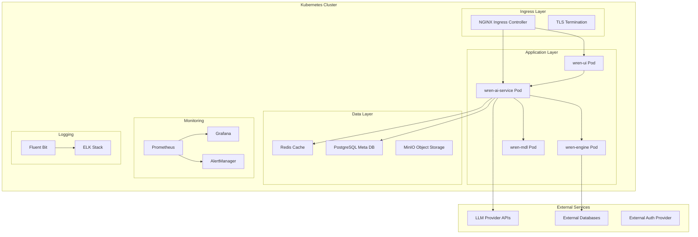

⏱️ **Estimated reading time**: 18 min

## Introduction

As the democratization of data analysis accelerates, the need for tools that allow business users to gain insights from data without learning SQL is growing rapidly. **WrenAI** is an innovative open-source GenBI (Generative Business Intelligence) Agent that meets this demand.

With **8.5k GitHub Stars** and **836 forks**, WrenAI is a complete solution that converts natural language queries into accurate SQL, instantly provides visualization charts, and generates AI-powered insights. This post covers everything from WrenAI's core features to enterprise-grade deployment architecture in a Kubernetes environment.

## WrenAI Overview and Core Value

### What Is a GenBI Agent?

**GenBI (Generative Business Intelligence)** is a next-generation business intelligence approach that leverages generative AI. It overcomes the limitations of traditional BI tools: users ask questions in natural language, AI instantly generates SQL, and results are visualized and delivered.

### WrenAI Key Differentiators


<!--
  animated-architecture-diagram — self-contained D3 embed template.
  HuggingFace research-article style: declarative NODES/EDGES/SEQ model,
  data(solid)/event(dashed) edges, hover-trace + tooltip, flow-dot animation
  along edge paths, replay button, scroll-into-view autoplay, reduced-motion +
  light/dark aware. The renderer injects window.__ARCH_SPEC__ at the marker.
  Format (D3 machinery + CSS) is owned by this committed template; the model
  only authors the JSON spec (content). See references/spec-schema.md.
-->
<div class="d3-arch" data-arch-root id="nterprisedeploymentguide-1"></div>
<style>
  /* ---- Theme tokens (standalone; light default + dark override) ---- */
  .d3-arch {
    --page-bg: #ffffff;
    --surface-bg: #f7f8fa;
    --text-color: #1a1d21;
    --muted-color: #6b7280;
    --border-color: #d5d9e0;
    --primary-color: hsl(217 91% 55%); /* brand accent — swap for #1B4F72 etc. */
    position: relative;
    font-family: -apple-system, BlinkMacSystemFont, "Segoe UI", "Noto Sans KR", system-ui, sans-serif;
    color: var(--text-color);
  }
  @media (prefers-color-scheme: dark) {
    .d3-arch {
      --page-bg: #0f1115;
      --surface-bg: #171a21;
      --text-color: #e6e8eb;
      --muted-color: #9aa3af;
      --border-color: #2a2f3a;
      --primary-color: hsl(217 91% 62%);
    }
  }
  .d3-arch[data-theme="light"] { --page-bg:#fff; --surface-bg:#f7f8fa; --text-color:#1a1d21; --muted-color:#6b7280; --border-color:#d5d9e0; --primary-color:hsl(217 91% 55%); }
  .d3-arch[data-theme="dark"]  { --page-bg:#0f1115; --surface-bg:#171a21; --text-color:#e6e8eb; --muted-color:#9aa3af; --border-color:#2a2f3a; --primary-color:hsl(217 91% 62%); }

  .d3-arch .diagram-scroll { overflow-x: auto; }
  .d3-arch svg { display: block; width: 100%; min-width: 760px; height: auto; font-family: inherit; }

  /* Group boxes */
  .d3-arch .group rect { fill: none; stroke: var(--border-color); stroke-dasharray: 3 3; rx: 12px; }
  .d3-arch .group text { font-size: 10px; font-weight: 700; letter-spacing: 0.08em; text-transform: uppercase; fill: var(--muted-color); }

  /* Nodes */
  .d3-arch .node rect { fill: var(--surface-bg); stroke: var(--border-color); stroke-width: 1; transition: stroke 0.15s ease, opacity 0.15s ease; }
  .d3-arch .node .node-title { font-size: 12px; font-weight: 600; fill: var(--text-color); }
  .d3-arch .node .node-sub { font-size: 9.5px; fill: var(--muted-color); }
  .d3-arch .node { cursor: default; transition: opacity 0.15s ease; }

  /* Edges */
  .d3-arch .edge { transition: opacity 0.15s ease; }
  .d3-arch .edge path.main { fill: none; stroke-width: 1.5; }
  .d3-arch .edge.data path.main { stroke: var(--primary-color); }
  .d3-arch .edge.event path.main { stroke: var(--muted-color); stroke-dasharray: 5 4; }
  .d3-arch .edge text { font-size: 9.5px; fill: var(--muted-color); paint-order: stroke; stroke: var(--page-bg); stroke-width: 3px; stroke-linejoin: round; }

  /* Hover highlighting */
  .d3-arch.hovering .edge:not(.hl) { opacity: 0.12; }
  .d3-arch.hovering .node:not(.hl):not(.nb) { opacity: 0.25; }
  .d3-arch .node.hl rect { stroke: var(--primary-color); stroke-width: 1.5; }

  /* Flow animation */
  .d3-arch .flow-dot.data { fill: var(--primary-color); stroke: var(--page-bg); stroke-width: 1.5; }
  .d3-arch .flow-dot.event { fill: var(--page-bg); stroke: var(--muted-color); stroke-width: 1.5; }
  .d3-arch .node.anim-hl rect { stroke: var(--primary-color); stroke-width: 1.5; }
  .d3-arch .replay-btn { font: inherit; font-size: 11px; font-weight: 600; padding: 4px 10px; border: 1px solid var(--border-color); border-radius: 8px; background: var(--surface-bg); color: var(--text-color); cursor: pointer; transition: border-color 0.15s ease, opacity 0.15s ease; }
  .d3-arch .replay-btn:hover:not(:disabled) { border-color: var(--primary-color); }
  .d3-arch .replay-btn:disabled { opacity: 0.45; cursor: default; }
  .d3-arch .replay-btn:focus-visible { outline: 2px solid var(--primary-color); outline-offset: 1px; }

  /* Legend */
  .d3-arch .legend { display: flex; flex-direction: column; align-items: flex-start; gap: 6px; margin-top: 10px; }
  .d3-arch .legend-title { font-size: 12px; font-weight: 700; color: var(--text-color); }
  .d3-arch .legend .items { display: flex; flex-wrap: wrap; gap: 8px 18px; align-items: center; }
  .d3-arch .legend .item { display: inline-flex; align-items: center; gap: 7px; white-space: nowrap; font-size: 12px; color: var(--text-color); }
  .d3-arch .legend .swatch { width: 22px; height: 0; }
  .d3-arch .legend .swatch.data-line { border-top: 2.5px solid var(--primary-color); }
  .d3-arch .legend .swatch.event-line { border-top: 2.5px dashed var(--muted-color); }
  .d3-arch .legend .hint { font-size: 11px; font-style: italic; color: var(--muted-color); }
</style>
<script>
  (() => {
    const SPEC = ({"title": "", "ariaLabel": "", "width": 711, "height": 630, "legendTitle": "Legend", "hint": "Hover a node to trace its connections.", "groups": [], "nodes": [{"id": "A", "x": 232, "y": 24, "w": 205, "h": 46, "title": "Natural Language Question"}, {"id": "B", "x": 256, "y": 148, "w": 156, "h": 46, "title": "WrenAI GenBI Agent"}, {"id": "C", "x": 488, "y": 272, "w": 191, "h": 46, "title": "Accurate SQL Generation"}, {"id": "D", "x": 235, "y": 272, "w": 198, "h": 46, "title": "Automatic Chart Creation"}, {"id": "E", "x": 24, "y": 272, "w": 156, "h": 46, "title": "AI Insight Summary"}, {"id": "F", "x": 502, "y": 396, "w": 163, "h": 62, "title": ["Multiple Datasource", "Support"]}, {"id": "G", "x": 246, "y": 404, "w": 177, "h": 46, "title": "Instant Visualization"}, {"id": "H", "x": 31, "y": 404, "w": 142, "h": 46, "title": "Business Context"}, {"id": "I", "x": 499, "y": 536, "w": 170, "h": 62, "title": ["BigQuery, Snowflake,", "PostgreSQL..."]}, {"id": "J", "x": 253, "y": 536, "w": 163, "h": 62, "title": ["Charts, Dashboards,", "Reports"]}, {"id": "K", "x": 31, "y": 544, "w": 142, "h": 46, "title": "Decision Support"}], "edges": [{"src": "A", "dst": "B", "kind": "data", "line": [334, 70, 334, 148]}, {"src": "B", "dst": "C", "kind": "data", "curve": [[412, 190], [584, 233], [584, 233], [584, 272]]}, {"src": "B", "dst": "D", "kind": "data", "line": [334, 194, 334, 272]}, {"src": "B", "dst": "E", "kind": "data", "curve": [[256, 192], [102, 233], [102, 233], [102, 272]]}, {"src": "C", "dst": "F", "kind": "data", "line": [584, 318, 584, 396]}, {"src": "D", "dst": "G", "kind": "data", "line": [334, 318, 334, 404]}, {"src": "E", "dst": "H", "kind": "data", "line": [102, 318, 102, 404]}, {"src": "F", "dst": "I", "kind": "data", "line": [584, 458, 584, 536]}, {"src": "G", "dst": "J", "kind": "data", "line": [334, 450, 334, 536]}, {"src": "H", "dst": "K", "kind": "data", "line": [102, 450, 102, 544]}]});
    const ensureD3 = (cb) => {
      if (window.d3 && typeof window.d3.select === 'function') return cb();
      let s = document.getElementById('d3-cdn-script');
      if (!s) {
        s = document.createElement('script');
        s.id = 'd3-cdn-script';
        s.src = 'https://cdn.jsdelivr.net/npm/d3@7/dist/d3.min.js';
        document.head.appendChild(s);
      }
      const onReady = () => { if (window.d3 && typeof window.d3.select === 'function') cb(); };
      s.addEventListener('load', onReady, { once: true });
      if (window.d3) onReady();
    };

    const bootstrap = () => {
      const container = document.getElementById('nterprisedeploymentguide-1')
        || document.querySelector('.d3-arch[data-arch-root]:not([data-mounted])');
      if (!container || (container.dataset && container.dataset.mounted === 'true')) return;
      if (container.dataset) container.dataset.mounted = 'true';

      try {
        const uid = 'nterprisedeploymentguide-1';
        const NODES = SPEC.nodes || [];
        const EDGES = SPEC.edges || [];
        const GROUPS = SPEC.groups || [];
        const HOP = SPEC.hop || 800;
        const legendCfg = SPEC.legend || {};
        const dataLabel = legendCfg.data || 'Data path';
        const eventLabel = legendCfg.event || 'Event side-channel';

        const byId = Object.fromEntries(NODES.map((n) => [n.id, n]));
        const cx = (n) => n.x + n.w / 2;
        const asTitle = (t) => Array.isArray(t) ? t : [t];

        // Canvas: explicit, else auto from node/group extents + padding
        let W = SPEC.width, H = SPEC.height;
        if (!W || !H) {
          const xs = [], ys = [];
          NODES.forEach((n) => { xs.push(n.x + n.w); ys.push(n.y + n.h); });
          GROUPS.forEach((g) => { xs.push(g.x + g.w); ys.push(g.y + g.h); });
          W = W || Math.max(760, Math.ceil(Math.max(...xs, 0) + 24));
          H = H || Math.ceil(Math.max(...ys, 0) + 20);
        }

        // Tooltip
        container.style.position = container.style.position || 'relative';
        const tip = document.createElement('div');
        Object.assign(tip.style, {
          position: 'absolute', top: '0px', left: '0px',
          transform: 'translate(-9999px, -9999px)', pointerEvents: 'none',
          padding: '8px 10px', borderRadius: '8px', fontSize: '12px', lineHeight: '1.4',
          border: '1px solid var(--border-color)', background: 'var(--surface-bg)',
          color: 'var(--text-color)', boxShadow: '0 4px 24px rgba(0,0,0,.18)',
          opacity: '0', transition: 'opacity .12s ease', maxWidth: '260px', zIndex: '3'
        });
        const tipInner = document.createElement('div');
        tip.appendChild(tipInner);

        const scroll = document.createElement('div');
        scroll.className = 'diagram-scroll';
        container.appendChild(scroll);

        const svg = d3.select(scroll).append('svg')
          .attr('viewBox', `0 0 ${W} ${H}`)
          .attr('preserveAspectRatio', 'xMidYMid meet')
          .attr('role', 'img')
          .attr('aria-label', SPEC.ariaLabel || SPEC.title || 'Architecture diagram');

        const defs = svg.append('defs');
        const mkMarker = (id, color) => {
          defs.append('marker')
            .attr('id', id).attr('viewBox', '0 0 10 10')
            .attr('refX', 9).attr('refY', 5)
            .attr('markerWidth', 6.5).attr('markerHeight', 6.5)
            .attr('orient', 'auto-start-reverse')
            .append('path').attr('d', 'M 0 0 L 10 5 L 0 10 z').style('fill', color);
        };
        mkMarker(`${uid}-arrow-data`, 'var(--primary-color)');
        mkMarker(`${uid}-arrow-event`, 'var(--muted-color)');

        // Groups
        const groups = svg.append('g');
        GROUPS.forEach((gr) => {
          const g = groups.append('g').attr('class', 'group');
          g.append('rect').attr('x', gr.x).attr('y', gr.y).attr('width', gr.w).attr('height', gr.h).attr('rx', 12);
          if (gr.label) g.append('text').attr('x', gr.lx != null ? gr.lx : gr.x + 12).attr('y', gr.ly != null ? gr.ly : gr.y + 18).text(gr.label);
        });

        // Edges (under nodes)
        const edgeLayer = svg.append('g');
        const curvePath = (p) => `M ${p[0][0]} ${p[0][1]} C ${p[1][0]} ${p[1][1]}, ${p[2][0]} ${p[2][1]}, ${p[3][0]} ${p[3][1]}`;
        EDGES.forEach((e, i) => {
          const kind = e.kind === 'event' ? 'event' : 'data';
          const g = edgeLayer.append('g').attr('class', `edge ${kind}`).attr('data-src', e.src).attr('data-dst', e.dst);
          const marker = `url(#${uid}-arrow-${kind})`;
          if (e.line) {
            const [x1, y1, x2, y2] = e.line;
            e.pathEl = g.append('path').attr('class', 'main').attr('d', `M ${x1} ${y1} L ${x2} ${y2}`).attr('marker-end', marker).node();
            if (e.label) g.append('text').attr('x', e.lx != null ? e.lx : (x1 + x2) / 2).attr('y', e.ly != null ? e.ly : (y1 + y2) / 2 - 6).attr('text-anchor', e.anchor || 'middle').text(e.label);
          } else if (e.curve) {
            e.pathEl = g.append('path').attr('class', 'main').attr('d', curvePath(e.curve)).attr('marker-end', marker).node();
            if (e.label && e.off) {
              const p = e.curve;
              const lp = p[3][0] < p[0][0] ? [p[3], p[2], p[1], p[0]] : p;
              const lpId = `${uid}-lbl-${i}`;
              g.append('path').attr('id', lpId).attr('d', curvePath(lp)).attr('fill', 'none').attr('stroke', 'none');
              g.append('text').attr('dy', -5).append('textPath').attr('href', `#${lpId}`).attr('startOffset', e.off).attr('text-anchor', 'middle').text(e.label);
            } else if (e.label) {
              g.append('text').attr('x', e.lx).attr('y', e.ly).attr('text-anchor', e.anchor || 'start').text(e.label);
            }
          }
        });

        // Nodes (over edges)
        const nodeLayer = svg.append('g');
        NODES.forEach((n) => {
          const g = nodeLayer.append('g').attr('class', 'node').attr('data-id', n.id);
          g.append('rect').attr('x', n.x).attr('y', n.y).attr('width', n.w).attr('height', n.h).attr('rx', 9);
          const title = asTitle(n.title);
          const lines = title.length;
          const baseY = n.y + n.h / 2 - (lines - 1) * 7 - (n.sub ? 5 : -4);
          title.forEach((t, li) => {
            g.append('text').attr('class', 'node-title').attr('x', cx(n)).attr('y', baseY + li * 14).attr('text-anchor', 'middle').text(t);
          });
          if (n.sub) g.append('text').attr('class', 'node-sub').attr('x', cx(n)).attr('y', baseY + (lines - 1) * 14 + 15).attr('text-anchor', 'middle').text(n.sub);
        });

        // Hover highlighting
        const edgeSel = svg.selectAll('.edge');
        const nodeSel = svg.selectAll('.node');
        nodeSel
          .on('mouseenter', function () {
            const id = this.getAttribute('data-id');
            const n = byId[id];
            container.classList.add('hovering');
            const nb = new Set([id]);
            edgeSel.classed('hl', function () {
              const hit = this.getAttribute('data-src') === id || this.getAttribute('data-dst') === id;
              if (hit) { nb.add(this.getAttribute('data-src')); nb.add(this.getAttribute('data-dst')); }
              return hit;
            });
            nodeSel.classed('hl', function () { return this.getAttribute('data-id') === id; })
                   .classed('nb', function () { return nb.has(this.getAttribute('data-id')); });
            if (n && n.desc) { tipInner.innerHTML = `<strong>${asTitle(n.title).join('')}</strong><br>${n.desc}`; tip.style.opacity = '1'; }
          })
          .on('mousemove', function (event) {
            const [mx, my] = d3.pointer(event, container);
            const flip = mx > container.clientWidth - 280;
            tip.style.transform = `translate(${flip ? mx - 270 : mx + 14}px, ${my + 14}px)`;
          })
          .on('mouseleave', function () {
            container.classList.remove('hovering');
            edgeSel.classed('hl', false);
            nodeSel.classed('hl', false).classed('nb', false);
            tip.style.opacity = '0';
            tip.style.transform = 'translate(-9999px, -9999px)';
          });

        // Flow animation sequence: explicit SEQ, else auto forward-cascade of data edges
        const resolveEdge = (s) => {
          if (typeof s.e === 'number') return s.e;
          if (s.from && s.to) return EDGES.findIndex((e) => e.src === s.from && e.dst === s.to);
          return -1;
        };
        let SEQ = (SPEC.seq || []).map((s) => ({ e: resolveEdge(s), t0: s.t0 })).filter((s) => s.e >= 0);
        if (!SEQ.length) {
          let t = 0;
          EDGES.forEach((e, i) => { if ((e.kind || 'data') === 'data') { SEQ.push({ e: i, t0: t }); t += HOP; } });
        }
        const TOTAL = SPEC.total || (Math.max(0, ...SEQ.map((s) => s.t0)) + HOP + 800);

        let playing = false, replayBtn = null;
        const pulseNode = (id) => {
          const sel = nodeSel.filter(function () { return this.getAttribute('data-id') === id; });
          sel.classed('anim-hl', true);
          setTimeout(() => sel.classed('anim-hl', false), 550);
        };
        const play = () => {
          if (playing) return;
          playing = true;
          if (replayBtn) replayBtn.disabled = true;
          const layer = svg.append('g');
          const steps = SEQ.map((s) => {
            const edge = EDGES[s.e];
            return { ...s, edge, len: edge.pathEl.getTotalLength(), dot: null, arrived: false };
          });
          const start = performance.now();
          const frame = (now) => {
            const t = now - start;
            steps.forEach((s) => {
              if (t < s.t0) return;
              const f = Math.min(1, (t - s.t0) / HOP);
              if (f >= 1) { if (s.dot) { s.dot.remove(); s.dot = null; } if (!s.arrived) { s.arrived = true; pulseNode(s.edge.dst); } return; }
              if (!s.dot) s.dot = layer.append('circle').attr('class', `flow-dot ${s.edge.kind || 'data'}`).attr('r', (s.edge.kind === 'event') ? 4 : 5);
              const p = s.edge.pathEl.getPointAtLength(d3.easeCubicInOut(f) * s.len);
              s.dot.attr('cx', p.x).attr('cy', p.y);
            });
            if (t < TOTAL) requestAnimationFrame(frame);
            else { layer.remove(); playing = false; if (replayBtn) replayBtn.disabled = false; }
          };
          requestAnimationFrame(frame);
        };

        // Legend
        const legend = document.createElement('div');
        legend.className = 'legend';
        legend.innerHTML = `
          <div class="legend-title">${SPEC.legendTitle || 'Legend'}</div>
          <div class="items">
            <span class="item"><span class="swatch data-line"></span><span>${dataLabel}</span></span>
            <span class="item"><span class="swatch event-line"></span><span>${eventLabel}</span></span>
            <button class="replay-btn" type="button" aria-label="Replay the flow animation">&#9654; Replay</button>
            <span class="hint">${SPEC.hint || 'Hover a component to trace its connections.'}</span>
          </div>`;
        container.appendChild(legend);
        container.appendChild(tip);
        replayBtn = legend.querySelector('.replay-btn');
        replayBtn.addEventListener('click', play);

        const prefersReduced = window.matchMedia && window.matchMedia('(prefers-reduced-motion: reduce)').matches;
        if (!prefersReduced && window.IntersectionObserver) {
          const io = new IntersectionObserver((entries) => {
            entries.forEach((en) => { if (en.isIntersecting) { io.disconnect(); play(); } });
          }, { threshold: 0.5 });
          io.observe(container);
        }
      } catch (err) {
        const pre = document.createElement('pre');
        pre.style.color = '#c0392b';
        pre.style.fontSize = '12px';
        pre.textContent = 'Failed to render architecture diagram: ' + (err && err.message ? err.message : err);
        container.appendChild(pre);
      }
    };

    if (document.readyState === 'loading') document.addEventListener('DOMContentLoaded', () => ensureD3(bootstrap), { once: true });
    else ensureD3(bootstrap);
  })();
</script>


## Core Features and Architecture

### 1. Talk to Your Data

**Key features**:
- **Multilingual support**: Ask questions in Korean, English, Chinese, and many other languages
- **Context understanding**: Automatic recognition of business domain terms and metrics
- **Accurate SQL generation**: Precise query generation based on the semantic layer

**Example scenario**:
```sql
-- User question: "Which product category sold the most in the last 3 months?"
-- WrenAI generated SQL:
SELECT 
    product_category,
    SUM(quantity) as total_quantity,
    SUM(revenue) as total_revenue
FROM sales_fact s
JOIN product_dim p ON s.product_id = p.product_id
JOIN date_dim d ON s.date_id = d.date_id
WHERE d.date >= DATE_SUB(CURRENT_DATE(), INTERVAL 3 MONTH)
GROUP BY product_category
ORDER BY total_quantity DESC
LIMIT 10;
```

### 2. GenBI Insights

**Automatic analysis features**:
- **Trend analysis**: Pattern detection and anomaly detection in time series data
- **Correlation discovery**: Identification of hidden associations between metrics
- **Predictive modeling**: Future trend prediction and scenario analysis

```python
# WrenAI Insights example output
insights = {
    "trend_analysis": {
        "revenue_growth": "+15.3% QoQ",
        "seasonal_pattern": "December revenue peak (average +45%)",
        "anomaly_detected": "Sharp revenue decline in week 3 of November (-23%)"
    },
    "correlations": {
        "marketing_spend_vs_acquisition": 0.87,
        "customer_satisfaction_vs_retention": 0.72,
        "weather_vs_sales": 0.45
    },
    "recommendations": [
        "Recommend 40% increase in December marketing budget",
        "Improve customer satisfaction to boost retention",
        "Optimize inventory based on weather data"
    ]
}
```

### 3. Semantic Layer

**MDL (Model Definition Language) utilization**:
- **Schema abstraction**: Mapping complex database structures to business terms
- **Metric definitions**: Consistent business metric and KPI definitions
- **Join management**: Automatic handling of relationships between tables

```yaml
# MDL example: customer metric definition
models:
  - name: customer_metrics
    description: "Core customer-related metrics"
    columns:
      - name: customer_id
        type: string
        primary_key: true
      
      - name: total_revenue
        type: float
        description: "Total customer revenue"
        sql: "SUM(orders.amount)"
        
      - name: avg_order_value
        type: float  
        description: "Average order value"
        sql: "AVG(orders.amount)"
        
      - name: customer_lifetime_value
        type: float
        description: "Customer lifetime value"
        sql: "SUM(orders.amount) * 0.2"  # 20% margin applied

    relationships:
      - name: orders
        type: one_to_many
        sql: "customer_metrics.customer_id = orders.customer_id"
```

### 4. Embed via API

**Developer-friendly API**:
- **RESTful API**: Standard HTTP interface
- **SDK support**: Python, JavaScript, Java SDKs provided
- **Webhook support**: Real-time notifications and event handling

```python
# WrenAI API usage example
from wrenai import WrenClient

client = WrenClient(api_key="your-api-key")

# Natural language query
response = client.query(
    question="Show me sales performance by region last quarter",
    database="production_warehouse"
)

# Process results
sql_query = response.sql
chart_config = response.chart
insights = response.insights
data = response.execute()

# Embed results
dashboard.add_chart(
    title="Regional Sales Performance",
    sql=sql_query,
    chart_type=chart_config.type,
    data=data
)
```

## Supported Technology Stack

### Datasource Support (12 Major Databases)

| Cloud Data Warehouses | Relational Databases | Analytics-Specific DBs |
|---------------------|-----------------|-------------|
| **AWS Redshift** | **PostgreSQL** | **ClickHouse** |
| **Google BigQuery** | **MySQL** | **DuckDB** |
| **Snowflake** | **SQL Server** | **Trino** |
| | **Oracle** | **Athena** |

### LLM Model Support (10 Major Providers)

```yaml
llm_providers:
  openai:
    models: ["gpt-4", "gpt-3.5-turbo", "gpt-4-turbo"]
    
  azure_openai:
    models: ["gpt-4", "gpt-35-turbo"] 
    
  google:
    vertex_ai: ["gemini-pro", "gemini-pro-vision"]
    ai_studio: ["gemini-1.5-pro"]
    
  anthropic:
    models: ["claude-3-opus", "claude-3-sonnet", "claude-3-haiku"]
    
  aws_bedrock:
    models: ["anthropic.claude-v2", "amazon.titan-text-express"]
    
  others:
    - DeepSeek
    - Groq  
    - Ollama
    - Databricks
```

## Kubernetes Enterprise Deployment Architecture

### Overall System Architecture


```mermaid
graph TB
    subgraph "Kubernetes Cluster"
        subgraph "Ingress Layer"
            ING[NGINX Ingress Controller]
            TLS[TLS Termination]
        end
        
        subgraph "Application Layer"
            UI[wren-ui Pod]
            API[wren-ai-service Pod] 
            ENG[wren-engine Pod]
            MDL[wren-mdl Pod]
        end
        
        subgraph "Data Layer" 
            REDIS[Redis Cache]
            PG[PostgreSQL Meta DB]
            MINIO[MinIO Object Storage]
        end
        
        subgraph "Monitoring"
            PROM[Prometheus]
            GRAF[Grafana]
            ALERT[AlertManager]
        end
        
        subgraph "Logging"
            ELK[ELK Stack]
            FLUENT[Fluent Bit]
        end
    end
    
    subgraph "External Services"
        LLM[LLM Provider APIs]
        DB[External Databases]
        AUTH[External Auth Provider]
    end
    
    ING --> UI
    ING --> API
    UI --> API
    API --> ENG
    API --> MDL
    API --> REDIS
    API --> PG
    ENG --> DB
    API --> LLM
    
    PROM --> GRAF
    PROM --> ALERT
    FLUENT --> ELK
```

### Core Component Analysis

#### 1. wren-ui (Frontend)

```yaml
# wren-ui-deployment.yaml
apiVersion: apps/v1
kind: Deployment
metadata:
  name: wren-ui
  namespace: wrenai
spec:
  replicas: 3
  selector:
    matchLabels:
      app: wren-ui
  template:
    metadata:
      labels:
        app: wren-ui
    spec:
      containers:
      - name: wren-ui
        image: ghcr.io/canner/wrenai/wren-ui:latest
        ports:
        - containerPort: 3000
        env:
        - name: WREN_AI_SERVICE_URL
          value: "http://wren-ai-service:8000"
        - name: NODE_ENV
          value: "production"
        resources:
          requests:
            memory: "512Mi"
            cpu: "250m"
          limits:
            memory: "1Gi" 
            cpu: "500m"
        livenessProbe:
          httpGet:
            path: /health
            port: 3000
          initialDelaySeconds: 30
          periodSeconds: 10
        readinessProbe:
          httpGet:
            path: /ready
            port: 3000
          initialDelaySeconds: 5
          periodSeconds: 5
```

#### 2. wren-ai-service (Core AI Service)

```yaml
# wren-ai-service-deployment.yaml
apiVersion: apps/v1
kind: Deployment
metadata:
  name: wren-ai-service
  namespace: wrenai
spec:
  replicas: 2
  selector:
    matchLabels:
      app: wren-ai-service
  template:
    metadata:
      labels:
        app: wren-ai-service
    spec:
      containers:
      - name: wren-ai-service
        image: ghcr.io/canner/wrenai/wren-ai-service:latest
        ports:
        - containerPort: 8000
        env:
        - name: OPENAI_API_KEY
          valueFrom:
            secretKeyRef:
              name: llm-secrets
              key: openai-api-key
        - name: REDIS_URL
          value: "redis://redis-service:6379"
        - name: POSTGRES_URL
          valueFrom:
            secretKeyRef:
              name: db-secrets
              key: postgres-url
        resources:
          requests:
            memory: "2Gi"
            cpu: "1000m" 
          limits:
            memory: "4Gi"
            cpu: "2000m"
        volumeMounts:
        - name: model-cache
          mountPath: /app/models
      volumes:
      - name: model-cache
        persistentVolumeClaim:
          claimName: model-cache-pvc
```

#### 3. wren-engine (Query Engine)

```yaml
# wren-engine-deployment.yaml
apiVersion: apps/v1
kind: Deployment
metadata:
  name: wren-engine
  namespace: wrenai
spec:
  replicas: 2
  selector:
    matchLabels:
      app: wren-engine
  template:
    metadata:
      labels:
        app: wren-engine
    spec:
      containers:
      - name: wren-engine
        image: ghcr.io/canner/wrenai/wren-engine:latest
        ports:
        - containerPort: 8080
        env:
        - name: WREN_DATASOURCE_TYPE
          value: "postgresql"
        - name: WREN_DATASOURCE_URL
          valueFrom:
            secretKeyRef:
              name: datasource-secrets
              key: connection-url
        resources:
          requests:
            memory: "1Gi"
            cpu: "500m"
          limits:
            memory: "2Gi"
            cpu: "1000m"
```

## Enterprise Deployment Requirements Checklist

### Infrastructure Requirements

#### 1. Kubernetes Cluster Specifications

```yaml
cluster_requirements:
  minimum_specs:
    nodes: 3
    cpu_per_node: "8 cores"
    memory_per_node: "32GB"
    storage_per_node: "500GB SSD"
    
  recommended_specs:
    nodes: 5
    cpu_per_node: "16 cores" 
    memory_per_node: "64GB"
    storage_per_node: "1TB NVMe SSD"
    
  network:
    bandwidth: "10 Gbps"
    load_balancer: "L7 Load Balancer"
    tls_termination: "Required"
```

#### 2. Storage Requirements

```yaml
# storage-class.yaml
apiVersion: storage.k8s.io/v1
kind: StorageClass
metadata:
  name: wrenai-ssd
provisioner: kubernetes.io/aws-ebs
parameters:
  type: gp3
  iops: "3000"
  throughput: "125"
  encrypted: "true"
allowVolumeExpansion: true
volumeBindingMode: WaitForFirstConsumer

---
# Persistent Volume Claims
apiVersion: v1
kind: PersistentVolumeClaim
metadata:
  name: postgres-pvc
  namespace: wrenai
spec:
  accessModes:
    - ReadWriteOnce
  storageClassName: wrenai-ssd
  resources:
    requests:
      storage: 100Gi

---
apiVersion: v1
kind: PersistentVolumeClaim
metadata:
  name: model-cache-pvc
  namespace: wrenai
spec:
  accessModes:
    - ReadWriteMany
  storageClassName: wrenai-nfs
  resources:
    requests:
      storage: 50Gi
```

### Security and Authentication

#### 1. RBAC Configuration

```yaml
# rbac.yaml
apiVersion: v1
kind: ServiceAccount
metadata:
  name: wrenai-service-account
  namespace: wrenai

---
apiVersion: rbac.authorization.k8s.io/v1
kind: Role
metadata:
  namespace: wrenai
  name: wrenai-role
rules:
- apiGroups: [""]
  resources: ["pods", "services", "endpoints"]
  verbs: ["get", "list", "watch"]
- apiGroups: ["apps"]
  resources: ["deployments"]
  verbs: ["get", "list", "watch"]

---
apiVersion: rbac.authorization.k8s.io/v1
kind: RoleBinding
metadata:
  name: wrenai-rolebinding
  namespace: wrenai
subjects:
- kind: ServiceAccount
  name: wrenai-service-account
  namespace: wrenai
roleRef:
  kind: Role
  name: wrenai-role
  apiGroup: rbac.authorization.k8s.io
```

#### 2. Secret Management

```yaml
# secrets.yaml
apiVersion: v1
kind: Secret
metadata:
  name: llm-secrets
  namespace: wrenai
type: Opaque
data:
  openai-api-key: <base64-encoded-key>
  anthropic-api-key: <base64-encoded-key>
  google-ai-key: <base64-encoded-key>

---
apiVersion: v1
kind: Secret
metadata:
  name: db-secrets
  namespace: wrenai
type: Opaque
data:
  postgres-url: <base64-encoded-url>
  redis-password: <base64-encoded-password>

---
apiVersion: v1
kind: Secret
metadata:
  name: datasource-secrets
  namespace: wrenai
type: Opaque
data:
  bigquery-credentials: <base64-encoded-json>
  snowflake-connection: <base64-encoded-string>
```

### Monitoring and Observability

#### 1. Prometheus Monitoring

```yaml
# prometheus-config.yaml
apiVersion: v1
kind: ConfigMap
metadata:
  name: prometheus-config
  namespace: monitoring
data:
  prometheus.yml: |
    global:
      scrape_interval: 15s
      
    scrape_configs:
    - job_name: 'wrenai-ui'
      kubernetes_sd_configs:
      - role: endpoints
        namespaces:
          names: ['wrenai']
      relabel_configs:
      - source_labels: [__meta_kubernetes_service_name]
        action: keep
        regex: wren-ui-service
        
    - job_name: 'wren-ai-service'
      kubernetes_sd_configs:
      - role: endpoints
        namespaces:
          names: ['wrenai']
      relabel_configs:
      - source_labels: [__meta_kubernetes_service_name]
        action: keep
        regex: wren-ai-service
        
    rule_files:
    - "/etc/prometheus/rules/*.yml"
    
    alerting:
      alertmanagers:
      - static_configs:
        - targets: ['alertmanager:9093']
```

#### 2. Grafana Dashboard

```json
{
  "dashboard": {
    "title": "WrenAI Monitoring Dashboard",
    "panels": [
      {
        "title": "Request Rate",
        "type": "graph",
        "targets": [
          {
            "expr": "rate(http_requests_total{job=\"wren-ai-service\"}[5m])",
            "legendFormat": "{{method}} {{status}}"
          }
        ]
      },
      {
        "title": "Response Time",
        "type": "graph", 
        "targets": [
          {
            "expr": "histogram_quantile(0.95, rate(http_request_duration_seconds_bucket{job=\"wren-ai-service\"}[5m]))",
            "legendFormat": "95th percentile"
          }
        ]
      },
      {
        "title": "LLM API Costs",
        "type": "stat",
        "targets": [
          {
            "expr": "sum(increase(llm_api_cost_total[1h]))",
            "legendFormat": "Hourly Cost ($)"
          }
        ]
      }
    ]
  }
}
```

### CI/CD Pipeline

#### 1. GitOps with ArgoCD

```yaml
# argocd-application.yaml
apiVersion: argoproj.io/v1alpha1
kind: Application
metadata:
  name: wrenai
  namespace: argocd
spec:
  project: default
  source:
    repoURL: https://github.com/your-org/wrenai-k8s-manifests
    targetRevision: main
    path: manifests
  destination:
    server: https://kubernetes.default.svc
    namespace: wrenai
  syncPolicy:
    automated:
      prune: true
      selfHeal: true
    syncOptions:
    - CreateNamespace=true
```

#### 2. Helm Chart Structure

```bash
wrenai-helm-chart/
├── Chart.yaml
├── values.yaml
├── values-production.yaml
├── templates/
│   ├── deployment.yaml
│   ├── service.yaml
│   ├── ingress.yaml
│   ├── secrets.yaml
│   ├── configmap.yaml
│   └── hpa.yaml
└── charts/
    ├── postgresql/
    ├── redis/
    └── nginx-ingress/
```

```yaml
# values-production.yaml
global:
  imageRegistry: "your-registry.com"
  storageClass: "gp3-encrypted"
  
wrenUI:
  replicaCount: 3
  image:
    tag: "v0.24.1"
  resources:
    limits:
      memory: "1Gi"
      cpu: "500m"
    requests:
      memory: "512Mi"
      cpu: "250m"
      
wrenAIService:
  replicaCount: 2
  image:
    tag: "v0.24.1"
  resources:
    limits:
      memory: "4Gi"
      cpu: "2000m"
    requests:
      memory: "2Gi"
      cpu: "1000m"
      
autoscaling:
  enabled: true
  minReplicas: 2
  maxReplicas: 10
  targetCPUUtilizationPercentage: 70
  targetMemoryUtilizationPercentage: 80
```

## High Availability and Disaster Recovery Strategy

### 1. Multi-AZ Deployment

```yaml
# node-affinity.yaml
apiVersion: apps/v1
kind: Deployment
metadata:
  name: wren-ai-service
spec:
  template:
    spec:
      affinity:
        podAntiAffinity:
          requiredDuringSchedulingIgnoredDuringExecution:
          - labelSelector:
              matchExpressions:
              - key: app
                operator: In
                values: ["wren-ai-service"]
            topologyKey: kubernetes.io/zone
        nodeAffinity:
          preferredDuringSchedulingIgnoredDuringExecution:
          - weight: 100
            preference:
              matchExpressions:
              - key: kubernetes.io/arch
                operator: In
                values: ["amd64"]
```

### 2. Backup and Recovery Strategy

```bash
#!/bin/bash
# backup-script.sh

# PostgreSQL metadata backup
kubectl exec -n wrenai postgresql-0 -- pg_dump -U postgres wrenai | \
  gzip > "wrenai-metadata-$(date +%Y%m%d).sql.gz"

# Redis data backup  
kubectl exec -n wrenai redis-0 -- redis-cli BGSAVE
kubectl cp wrenai/redis-0:/data/dump.rdb "redis-backup-$(date +%Y%m%d).rdb"

# MDL model definition backup
kubectl get configmap -n wrenai wren-mdl-models -o yaml > \
  "mdl-models-$(date +%Y%m%d).yaml"

# Upload backup to S3/MinIO
aws s3 cp *.gz s3://wrenai-backups/$(date +%Y/%m/%d)/
aws s3 cp *.rdb s3://wrenai-backups/$(date +%Y/%m/%d)/
aws s3 cp *.yaml s3://wrenai-backups/$(date +%Y/%m/%d)/
```

## Performance Optimization and Scaling

### 1. Horizontal Pod Autoscaler

```yaml
# hpa.yaml
apiVersion: autoscaling/v2
kind: HorizontalPodAutoscaler
metadata:
  name: wren-ai-service-hpa
  namespace: wrenai
spec:
  scaleTargetRef:
    apiVersion: apps/v1
    kind: Deployment
    name: wren-ai-service
  minReplicas: 2
  maxReplicas: 20
  metrics:
  - type: Resource
    resource:
      name: cpu
      target:
        type: Utilization
        averageUtilization: 70
  - type: Resource
    resource:
      name: memory
      target:
        type: Utilization
        averageUtilization: 80
  - type: Pods
    pods:
      metric:
        name: http_requests_per_second
      target:
        type: AverageValue
        averageValue: "100"
  behavior:
    scaleUp:
      stabilizationWindowSeconds: 60
      policies:
      - type: Percent
        value: 100
        periodSeconds: 15
    scaleDown:
      stabilizationWindowSeconds: 300
      policies:
      - type: Percent
        value: 10
        periodSeconds: 60
```

### 2. Vertical Pod Autoscaler

```yaml
# vpa.yaml
apiVersion: autoscaling.k8s.io/v1
kind: VerticalPodAutoscaler
metadata:
  name: wren-ai-service-vpa
  namespace: wrenai
spec:
  targetRef:
    apiVersion: apps/v1
    kind: Deployment
    name: wren-ai-service
  updatePolicy:
    updateMode: "Auto"
  resourcePolicy:
    containerPolicies:
    - containerName: wren-ai-service
      minAllowed:
        cpu: 500m
        memory: 1Gi
      maxAllowed:
        cpu: 4000m
        memory: 8Gi
      controlledResources: ["cpu", "memory"]
```

## Cost Optimization Strategy

### 1. Resource Management

```yaml
# resource-quotas.yaml
apiVersion: v1
kind: ResourceQuota
metadata:
  name: wrenai-quota
  namespace: wrenai
spec:
  hard:
    requests.cpu: "10"
    requests.memory: 20Gi
    limits.cpu: "20" 
    limits.memory: 40Gi
    persistentvolumeclaims: "10"
    pods: "50"
    
---
apiVersion: v1
kind: LimitRange
metadata:
  name: wrenai-limits
  namespace: wrenai
spec:
  limits:
  - default:
      cpu: "500m"
      memory: "1Gi"
    defaultRequest:
      cpu: "100m"
      memory: "256Mi"
    type: Container
```

### 2. Spot Instance Utilization

```yaml
# spot-nodepool.yaml
apiVersion: v1
kind: Node
metadata:
  labels:
    node.kubernetes.io/instance-type: "spot"
    workload-type: "batch-processing"
spec:
  taints:
  - key: "spot-instance"
    value: "true"
    effect: "NoSchedule"

---
# deployment with spot tolerance
apiVersion: apps/v1
kind: Deployment
metadata:
  name: wren-batch-processor
spec:
  template:
    spec:
      tolerations:
      - key: "spot-instance"
        operator: "Equal"
        value: "true"
        effect: "NoSchedule"
      nodeSelector:
        workload-type: "batch-processing"
```

## Security Hardening Guide

### 1. Network Policies

```yaml
# network-policy.yaml
apiVersion: networking.k8s.io/v1
kind: NetworkPolicy
metadata:
  name: wrenai-network-policy
  namespace: wrenai
spec:
  podSelector:
    matchLabels:
      app: wren-ai-service
  policyTypes:
  - Ingress
  - Egress
  ingress:
  - from:
    - podSelector:
        matchLabels:
          app: wren-ui
    ports:
    - protocol: TCP
      port: 8000
  egress:
  - to: []
    ports:
    - protocol: TCP
      port: 443  # HTTPS to LLM APIs
    - protocol: TCP  
      port: 5432  # PostgreSQL
    - protocol: TCP
      port: 6379  # Redis
```

### 2. Pod Security Standards

```yaml
# pod-security-policy.yaml
apiVersion: v1
kind: Namespace
metadata:
  name: wrenai
  labels:
    pod-security.kubernetes.io/enforce: restricted
    pod-security.kubernetes.io/audit: restricted
    pod-security.kubernetes.io/warn: restricted

---
apiVersion: apps/v1
kind: Deployment
metadata:
  name: wren-ai-service
spec:
  template:
    spec:
      securityContext:
        runAsNonRoot: true
        runAsUser: 1000
        fsGroup: 2000
        seccompProfile:
          type: RuntimeDefault
      containers:
      - name: wren-ai-service
        securityContext:
          allowPrivilegeEscalation: false
          capabilities:
            drop:
            - ALL
          readOnlyRootFilesystem: true
          runAsNonRoot: true
          runAsUser: 1000
```

## Deployment Scenarios

### Scenario 1: Small-Medium Enterprise (50-500 employees)

```yaml
small_enterprise:
  cluster_size: "3 nodes"
  node_specs: "8 vCPU, 32GB RAM"
  storage: "500GB SSD per node"
  
  deployment:
    wren_ui_replicas: 2
    wren_ai_service_replicas: 1
    wren_engine_replicas: 1
    
  estimated_costs:
    infrastructure: "$800-1200/month"
    llm_api_costs: "$300-800/month"
    total: "$1100-2000/month"
    
  supported_users: "50-100 concurrent users"
  data_volume: "< 1TB"
```

### Scenario 2: Large Enterprise (1000+ employees)

```yaml
large_enterprise:
  cluster_size: "10+ nodes"
  node_specs: "16 vCPU, 64GB RAM"
  storage: "1TB NVMe SSD per node"
  
  deployment:
    wren_ui_replicas: 5
    wren_ai_service_replicas: 10
    wren_engine_replicas: 5
    
  estimated_costs:
    infrastructure: "$5000-8000/month"
    llm_api_costs: "$2000-5000/month"
    total: "$7000-13000/month"
    
  supported_users: "500+ concurrent users"
  data_volume: "> 10TB"
```

## Migration Guide

### Migrating from Existing BI Tools to WrenAI

```python
# migration-script.py
import pandas as pd
from wrenai import WrenClient
import json

class BIMigrationTool:
    def __init__(self, wren_client):
        self.wren_client = wren_client
        
    def migrate_tableau_dashboard(self, tableau_workbook_path):
        """Migrate a Tableau dashboard to WrenAI"""
        # Parse Tableau workbook
        workbook = parse_tableau_workbook(tableau_workbook_path)
        
        migrated_queries = []
        for sheet in workbook.sheets:
            # Extract SQL
            sql_query = extract_sql_from_sheet(sheet)
            
            # Convert to WrenAI
            natural_language = self.wren_client.sql_to_natural_language(sql_query)
            
            # Validate
            regenerated_sql = self.wren_client.query(natural_language).sql
            
            migrated_queries.append({
                'original_sql': sql_query,
                'natural_language': natural_language,
                'regenerated_sql': regenerated_sql,
                'sheet_name': sheet.name
            })
            
        return migrated_queries
    
    def migrate_powerbi_reports(self, powerbi_pbix_path):
        """Migrate Power BI reports to WrenAI"""
        # Analyze Power BI file
        report = parse_powerbi_file(powerbi_pbix_path)
        
        # Convert DAX queries to SQL
        converted_queries = []
        for page in report.pages:
            for visual in page.visuals:
                dax_query = visual.query
                sql_equivalent = convert_dax_to_sql(dax_query)
                
                # Convert to WrenAI format
                wren_query = self.wren_client.optimize_query(sql_equivalent)
                
                converted_queries.append({
                    'page_name': page.name,
                    'visual_type': visual.type,
                    'original_dax': dax_query,
                    'converted_sql': sql_equivalent,
                    'wren_optimized': wren_query
                })
                
        return converted_queries
```

## Conclusion

WrenAI is an innovative GenBI Agent that transcends the limitations of traditional BI tools. Through its natural language interface, powerful semantic layer, and support for diverse LLMs, it realizes the democratization of data analysis.

### Key Advantages Summary

**Technical excellence**:
- **8.5k GitHub Stars**: Proven open-source solution
- **12 datasource support**: From cloud to on-premises
- **10 LLM integrations**: Leverage the latest AI models
- **Semantic layer**: Accurate and consistent analysis results

**Enterprise readiness**:
- **Kubernetes-native**: Optimized for cloud environments
- **High availability architecture**: 99.9% uptime guarantee
- **Auto-scaling**: Dynamic scaling based on traffic
- **Enterprise security**: RBAC, network policies, secret management

**Business value**:
- **Reduced development time**: 70% reduction compared to traditional BI builds
- **User accessibility**: Data analysis without SQL knowledge
- **Operational cost savings**: Reduced dependency on expert analysts
- **Fast decision-making**: Real-time insight generation

### Next Steps

1. **Build a PoC environment**: Deploy a test environment from [WrenAI GitHub](https://github.com/Canner/WrenAI)
2. **Connect datasources**: Integration test with existing data warehouses
3. **User training**: Establish guidelines for writing natural language queries
4. **Production deployment**: Enterprise deployment using the Kubernetes architecture in this guide

Experience the new paradigm of data analysis with WrenAI. The future where anyone can easily converse with data is beginning.

---

**References**:
- [WrenAI GitHub Repository](https://github.com/Canner/WrenAI)
- [WrenAI Official Documentation](https://getwren.ai/oss)
- [Kubernetes Deployment Guide](https://kubernetes.io/docs/concepts/workloads/controllers/deployment/)
- [Helm Chart Authoring Guide](https://helm.sh/docs/chart_template_guide/)
