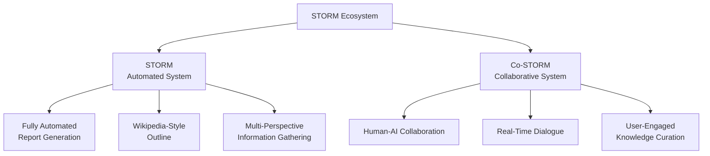

⏱️ **Estimated reading time**: 10 min

## Introduction

**STORM (Synthesis of Topic Outlines through Retrieval and Multi-perspective Question Asking)** developed at Stanford is an LLM-based knowledge curation agent system. With **25.4k GitHub stars**, this project is an innovative system that automatically researches topics and generates full-length reports complete with citations.

**STORM** is not just a text generator. It is an **intelligent agent system** that raises questions from diverse perspectives, collects information, and organizes it systematically to produce Wikipedia-quality reports.

This guide covers the core features of STORM and Co-STORM, practical usage, and customization methods in full detail.

## STORM System Overview

### Core Features

**STORM** has the following innovative characteristics:

- **Automated research**: Multi-angle information gathering on a topic
- **Citation system**: Source attribution for all content
- **Structured organization**: Wikipedia-style hierarchical outlines
- **Multiple perspectives**: Approach from various expert viewpoints
- **Collaborative mode**: Human-AI collaboration support through Co-STORM
- **Customization**: Applicable to various domains

### STORM vs Co-STORM



## STORM Architecture Deep Dive

### 4 Core Modules

**STORM** consists of the following 4 modules:

#### 1. Knowledge Curation Module

```python
# Knowledge gathering process
class KnowledgeCurationModule:
    def __init__(self, retriever, llm):
        self.retriever = retriever  # Bing, Google, etc.
        self.llm = llm
    
    def collect_information(self, topic):
        """Collect information from diverse perspectives"""
        perspectives = self.generate_perspectives(topic)
        collected_info = []
        
        for perspective in perspectives:
            queries = self.generate_queries(topic, perspective)
            for query in queries:
                results = self.retriever.search(query)
                collected_info.extend(results)
        
        return self.deduplicate_and_filter(collected_info)
```

#### 2. Outline Generation Module

```python
# Hierarchical outline generation
class OutlineGenerationModule:
    def generate_outline(self, collected_info, topic):
        """Systematically organize collected information"""
        key_concepts = self.extract_key_concepts(collected_info)
        hierarchy = self.build_hierarchy(key_concepts)
        
        outline = {
            "title": topic,
            "sections": []
        }
        
        for section in hierarchy:
            outline["sections"].append({
                "title": section["title"],
                "subsections": section["subsections"],
                "key_points": section["key_points"]
            })
        
        return outline
```

#### 3. Article Generation Module

```python
# Write article based on the outline
class ArticleGenerationModule:
    def populate_outline(self, outline, knowledge_base):
        """Fill the outline with actual content"""
        article = {
            "title": outline["title"],
            "content": []
        }
        
        for section in outline["sections"]:
            section_content = self.write_section(
                section, 
                knowledge_base,
                citation_style="wikipedia"
            )
            article["content"].append(section_content)
        
        return article
```

#### 4. Article Polishing Module

```python
# Final article refinement
class ArticlePolishingModule:
    def polish_article(self, article):
        """Improve quality and consistency of the article"""
        polished = {
            "title": article["title"],
            "content": []
        }
        
        for section in article["content"]:
            # Unify style, remove duplicates, clean citations
            polished_section = self.improve_writing_quality(section)
            polished_section = self.verify_citations(polished_section)
            polished["content"].append(polished_section)
        
        return polished
```

## Installation and Usage

### 1. Installation

```bash
# Simple installation via pip
pip install knowledge-storm

# Or install from source
git clone https://github.com/stanford-oval/storm.git
cd storm
pip install -r requirements.txt
pip install -e .
```

### 2. API Key Setup

```toml
# Create secrets.toml file
# ============ language model configurations ============ 
OPENAI_API_KEY="your_openai_api_key"
OPENAI_API_TYPE="openai"

# For Azure OpenAI
OPENAI_API_TYPE="azure"
AZURE_API_BASE="your_azure_api_base_url"
AZURE_API_VERSION="your_azure_api_version"

# ============ retriever configurations ============ 
BING_SEARCH_API_KEY="your_bing_search_api_key"

# ============ encoder configurations ============ 
ENCODER_API_TYPE="openai"
```

### 3. Basic STORM Usage

```python
# Basic STORM usage example
from knowledge_storm import STORMWikiRunnerArguments, STORMWikiRunner
from knowledge_storm import STORMWikiLMConfigs

# Initialize configuration
lm_configs = STORMWikiLMConfigs()
runner_args = STORMWikiRunnerArguments(
    output_dir="./storm_output",
    max_conv_turn=5,
    max_perspective=5
)

# Run STORM
runner = STORMWikiRunner(lm_configs)

# Set topic and run
topic = "Artificial Intelligence in Healthcare"
runner.run(
    topic=topic,
    do_research=True,
    do_generate_outline=True,  
    do_generate_article=True,
    do_polish_article=True
)

# Check results
print(f"Generated article saved to: {runner_args.output_dir}")
```

### 4. Command Line Interface

```bash
# Fully automated run
python examples/storm_examples/run_storm_wiki_gpt.py \
    --output-dir ./results \
    --retriever bing \
    --do-research \
    --do-generate-outline \
    --do-generate-article \
    --do-polish-article

# Run only specific steps
python examples/storm_examples/run_storm_wiki_gpt.py \
    --output-dir ./results \
    --retriever bing \
    --do-research  # Research only
```

## Co-STORM: Collaborative AI System

### Co-STORM Overview

**Co-STORM** is an innovative system for human-AI collaborative knowledge curation:

- **Real-time dialogue**: Conversation between user and AI agents
- **Multiple experts**: Several AI experts collaborating
- **User participation**: Ability to intervene in the dialogue at any time
- **Dynamic adjustment**: Direction adjusted based on user feedback

### Co-STORM Usage

```python
# Initialize and run Co-STORM
from knowledge_storm import CoStormRunner

# Create Co-STORM runner
costorm_runner = CoStormRunner(
    args=costorm_args,
    lm_configs=lm_configs,
    rm=rm,
    conv_simulator_lm=conv_simulator_lm,
    topic=topic,
    callback_handler=StreamlitCallbackHandler()
)

# Start collaborative session
costorm_runner.warm_start()

# Progress step by step
conv_turn = costorm_runner.step()  # Observe AI agent dialogue
costorm_runner.step(user_utterance="User opinion added")  # User intervention

# Generate final report
costorm_runner.knowledge_base.reorganize()
article = costorm_runner.generate_report()
```

### Co-STORM Run Example

```bash
# Co-STORM run command
python examples/costorm_examples/run_costorm_gpt.py \
    --output-dir ./costorm_results \
    --retriever bing
```

## Advanced Customization

### 1. Custom Search Engine

```python
# Implement custom search system
from knowledge_storm.interface import Retriever

class CustomRetriever(Retriever):
    def __init__(self, custom_api_key):
        self.api_key = custom_api_key
    
    def retrieve(self, query, k=10):
        """Custom search logic"""
        # Integrate your search system
        results = self.search_custom_database(query)
        
        return [
            {
                "title": result["title"],
                "content": result["content"], 
                "url": result["url"]
            }
            for result in results[:k]
        ]
    
    def search_custom_database(self, query):
        # Custom database search implementation
        pass
```

### 2. Domain-Specific Modules

```python
# Medical domain-specific STORM
class MedicalSTORMRunner(STORMWikiRunner):
    def __init__(self, lm_configs):
        super().__init__(lm_configs)
        
        # Medical expert prompt configuration
        self.medical_prompts = {
            "research": "Research from a medical expert perspective...",
            "outline": "Structure in medical textbook style...",
            "article": "Write for easy understanding by medical staff..."
        }
    
    def customize_for_medical_domain(self):
        """Customization for the medical domain"""
        # Load medical glossary
        self.load_medical_terminology()
        
        # Set medical citation style
        self.set_medical_citation_style()
```

### 3. Multiple Output Formats

```python
# Support for multiple report formats
class MultiFormatSTORM(STORMWikiRunner):
    def generate_report(self, format_type="wikipedia"):
        """Generate reports in various formats"""
        base_content = super().generate_report()
        
        if format_type == "academic":
            return self.convert_to_academic_paper(base_content)
        elif format_type == "presentation":
            return self.convert_to_slides(base_content)
        elif format_type == "executive_summary":
            return self.create_executive_summary(base_content)
        else:
            return base_content
    
    def convert_to_academic_paper(self, content):
        """Convert to academic paper format"""
        return {
            "abstract": self.generate_abstract(content),
            "introduction": content["sections"][0],
            "literature_review": self.create_literature_review(content),
            "conclusion": content["sections"][-1],
            "references": content["citations"]
        }
```

## Production Deployment Guide

### 1. Docker Containerization

```dockerfile
# Dockerfile for STORM
FROM python:3.9-slim

# Install system packages
RUN apt-get update && apt-get install -y \
    git \
    build-essential \
    && rm -rf /var/lib/apt/lists/*

# Install STORM
WORKDIR /app
COPY requirements.txt .
RUN pip install -r requirements.txt
RUN pip install knowledge-storm

# Application code
COPY . .

# Environment variables
ENV PYTHONPATH=/app
ENV STORM_OUTPUT_DIR=/app/outputs

# Service port
EXPOSE 8000

# Start service
CMD ["python", "storm_server.py"]
```

### 2. Web Service Implementation

```python
# FastAPI-based STORM service
from fastapi import FastAPI, BackgroundTasks
from pydantic import BaseModel
import asyncio

app = FastAPI(title="STORM API", version="1.0.0")

class ResearchRequest(BaseModel):
    topic: str
    max_conv_turn: int = 5
    max_perspective: int = 5
    output_format: str = "wikipedia"

class ResearchResponse(BaseModel):
    task_id: str
    status: str
    result_url: str = None

@app.post("/research", response_model=ResearchResponse)
async def create_research_task(
    request: ResearchRequest, 
    background_tasks: BackgroundTasks
):
    task_id = generate_task_id()
    
    # Run STORM in the background
    background_tasks.add_task(
        run_storm_research, 
        task_id, 
        request.topic,
        request.max_conv_turn,
        request.max_perspective
    )
    
    return ResearchResponse(
        task_id=task_id,
        status="processing"
    )

async def run_storm_research(task_id, topic, max_conv_turn, max_perspective):
    """Background STORM execution"""
    try:
        runner = STORMWikiRunner(lm_configs)
        result = runner.run(
            topic=topic,
            do_research=True,
            do_generate_outline=True,
            do_generate_article=True,
            do_polish_article=True
        )
        
        # Save result
        save_result(task_id, result)
        update_task_status(task_id, "completed")
        
    except Exception as e:
        update_task_status(task_id, "failed", str(e))

@app.get("/research/{task_id}")
async def get_research_result(task_id: str):
    """Retrieve research result"""
    status = get_task_status(task_id)
    
    if status["status"] == "completed":
        result = load_result(task_id)
        return {
            "task_id": task_id,
            "status": "completed",
            "result": result
        }
    else:
        return {
            "task_id": task_id,
            "status": status["status"],
            "message": status.get("message")
        }
```

### 3. Kubernetes Deployment

```yaml
# k8s-deployment.yaml
apiVersion: apps/v1
kind: Deployment
metadata:
  name: storm-api
spec:
  replicas: 3
  selector:
    matchLabels:
      app: storm-api
  template:
    metadata:
      labels:
        app: storm-api
    spec:
      containers:
      - name: storm-api
        image: your-registry/storm-api:latest
        ports:
        - containerPort: 8000
        env:
        - name: OPENAI_API_KEY
          valueFrom:
            secretKeyRef:
              name: storm-secrets
              key: openai-api-key
        - name: BING_SEARCH_API_KEY
          valueFrom:
            secretKeyRef:
              name: storm-secrets
              key: bing-api-key
        resources:
          requests:
            memory: "2Gi"
            cpu: "1000m"
          limits:
            memory: "4Gi"
            cpu: "2000m"
        volumeMounts:
        - name: storm-storage
          mountPath: /app/outputs
      volumes:
      - name: storm-storage
        persistentVolumeClaim:
          claimName: storm-pvc
---
apiVersion: v1
kind: Service
metadata:
  name: storm-service
spec:
  selector:
    app: storm-api
  ports:
  - port: 80
    targetPort: 8000
  type: LoadBalancer
```

## Performance Optimization and Scaling

### 1. Parallel Processing Optimization

```python
# Performance improvement through parallel processing
import asyncio
from concurrent.futures import ThreadPoolExecutor

class OptimizedSTORMRunner:
    def __init__(self, max_workers=4):
        self.executor = ThreadPoolExecutor(max_workers=max_workers)
    
    async def parallel_research(self, topic, perspectives):
        """Multi-perspective parallel research"""
        tasks = []
        
        for perspective in perspectives:
            task = asyncio.create_task(
                self.research_perspective(topic, perspective)
            )
            tasks.append(task)
        
        results = await asyncio.gather(*tasks)
        return self.merge_research_results(results)
    
    async def research_perspective(self, topic, perspective):
        """Research from a specific perspective"""
        loop = asyncio.get_event_loop()
        return await loop.run_in_executor(
            self.executor,
            self.single_perspective_research,
            topic,
            perspective
        )
```

### 2. Caching System

```python
# Efficient caching implementation
from functools import lru_cache
import hashlib
import pickle

class STORMCache:
    def __init__(self, cache_dir="./storm_cache"):
        self.cache_dir = cache_dir
        os.makedirs(cache_dir, exist_ok=True)
    
    def get_cache_key(self, topic, parameters):
        """Generate cache key"""
        content = f"{topic}_{str(sorted(parameters.items()))}"
        return hashlib.md5(content.encode()).hexdigest()
    
    def get_cached_result(self, cache_key):
        """Look up cached result"""
        cache_file = os.path.join(self.cache_dir, f"{cache_key}.pkl")
        
        if os.path.exists(cache_file):
            with open(cache_file, 'rb') as f:
                return pickle.load(f)
        return None
    
    def save_to_cache(self, cache_key, result):
        """Save result to cache"""
        cache_file = os.path.join(self.cache_dir, f"{cache_key}.pkl")
        
        with open(cache_file, 'wb') as f:
            pickle.dump(result, f)

# Cached STORM runner
class CachedSTORMRunner(STORMWikiRunner):
    def __init__(self, lm_configs):
        super().__init__(lm_configs)
        self.cache = STORMCache()
    
    def run_with_cache(self, topic, **kwargs):
        cache_key = self.cache.get_cache_key(topic, kwargs)
        cached_result = self.cache.get_cached_result(cache_key)
        
        if cached_result:
            print(f"Using cached result for: {topic}")
            return cached_result
        
        result = self.run(topic=topic, **kwargs)
        self.cache.save_to_cache(cache_key, result)
        
        return result
```

## Datasets and Benchmarks

### FreshWiki Dataset

**FreshWiki** is a high-quality dataset for STORM evaluation:

- **Scale**: 100 high-quality Wikipedia articles
- **Period**: Most-edited pages from February 2022 to September 2023
- **Use**: Automated knowledge curation research

```python
# FreshWiki dataset utilization
from datasets import load_dataset

# Load dataset from Hugging Face
dataset = load_dataset("stanford-oval/FreshWiki")

# Use evaluation data
for item in dataset["train"]:
    topic = item["title"]
    reference_article = item["content"]
    
    # Generate article with STORM
    generated_article = storm_runner.run(topic=topic)
    
    # Quality evaluation
    score = evaluate_quality(generated_article, reference_article)
    print(f"Topic: {topic}, Quality Score: {score}")
```

### WildSeek Dataset

**WildSeek** is a dataset containing complex information-seeking patterns from real users:

```python
# Evaluate Co-STORM with WildSeek dataset
wildseek_data = load_dataset("stanford-oval/WildSeek")

for item in wildseek_data["train"]:
    topic = item["topic"]
    user_goal = item["user_goal"]
    
    # Simulate collaborative session with Co-STORM
    costorm_runner = CoStormRunner(topic=topic)
    costorm_runner.set_user_goal(user_goal)
    
    result = costorm_runner.collaborative_research()
    print(f"Topic: {topic}")
    print(f"User Goal: {user_goal}")
    print(f"Result Quality: {evaluate_result(result)}")
```

## Comparative Analysis: STORM vs Existing Systems

### Feature Comparison

| Feature | STORM | ChatGPT | Claude | Perplexity |
|------|-------|---------|---------|------------|
| Automated research | Yes | No | No | Yes |
| Structured outline | Yes | No | No | No |
| Citation system | Yes | No | No | Yes |
| Multiple perspectives | Yes | No | No | No |
| Collaborative mode | Yes | No | No | No |
| Customization | Yes | No | No | No |

### Performance Benchmark

```python
# Performance comparison experiment
def benchmark_systems():
    topics = [
        "Quantum Computing Applications",
        "Climate Change Mitigation Strategies", 
        "Artificial Intelligence Ethics"
    ]
    
    results = {
        "STORM": [],
        "ChatGPT": [],
        "Claude": [],
        "Perplexity": []
    }
    
    for topic in topics:
        # Evaluate STORM
        storm_result = storm_runner.run(topic=topic)
        storm_score = evaluate_comprehensive_quality(storm_result, topic)
        results["STORM"].append(storm_score)
        
        # Compare with other systems...
    
    return results

# Evaluation metrics
def evaluate_comprehensive_quality(result, topic):
    """Comprehensive quality evaluation"""
    metrics = {
        "factual_accuracy": evaluate_factual_accuracy(result),
        "completeness": evaluate_completeness(result, topic),
        "citation_quality": evaluate_citations(result),
        "structure_quality": evaluate_structure(result),
        "readability": evaluate_readability(result)
    }
    
    return sum(metrics.values()) / len(metrics)
```

## Real-World Use Cases

### 1. Education

```python
# Generate educational materials
class EducationalSTORM(STORMWikiRunner):
    def generate_course_material(self, topic, education_level="university"):
        """Generate learning materials appropriate for the education level"""
        
        # Customize by education level
        if education_level == "high_school":
            complexity_level = "basic"
            citation_style = "simplified"
        elif education_level == "university":
            complexity_level = "intermediate"
            citation_style = "academic"
        else:
            complexity_level = "advanced"
            citation_style = "scholarly"
        
        result = self.run(
            topic=topic,
            complexity_level=complexity_level,
            citation_style=citation_style
        )
        
        # Add learning objectives and quiz
        result["learning_objectives"] = self.generate_learning_objectives(result)
        result["quiz_questions"] = self.generate_quiz(result)
        
        return result

# Usage example
edu_storm = EducationalSTORM(lm_configs)
course_material = edu_storm.generate_course_material(
    topic="Machine Learning Fundamentals",
    education_level="university"
)
```

### 2. Corporate Research

```python
# Market analysis report for enterprise use
class BusinessSTORM(STORMWikiRunner):
    def generate_market_analysis(self, company_or_industry):
        """Generate market analysis report"""
        
        # Set business perspectives
        business_perspectives = [
            "Market Size and Growth",
            "Competitive Landscape",
            "Consumer Trends",
            "Regulatory Environment",
            "Technology Disruption",
            "Investment Opportunities"
        ]
        
        result = self.run(
            topic=company_or_industry,
            perspectives=business_perspectives,
            citation_style="business"
        )
        
        # Add business insights
        result["executive_summary"] = self.generate_executive_summary(result)
        result["swot_analysis"] = self.generate_swot_analysis(result)
        result["recommendations"] = self.generate_recommendations(result)
        
        return result

# Usage example
business_storm = BusinessSTORM(lm_configs)
market_report = business_storm.generate_market_analysis("Electric Vehicle Industry")
```

### 3. Journalism

```python
# In-depth research for investigative reporting
class JournalismSTORM(STORMWikiRunner):
    def investigative_research(self, topic):
        """In-depth research for investigative reporting"""
        
        journalism_perspectives = [
            "Who (Key Players)",
            "What (Core Facts)",
            "When (Timeline)",
            "Where (Geographic Context)",
            "Why (Motivations and Causes)",
            "How (Mechanisms and Processes)"
        ]
        
        result = self.run(
            topic=topic,
            perspectives=journalism_perspectives,
            fact_checking=True,
            source_verification=True
        )
        
        # Add journalism elements
        result["fact_check_report"] = self.generate_fact_check(result)
        result["source_credibility"] = self.assess_source_credibility(result)
        result["follow_up_questions"] = self.generate_follow_up_questions(result)
        
        return result
```

## Conclusion

**Stanford STORM** is an innovative system that presents a new paradigm for knowledge curation.

### Key Advantages

1. **Systematic approach**: 4-stage modular pipeline
2. **Multiple perspectives**: Information gathering from various expert viewpoints
3. **Citation system**: Source attribution for all content
4. **Collaborative features**: Human-AI collaboration through Co-STORM
5. **Customization**: Applicable to various domains
6. **Open source**: Free use under MIT license

### Recommended Use Cases

- **Researchers**: Literature review and systematic review writing
- **Educators**: Educational materials and lecture note generation
- **Enterprises**: Market analysis and competitor research
- **Journalists**: Investigative reporting and fact-checking
- **Students**: Research for assignments and projects

**STORM** and **Co-STORM** have the potential to fundamentally change the way knowledge work is done, going beyond mere tools. As the 25.4k GitHub stars attest, many users have already recognized their value.

Try incorporating STORM into your knowledge curation workflow!

---

**Reference links**:
- [STORM GitHub Repository](https://github.com/stanford-oval/storm)
- [STORM Official Website](https://storm.genie.stanford.edu)
- [NAACL 2024 Paper](https://aclanthology.org/2024.naacl-long.347/)
- [EMNLP 2024 Co-STORM Paper](https://aclanthology.org/2024.emnlp-main.554/)
- [FreshWiki Dataset](https://huggingface.co/datasets/stanford-oval/FreshWiki)
- [WildSeek Dataset](https://huggingface.co/datasets/stanford-oval/WildSeek)
