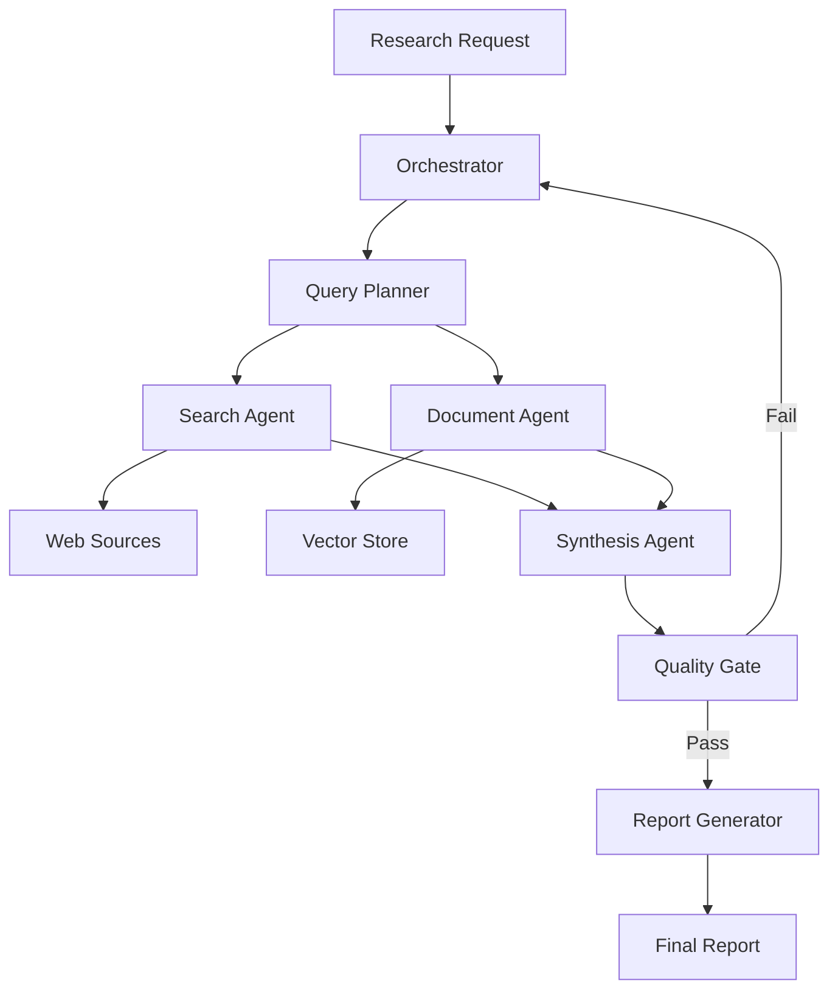

⏱️ **Estimated reading time**: 20 min

## Introduction

**LangChain Open Deep Research** is an open-source multi-agent system designed to automate complex research tasks end to end. It combines web search, document retrieval, synthesis, and report generation into a coordinated pipeline where specialized agents handle distinct phases of the research process.

This guide covers the full architecture from core concepts to production deployment, including the quality-focused agent design, multi-agent orchestration patterns, advanced RAG, and domain-specific adaptations for financial and medical research.


*Concept diagram*

## System Architecture Overview

Open Deep Research uses a hub-and-spoke agent architecture built on LangGraph:



### Core Design Principles

1. **Quality over speed**: Every research output passes a quality gate before being delivered
2. **Parallel execution**: Independent searches run concurrently to reduce total latency
3. **Source attribution**: All claims are linked to verifiable sources
4. **Iterative refinement**: The orchestrator can re-dispatch failed quality checks
5. **Domain awareness**: Agents can be configured with domain-specific knowledge

## Quality-Focused Agent

The `QualityFocusedAgent` is the backbone of reliable research output:

```python
from langchain_core.prompts import ChatPromptTemplate
from langchain_anthropic import ChatAnthropic
from langgraph.graph import StateGraph, END
from typing import TypedDict, List, Optional
import asyncio

class ResearchState(TypedDict):
    query: str
    sub_queries: List[str]
    search_results: List[dict]
    synthesized_content: str
    quality_score: float
    final_report: Optional[str]
    iteration: int

class QualityFocusedAgent:
    def __init__(
        self,
        model: str = "claude-3-7-sonnet-latest",
        quality_threshold: float = 0.8,
        max_iterations: int = 3
    ):
        self.llm = ChatAnthropic(model=model)
        self.quality_threshold = quality_threshold
        self.max_iterations = max_iterations
        self.graph = self._build_graph()

    def _build_graph(self) -> StateGraph:
        workflow = StateGraph(ResearchState)

        workflow.add_node("plan_queries", self._plan_queries)
        workflow.add_node("search", self._parallel_search)
        workflow.add_node("synthesize", self._synthesize)
        workflow.add_node("evaluate_quality", self._evaluate_quality)
        workflow.add_node("generate_report", self._generate_report)

        workflow.set_entry_point("plan_queries")
        workflow.add_edge("plan_queries", "search")
        workflow.add_edge("search", "synthesize")
        workflow.add_edge("synthesize", "evaluate_quality")
        workflow.add_conditional_edges(
            "evaluate_quality",
            self._quality_router,
            {
                "retry": "plan_queries",
                "pass": "generate_report",
                "max_retries": END
            }
        )
        workflow.add_edge("generate_report", END)

        return workflow.compile()

    async def _plan_queries(self, state: ResearchState) -> ResearchState:
        prompt = ChatPromptTemplate.from_template(
            "Break down this research query into 3-5 specific sub-queries "
            "that together cover the topic comprehensively.\n\nQuery: {query}"
        )
        response = await self.llm.ainvoke(prompt.format_messages(query=state["query"]))
        sub_queries = self._parse_sub_queries(response.content)
        return {**state, "sub_queries": sub_queries}

    async def _parallel_search(self, state: ResearchState) -> ResearchState:
        tasks = [self._search_one(q) for q in state["sub_queries"]]
        results = await asyncio.gather(*tasks, return_exceptions=True)
        flat_results = []
        for r in results:
            if isinstance(r, list):
                flat_results.extend(r)
        return {**state, "search_results": flat_results}

    async def _search_one(self, query: str) -> List[dict]:
        # Integrate your search backend here (Tavily, Bing, etc.)
        return []

    async def _synthesize(self, state: ResearchState) -> ResearchState:
        context = self._format_results(state["search_results"])
        prompt = ChatPromptTemplate.from_template(
            "Synthesize the following search results into a coherent, "
            "factual summary for the query: {query}\n\nSources:\n{context}"
        )
        response = await self.llm.ainvoke(
            prompt.format_messages(query=state["query"], context=context)
        )
        return {**state, "synthesized_content": response.content}

    async def _evaluate_quality(self, state: ResearchState) -> ResearchState:
        prompt = ChatPromptTemplate.from_template(
            "Rate the quality of this research synthesis on a scale of 0.0 to 1.0. "
            "Consider: factual accuracy, completeness, source diversity, and clarity.\n\n"
            "Query: {query}\n\nSynthesis: {synthesis}\n\n"
            "Respond with just the score, e.g.: 0.85"
        )
        response = await self.llm.ainvoke(
            prompt.format_messages(
                query=state["query"],
                synthesis=state["synthesized_content"]
            )
        )
        try:
            score = float(response.content.strip())
        except ValueError:
            score = 0.5
        return {**state, "quality_score": score}

    def _quality_router(self, state: ResearchState) -> str:
        if state["iteration"] >= self.max_iterations:
            return "max_retries"
        if state["quality_score"] >= self.quality_threshold:
            return "pass"
        return "retry"

    async def _generate_report(self, state: ResearchState) -> ResearchState:
        prompt = ChatPromptTemplate.from_template(
            "Generate a comprehensive research report based on this synthesis.\n\n"
            "Query: {query}\n\nSynthesis: {synthesis}"
        )
        response = await self.llm.ainvoke(
            prompt.format_messages(
                query=state["query"],
                synthesis=state["synthesized_content"]
            )
        )
        return {**state, "final_report": response.content}

    def _parse_sub_queries(self, content: str) -> List[str]:
        lines = [l.strip() for l in content.split("\n") if l.strip()]
        return [l.lstrip("0123456789.-) ") for l in lines if len(l) > 10][:5]

    def _format_results(self, results: List[dict]) -> str:
        return "\n\n".join(
            f"Source: {r.get('url', 'unknown')}\n{r.get('content', '')}"
            for r in results[:10]
        )

    async def research(self, query: str) -> str:
        initial_state = ResearchState(
            query=query,
            sub_queries=[],
            search_results=[],
            synthesized_content="",
            quality_score=0.0,
            final_report=None,
            iteration=0
        )
        final_state = await self.graph.ainvoke(initial_state)
        return final_state.get("final_report", "Research could not be completed.")
```

## Multi-Agent Research System

For large-scale or domain-spanning research, a multi-agent setup distributes the workload:

```python
from dataclasses import dataclass, field
from typing import Dict
import asyncio

@dataclass
class ResearchTask:
    task_id: str
    topic: str
    depth: str = "comprehensive"
    domains: List[str] = field(default_factory=list)

class MultiAgentResearchSystem:
    def __init__(self, num_workers: int = 4):
        self.num_workers = num_workers
        self.agents: Dict[str, QualityFocusedAgent] = {}
        self.task_queue: asyncio.Queue = asyncio.Queue()
        self.results: Dict[str, str] = {}

    def _get_or_create_agent(self, domain: str) -> QualityFocusedAgent:
        if domain not in self.agents:
            self.agents[domain] = QualityFocusedAgent(
                model="claude-3-7-sonnet-latest",
                quality_threshold=0.82
            )
        return self.agents[domain]

    async def _worker(self, worker_id: int):
        while True:
            task: ResearchTask = await self.task_queue.get()
            try:
                domain = task.domains[0] if task.domains else "general"
                agent = self._get_or_create_agent(domain)
                result = await agent.research(task.topic)
                self.results[task.task_id] = result
            except Exception as e:
                self.results[task.task_id] = f"Error: {e}"
            finally:
                self.task_queue.task_done()

    async def run(self, tasks: List[ResearchTask]) -> Dict[str, str]:
        workers = [
            asyncio.create_task(self._worker(i))
            for i in range(self.num_workers)
        ]
        for task in tasks:
            await self.task_queue.put(task)
        await self.task_queue.join()
        for w in workers:
            w.cancel()
        return self.results

# Usage
async def main():
    system = MultiAgentResearchSystem(num_workers=3)

    tasks = [
        ResearchTask("t1", "Impact of large language models on software engineering productivity", domains=["technology"]),
        ResearchTask("t2", "Current state of quantum computing hardware", domains=["physics", "technology"]),
        ResearchTask("t3", "Advances in mRNA vaccine technology post-COVID", domains=["medicine"]),
    ]

    results = await system.run(tasks)
    for task_id, report in results.items():
        print(f"\n=== {task_id} ===\n{report[:500]}...")
```

## Advanced RAG System

The `AdvancedRAGSystem` provides retrieval-augmented generation with hybrid search and reranking:

```python
from langchain_community.vectorstores import Chroma
from langchain_anthropic import ChatAnthropic
from langchain_openai import OpenAIEmbeddings
from langchain_core.documents import Document
from langchain.retrievers import BM25Retriever, EnsembleRetriever
from langchain_community.cross_encoders import HuggingFaceCrossEncoder
from langchain.retrievers.document_compressors import CrossEncoderReranker
from typing import List

class AdvancedRAGSystem:
    def __init__(
        self,
        vector_store_path: str = "./chroma_db",
        top_k: int = 10,
        rerank_top_k: int = 4
    ):
        self.embeddings = OpenAIEmbeddings(model="text-embedding-3-large")
        self.llm = ChatAnthropic(model="claude-3-7-sonnet-latest")
        self.top_k = top_k
        self.rerank_top_k = rerank_top_k

        self.vector_store = Chroma(
            persist_directory=vector_store_path,
            embedding_function=self.embeddings
        )
        self.reranker = CrossEncoderReranker(
            model=HuggingFaceCrossEncoder(model_name="BAAI/bge-reranker-v2-m3"),
            top_n=rerank_top_k
        )

    def add_documents(self, docs: List[Document]) -> None:
        self.vector_store.add_documents(docs)

    def _build_ensemble_retriever(self, docs: List[Document]) -> EnsembleRetriever:
        semantic = self.vector_store.as_retriever(
            search_kwargs={"k": self.top_k}
        )
        bm25 = BM25Retriever.from_documents(docs)
        bm25.k = self.top_k
        return EnsembleRetriever(
            retrievers=[semantic, bm25],
            weights=[0.6, 0.4]
        )

    async def query(self, question: str, docs: List[Document] = None) -> dict:
        if docs:
            retriever = self._build_ensemble_retriever(docs)
        else:
            retriever = self.vector_store.as_retriever(
                search_kwargs={"k": self.top_k}
            )

        raw_docs = retriever.get_relevant_documents(question)
        reranked = self.reranker.compress_documents(raw_docs, question)

        context = "\n\n".join(d.page_content for d in reranked)
        prompt = (
            f"Answer the following question using only the provided context. "
            f"Cite specific sources where possible.\n\n"
            f"Question: {question}\n\nContext:\n{context}"
        )
        response = await self.llm.ainvoke(prompt)

        return {
            "answer": response.content,
            "sources": [d.metadata.get("source", "unknown") for d in reranked],
            "num_sources": len(reranked)
        }
```

## Domain-Specific Agents

### Financial Research Agent

```python
from langchain_community.tools import YahooFinanceNewsTool
from langchain_community.utilities import SerpAPIWrapper

class FinancialResearchAgent(QualityFocusedAgent):
    def __init__(self):
        super().__init__(
            model="claude-3-7-sonnet-latest",
            quality_threshold=0.88,
            max_iterations=4
        )
        self.news_tool = YahooFinanceNewsTool()
        self.search_tool = SerpAPIWrapper()

        self.financial_prompt_suffix = (
            "\n\nIMPORTANT: This is financial research. "
            "Clearly distinguish between facts and projections. "
            "Include relevant risk factors. "
            "Do not make investment recommendations. "
            "Cite all quantitative data with its source and date."
        )

    async def research_company(self, ticker: str, aspects: List[str] = None) -> dict:
        if aspects is None:
            aspects = ["business model", "financials", "competitive position", "risks"]

        tasks = [
            self.research(f"{ticker} {aspect}{self.financial_prompt_suffix}")
            for aspect in aspects
        ]
        results = await asyncio.gather(*tasks)

        return {
            "ticker": ticker,
            "sections": dict(zip(aspects, results)),
            "generated_at": "2025-07-17"
        }

    async def compare_peers(self, tickers: List[str], metric: str) -> str:
        query = (
            f"Compare {', '.join(tickers)} on {metric}. "
            f"Include recent data and trends.{self.financial_prompt_suffix}"
        )
        return await self.research(query)
```

### Medical Research Agent

```python
class MedicalResearchAgent(QualityFocusedAgent):
    def __init__(self):
        super().__init__(
            model="claude-3-7-sonnet-latest",
            quality_threshold=0.92,  # Higher threshold for medical content
            max_iterations=5
        )
        self.pubmed_sources = [
            "pubmed.ncbi.nlm.nih.gov",
            "nejm.org",
            "thelancet.com",
            "jamanetwork.com"
        ]
        self.disclaimer = (
            "\n\nDISCLAIMER: This is for informational purposes only and does not "
            "constitute medical advice. Consult qualified healthcare professionals "
            "for medical decisions."
        )

    async def research_condition(self, condition: str) -> dict:
        sections = {
            "overview": f"Overview and epidemiology of {condition}",
            "pathophysiology": f"Pathophysiology and mechanisms of {condition}",
            "diagnosis": f"Diagnostic criteria and methods for {condition}",
            "treatment": f"Current evidence-based treatments for {condition}",
            "research": f"Recent clinical trials and research advances in {condition}"
        }

        tasks = [self.research(q) for q in sections.values()]
        results = await asyncio.gather(*tasks)

        return {
            "condition": condition,
            "sections": dict(zip(sections.keys(), results)),
            "disclaimer": self.disclaimer.strip()
        }
```

## Production Integration: Slack and Teams

```python
from slack_sdk.web.async_client import AsyncWebClient
from slack_sdk.errors import SlackApiError

class ResearchNotificationService:
    def __init__(self, slack_token: str, default_channel: str):
        self.slack = AsyncWebClient(token=slack_token)
        self.default_channel = default_channel

    async def post_research_complete(
        self,
        channel: str,
        topic: str,
        report: str,
        quality_score: float,
        thread_ts: str = None
    ):
        # Post summary to channel
        summary = report[:500] + "..." if len(report) > 500 else report
        blocks = [
            {
                "type": "header",
                "text": {"type": "plain_text", "text": f"Research Complete: {topic[:50]}"}
            },
            {
                "type": "section",
                "text": {
                    "type": "mrkdwn",
                    "text": f"*Quality Score:* {quality_score:.0%}\n\n{summary}"
                }
            }
        ]

        try:
            response = await self.slack.chat_postMessage(
                channel=channel or self.default_channel,
                blocks=blocks,
                thread_ts=thread_ts
            )
            # Post full report in thread
            if len(report) > 500:
                await self.slack.chat_postMessage(
                    channel=channel or self.default_channel,
                    text=f"*Full Report:*\n\n{report}",
                    thread_ts=response["ts"]
                )
        except SlackApiError as e:
            print(f"Slack error: {e.response['error']}")
```

## Prometheus Metrics and Monitoring

```python
from prometheus_client import Counter, Histogram, Gauge, start_http_server
import time

class ResearchMetrics:
    def __init__(self):
        self.research_total = Counter(
            "research_requests_total",
            "Total research requests",
            ["status", "domain"]
        )
        self.research_duration = Histogram(
            "research_duration_seconds",
            "Research task duration",
            ["domain"],
            buckets=[5, 15, 30, 60, 120, 300]
        )
        self.quality_score = Histogram(
            "research_quality_score",
            "Quality scores of completed research",
            buckets=[0.5, 0.6, 0.7, 0.8, 0.85, 0.9, 0.95, 1.0]
        )
        self.active_tasks = Gauge(
            "research_active_tasks",
            "Currently running research tasks"
        )
        self.token_usage = Counter(
            "llm_tokens_total",
            "Total LLM tokens used",
            ["model", "type"]
        )

    def record_request(self, domain: str, status: str):
        self.research_total.labels(status=status, domain=domain).inc()

    def record_duration(self, domain: str, seconds: float):
        self.research_duration.labels(domain=domain).observe(seconds)

    def record_quality(self, score: float):
        self.quality_score.observe(score)

metrics = ResearchMetrics()

# Instrument the QualityFocusedAgent
original_research = QualityFocusedAgent.research

async def instrumented_research(self, query: str) -> str:
    domain = getattr(self, "domain", "general")
    metrics.active_tasks.inc()
    start = time.time()
    try:
        result = await original_research(self, query)
        metrics.record_request(domain, "success")
        return result
    except Exception as e:
        metrics.record_request(domain, "error")
        raise
    finally:
        metrics.active_tasks.dec()
        metrics.record_duration(domain, time.time() - start)

QualityFocusedAgent.research = instrumented_research
```

## Kubernetes Deployment

```yaml
# open-deep-research-deployment.yaml
apiVersion: apps/v1
kind: Deployment
metadata:
  name: open-deep-research
  namespace: ai-research
spec:
  replicas: 3
  selector:
    matchLabels:
      app: open-deep-research
  template:
    metadata:
      labels:
        app: open-deep-research
      annotations:
        prometheus.io/scrape: "true"
        prometheus.io/port: "9090"
        prometheus.io/path: "/metrics"
    spec:
      containers:
      - name: research-service
        image: your-registry/open-deep-research:latest
        ports:
        - containerPort: 8000
          name: http
        - containerPort: 9090
          name: metrics
        env:
        - name: ANTHROPIC_API_KEY
          valueFrom:
            secretKeyRef:
              name: ai-keys
              key: anthropic
        - name: OPENAI_API_KEY
          valueFrom:
            secretKeyRef:
              name: ai-keys
              key: openai
        - name: TAVILY_API_KEY
          valueFrom:
            secretKeyRef:
              name: ai-keys
              key: tavily
        - name: VECTOR_STORE_PATH
          value: "/data/chroma"
        resources:
          requests:
            memory: "2Gi"
            cpu: "1000m"
          limits:
            memory: "4Gi"
            cpu: "2000m"
        livenessProbe:
          httpGet:
            path: /health
            port: 8000
          initialDelaySeconds: 30
          periodSeconds: 15
        readinessProbe:
          httpGet:
            path: /ready
            port: 8000
          initialDelaySeconds: 10
          periodSeconds: 5
        volumeMounts:
        - name: vector-store
          mountPath: /data/chroma
      volumes:
      - name: vector-store
        persistentVolumeClaim:
          claimName: chroma-pvc
---
apiVersion: autoscaling/v2
kind: HorizontalPodAutoscaler
metadata:
  name: research-hpa
  namespace: ai-research
spec:
  scaleTargetRef:
    apiVersion: apps/v1
    kind: Deployment
    name: open-deep-research
  minReplicas: 2
  maxReplicas: 15
  metrics:
  - type: Resource
    resource:
      name: cpu
      target:
        type: Utilization
        averageUtilization: 65
  - type: Pods
    pods:
      metric:
        name: research_active_tasks
      target:
        type: AverageValue
        averageValue: "5"
```

## FastAPI Service Layer

```python
from fastapi import FastAPI, BackgroundTasks, HTTPException
from pydantic import BaseModel
from uuid import uuid4
import asyncio

app = FastAPI(title="Open Deep Research API")
research_system = MultiAgentResearchSystem(num_workers=4)
task_store: dict = {}

class ResearchRequest(BaseModel):
    topic: str
    domain: str = "general"
    depth: str = "comprehensive"

class ResearchResponse(BaseModel):
    task_id: str
    status: str

@app.post("/research", response_model=ResearchResponse)
async def submit_research(
    request: ResearchRequest,
    background_tasks: BackgroundTasks
):
    task_id = str(uuid4())
    task_store[task_id] = {"status": "queued", "result": None}
    background_tasks.add_task(
        _run_research, task_id, request.topic, request.domain
    )
    return ResearchResponse(task_id=task_id, status="queued")

async def _run_research(task_id: str, topic: str, domain: str):
    task_store[task_id]["status"] = "running"
    try:
        task = ResearchTask(task_id=task_id, topic=topic, domains=[domain])
        results = await research_system.run([task])
        task_store[task_id]["status"] = "completed"
        task_store[task_id]["result"] = results.get(task_id)
    except Exception as e:
        task_store[task_id]["status"] = "failed"
        task_store[task_id]["error"] = str(e)

@app.get("/research/{task_id}")
async def get_research(task_id: str):
    if task_id not in task_store:
        raise HTTPException(status_code=404, detail="Task not found")
    return task_store[task_id]

@app.get("/health")
async def health():
    return {"status": "ok"}
```

## Cost Management

### Token Usage Tracking

```python
from langchain_core.callbacks import BaseCallbackHandler
from dataclasses import dataclass, field

@dataclass
class UsageStats:
    input_tokens: int = 0
    output_tokens: int = 0
    cache_read_tokens: int = 0
    requests: int = 0

    @property
    def estimated_cost_usd(self) -> float:
        # Claude 3 Sonnet pricing (approximate)
        input_cost = self.input_tokens * 3e-6
        output_cost = self.output_tokens * 15e-6
        cache_cost = self.cache_read_tokens * 0.3e-6
        return input_cost + output_cost + cache_cost

class TokenTracker(BaseCallbackHandler):
    def __init__(self):
        self.stats = UsageStats()

    def on_llm_end(self, response, **kwargs):
        if hasattr(response, "llm_output") and response.llm_output:
            usage = response.llm_output.get("usage", {})
            self.stats.input_tokens += usage.get("input_tokens", 0)
            self.stats.output_tokens += usage.get("output_tokens", 0)
            self.stats.cache_read_tokens += usage.get("cache_read_input_tokens", 0)
            self.stats.requests += 1
```

## Summary and Recommendations

LangChain Open Deep Research provides a solid foundation for automating complex, multi-step research tasks. The architecture is modular enough to adapt to diverse domains while maintaining quality standards through iterative refinement.

**When to use it:**
- Research topics that require synthesizing information from many sources
- Recurring research workflows (competitive intelligence, literature reviews)
- Teams that need structured, cited research outputs at scale

**Key architectural decisions:**
- Use the `QualityFocusedAgent` as the base for all domain-specific agents; override only what differs
- Set quality thresholds conservatively (0.85+) for public-facing outputs
- Deploy the multi-agent system behind a task queue for large workloads
- Instrument with Prometheus from day one to track token costs and quality trends

**Limitations to plan for:**
- Token costs scale with research depth; cache aggressively
- Quality scores are themselves LLM outputs and not perfectly calibrated
- Web search results vary in freshness; add date filters for time-sensitive topics
- The system does not replace domain experts; treat outputs as first drafts

---

**References**:
- [LangChain Open Deep Research](https://github.com/langchain-ai/open_deep_research)
- [LangGraph Documentation](https://langchain-ai.github.io/langgraph/)
- [LangChain Documentation](https://python.langchain.com/docs/introduction/)
- [Anthropic Claude API](https://docs.anthropic.com/)
