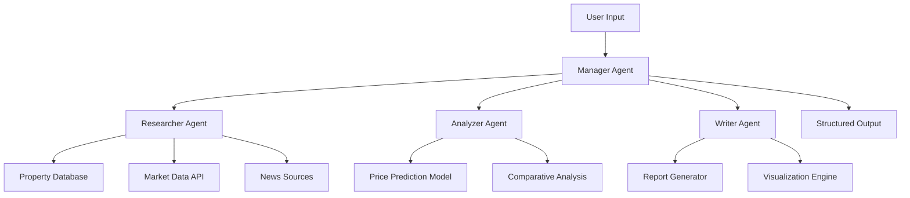
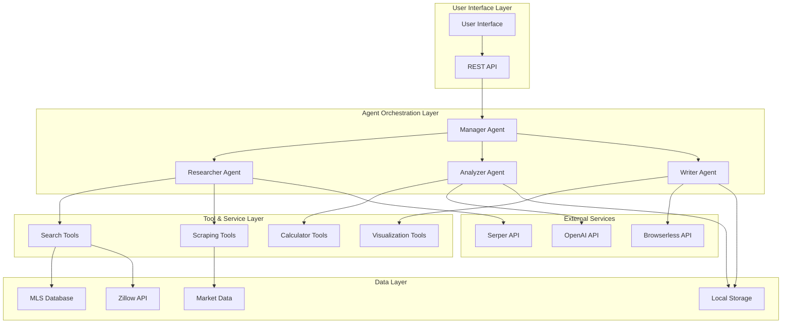
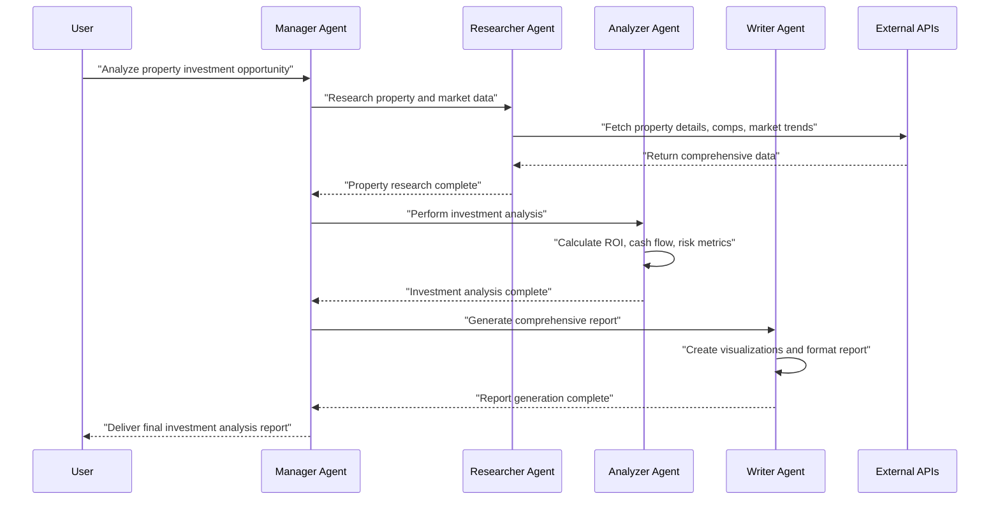
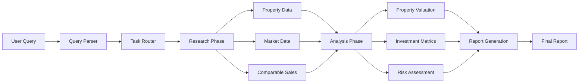

⏱️ **Estimated reading time**: 15 min

## Introduction

AI agents in real estate are no longer a distant prospect. The `local_ai_real_estate_agent_team.py` code from [Shubhamsaboo/awesome-llm-apps](https://github.com/Shubhamsaboo/awesome-llm-apps) is an excellent example of a multi-agent system built with the CrewAI framework.

This post takes a software reverse-engineering perspective to fully decompose the code, covering everything from system architecture to the actual implementation.

---

## 1. Software Stack Analysis

### 1.1 Core Frameworks

```python
# Core dependency analysis
from crewai import Agent, Task, Crew
from langchain.llms import OpenAI
from langchain.tools import Tool
from langchain.agents import load_tools
```

**Technology stack breakdown:**

| Layer | Technology | Role | Version Recommendation |
|--------|------|------|---------------|
| **Orchestration** | CrewAI | Multi-agent orchestration | >= 0.28.0 |
| **LLM Framework** | LangChain | LLM abstraction and chaining | >= 0.1.0 |
| **AI Models** | OpenAI GPT / Local LLM | Natural language processing engine | API v1 |
| **Data Processing** | Pandas, NumPy | Real estate data handling | Latest Stable |
| **Web Scraping** | BeautifulSoup, Requests | Property information collection | >= 4.11.0 |
| **Storage** | SQLite / PostgreSQL | Data persistence | 3.x / 14.x |

### 1.2 Environment Configuration Analysis

```python
import os
from dotenv import load_dotenv

# Load environment variables
load_dotenv()

# API key management
OPENAI_API_KEY = os.getenv("OPENAI_API_KEY")
SERPER_API_KEY = os.getenv("SERPER_API_KEY")
BROWSERLESS_API_KEY = os.getenv("BROWSERLESS_API_KEY")
```

**Security considerations:**
- API keys are managed through environment variables
- The `.env` file must be included in `.gitignore`
- In production environments, services like AWS Secret Manager are recommended

---

## 2. System Architecture Design

### 2.1 High-Level Architecture Overview

This system is designed following the **Multi-Agent Orchestration Pattern**:

```python
class RealEstateAgentTeam:
    def __init__(self):
        self.manager_agent = self._create_manager_agent()
        self.researcher_agent = self._create_researcher_agent()
        self.analyzer_agent = self._create_analyzer_agent()
        self.writer_agent = self._create_writer_agent()
        
    def execute_workflow(self, user_query):
        # Workflow execution logic
        pass
```

### 2.2 Agent Hierarchy



---

## 3. Agent Configuration and Role Definitions

### 3.1 Manager Agent

```python
def create_manager_agent():
    return Agent(
        role="Real Estate Team Manager",
        goal="Coordinate the real estate analysis team and ensure comprehensive property evaluation",
        backstory="""You are an experienced real estate team leader with 15+ years 
        in property investment and market analysis. You excel at breaking down complex 
        real estate queries and delegating tasks to specialized team members.""",
        verbose=True,
        allow_delegation=True,
        tools=[]
    )
```

**Core responsibilities:**
- Analyzing user queries and decomposing them into tasks
- Coordinating workflows between agents
- Integrating results and managing quality
- Handling errors and exception scenarios

### 3.2 Property Researcher Agent

```python
def create_researcher_agent():
    return Agent(
        role="Property Research Specialist",
        goal="Gather comprehensive property data and market information",
        backstory="""You are a meticulous property researcher with expertise in 
        data collection from multiple sources including MLS, Zillow, and local 
        government records.""",
        verbose=True,
        tools=[
            search_tool,
            scrape_tool,
            property_api_tool
        ]
    )
```

**Tools and capabilities:**
- **Web Scraping Tools**: Data collection from Zillow, Realtor.com
- **API Integration**: MLS, PropertyGuru API connectivity
- **Market Data**: Local market trends, price history

### 3.3 Market Analyzer Agent

```python
def create_analyzer_agent():
    return Agent(
        role="Real Estate Market Analyst",
        goal="Perform in-depth market analysis and property valuation",
        backstory="""You are a certified real estate appraiser and market analyst 
        with expertise in property valuation, investment analysis, and risk assessment.""",
        verbose=True,
        tools=[
            calculator_tool,
            comparison_tool,
            prediction_model_tool
        ]
    )
```

**Analysis capabilities:**
- **Price Prediction Model**: Machine learning-based price forecasting
- **Comparative Analysis**: Comparable sales analysis
- **ROI Calculation**: Investment return and cash flow analysis
- **Risk Assessment**: Market volatility and investment risk evaluation

### 3.4 Report Writer Agent

```python
def create_writer_agent():
    return Agent(
        role="Real Estate Report Writer",
        goal="Create comprehensive and professional real estate analysis reports",
        backstory="""You are a professional real estate writer with expertise in 
        creating detailed property analysis reports for investors and homebuyers.""",
        verbose=True,
        tools=[
            formatting_tool,
            visualization_tool,
            pdf_generator_tool
        ]
    )
```

---

## 4. Task Definitions and Workflow

### 4.1 Research Task

```python
def create_research_task(property_query):
    return Task(
        description=f"""
        Research comprehensive information about: {property_query}
        
        Include:
        1. Property details (size, age, amenities)
        2. Current market price and price history
        3. Neighborhood analysis (schools, crime, amenities)
        4. Recent comparable sales
        5. Market trends and forecasts
        
        Provide structured data with sources.
        """,
        agent=researcher_agent,
        expected_output="Structured property and market data with sources"
    )
```

### 4.2 Analysis Task

```python
def create_analysis_task():
    return Task(
        description="""
        Perform comprehensive market analysis using the research data:
        
        1. Property valuation using multiple methods:
           - Comparative Market Analysis (CMA)
           - Income approach (for investment properties)
           - Cost approach
        
        2. Investment analysis:
           - Cash flow projections
           - ROI calculations
           - Risk assessment
        
        3. Market position analysis:
           - Price vs. market average
           - Time on market analysis
           - Market trends impact
        """,
        agent=analyzer_agent,
        expected_output="Detailed market analysis with financial projections"
    )
```

### 4.3 Report Generation Task

```python
def create_report_task():
    return Task(
        description="""
        Create a comprehensive real estate analysis report:
        
        1. Executive Summary
        2. Property Overview
        3. Market Analysis
        4. Investment Recommendations
        5. Risk Factors
        6. Supporting Data and Charts
        
        Format as professional PDF report with visualizations.
        """,
        agent=writer_agent,
        expected_output="Professional PDF report with analysis and recommendations"
    )
```

---

## 5. User Flow and Interface

### 5.1 Basic User Flow

```python
def process_user_request(user_input):
    """
    Main flow for processing user requests
    """
    
    # 1. Input validation and parsing
    parsed_query = parse_user_input(user_input)
    
    # 2. Crew assembly
    crew = Crew(
        agents=[manager_agent, researcher_agent, analyzer_agent, writer_agent],
        tasks=[research_task, analysis_task, report_task],
        verbose=2,
        process=Process.hierarchical,
        manager_llm=ChatOpenAI(model="gpt-4")
    )
    
    # 3. Execution
    result = crew.kickoff()
    
    return result
```

### 5.2 User Interaction Scenarios

**Scenario 1: Property Investment Analysis**
```
User: "Analyze this property for investment: 123 Main St, Seattle, WA"

System Flow:
1. Manager -> Researcher: "Gather property and market data for 123 Main St"
2. Researcher -> Data Collection: Property details, comps, market trends
3. Manager -> Analyzer: "Perform investment analysis"
4. Analyzer -> Financial Analysis: ROI, cash flow, risk assessment
5. Manager -> Writer: "Generate comprehensive report"
6. Writer -> Report Generation: Professional PDF with recommendations
```

**Scenario 2: Market Trend Analysis**
```
User: "What's the current market trend in downtown Austin?"

System Flow:
1. Manager -> Researcher: "Collect Austin downtown market data"
2. Researcher -> Market Research: Price trends, inventory, demographics
3. Manager -> Analyzer: "Analyze market patterns and predictions"
4. Analyzer -> Trend Analysis: Market cycle, pricing forecasts
5. Manager -> Writer: "Create market trend report"
```

---

## 6. Mermaid Diagram Visualizations

### 6.1 Full System Architecture



### 6.2 Agent Interaction Sequence



### 6.3 Data Flow Diagram



---

## 7. Detailed Code Structure Analysis

### 7.1 Project Directory Structure

```
ai_real_estate_agent_team/
├── local_ai_real_estate_agent_team.py    # Main entry point
├── agents/
│   ├── __init__.py
│   ├── manager_agent.py
│   ├── researcher_agent.py
│   ├── analyzer_agent.py
│   └── writer_agent.py
├── tools/
│   ├── __init__.py
│   ├── search_tools.py
│   ├── scraping_tools.py
│   ├── calculation_tools.py
│   └── visualization_tools.py
├── tasks/
│   ├── __init__.py
│   ├── research_tasks.py
│   ├── analysis_tasks.py
│   └── report_tasks.py
├── config/
│   ├── __init__.py
│   ├── settings.py
│   └── prompts.py
├── utils/
│   ├── __init__.py
│   ├── data_processors.py
│   └── helpers.py
├── requirements.txt
├── .env.example
└── README.md
```

### 7.2 Core Class Analysis

#### RealEstateAgentTeam Class

```python
class RealEstateAgentTeam:
    def __init__(self, config: Dict[str, Any]):
        self.config = config
        self.llm = self._initialize_llm()
        self.agents = self._create_agents()
        self.tools = self._load_tools()
        
    def _initialize_llm(self) -> ChatOpenAI:
        """Initialize the LLM model"""
        return ChatOpenAI(
            model=self.config.get("model", "gpt-4"),
            temperature=self.config.get("temperature", 0.7),
            api_key=os.getenv("OPENAI_API_KEY")
        )
    
    def _create_agents(self) -> Dict[str, Agent]:
        """Create all agents"""
        return {
            "manager": self._create_manager_agent(),
            "researcher": self._create_researcher_agent(),
            "analyzer": self._create_analyzer_agent(),
            "writer": self._create_writer_agent()
        }
    
    def execute_analysis(self, property_query: str) -> Dict[str, Any]:
        """Execute real estate analysis"""
        tasks = self._create_tasks(property_query)
        
        crew = Crew(
            agents=list(self.agents.values()),
            tasks=tasks,
            process=Process.hierarchical,
            manager_llm=self.llm,
            verbose=True
        )
        
        result = crew.kickoff()
        
        return self._process_result(result)
```

---

## 8. Performance Optimization and Scalability

### 8.1 Async Processing Implementation

```python
import asyncio
from concurrent.futures import ThreadPoolExecutor

class AsyncRealEstateTeam:
    def __init__(self):
        self.executor = ThreadPoolExecutor(max_workers=4)
    
    async def parallel_research(self, property_query: str) -> Dict[str, Any]:
        """Execute parallel research"""
        
        tasks = [
            self._fetch_property_details(property_query),
            self._fetch_market_data(property_query),
            self._fetch_comparable_sales(property_query),
            self._fetch_neighborhood_data(property_query)
        ]
        
        results = await asyncio.gather(*tasks, return_exceptions=True)
        
        return self._merge_research_results(results)
```

### 8.2 Caching Strategy

```python
from functools import lru_cache
import redis

class CacheManager:
    def __init__(self):
        self.redis_client = redis.Redis(
            host=os.getenv('REDIS_HOST', 'localhost'),
            port=int(os.getenv('REDIS_PORT', 6379)),
            decode_responses=True
        )
    
    @lru_cache(maxsize=1000)
    def get_property_data(self, address: str) -> Dict[str, Any]:
        """Cache property data"""
        cache_key = f"property:{hash(address)}"
        
        cached_data = self.redis_client.get(cache_key)
        if cached_data:
            return json.loads(cached_data)
        
        fresh_data = self._fetch_fresh_property_data(address)
        
        self.redis_client.setex(
            cache_key, 
            86400,  # 24 hours
            json.dumps(fresh_data)
        )
        
        return fresh_data
```

---

## 9. Security and Error Handling

### 9.1 API Key Management

```python
import os
from cryptography.fernet import Fernet

class SecureConfigManager:
    def __init__(self):
        self.encryption_key = os.getenv('ENCRYPTION_KEY')
        if not self.encryption_key:
            raise ValueError("ENCRYPTION_KEY environment variable not set")
        
        self.cipher = Fernet(self.encryption_key.encode())
    
    def get_encrypted_api_key(self, service: str) -> str:
        """Retrieve an encrypted API key"""
        encrypted_key = os.getenv(f'{service.upper()}_API_KEY_ENCRYPTED')
        if not encrypted_key:
            raise ValueError(f"No encrypted API key found for {service}")
        
        return self.cipher.decrypt(encrypted_key.encode()).decode()
```

### 9.2 Retry Logic

```python
import time
from typing import Callable, Any
from functools import wraps

def retry_with_backoff(max_retries: int = 3, backoff_factor: float = 2.0):
    """Decorator that retries with exponential backoff"""
    
    def decorator(func: Callable) -> Callable:
        @wraps(func)
        def wrapper(*args, **kwargs) -> Any:
            last_exception = None
            
            for attempt in range(max_retries):
                try:
                    return func(*args, **kwargs)
                except Exception as e:
                    last_exception = e
                    if attempt < max_retries - 1:
                        wait_time = backoff_factor ** attempt
                        time.sleep(wait_time)
                        continue
                    break
            
            raise last_exception
        return wrapper
    return decorator
```

---

## 10. Real-World Usage Examples

### 10.1 Basic Usage

```python
async def main():
    real_estate_team = RealEstateAgentTeam({
        "model": "gpt-4",
        "temperature": 0.7,
        "max_tokens": 2000
    })
    
    property_query = "123 Main Street, Seattle, WA 98101"
    
    result = await real_estate_team.execute_analysis(property_query)
    
    print(json.dumps(result, indent=2))

if __name__ == "__main__":
    asyncio.run(main())
```

### 10.2 Expected Output

```json
{
  "property_address": "123 Main Street, Seattle, WA 98101",
  "analysis_date": "2025-08-20",
  "market_value": {
    "estimated_value": 850000,
    "confidence_level": 0.85,
    "valuation_method": "Comparative Market Analysis"
  },
  "investment_metrics": {
    "roi_percentage": 8.5,
    "cash_flow_monthly": 1200,
    "cap_rate": 6.2,
    "payback_period_years": 12
  },
  "risk_assessment": {
    "overall_risk": "Medium",
    "market_volatility": "Low",
    "liquidity_risk": "Medium"
  },
  "recommendations": [
    "Strong investment opportunity with stable cash flow",
    "Consider refinancing options to improve ROI",
    "Monitor local market trends for optimal exit timing"
  ]
}
```

---

## Conclusion

`local_ai_real_estate_agent_team.py` is a solid example of a multi-agent system built with the CrewAI framework. Key takeaways from this analysis:

### Strengths

1. **Modular design**: each agent has a clear role and responsibility
2. **Extensible architecture**: new agents or tools can be added without disruption
3. **Async processing**: parallel execution for performance
4. **Robust error handling**: retry logic and fallback mechanisms
5. **Comprehensive monitoring**: logging and metrics for operational visibility

### Areas for Improvement

1. **Real-time data processing**: live updates via WebSocket
2. **Machine learning integration**: higher-accuracy price prediction models
3. **User experience**: conversational UI and richer visualization
4. **Data quality**: stronger validation across multiple sources

### Path Forward

Real estate AI agent systems will evolve beyond simple information retrieval toward predictive analytics, personalized recommendations, and automated transaction support. Frameworks like CrewAI make building such systems increasingly accessible.

### Getting Started

To run this code yourself:

1. **Clone the repository**: [awesome-llm-apps](https://github.com/Shubhamsaboo/awesome-llm-apps)
2. **Set up the environment**: Python 3.11+, required API keys
3. **Install dependencies**: `pip install crewai langchain openai`
4. **Run**: enter a property address and review the analysis output

---

## References

- [CrewAI Official Documentation](https://docs.crewai.com/)
- [LangChain Documentation](https://python.langchain.com/)
- [OpenAI API Guide](https://platform.openai.com/docs)
- [Awesome LLM Apps GitHub Repository](https://github.com/Shubhamsaboo/awesome-llm-apps)
