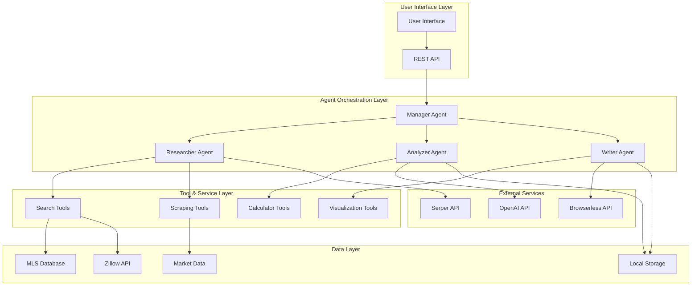
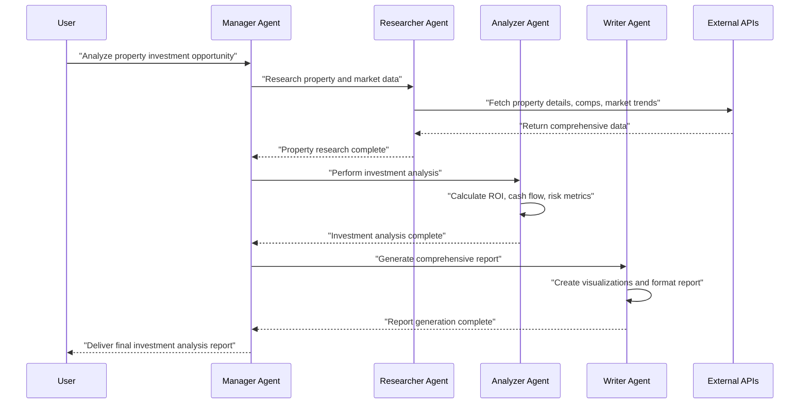

⏱️ **Estimated reading time**: 15 min

## Introduction

AI agents in real estate are no longer a distant prospect. The `local_ai_real_estate_agent_team.py` code from [Shubhamsaboo/awesome-llm-apps](https://github.com/Shubhamsaboo/awesome-llm-apps) is an excellent example of a multi-agent system built with the CrewAI framework.

This post takes a software reverse-engineering perspective to fully decompose the code, covering everything from system architecture to the actual implementation.

---

## 1. Software Stack Analysis

### 1.1 Core Frameworks

```python
# Core dependency analysis
from crewai import Agent, Task, Crew
from langchain.llms import OpenAI
from langchain.tools import Tool
from langchain.agents import load_tools
```

**Technology stack breakdown:**

| Layer | Technology | Role | Version Recommendation |
|--------|------|------|---------------|
| **Orchestration** | CrewAI | Multi-agent orchestration | >= 0.28.0 |
| **LLM Framework** | LangChain | LLM abstraction and chaining | >= 0.1.0 |
| **AI Models** | OpenAI GPT / Local LLM | Natural language processing engine | API v1 |
| **Data Processing** | Pandas, NumPy | Real estate data handling | Latest Stable |
| **Web Scraping** | BeautifulSoup, Requests | Property information collection | >= 4.11.0 |
| **Storage** | SQLite / PostgreSQL | Data persistence | 3.x / 14.x |

### 1.2 Environment Configuration Analysis

```python
import os
from dotenv import load_dotenv

# Load environment variables
load_dotenv()

# API key management
OPENAI_API_KEY = os.getenv("OPENAI_API_KEY")
SERPER_API_KEY = os.getenv("SERPER_API_KEY")
BROWSERLESS_API_KEY = os.getenv("BROWSERLESS_API_KEY")
```

**Security considerations:**
- API keys are managed through environment variables
- The `.env` file must be included in `.gitignore`
- In production environments, services like AWS Secret Manager are recommended

---

## 2. System Architecture Design

### 2.1 High-Level Architecture Overview

This system is designed following the **Multi-Agent Orchestration Pattern**:

```python
class RealEstateAgentTeam:
    def __init__(self):
        self.manager_agent = self._create_manager_agent()
        self.researcher_agent = self._create_researcher_agent()
        self.analyzer_agent = self._create_analyzer_agent()
        self.writer_agent = self._create_writer_agent()
        
    def execute_workflow(self, user_query):
        # Workflow execution logic
        pass
```

### 2.2 Agent Hierarchy


<!--
  animated-architecture-diagram — self-contained D3 embed template.
  HuggingFace research-article style: declarative NODES/EDGES/SEQ model,
  data(solid)/event(dashed) edges, hover-trace + tooltip, flow-dot animation
  along edge paths, replay button, scroll-into-view autoplay, reduced-motion +
  light/dark aware. The renderer injects window.__ARCH_SPEC__ at the marker.
  Format (D3 machinery + CSS) is owned by this committed template; the model
  only authors the JSON spec (content). See references/spec-schema.md.
-->
<div class="d3-arch" data-arch-root id="eagentteamcrewaianalysis-1"></div>
<style>
  /* ---- Theme tokens (standalone; light default + dark override) ---- */
  .d3-arch {
    --page-bg: #ffffff;
    --surface-bg: #f7f8fa;
    --text-color: #1a1d21;
    --muted-color: #6b7280;
    --border-color: #d5d9e0;
    --primary-color: hsl(217 91% 55%); /* brand accent — swap for #1B4F72 etc. */
    position: relative;
    font-family: -apple-system, BlinkMacSystemFont, "Segoe UI", "Noto Sans KR", system-ui, sans-serif;
    color: var(--text-color);
  }
  @media (prefers-color-scheme: dark) {
    .d3-arch {
      --page-bg: #0f1115;
      --surface-bg: #171a21;
      --text-color: #e6e8eb;
      --muted-color: #9aa3af;
      --border-color: #2a2f3a;
      --primary-color: hsl(217 91% 62%);
    }
  }
  .d3-arch[data-theme="light"] { --page-bg:#fff; --surface-bg:#f7f8fa; --text-color:#1a1d21; --muted-color:#6b7280; --border-color:#d5d9e0; --primary-color:hsl(217 91% 55%); }
  .d3-arch[data-theme="dark"]  { --page-bg:#0f1115; --surface-bg:#171a21; --text-color:#e6e8eb; --muted-color:#9aa3af; --border-color:#2a2f3a; --primary-color:hsl(217 91% 62%); }

  .d3-arch .diagram-scroll { overflow-x: auto; }
  /* Size to the spec's natural canvas: JS caps max-width at the spec width so a
     narrow/portrait diagram is never stretched to the article column (blur + giant
     vertical figures); wide diagrams scale down but keep min-width 760 + scroll. */
  .d3-arch svg { display: block; width: 100%; max-width: 100%; height: auto; font-family: inherit; }

  /* Group boxes */
  .d3-arch .group rect { fill: none; stroke: var(--border-color); stroke-dasharray: 3 3; rx: 12px; }
  .d3-arch .group text { font-size: 10px; font-weight: 700; letter-spacing: 0.08em; text-transform: uppercase; fill: var(--muted-color); }

  /* Nodes */
  .d3-arch .node rect { fill: var(--surface-bg); stroke: var(--border-color); stroke-width: 1; transition: stroke 0.15s ease, opacity 0.15s ease; }
  .d3-arch .node .node-title { font-size: 12px; font-weight: 600; fill: var(--text-color); }
  .d3-arch .node .node-sub { font-size: 9.5px; fill: var(--muted-color); }
  .d3-arch .node { cursor: default; transition: opacity 0.15s ease; }

  /* Edges */
  .d3-arch .edge { transition: opacity 0.15s ease; }
  .d3-arch .edge path.main { fill: none; stroke-width: 1.5; }
  .d3-arch .edge.data path.main { stroke: var(--primary-color); }
  .d3-arch .edge.event path.main { stroke: var(--muted-color); stroke-dasharray: 5 4; }
  .d3-arch .edge text { font-size: 9.5px; fill: var(--muted-color); paint-order: stroke; stroke: var(--page-bg); stroke-width: 3px; stroke-linejoin: round; }

  /* Hover highlighting */
  .d3-arch.hovering .edge:not(.hl) { opacity: 0.12; }
  .d3-arch.hovering .node:not(.hl):not(.nb) { opacity: 0.25; }
  .d3-arch .node.hl rect { stroke: var(--primary-color); stroke-width: 1.5; }

  /* Flow animation */
  .d3-arch .flow-dot.data { fill: var(--primary-color); stroke: var(--page-bg); stroke-width: 1.5; }
  .d3-arch .flow-dot.event { fill: var(--page-bg); stroke: var(--muted-color); stroke-width: 1.5; }
  .d3-arch .node.anim-hl rect { stroke: var(--primary-color); stroke-width: 1.5; }
  .d3-arch .replay-btn { font: inherit; font-size: 11px; font-weight: 600; padding: 4px 10px; border: 1px solid var(--border-color); border-radius: 8px; background: var(--surface-bg); color: var(--text-color); cursor: pointer; transition: border-color 0.15s ease, opacity 0.15s ease; }
  .d3-arch .replay-btn:hover:not(:disabled) { border-color: var(--primary-color); }
  .d3-arch .replay-btn:disabled { opacity: 0.45; cursor: default; }
  .d3-arch .replay-btn:focus-visible { outline: 2px solid var(--primary-color); outline-offset: 1px; }

  /* Legend */
  .d3-arch .legend { display: flex; flex-direction: column; align-items: flex-start; gap: 6px; margin-top: 10px; }
  .d3-arch .legend-title { font-size: 12px; font-weight: 700; color: var(--text-color); }
  .d3-arch .legend .items { display: flex; flex-wrap: wrap; gap: 8px 18px; align-items: center; }
  .d3-arch .legend .item { display: inline-flex; align-items: center; gap: 7px; white-space: nowrap; font-size: 12px; color: var(--text-color); }
  .d3-arch .legend .swatch { width: 22px; height: 0; }
  .d3-arch .legend .swatch.data-line { border-top: 2.5px solid var(--primary-color); }
  .d3-arch .legend .swatch.event-line { border-top: 2.5px dashed var(--muted-color); }
  .d3-arch .legend .hint { font-size: 11px; font-style: italic; color: var(--muted-color); }
</style>
<script>
  (() => {
    const SPEC = ({"title": "", "ariaLabel": "", "width": 864, "height": 759, "legendTitle": "Legend", "hint": "Hover a node to trace its connections.", "groups": [], "nodes": [{"id": "U", "x": 24, "y": 226, "w": 120, "h": 46, "title": "User Input"}, {"id": "M", "x": 222, "y": 226, "w": 121, "h": 46, "title": "Manager Agent"}, {"id": "R", "x": 425, "y": 580, "w": 142, "h": 46, "title": "Researcher Agent"}, {"id": "A", "x": 432, "y": 327, "w": 128, "h": 46, "title": "Analyzer Agent"}, {"id": "W", "x": 436, "y": 125, "w": 120, "h": 46, "title": "Writer Agent"}, {"id": "DS1", "x": 666, "y": 681, "w": 149, "h": 46, "title": "Property Database"}, {"id": "DS2", "x": 673, "y": 580, "w": 135, "h": 46, "title": "Market Data API"}, {"id": "DS3", "x": 680, "y": 479, "w": 120, "h": 46, "title": "News Sources"}, {"id": "ML", "x": 648, "y": 378, "w": 184, "h": 46, "title": "Price Prediction Model"}, {"id": "COMP", "x": 655, "y": 277, "w": 170, "h": 46, "title": "Comparative Analysis"}, {"id": "RPT", "x": 669, "y": 176, "w": 142, "h": 46, "title": "Report Generator"}, {"id": "VIS", "x": 655, "y": 75, "w": 170, "h": 46, "title": "Visualization Engine"}, {"id": "OUT", "x": 421, "y": 24, "w": 149, "h": 46, "title": "Structured Output"}], "edges": [{"src": "U", "dst": "M", "kind": "data", "line": [144, 249, 222, 249]}, {"src": "M", "dst": "R", "kind": "data", "curve": [[289, 272], [382, 603], [382, 603], [425, 603]]}, {"src": "M", "dst": "A", "kind": "data", "curve": [[305, 272], [382, 350], [382, 350], [432, 350]]}, {"src": "M", "dst": "W", "kind": "data", "curve": [[305, 226], [382, 148], [382, 148], [436, 148]]}, {"src": "R", "dst": "DS1", "kind": "data", "curve": [[521, 626], [609, 704], [609, 704], [666, 704]]}, {"src": "R", "dst": "DS2", "kind": "data", "line": [567, 603, 673, 603]}, {"src": "R", "dst": "DS3", "kind": "data", "curve": [[521, 580], [609, 502], [609, 502], [680, 502]]}, {"src": "A", "dst": "ML", "kind": "data", "curve": [[547, 373], [609, 401], [609, 401], [648, 401]]}, {"src": "A", "dst": "COMP", "kind": "data", "curve": [[547, 327], [609, 300], [609, 300], [655, 300]]}, {"src": "W", "dst": "RPT", "kind": "data", "curve": [[547, 171], [609, 199], [609, 199], [669, 199]]}, {"src": "W", "dst": "VIS", "kind": "data", "curve": [[547, 125], [609, 98], [609, 98], [655, 98]]}, {"src": "M", "dst": "OUT", "kind": "data", "curve": [[294, 226], [382, 47], [382, 47], [421, 47]]}]});
    const ensureD3 = (cb) => {
      if (window.d3 && typeof window.d3.select === 'function') return cb();
      let s = document.getElementById('d3-cdn-script');
      if (!s) {
        s = document.createElement('script');
        s.id = 'd3-cdn-script';
        s.src = 'https://cdn.jsdelivr.net/npm/d3@7/dist/d3.min.js';
        document.head.appendChild(s);
      }
      const onReady = () => { if (window.d3 && typeof window.d3.select === 'function') cb(); };
      s.addEventListener('load', onReady, { once: true });
      if (window.d3) onReady();
    };

    const bootstrap = () => {
      const container = document.getElementById('eagentteamcrewaianalysis-1')
        || document.querySelector('.d3-arch[data-arch-root]:not([data-mounted])');
      if (!container || (container.dataset && container.dataset.mounted === 'true')) return;
      if (container.dataset) container.dataset.mounted = 'true';

      try {
        const uid = 'eagentteamcrewaianalysis-1';
        const NODES = SPEC.nodes || [];
        const EDGES = SPEC.edges || [];
        const GROUPS = SPEC.groups || [];
        const HOP = SPEC.hop || 800;
        const legendCfg = SPEC.legend || {};
        const dataLabel = legendCfg.data || 'Data path';
        const eventLabel = legendCfg.event || 'Event side-channel';

        const byId = Object.fromEntries(NODES.map((n) => [n.id, n]));
        const cx = (n) => n.x + n.w / 2;
        const asTitle = (t) => Array.isArray(t) ? t : [t];

        // Canvas: explicit, else auto from node/group extents + padding
        let W = SPEC.width, H = SPEC.height;
        if (!W || !H) {
          const xs = [], ys = [];
          NODES.forEach((n) => { xs.push(n.x + n.w); ys.push(n.y + n.h); });
          GROUPS.forEach((g) => { xs.push(g.x + g.w); ys.push(g.y + g.h); });
          W = W || Math.max(760, Math.ceil(Math.max(...xs, 0) + 24));
          H = H || Math.ceil(Math.max(...ys, 0) + 20);
        }

        // Tooltip
        container.style.position = container.style.position || 'relative';
        const tip = document.createElement('div');
        Object.assign(tip.style, {
          position: 'absolute', top: '0px', left: '0px',
          transform: 'translate(-9999px, -9999px)', pointerEvents: 'none',
          padding: '8px 10px', borderRadius: '8px', fontSize: '12px', lineHeight: '1.4',
          border: '1px solid var(--border-color)', background: 'var(--surface-bg)',
          color: 'var(--text-color)', boxShadow: '0 4px 24px rgba(0,0,0,.18)',
          opacity: '0', transition: 'opacity .12s ease', maxWidth: '260px', zIndex: '3'
        });
        const tipInner = document.createElement('div');
        tip.appendChild(tipInner);

        const scroll = document.createElement('div');
        scroll.className = 'diagram-scroll';
        container.appendChild(scroll);

        const svg = d3.select(scroll).append('svg')
          .attr('viewBox', `0 0 ${W} ${H}`)
          .attr('preserveAspectRatio', 'xMidYMid meet')
          .attr('role', 'img')
          .attr('aria-label', SPEC.ariaLabel || SPEC.title || 'Architecture diagram');
        // Never upscale past the spec's natural width; keep 760px readability
        // floor (with horizontal scroll) only for diagrams that are actually wide.
        svg.style('max-width', W + 'px').style('min-width', Math.min(W, 760) + 'px').style('margin', '0 auto');

        const defs = svg.append('defs');
        const mkMarker = (id, color) => {
          defs.append('marker')
            .attr('id', id).attr('viewBox', '0 0 10 10')
            .attr('refX', 9).attr('refY', 5)
            .attr('markerWidth', 6.5).attr('markerHeight', 6.5)
            .attr('orient', 'auto-start-reverse')
            .append('path').attr('d', 'M 0 0 L 10 5 L 0 10 z').style('fill', color);
        };
        mkMarker(`${uid}-arrow-data`, 'var(--primary-color)');
        mkMarker(`${uid}-arrow-event`, 'var(--muted-color)');

        // Groups
        const groups = svg.append('g');
        GROUPS.forEach((gr) => {
          const g = groups.append('g').attr('class', 'group');
          g.append('rect').attr('x', gr.x).attr('y', gr.y).attr('width', gr.w).attr('height', gr.h).attr('rx', 12);
          if (gr.label) g.append('text').attr('x', gr.lx != null ? gr.lx : gr.x + 12).attr('y', gr.ly != null ? gr.ly : gr.y + 18).text(gr.label);
        });

        // Edges (under nodes)
        const edgeLayer = svg.append('g');
        const curvePath = (p) => `M ${p[0][0]} ${p[0][1]} C ${p[1][0]} ${p[1][1]}, ${p[2][0]} ${p[2][1]}, ${p[3][0]} ${p[3][1]}`;
        EDGES.forEach((e, i) => {
          const kind = e.kind === 'event' ? 'event' : 'data';
          const g = edgeLayer.append('g').attr('class', `edge ${kind}`).attr('data-src', e.src).attr('data-dst', e.dst);
          const marker = `url(#${uid}-arrow-${kind})`;
          if (e.line) {
            const [x1, y1, x2, y2] = e.line;
            e.pathEl = g.append('path').attr('class', 'main').attr('d', `M ${x1} ${y1} L ${x2} ${y2}`).attr('marker-end', marker).node();
            if (e.label) g.append('text').attr('x', e.lx != null ? e.lx : (x1 + x2) / 2).attr('y', e.ly != null ? e.ly : (y1 + y2) / 2 - 6).attr('text-anchor', e.anchor || 'middle').text(e.label);
          } else if (e.curve) {
            e.pathEl = g.append('path').attr('class', 'main').attr('d', curvePath(e.curve)).attr('marker-end', marker).node();
            if (e.label && e.off) {
              const p = e.curve;
              const lp = p[3][0] < p[0][0] ? [p[3], p[2], p[1], p[0]] : p;
              const lpId = `${uid}-lbl-${i}`;
              g.append('path').attr('id', lpId).attr('d', curvePath(lp)).attr('fill', 'none').attr('stroke', 'none');
              g.append('text').attr('dy', -5).append('textPath').attr('href', `#${lpId}`).attr('startOffset', e.off).attr('text-anchor', 'middle').text(e.label);
            } else if (e.label) {
              g.append('text').attr('x', e.lx).attr('y', e.ly).attr('text-anchor', e.anchor || 'start').text(e.label);
            }
          }
        });

        // Nodes (over edges)
        const nodeLayer = svg.append('g');
        NODES.forEach((n) => {
          const g = nodeLayer.append('g').attr('class', 'node').attr('data-id', n.id);
          g.append('rect').attr('x', n.x).attr('y', n.y).attr('width', n.w).attr('height', n.h).attr('rx', 9);
          const title = asTitle(n.title);
          const lines = title.length;
          const baseY = n.y + n.h / 2 - (lines - 1) * 7 - (n.sub ? 5 : -4);
          title.forEach((t, li) => {
            g.append('text').attr('class', 'node-title').attr('x', cx(n)).attr('y', baseY + li * 14).attr('text-anchor', 'middle').text(t);
          });
          if (n.sub) g.append('text').attr('class', 'node-sub').attr('x', cx(n)).attr('y', baseY + (lines - 1) * 14 + 15).attr('text-anchor', 'middle').text(n.sub);
        });

        // Hover highlighting
        const edgeSel = svg.selectAll('.edge');
        const nodeSel = svg.selectAll('.node');
        nodeSel
          .on('mouseenter', function () {
            const id = this.getAttribute('data-id');
            const n = byId[id];
            container.classList.add('hovering');
            const nb = new Set([id]);
            edgeSel.classed('hl', function () {
              const hit = this.getAttribute('data-src') === id || this.getAttribute('data-dst') === id;
              if (hit) { nb.add(this.getAttribute('data-src')); nb.add(this.getAttribute('data-dst')); }
              return hit;
            });
            nodeSel.classed('hl', function () { return this.getAttribute('data-id') === id; })
                   .classed('nb', function () { return nb.has(this.getAttribute('data-id')); });
            if (n && n.desc) { tipInner.innerHTML = `<strong>${asTitle(n.title).join('')}</strong><br>${n.desc}`; tip.style.opacity = '1'; }
          })
          .on('mousemove', function (event) {
            const [mx, my] = d3.pointer(event, container);
            const flip = mx > container.clientWidth - 280;
            tip.style.transform = `translate(${flip ? mx - 270 : mx + 14}px, ${my + 14}px)`;
          })
          .on('mouseleave', function () {
            container.classList.remove('hovering');
            edgeSel.classed('hl', false);
            nodeSel.classed('hl', false).classed('nb', false);
            tip.style.opacity = '0';
            tip.style.transform = 'translate(-9999px, -9999px)';
          });

        // Flow animation sequence: explicit SEQ, else auto forward-cascade of data edges
        const resolveEdge = (s) => {
          if (typeof s.e === 'number') return s.e;
          if (s.from && s.to) return EDGES.findIndex((e) => e.src === s.from && e.dst === s.to);
          return -1;
        };
        let SEQ = (SPEC.seq || []).map((s) => ({ e: resolveEdge(s), t0: s.t0 })).filter((s) => s.e >= 0);
        if (!SEQ.length) {
          let t = 0;
          EDGES.forEach((e, i) => { if ((e.kind || 'data') === 'data') { SEQ.push({ e: i, t0: t }); t += HOP; } });
        }
        const TOTAL = SPEC.total || (Math.max(0, ...SEQ.map((s) => s.t0)) + HOP + 800);

        let playing = false, replayBtn = null;
        const pulseNode = (id) => {
          const sel = nodeSel.filter(function () { return this.getAttribute('data-id') === id; });
          sel.classed('anim-hl', true);
          setTimeout(() => sel.classed('anim-hl', false), 550);
        };
        const play = () => {
          if (playing) return;
          playing = true;
          if (replayBtn) replayBtn.disabled = true;
          const layer = svg.append('g');
          const steps = SEQ.map((s) => {
            const edge = EDGES[s.e];
            return { ...s, edge, len: edge.pathEl.getTotalLength(), dot: null, arrived: false };
          });
          const start = performance.now();
          const frame = (now) => {
            const t = now - start;
            steps.forEach((s) => {
              if (t < s.t0) return;
              const f = Math.min(1, (t - s.t0) / HOP);
              if (f >= 1) { if (s.dot) { s.dot.remove(); s.dot = null; } if (!s.arrived) { s.arrived = true; pulseNode(s.edge.dst); } return; }
              if (!s.dot) s.dot = layer.append('circle').attr('class', `flow-dot ${s.edge.kind || 'data'}`).attr('r', (s.edge.kind === 'event') ? 4 : 5);
              const p = s.edge.pathEl.getPointAtLength(d3.easeCubicInOut(f) * s.len);
              s.dot.attr('cx', p.x).attr('cy', p.y);
            });
            if (t < TOTAL) requestAnimationFrame(frame);
            else { layer.remove(); playing = false; if (replayBtn) replayBtn.disabled = false; }
          };
          requestAnimationFrame(frame);
        };

        // Legend
        const legend = document.createElement('div');
        legend.className = 'legend';
        legend.innerHTML = `
          <div class="legend-title">${SPEC.legendTitle || 'Legend'}</div>
          <div class="items">
            <span class="item"><span class="swatch data-line"></span><span>${dataLabel}</span></span>
            <span class="item"><span class="swatch event-line"></span><span>${eventLabel}</span></span>
            <button class="replay-btn" type="button" aria-label="Replay the flow animation">&#9654; Replay</button>
            <span class="hint">${SPEC.hint || 'Hover a component to trace its connections.'}</span>
          </div>`;
        container.appendChild(legend);
        container.appendChild(tip);
        replayBtn = legend.querySelector('.replay-btn');
        replayBtn.addEventListener('click', play);

        const prefersReduced = window.matchMedia && window.matchMedia('(prefers-reduced-motion: reduce)').matches;
        if (!prefersReduced && window.IntersectionObserver) {
          const io = new IntersectionObserver((entries) => {
            entries.forEach((en) => { if (en.isIntersecting) { io.disconnect(); play(); } });
          }, { threshold: 0.5 });
          io.observe(container);
        }
      } catch (err) {
        const pre = document.createElement('pre');
        pre.style.color = '#c0392b';
        pre.style.fontSize = '12px';
        pre.textContent = 'Failed to render architecture diagram: ' + (err && err.message ? err.message : err);
        container.appendChild(pre);
      }
    };

    if (document.readyState === 'loading') document.addEventListener('DOMContentLoaded', () => ensureD3(bootstrap), { once: true });
    else ensureD3(bootstrap);
  })();
</script>


---

## 3. Agent Configuration and Role Definitions

### 3.1 Manager Agent

```python
def create_manager_agent():
    return Agent(
        role="Real Estate Team Manager",
        goal="Coordinate the real estate analysis team and ensure comprehensive property evaluation",
        backstory="""You are an experienced real estate team leader with 15+ years 
        in property investment and market analysis. You excel at breaking down complex 
        real estate queries and delegating tasks to specialized team members.""",
        verbose=True,
        allow_delegation=True,
        tools=[]
    )
```

**Core responsibilities:**
- Analyzing user queries and decomposing them into tasks
- Coordinating workflows between agents
- Integrating results and managing quality
- Handling errors and exception scenarios

### 3.2 Property Researcher Agent

```python
def create_researcher_agent():
    return Agent(
        role="Property Research Specialist",
        goal="Gather comprehensive property data and market information",
        backstory="""You are a meticulous property researcher with expertise in 
        data collection from multiple sources including MLS, Zillow, and local 
        government records.""",
        verbose=True,
        tools=[
            search_tool,
            scrape_tool,
            property_api_tool
        ]
    )
```

**Tools and capabilities:**
- **Web Scraping Tools**: Data collection from Zillow, Realtor.com
- **API Integration**: MLS, PropertyGuru API connectivity
- **Market Data**: Local market trends, price history

### 3.3 Market Analyzer Agent

```python
def create_analyzer_agent():
    return Agent(
        role="Real Estate Market Analyst",
        goal="Perform in-depth market analysis and property valuation",
        backstory="""You are a certified real estate appraiser and market analyst 
        with expertise in property valuation, investment analysis, and risk assessment.""",
        verbose=True,
        tools=[
            calculator_tool,
            comparison_tool,
            prediction_model_tool
        ]
    )
```

**Analysis capabilities:**
- **Price Prediction Model**: Machine learning-based price forecasting
- **Comparative Analysis**: Comparable sales analysis
- **ROI Calculation**: Investment return and cash flow analysis
- **Risk Assessment**: Market volatility and investment risk evaluation

### 3.4 Report Writer Agent

```python
def create_writer_agent():
    return Agent(
        role="Real Estate Report Writer",
        goal="Create comprehensive and professional real estate analysis reports",
        backstory="""You are a professional real estate writer with expertise in 
        creating detailed property analysis reports for investors and homebuyers.""",
        verbose=True,
        tools=[
            formatting_tool,
            visualization_tool,
            pdf_generator_tool
        ]
    )
```

---

## 4. Task Definitions and Workflow

### 4.1 Research Task

```python
def create_research_task(property_query):
    return Task(
        description=f"""
        Research comprehensive information about: {property_query}
        
        Include:
        1. Property details (size, age, amenities)
        2. Current market price and price history
        3. Neighborhood analysis (schools, crime, amenities)
        4. Recent comparable sales
        5. Market trends and forecasts
        
        Provide structured data with sources.
        """,
        agent=researcher_agent,
        expected_output="Structured property and market data with sources"
    )
```

### 4.2 Analysis Task

```python
def create_analysis_task():
    return Task(
        description="""
        Perform comprehensive market analysis using the research data:
        
        1. Property valuation using multiple methods:
           - Comparative Market Analysis (CMA)
           - Income approach (for investment properties)
           - Cost approach
        
        2. Investment analysis:
           - Cash flow projections
           - ROI calculations
           - Risk assessment
        
        3. Market position analysis:
           - Price vs. market average
           - Time on market analysis
           - Market trends impact
        """,
        agent=analyzer_agent,
        expected_output="Detailed market analysis with financial projections"
    )
```

### 4.3 Report Generation Task

```python
def create_report_task():
    return Task(
        description="""
        Create a comprehensive real estate analysis report:
        
        1. Executive Summary
        2. Property Overview
        3. Market Analysis
        4. Investment Recommendations
        5. Risk Factors
        6. Supporting Data and Charts
        
        Format as professional PDF report with visualizations.
        """,
        agent=writer_agent,
        expected_output="Professional PDF report with analysis and recommendations"
    )
```

---

## 5. User Flow and Interface

### 5.1 Basic User Flow

```python
def process_user_request(user_input):
    """
    Main flow for processing user requests
    """
    
    # 1. Input validation and parsing
    parsed_query = parse_user_input(user_input)
    
    # 2. Crew assembly
    crew = Crew(
        agents=[manager_agent, researcher_agent, analyzer_agent, writer_agent],
        tasks=[research_task, analysis_task, report_task],
        verbose=2,
        process=Process.hierarchical,
        manager_llm=ChatOpenAI(model="gpt-4")
    )
    
    # 3. Execution
    result = crew.kickoff()
    
    return result
```

### 5.2 User Interaction Scenarios

**Scenario 1: Property Investment Analysis**
```
User: "Analyze this property for investment: 123 Main St, Seattle, WA"

System Flow:
1. Manager -> Researcher: "Gather property and market data for 123 Main St"
2. Researcher -> Data Collection: Property details, comps, market trends
3. Manager -> Analyzer: "Perform investment analysis"
4. Analyzer -> Financial Analysis: ROI, cash flow, risk assessment
5. Manager -> Writer: "Generate comprehensive report"
6. Writer -> Report Generation: Professional PDF with recommendations
```

**Scenario 2: Market Trend Analysis**
```
User: "What's the current market trend in downtown Austin?"

System Flow:
1. Manager -> Researcher: "Collect Austin downtown market data"
2. Researcher -> Market Research: Price trends, inventory, demographics
3. Manager -> Analyzer: "Analyze market patterns and predictions"
4. Analyzer -> Trend Analysis: Market cycle, pricing forecasts
5. Manager -> Writer: "Create market trend report"
```

---

## 6. Mermaid Diagram Visualizations

### 6.1 Full System Architecture


```mermaid
graph TB
    subgraph "User Interface Layer"
        UI[User Interface]
        API[REST API]
    end
    
    subgraph "Agent Orchestration Layer"
        M[Manager Agent]
        M --> R[Researcher Agent]
        M --> A[Analyzer Agent]  
        M --> W[Writer Agent]
    end
    
    subgraph "Tool & Service Layer"
        ST[Search Tools]
        SCR[Scraping Tools]
        CALC[Calculator Tools]
        VIS[Visualization Tools]
    end
    
    subgraph "Data Layer"
        MLS[MLS Database]
        ZILLOW[Zillow API]
        MARKET[Market Data]
        LOCAL[Local Storage]
    end
    
    subgraph "External Services"
        OPENAI[OpenAI API]
        SERPER[Serper API]
        BROWSER[Browserless API]
    end
    
    UI --> API
    API --> M
    
    R --> ST
    R --> SCR
    A --> CALC
    W --> VIS
    
    ST --> MLS
    ST --> ZILLOW
    SCR --> MARKET
    
    R --> SERPER
    A --> OPENAI
    W --> BROWSER
    
    A --> LOCAL
    W --> LOCAL
```

### 6.2 Agent Interaction Sequence


```mermaid
sequenceDiagram
    participant U as User
    participant M as Manager Agent
    participant R as Researcher Agent
    participant A as Analyzer Agent
    participant W as Writer Agent
    participant EXT as External APIs

    U->>M: "Analyze property investment opportunity"
    M->>R: "Research property and market data"
    R->>EXT: "Fetch property details, comps, market trends"
    EXT-->>R: "Return comprehensive data"
    R-->>M: "Property research complete"
    
    M->>A: "Perform investment analysis"
    A->>A: "Calculate ROI, cash flow, risk metrics"
    A-->>M: "Investment analysis complete"
    
    M->>W: "Generate comprehensive report"
    W->>W: "Create visualizations and format report"
    W-->>M: "Report generation complete"
    
    M-->>U: "Deliver final investment analysis report"
```

### 6.3 Data Flow Diagram


<!--
  animated-architecture-diagram — self-contained D3 embed template.
  HuggingFace research-article style: declarative NODES/EDGES/SEQ model,
  data(solid)/event(dashed) edges, hover-trace + tooltip, flow-dot animation
  along edge paths, replay button, scroll-into-view autoplay, reduced-motion +
  light/dark aware. The renderer injects window.__ARCH_SPEC__ at the marker.
  Format (D3 machinery + CSS) is owned by this committed template; the model
  only authors the JSON spec (content). See references/spec-schema.md.
-->
<div class="d3-arch" data-arch-root id="eagentteamcrewaianalysis-2"></div>
<style>
  /* ---- Theme tokens (standalone; light default + dark override) ---- */
  .d3-arch {
    --page-bg: #ffffff;
    --surface-bg: #f7f8fa;
    --text-color: #1a1d21;
    --muted-color: #6b7280;
    --border-color: #d5d9e0;
    --primary-color: hsl(217 91% 55%); /* brand accent — swap for #1B4F72 etc. */
    position: relative;
    font-family: -apple-system, BlinkMacSystemFont, "Segoe UI", "Noto Sans KR", system-ui, sans-serif;
    color: var(--text-color);
  }
  @media (prefers-color-scheme: dark) {
    .d3-arch {
      --page-bg: #0f1115;
      --surface-bg: #171a21;
      --text-color: #e6e8eb;
      --muted-color: #9aa3af;
      --border-color: #2a2f3a;
      --primary-color: hsl(217 91% 62%);
    }
  }
  .d3-arch[data-theme="light"] { --page-bg:#fff; --surface-bg:#f7f8fa; --text-color:#1a1d21; --muted-color:#6b7280; --border-color:#d5d9e0; --primary-color:hsl(217 91% 55%); }
  .d3-arch[data-theme="dark"]  { --page-bg:#0f1115; --surface-bg:#171a21; --text-color:#e6e8eb; --muted-color:#9aa3af; --border-color:#2a2f3a; --primary-color:hsl(217 91% 62%); }

  .d3-arch .diagram-scroll { overflow-x: auto; }
  /* Size to the spec's natural canvas: JS caps max-width at the spec width so a
     narrow/portrait diagram is never stretched to the article column (blur + giant
     vertical figures); wide diagrams scale down but keep min-width 760 + scroll. */
  .d3-arch svg { display: block; width: 100%; max-width: 100%; height: auto; font-family: inherit; }

  /* Group boxes */
  .d3-arch .group rect { fill: none; stroke: var(--border-color); stroke-dasharray: 3 3; rx: 12px; }
  .d3-arch .group text { font-size: 10px; font-weight: 700; letter-spacing: 0.08em; text-transform: uppercase; fill: var(--muted-color); }

  /* Nodes */
  .d3-arch .node rect { fill: var(--surface-bg); stroke: var(--border-color); stroke-width: 1; transition: stroke 0.15s ease, opacity 0.15s ease; }
  .d3-arch .node .node-title { font-size: 12px; font-weight: 600; fill: var(--text-color); }
  .d3-arch .node .node-sub { font-size: 9.5px; fill: var(--muted-color); }
  .d3-arch .node { cursor: default; transition: opacity 0.15s ease; }

  /* Edges */
  .d3-arch .edge { transition: opacity 0.15s ease; }
  .d3-arch .edge path.main { fill: none; stroke-width: 1.5; }
  .d3-arch .edge.data path.main { stroke: var(--primary-color); }
  .d3-arch .edge.event path.main { stroke: var(--muted-color); stroke-dasharray: 5 4; }
  .d3-arch .edge text { font-size: 9.5px; fill: var(--muted-color); paint-order: stroke; stroke: var(--page-bg); stroke-width: 3px; stroke-linejoin: round; }

  /* Hover highlighting */
  .d3-arch.hovering .edge:not(.hl) { opacity: 0.12; }
  .d3-arch.hovering .node:not(.hl):not(.nb) { opacity: 0.25; }
  .d3-arch .node.hl rect { stroke: var(--primary-color); stroke-width: 1.5; }

  /* Flow animation */
  .d3-arch .flow-dot.data { fill: var(--primary-color); stroke: var(--page-bg); stroke-width: 1.5; }
  .d3-arch .flow-dot.event { fill: var(--page-bg); stroke: var(--muted-color); stroke-width: 1.5; }
  .d3-arch .node.anim-hl rect { stroke: var(--primary-color); stroke-width: 1.5; }
  .d3-arch .replay-btn { font: inherit; font-size: 11px; font-weight: 600; padding: 4px 10px; border: 1px solid var(--border-color); border-radius: 8px; background: var(--surface-bg); color: var(--text-color); cursor: pointer; transition: border-color 0.15s ease, opacity 0.15s ease; }
  .d3-arch .replay-btn:hover:not(:disabled) { border-color: var(--primary-color); }
  .d3-arch .replay-btn:disabled { opacity: 0.45; cursor: default; }
  .d3-arch .replay-btn:focus-visible { outline: 2px solid var(--primary-color); outline-offset: 1px; }

  /* Legend */
  .d3-arch .legend { display: flex; flex-direction: column; align-items: flex-start; gap: 6px; margin-top: 10px; }
  .d3-arch .legend-title { font-size: 12px; font-weight: 700; color: var(--text-color); }
  .d3-arch .legend .items { display: flex; flex-wrap: wrap; gap: 8px 18px; align-items: center; }
  .d3-arch .legend .item { display: inline-flex; align-items: center; gap: 7px; white-space: nowrap; font-size: 12px; color: var(--text-color); }
  .d3-arch .legend .swatch { width: 22px; height: 0; }
  .d3-arch .legend .swatch.data-line { border-top: 2.5px solid var(--primary-color); }
  .d3-arch .legend .swatch.event-line { border-top: 2.5px dashed var(--muted-color); }
  .d3-arch .legend .hint { font-size: 11px; font-style: italic; color: var(--muted-color); }
</style>
<script>
  (() => {
    const SPEC = ({"title": "", "ariaLabel": "", "width": 613, "height": 1094, "legendTitle": "Legend", "hint": "Hover a node to trace its connections.", "groups": [], "nodes": [{"id": "INPUT", "x": 237, "y": 24, "w": 120, "h": 46, "title": "User Query"}, {"id": "PARSE", "x": 237, "y": 148, "w": 120, "h": 46, "title": "Query Parser"}, {"id": "ROUTE", "x": 237, "y": 272, "w": 120, "h": 46, "title": "Task Router"}, {"id": "RESEARCH", "x": 233, "y": 396, "w": 128, "h": 46, "title": "Research Phase"}, {"id": "PROPERTY", "x": 418, "y": 520, "w": 121, "h": 46, "title": "Property Data"}, {"id": "MARKET", "x": 243, "y": 520, "w": 120, "h": 46, "title": "Market Data"}, {"id": "COMPS", "x": 46, "y": 520, "w": 142, "h": 46, "title": "Comparable Sales"}, {"id": "ANALYSIS", "x": 228, "y": 644, "w": 128, "h": 46, "title": "Analysis Phase"}, {"id": "VALUATION", "x": 425, "y": 768, "w": 156, "h": 46, "title": "Property Valuation"}, {"id": "INVESTMENT", "x": 214, "y": 768, "w": 156, "h": 46, "title": "Investment Metrics"}, {"id": "RISK", "x": 24, "y": 768, "w": 135, "h": 46, "title": "Risk Assessment"}, {"id": "REPORT", "x": 223, "y": 892, "w": 149, "h": 46, "title": "Report Generation"}, {"id": "OUTPUT", "x": 237, "y": 1016, "w": 120, "h": 46, "title": "Final Report"}], "edges": [{"src": "INPUT", "dst": "PARSE", "kind": "data", "line": [297, 70, 297, 148]}, {"src": "PARSE", "dst": "ROUTE", "kind": "data", "line": [297, 194, 297, 272]}, {"src": "ROUTE", "dst": "RESEARCH", "kind": "data", "line": [297, 318, 297, 396]}, {"src": "RESEARCH", "dst": "PROPERTY", "kind": "data", "curve": [[361, 441], [478, 481], [478, 481], [478, 520]]}, {"src": "RESEARCH", "dst": "MARKET", "kind": "data", "line": [299, 442, 303, 520]}, {"src": "RESEARCH", "dst": "COMPS", "kind": "data", "curve": [[233, 441], [117, 481], [117, 481], [117, 520]]}, {"src": "PROPERTY", "dst": "ANALYSIS", "kind": "data", "curve": [[478, 566], [478, 605], [478, 605], [356, 646]]}, {"src": "MARKET", "dst": "ANALYSIS", "kind": "data", "line": [303, 566, 296, 644]}, {"src": "COMPS", "dst": "ANALYSIS", "kind": "data", "curve": [[117, 566], [117, 605], [117, 605], [228, 644]]}, {"src": "ANALYSIS", "dst": "VALUATION", "kind": "data", "curve": [[356, 686], [503, 729], [503, 729], [503, 768]]}, {"src": "ANALYSIS", "dst": "INVESTMENT", "kind": "data", "line": [292, 690, 292, 768]}, {"src": "ANALYSIS", "dst": "RISK", "kind": "data", "curve": [[228, 687], [92, 729], [92, 729], [92, 768]]}, {"src": "VALUATION", "dst": "REPORT", "kind": "data", "curve": [[503, 814], [503, 853], [503, 853], [372, 893]]}, {"src": "INVESTMENT", "dst": "REPORT", "kind": "data", "line": [292, 814, 295, 892]}, {"src": "RISK", "dst": "REPORT", "kind": "data", "curve": [[92, 814], [92, 853], [92, 853], [223, 893]]}, {"src": "REPORT", "dst": "OUTPUT", "kind": "data", "line": [297, 938, 297, 1016]}]});
    const ensureD3 = (cb) => {
      if (window.d3 && typeof window.d3.select === 'function') return cb();
      let s = document.getElementById('d3-cdn-script');
      if (!s) {
        s = document.createElement('script');
        s.id = 'd3-cdn-script';
        s.src = 'https://cdn.jsdelivr.net/npm/d3@7/dist/d3.min.js';
        document.head.appendChild(s);
      }
      const onReady = () => { if (window.d3 && typeof window.d3.select === 'function') cb(); };
      s.addEventListener('load', onReady, { once: true });
      if (window.d3) onReady();
    };

    const bootstrap = () => {
      const container = document.getElementById('eagentteamcrewaianalysis-2')
        || document.querySelector('.d3-arch[data-arch-root]:not([data-mounted])');
      if (!container || (container.dataset && container.dataset.mounted === 'true')) return;
      if (container.dataset) container.dataset.mounted = 'true';

      try {
        const uid = 'eagentteamcrewaianalysis-2';
        const NODES = SPEC.nodes || [];
        const EDGES = SPEC.edges || [];
        const GROUPS = SPEC.groups || [];
        const HOP = SPEC.hop || 800;
        const legendCfg = SPEC.legend || {};
        const dataLabel = legendCfg.data || 'Data path';
        const eventLabel = legendCfg.event || 'Event side-channel';

        const byId = Object.fromEntries(NODES.map((n) => [n.id, n]));
        const cx = (n) => n.x + n.w / 2;
        const asTitle = (t) => Array.isArray(t) ? t : [t];

        // Canvas: explicit, else auto from node/group extents + padding
        let W = SPEC.width, H = SPEC.height;
        if (!W || !H) {
          const xs = [], ys = [];
          NODES.forEach((n) => { xs.push(n.x + n.w); ys.push(n.y + n.h); });
          GROUPS.forEach((g) => { xs.push(g.x + g.w); ys.push(g.y + g.h); });
          W = W || Math.max(760, Math.ceil(Math.max(...xs, 0) + 24));
          H = H || Math.ceil(Math.max(...ys, 0) + 20);
        }

        // Tooltip
        container.style.position = container.style.position || 'relative';
        const tip = document.createElement('div');
        Object.assign(tip.style, {
          position: 'absolute', top: '0px', left: '0px',
          transform: 'translate(-9999px, -9999px)', pointerEvents: 'none',
          padding: '8px 10px', borderRadius: '8px', fontSize: '12px', lineHeight: '1.4',
          border: '1px solid var(--border-color)', background: 'var(--surface-bg)',
          color: 'var(--text-color)', boxShadow: '0 4px 24px rgba(0,0,0,.18)',
          opacity: '0', transition: 'opacity .12s ease', maxWidth: '260px', zIndex: '3'
        });
        const tipInner = document.createElement('div');
        tip.appendChild(tipInner);

        const scroll = document.createElement('div');
        scroll.className = 'diagram-scroll';
        container.appendChild(scroll);

        const svg = d3.select(scroll).append('svg')
          .attr('viewBox', `0 0 ${W} ${H}`)
          .attr('preserveAspectRatio', 'xMidYMid meet')
          .attr('role', 'img')
          .attr('aria-label', SPEC.ariaLabel || SPEC.title || 'Architecture diagram');
        // Never upscale past the spec's natural width; keep 760px readability
        // floor (with horizontal scroll) only for diagrams that are actually wide.
        svg.style('max-width', W + 'px').style('min-width', Math.min(W, 760) + 'px').style('margin', '0 auto');

        const defs = svg.append('defs');
        const mkMarker = (id, color) => {
          defs.append('marker')
            .attr('id', id).attr('viewBox', '0 0 10 10')
            .attr('refX', 9).attr('refY', 5)
            .attr('markerWidth', 6.5).attr('markerHeight', 6.5)
            .attr('orient', 'auto-start-reverse')
            .append('path').attr('d', 'M 0 0 L 10 5 L 0 10 z').style('fill', color);
        };
        mkMarker(`${uid}-arrow-data`, 'var(--primary-color)');
        mkMarker(`${uid}-arrow-event`, 'var(--muted-color)');

        // Groups
        const groups = svg.append('g');
        GROUPS.forEach((gr) => {
          const g = groups.append('g').attr('class', 'group');
          g.append('rect').attr('x', gr.x).attr('y', gr.y).attr('width', gr.w).attr('height', gr.h).attr('rx', 12);
          if (gr.label) g.append('text').attr('x', gr.lx != null ? gr.lx : gr.x + 12).attr('y', gr.ly != null ? gr.ly : gr.y + 18).text(gr.label);
        });

        // Edges (under nodes)
        const edgeLayer = svg.append('g');
        const curvePath = (p) => `M ${p[0][0]} ${p[0][1]} C ${p[1][0]} ${p[1][1]}, ${p[2][0]} ${p[2][1]}, ${p[3][0]} ${p[3][1]}`;
        EDGES.forEach((e, i) => {
          const kind = e.kind === 'event' ? 'event' : 'data';
          const g = edgeLayer.append('g').attr('class', `edge ${kind}`).attr('data-src', e.src).attr('data-dst', e.dst);
          const marker = `url(#${uid}-arrow-${kind})`;
          if (e.line) {
            const [x1, y1, x2, y2] = e.line;
            e.pathEl = g.append('path').attr('class', 'main').attr('d', `M ${x1} ${y1} L ${x2} ${y2}`).attr('marker-end', marker).node();
            if (e.label) g.append('text').attr('x', e.lx != null ? e.lx : (x1 + x2) / 2).attr('y', e.ly != null ? e.ly : (y1 + y2) / 2 - 6).attr('text-anchor', e.anchor || 'middle').text(e.label);
          } else if (e.curve) {
            e.pathEl = g.append('path').attr('class', 'main').attr('d', curvePath(e.curve)).attr('marker-end', marker).node();
            if (e.label && e.off) {
              const p = e.curve;
              const lp = p[3][0] < p[0][0] ? [p[3], p[2], p[1], p[0]] : p;
              const lpId = `${uid}-lbl-${i}`;
              g.append('path').attr('id', lpId).attr('d', curvePath(lp)).attr('fill', 'none').attr('stroke', 'none');
              g.append('text').attr('dy', -5).append('textPath').attr('href', `#${lpId}`).attr('startOffset', e.off).attr('text-anchor', 'middle').text(e.label);
            } else if (e.label) {
              g.append('text').attr('x', e.lx).attr('y', e.ly).attr('text-anchor', e.anchor || 'start').text(e.label);
            }
          }
        });

        // Nodes (over edges)
        const nodeLayer = svg.append('g');
        NODES.forEach((n) => {
          const g = nodeLayer.append('g').attr('class', 'node').attr('data-id', n.id);
          g.append('rect').attr('x', n.x).attr('y', n.y).attr('width', n.w).attr('height', n.h).attr('rx', 9);
          const title = asTitle(n.title);
          const lines = title.length;
          const baseY = n.y + n.h / 2 - (lines - 1) * 7 - (n.sub ? 5 : -4);
          title.forEach((t, li) => {
            g.append('text').attr('class', 'node-title').attr('x', cx(n)).attr('y', baseY + li * 14).attr('text-anchor', 'middle').text(t);
          });
          if (n.sub) g.append('text').attr('class', 'node-sub').attr('x', cx(n)).attr('y', baseY + (lines - 1) * 14 + 15).attr('text-anchor', 'middle').text(n.sub);
        });

        // Hover highlighting
        const edgeSel = svg.selectAll('.edge');
        const nodeSel = svg.selectAll('.node');
        nodeSel
          .on('mouseenter', function () {
            const id = this.getAttribute('data-id');
            const n = byId[id];
            container.classList.add('hovering');
            const nb = new Set([id]);
            edgeSel.classed('hl', function () {
              const hit = this.getAttribute('data-src') === id || this.getAttribute('data-dst') === id;
              if (hit) { nb.add(this.getAttribute('data-src')); nb.add(this.getAttribute('data-dst')); }
              return hit;
            });
            nodeSel.classed('hl', function () { return this.getAttribute('data-id') === id; })
                   .classed('nb', function () { return nb.has(this.getAttribute('data-id')); });
            if (n && n.desc) { tipInner.innerHTML = `<strong>${asTitle(n.title).join('')}</strong><br>${n.desc}`; tip.style.opacity = '1'; }
          })
          .on('mousemove', function (event) {
            const [mx, my] = d3.pointer(event, container);
            const flip = mx > container.clientWidth - 280;
            tip.style.transform = `translate(${flip ? mx - 270 : mx + 14}px, ${my + 14}px)`;
          })
          .on('mouseleave', function () {
            container.classList.remove('hovering');
            edgeSel.classed('hl', false);
            nodeSel.classed('hl', false).classed('nb', false);
            tip.style.opacity = '0';
            tip.style.transform = 'translate(-9999px, -9999px)';
          });

        // Flow animation sequence: explicit SEQ, else auto forward-cascade of data edges
        const resolveEdge = (s) => {
          if (typeof s.e === 'number') return s.e;
          if (s.from && s.to) return EDGES.findIndex((e) => e.src === s.from && e.dst === s.to);
          return -1;
        };
        let SEQ = (SPEC.seq || []).map((s) => ({ e: resolveEdge(s), t0: s.t0 })).filter((s) => s.e >= 0);
        if (!SEQ.length) {
          let t = 0;
          EDGES.forEach((e, i) => { if ((e.kind || 'data') === 'data') { SEQ.push({ e: i, t0: t }); t += HOP; } });
        }
        const TOTAL = SPEC.total || (Math.max(0, ...SEQ.map((s) => s.t0)) + HOP + 800);

        let playing = false, replayBtn = null;
        const pulseNode = (id) => {
          const sel = nodeSel.filter(function () { return this.getAttribute('data-id') === id; });
          sel.classed('anim-hl', true);
          setTimeout(() => sel.classed('anim-hl', false), 550);
        };
        const play = () => {
          if (playing) return;
          playing = true;
          if (replayBtn) replayBtn.disabled = true;
          const layer = svg.append('g');
          const steps = SEQ.map((s) => {
            const edge = EDGES[s.e];
            return { ...s, edge, len: edge.pathEl.getTotalLength(), dot: null, arrived: false };
          });
          const start = performance.now();
          const frame = (now) => {
            const t = now - start;
            steps.forEach((s) => {
              if (t < s.t0) return;
              const f = Math.min(1, (t - s.t0) / HOP);
              if (f >= 1) { if (s.dot) { s.dot.remove(); s.dot = null; } if (!s.arrived) { s.arrived = true; pulseNode(s.edge.dst); } return; }
              if (!s.dot) s.dot = layer.append('circle').attr('class', `flow-dot ${s.edge.kind || 'data'}`).attr('r', (s.edge.kind === 'event') ? 4 : 5);
              const p = s.edge.pathEl.getPointAtLength(d3.easeCubicInOut(f) * s.len);
              s.dot.attr('cx', p.x).attr('cy', p.y);
            });
            if (t < TOTAL) requestAnimationFrame(frame);
            else { layer.remove(); playing = false; if (replayBtn) replayBtn.disabled = false; }
          };
          requestAnimationFrame(frame);
        };

        // Legend
        const legend = document.createElement('div');
        legend.className = 'legend';
        legend.innerHTML = `
          <div class="legend-title">${SPEC.legendTitle || 'Legend'}</div>
          <div class="items">
            <span class="item"><span class="swatch data-line"></span><span>${dataLabel}</span></span>
            <span class="item"><span class="swatch event-line"></span><span>${eventLabel}</span></span>
            <button class="replay-btn" type="button" aria-label="Replay the flow animation">&#9654; Replay</button>
            <span class="hint">${SPEC.hint || 'Hover a component to trace its connections.'}</span>
          </div>`;
        container.appendChild(legend);
        container.appendChild(tip);
        replayBtn = legend.querySelector('.replay-btn');
        replayBtn.addEventListener('click', play);

        const prefersReduced = window.matchMedia && window.matchMedia('(prefers-reduced-motion: reduce)').matches;
        if (!prefersReduced && window.IntersectionObserver) {
          const io = new IntersectionObserver((entries) => {
            entries.forEach((en) => { if (en.isIntersecting) { io.disconnect(); play(); } });
          }, { threshold: 0.5 });
          io.observe(container);
        }
      } catch (err) {
        const pre = document.createElement('pre');
        pre.style.color = '#c0392b';
        pre.style.fontSize = '12px';
        pre.textContent = 'Failed to render architecture diagram: ' + (err && err.message ? err.message : err);
        container.appendChild(pre);
      }
    };

    if (document.readyState === 'loading') document.addEventListener('DOMContentLoaded', () => ensureD3(bootstrap), { once: true });
    else ensureD3(bootstrap);
  })();
</script>


---

## 7. Detailed Code Structure Analysis

### 7.1 Project Directory Structure

```
ai_real_estate_agent_team/
├── local_ai_real_estate_agent_team.py    # Main entry point
├── agents/
│   ├── __init__.py
│   ├── manager_agent.py
│   ├── researcher_agent.py
│   ├── analyzer_agent.py
│   └── writer_agent.py
├── tools/
│   ├── __init__.py
│   ├── search_tools.py
│   ├── scraping_tools.py
│   ├── calculation_tools.py
│   └── visualization_tools.py
├── tasks/
│   ├── __init__.py
│   ├── research_tasks.py
│   ├── analysis_tasks.py
│   └── report_tasks.py
├── config/
│   ├── __init__.py
│   ├── settings.py
│   └── prompts.py
├── utils/
│   ├── __init__.py
│   ├── data_processors.py
│   └── helpers.py
├── requirements.txt
├── .env.example
└── README.md
```

### 7.2 Core Class Analysis

#### RealEstateAgentTeam Class

```python
class RealEstateAgentTeam:
    def __init__(self, config: Dict[str, Any]):
        self.config = config
        self.llm = self._initialize_llm()
        self.agents = self._create_agents()
        self.tools = self._load_tools()
        
    def _initialize_llm(self) -> ChatOpenAI:
        """Initialize the LLM model"""
        return ChatOpenAI(
            model=self.config.get("model", "gpt-4"),
            temperature=self.config.get("temperature", 0.7),
            api_key=os.getenv("OPENAI_API_KEY")
        )
    
    def _create_agents(self) -> Dict[str, Agent]:
        """Create all agents"""
        return {
            "manager": self._create_manager_agent(),
            "researcher": self._create_researcher_agent(),
            "analyzer": self._create_analyzer_agent(),
            "writer": self._create_writer_agent()
        }
    
    def execute_analysis(self, property_query: str) -> Dict[str, Any]:
        """Execute real estate analysis"""
        tasks = self._create_tasks(property_query)
        
        crew = Crew(
            agents=list(self.agents.values()),
            tasks=tasks,
            process=Process.hierarchical,
            manager_llm=self.llm,
            verbose=True
        )
        
        result = crew.kickoff()
        
        return self._process_result(result)
```

---

## 8. Performance Optimization and Scalability

### 8.1 Async Processing Implementation

```python
import asyncio
from concurrent.futures import ThreadPoolExecutor

class AsyncRealEstateTeam:
    def __init__(self):
        self.executor = ThreadPoolExecutor(max_workers=4)
    
    async def parallel_research(self, property_query: str) -> Dict[str, Any]:
        """Execute parallel research"""
        
        tasks = [
            self._fetch_property_details(property_query),
            self._fetch_market_data(property_query),
            self._fetch_comparable_sales(property_query),
            self._fetch_neighborhood_data(property_query)
        ]
        
        results = await asyncio.gather(*tasks, return_exceptions=True)
        
        return self._merge_research_results(results)
```

### 8.2 Caching Strategy

```python
from functools import lru_cache
import redis

class CacheManager:
    def __init__(self):
        self.redis_client = redis.Redis(
            host=os.getenv('REDIS_HOST', 'localhost'),
            port=int(os.getenv('REDIS_PORT', 6379)),
            decode_responses=True
        )
    
    @lru_cache(maxsize=1000)
    def get_property_data(self, address: str) -> Dict[str, Any]:
        """Cache property data"""
        cache_key = f"property:{hash(address)}"
        
        cached_data = self.redis_client.get(cache_key)
        if cached_data:
            return json.loads(cached_data)
        
        fresh_data = self._fetch_fresh_property_data(address)
        
        self.redis_client.setex(
            cache_key, 
            86400,  # 24 hours
            json.dumps(fresh_data)
        )
        
        return fresh_data
```

---

## 9. Security and Error Handling

### 9.1 API Key Management

```python
import os
from cryptography.fernet import Fernet

class SecureConfigManager:
    def __init__(self):
        self.encryption_key = os.getenv('ENCRYPTION_KEY')
        if not self.encryption_key:
            raise ValueError("ENCRYPTION_KEY environment variable not set")
        
        self.cipher = Fernet(self.encryption_key.encode())
    
    def get_encrypted_api_key(self, service: str) -> str:
        """Retrieve an encrypted API key"""
        encrypted_key = os.getenv(f'{service.upper()}_API_KEY_ENCRYPTED')
        if not encrypted_key:
            raise ValueError(f"No encrypted API key found for {service}")
        
        return self.cipher.decrypt(encrypted_key.encode()).decode()
```

### 9.2 Retry Logic

```python
import time
from typing import Callable, Any
from functools import wraps

def retry_with_backoff(max_retries: int = 3, backoff_factor: float = 2.0):
    """Decorator that retries with exponential backoff"""
    
    def decorator(func: Callable) -> Callable:
        @wraps(func)
        def wrapper(*args, **kwargs) -> Any:
            last_exception = None
            
            for attempt in range(max_retries):
                try:
                    return func(*args, **kwargs)
                except Exception as e:
                    last_exception = e
                    if attempt < max_retries - 1:
                        wait_time = backoff_factor ** attempt
                        time.sleep(wait_time)
                        continue
                    break
            
            raise last_exception
        return wrapper
    return decorator
```

---

## 10. Real-World Usage Examples

### 10.1 Basic Usage

```python
async def main():
    real_estate_team = RealEstateAgentTeam({
        "model": "gpt-4",
        "temperature": 0.7,
        "max_tokens": 2000
    })
    
    property_query = "123 Main Street, Seattle, WA 98101"
    
    result = await real_estate_team.execute_analysis(property_query)
    
    print(json.dumps(result, indent=2))

if __name__ == "__main__":
    asyncio.run(main())
```

### 10.2 Expected Output

```json
{
  "property_address": "123 Main Street, Seattle, WA 98101",
  "analysis_date": "2025-08-20",
  "market_value": {
    "estimated_value": 850000,
    "confidence_level": 0.85,
    "valuation_method": "Comparative Market Analysis"
  },
  "investment_metrics": {
    "roi_percentage": 8.5,
    "cash_flow_monthly": 1200,
    "cap_rate": 6.2,
    "payback_period_years": 12
  },
  "risk_assessment": {
    "overall_risk": "Medium",
    "market_volatility": "Low",
    "liquidity_risk": "Medium"
  },
  "recommendations": [
    "Strong investment opportunity with stable cash flow",
    "Consider refinancing options to improve ROI",
    "Monitor local market trends for optimal exit timing"
  ]
}
```

---

## Conclusion

`local_ai_real_estate_agent_team.py` is a solid example of a multi-agent system built with the CrewAI framework. Key takeaways from this analysis:

### Strengths

1. **Modular design**: each agent has a clear role and responsibility
2. **Extensible architecture**: new agents or tools can be added without disruption
3. **Async processing**: parallel execution for performance
4. **Robust error handling**: retry logic and fallback mechanisms
5. **Comprehensive monitoring**: logging and metrics for operational visibility

### Areas for Improvement

1. **Real-time data processing**: live updates via WebSocket
2. **Machine learning integration**: higher-accuracy price prediction models
3. **User experience**: conversational UI and richer visualization
4. **Data quality**: stronger validation across multiple sources

### Path Forward

Real estate AI agent systems will evolve beyond simple information retrieval toward predictive analytics, personalized recommendations, and automated transaction support. Frameworks like CrewAI make building such systems increasingly accessible.

### Getting Started

To run this code yourself:

1. **Clone the repository**: [awesome-llm-apps](https://github.com/Shubhamsaboo/awesome-llm-apps)
2. **Set up the environment**: Python 3.11+, required API keys
3. **Install dependencies**: `pip install crewai langchain openai`
4. **Run**: enter a property address and review the analysis output

---

## References

- [CrewAI Official Documentation](https://docs.crewai.com/)
- [LangChain Documentation](https://python.langchain.com/)
- [OpenAI API Guide](https://platform.openai.com/docs)
- [Awesome LLM Apps GitHub Repository](https://github.com/Shubhamsaboo/awesome-llm-apps)
