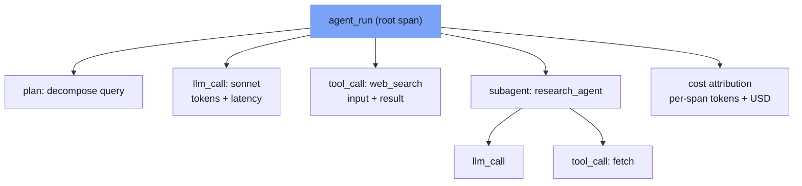

⏱️ **Estimated reading time**: 9 min

<!-- evolve-diagram -->
*Conceptual diagram*



## Why Logs Are Not Enough for Agents

For a single LLM call, traditional logging works fine. Record the input-output pair, measure latency, capture errors.

Multi-agent systems change the situation. Agents call tools autonomously, hand control to other agents, and chain multiple LLM calls together. To understand what went wrong and why, you need to be able to reconstruct not just "what happened" but "in what order, under what context, and what decisions were made."

A 2025 analysis found that approximately 65% of agent failures originate from context construction problems rather than model capability limits. Without observability, this category of failure is impossible to diagnose.

---

## Three Components of Agent Tracing

### 1. Nested Spans

Agent execution has a tree structure. A root span wraps the entire agent run, and child spans represent each LLM call, tool call, and sub-agent call.

If you implement this directly on top of OpenTelemetry, follow this structure:

```python
with tracer.start_as_current_span("agent_run") as root_span:
    root_span.set_attribute("agent.name", "research_agent")
    root_span.set_attribute("input.query", query)
    
    with tracer.start_as_current_span("llm_call") as llm_span:
        llm_span.set_attribute("model", "claude-sonnet-4-6")
        llm_span.set_attribute("prompt_tokens", prompt_tokens)
        response = llm.invoke(prompt)
        llm_span.set_attribute("completion_tokens", completion_tokens)
    
    with tracer.start_as_current_span("tool_call") as tool_span:
        tool_span.set_attribute("tool.name", "web_search")
        tool_span.set_attribute("tool.input", search_query)
        result = search_tool.run(search_query)
```

The critical element is propagating parent-child relationships through span context. In multi-agent handoffs, this propagation must cross agent boundaries.

### 2. Memory and State Tracking

You need to record what context the agent held at each step. For long-running agents in particular, tracking how context evolved over time is essential for diagnosis.

Save state snapshots at each major decision point. If full snapshots are prohibitive for production storage, recording just the hash and delta of state is enough to reconstruct what happened.

### 3. Cost Attribution

In a multi-agent pipeline, aggregating total cost is not sufficient. You need to trace token consumption down to the span level to identify which agent at which step is responsible. That is the only way to find actionable optimization targets.

```python
# Add cost attribution to a span
span.set_attribute("cost.input_tokens", input_tokens)
span.set_attribute("cost.output_tokens", output_tokens)
span.set_attribute("cost.model_tier", "sonnet")  # haiku/sonnet/opus
span.set_attribute("cost.estimated_usd", estimated_cost)
```

---

## Designing the Evaluation Loop

Tracing answers "what happened." Evaluation answers "did it go well." These are separate layers.

### Offline vs Online Evaluation

**Offline evaluation** validates model and prompt changes against a fixed benchmark dataset before deployment. Integrated into CI/CD pipelines, it catches regressions.

**Online evaluation** samples production traces in real time and tracks quality metrics. It catches distribution drift and prompt issues after deployment.

Both must operate together. Offline alone means missing distribution shifts in real production data. Online alone means no quality gate before deployment.

### Pitfalls of LLM-as-Judge Evaluation

Using an LLM as an evaluator is a common pattern but requires care. If the evaluation prompt uses the same model as the generation prompt, you introduce self-reinforcing bias. Where possible, use a different model for evaluation than for generation.

Also, the evaluator LLM's judgments themselves need periodic human review to verify they can be trusted. Tracking the correlation between automated evaluation scores and actual user feedback is a baseline requirement.

### Choosing Evaluation Metrics

Appropriate metrics depend on the type of agent task.

| Task Type | Example Metrics |
|-----------|----------------|
| Information retrieval | Relevance, completeness, factual accuracy |
| Code generation | Test pass rate, security issues, style compliance |
| Tool use | Correct tool selection, parameter accuracy |
| Multi-step reasoning | Intermediate step accuracy, final answer accuracy |

Resist the urge to summarize agent quality in a single score. Tracking multi-dimensional metrics and alerting when any metric drops below a threshold is more useful.

---

## Platform Comparison: MLflow vs LangSmith vs Arize

All three platforms are production-ready but have different strengths.

**MLflow** is open source, which enables self-hosting, and includes an agent replay feature for tracing. It integrates well with existing ML experiment tracking workflows. It is well suited to enterprise environments where sending data to external services is restricted.

**LangSmith** integrates deeply with the LangChain ecosystem. Its strongest feature is high-fidelity traces that render the full execution tree of an agent run. It also provides prompt management and evaluation in the same platform.

**Arize AI** excels at span-level tracing and real-time dashboards at enterprise scale. Its open-source Phoenix library lets you start in a local development environment and scale up.

All three platforms support integrations with major frameworks including LangGraph, OpenAI Agents SDK, and CrewAI.

---

## Production Debugging Patterns

### Reproducing a Failure Trace

To reproduce an agent failure locally, you need to save a snapshot of the complete input state at the point of failure: the initial query, all tool call results, and the memory state. Replaying the same agent locally from that snapshot reproduces the failure.

MLflow provides an agent replay feature for exactly this purpose. You can select a specific span from a trace and restart execution from that point.

### Detecting Context Drift

This is a common failure pattern in long-running agents. The agent forgets the original goal or takes actions that contradict information it collected earlier.

Diagnostic metrics: track context window utilization, measure semantic similarity between the initial instructions and current agent behavior, and track how much the tool call pattern diverges from previous steps.

### Classifying Tool Error Patterns

Do not look at tool call failures as a single error rate. Classify them by type.

- **Parameter errors**: The agent passes malformed input to a tool. Caused by an unclear tool specification or an agent prompt that incorrectly describes how to use the tool.
- **Timeouts**: Common in tools that depend on external APIs. Requires retry logic and circuit breakers.
- **Permission errors**: The agent attempts to call a tool that is outside its granted scope.

Looking at the frequency of each type alongside the agent's context at the time of failure reveals systemic root causes.

---

## Building Observability Incrementally

Trying to build a complete system from the start takes too long. An incremental approach is more realistic.

**Stage 1**: Log token counts and latency per LLM call. Sufficient for understanding costs and detecting bottlenecks.

**Stage 2**: Add tool call spans. Makes it visible which tools are failing and how often.

**Stage 3**: Wrap the entire agent execution in a root span and build the nested tree structure.

**Stage 4**: Build an offline evaluation dataset for core tasks and integrate it into CI.

**Stage 5**: Add online evaluation based on sampling production traces.

Do not attempt all five stages at once. Stabilize stages 1 and 2 first, then build incrementally. That approach is sustainable.

---

## Key Takeaways

Running production agents without observability is like flying a plane with no instruments. Things look fine when everything is working, but when something goes wrong there is no way to know where it happened.

Tracing, cost attribution, and evaluation loops are not optional features. They are operational requirements for production agents. Starting simple is fine. Starting without them at all, on the assumption you will add them later, means you will be building the infrastructure after failure patterns have already accumulated.

---

<!-- evolve-refs -->
## References

- [MLflow Tracing](https://mlflow.org/docs/latest/genai/tracing/)
- [LangSmith](https://docs.langchain.com/langsmith)
- [Arize Phoenix](https://github.com/Arize-ai/phoenix)
- [OpenTelemetry GenAI Semantic Conventions](https://github.com/open-telemetry/semantic-conventions-genai)
