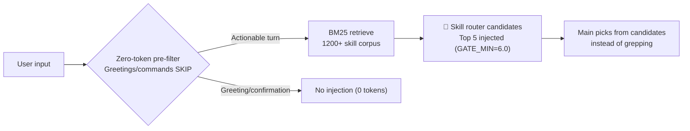
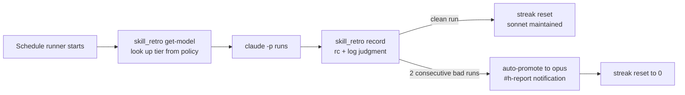

## The Day We Burned $705

Let's start with the incident. On June 1, 2026, we ran all 9 sessions on Opus and hit an estimated daily cost of $705. A single monitoring session consumed $381 -- 54% of the total. The cause: 9.4 hours, 1145 turns, and 138 ScheduleWakeup calls accumulated in one session. Forty-two percent of that cost came from cache_read at 195M tokens. On the same day we ran `cd` 153 times and re-read the same file 10 times.

The irony is that all 18 subagents launched that day were correctly routed to sonnet. The problem was not the sub -- it was the main. Keeping the main session on Opus while churning a massive context through repeated turns was the only leak.

This post covers the rules we put in place after that day. We leave out the AI platform and GPU discussion and focus entirely on how to cut the operating cost of agents themselves through routing and token hygiene.

## 1. Model Tiers: Stop Paying 19x for the Same Work

The biggest lever is model selection. The cost multipliers in our environment are clear: haiku is roughly 1x, sonnet roughly 4x, and opus roughly 19x. Running the same exploration task on opus costs 19 times more than haiku.

So we fix models to task types.

| Tier | When | Multiplier |
|---|---|---|
| `haiku` | Exploration, file reading, search, grep, summarization, translation | ~1x |
| `sonnet` | Analysis, implementation, code generation, review, writing (default) | ~4x |
| `opus` | Architecture, multi-step reasoning, complex debugging, spec writing | ~19x |
| `fable` | Orchestrator/conductor (usage-limit savings) | Low |

There is one hard rule: every subagent call must explicitly specify the `model` parameter. Omitting it defaults to the session model -- if that default is Opus, every subagent call is billed at 19x. That was the essence of the June 1 incident.

```python
# Good: exploration explicitly routed to haiku
Agent(subagent_type="Explore", model="haiku", prompt="...")
# Bad: model omitted -> session default (opus) = 19x billing
Agent(subagent_type="Explore", prompt="...")
```

We add one more pattern: set the session main to fable and give it only the conductor role. Routing, branching, and aggregation are handled cheaply by fable; only stages that genuinely need heavy reasoning get a one-shot `Agent(model="opus")` call. Exploration goes to haiku. Spawn depth is capped at 2, and haiku subagents never spawn further subagents.

## 2. Skill Router: Keep the Main from Wandering the Codebase

The second lever is the skill router. We have more than 1200 skills. When the main agent starts grepping the codebase to decide which skill to use, that itself burns expensive opus tokens.

So the `UserPromptSubmit` hook `skill-router-gate.py` runs a BM25 search in deterministic code on every turn and injects the top candidates into context.



Scoring weights exact name matches heavily (idf-based) and description tokens lightly. Greetings and simple commands pass through a zero-token pre-filter, and consecutive identical turns are cached. The structure adds hints only on the input side with no extra LLM pass -- almost zero cost. The payoff: the main agent stops burning opus tokens on exploration from the start.

To be honest about the limits: in our experiments with decomposing complex requests and searching per step (SAD), even with perfect decomposition the ceiling for our retriever was 42.5% step coverage. The paper's claim that "retrieval is fine, just fix decomposition" did not transfer directly to our environment. So deterministic regex decomposition is off by default, and decomposition is opt-in for compound requests only. We measure before we fix.

## 3. Token Hygiene: Context Leaks Easily

The third lever is token hygiene. The core principle: large outputs must not accumulate directly in the main context.

The most important rule is the 2K token rule. Any tool call expected to return more than 2K tokens is delegated to a subagent. The subagent reads and processes the data, returns only a summary, and the main context stays clean. Structured outputs exceeding 200 lines or 2KB are offloaded to scratch files or SQLite. Repetitively structured JSON is run through headroom's deterministic compression for a 50%+ reduction before being reinjected.

Shell output gets the `rtk` prefix for 60-90% compression. Each MCP server costs roughly 1000 tokens of schema per turn, so we disable unused servers and keep the count at 10 or fewer. These are ghost tokens -- the invisible per-turn overhead of schemas that are loaded but never called.

| Rule file | Mechanism |
|---|---|
| `loop-monitor-cost-guard` | Polling/monitoring leaves the Claude hot loop for cron ($0 cost); /loop splits before 50 turns or 40% context |
| `ecc-token-strategy` | 2K token rule delegation; 200+ line outputs to scratch files; JSON via headroom compression |
| `rtk-token-optimization` | `rtk` prefix compresses command output 60-90% |
| `token-diet-hygiene` | MCP servers capped at 10; skill descriptions capped at 512 chars; ghost token detection |
| `sonnet-format-determinism` | Format, enums, and counts owned by code; model generates content only |

The last rule connects directly to cost. On June 16, 2026, 33 sonnet workers received identical instructions and produced `quality_gate` output in 5 different shapes; 24 of them over-tagged judgment flags. When you ask a model to produce format in prose, it varies every call. So now numbers, enums, and rendering are owned by deterministic code, and the model generates content only. The need to pay for a more expensive model just for format consistency disappears.

## 4. Retro-Driven Escalation: Start Cheap, Promote on Failure

Scheduled skills do not hard-code a model. The central policy `skill_model_policy.json` starts at sonnet, and `skill_retro.py` determines the model through retrospective analysis.



Bad run judgment is conservative: only when exit code is non-zero or the log contains markers like authentication failure, API error, or Traceback. A single transient failure does not trigger promotion; a streak is required. Clean successes reset the streak, and there is no automatic demotion. Cost control comes from selective data-driven promotion, not blanket model demotion. Only skills that genuinely need quality become expensive. In practice, `twitter-timeline-to-slack` was pinned to opus after sonnet skipped the enrichment stage.

## 5. Auditing: See Where the Money Goes

The last piece is measurement. `scripts/cost_audit.py` parses session transcripts and reports cost by tier, cache hit rate, the most expensive sessions and tools, and files that were re-read. Insights like "main Opus accounted for 97% of billing" from June 1 come from here, and the findings feed back into model pins.

The full flow in one sentence: choose the session model by task type, let the skill router reduce main-agent exploration, route subagents by tier, keep context clean with token hygiene, let retrospectives promote only failing skills, and let auditing tell you where the money leaks next.

## The ThakiCloud Perspective: Lock Cost Control into Rules

Cost optimization is not a heroic one-time decision -- it is the accumulation of rules that apply automatically every turn. Most of the rules we have embedded run through deterministic code and hooks, so no one has to think about them manually. Expensive models are not forbidden; they are reserved for cases where data justifies the spend.

This discipline matters even more in on-premises environments, where token costs translate directly to electricity and GPU time. The platform ThakiCloud provides embeds this kind of routing and observability as a baseline, so customers can pull the same levers on their own infrastructure.

## Closing

The lesson from the $705 incident was simple. The leak was in behavior, not hardware, and behavior is corrected only by rules. Match model tiers to task types, reduce exploration with the skill router, handle tokens hygienically, promote only what fails, and audit daily -- and you can do the same work at 19x lower cost.

ThakiCloud is making this cost discipline a baseline feature of the product. You can learn more on our website.
