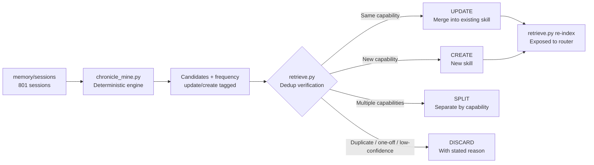
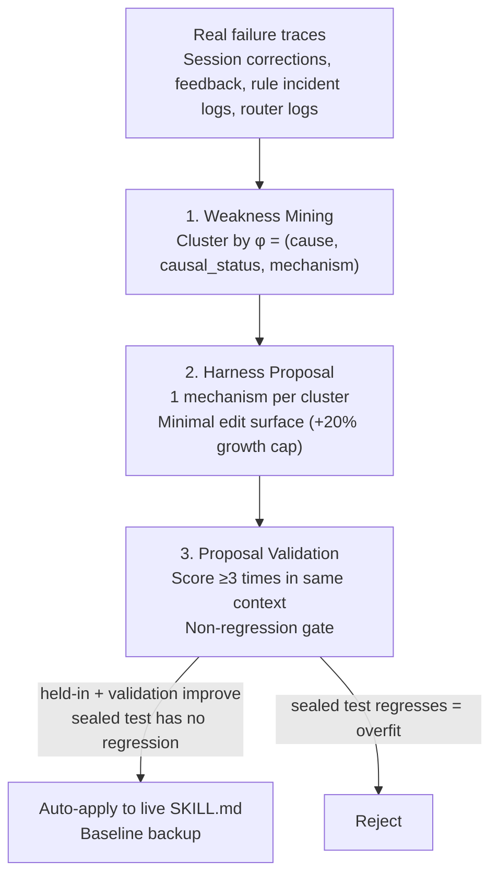

## If You Keep Explaining the Same Thing Over and Over

Anyone who has used an AI agent long enough will notice a pattern: the same task, following the same conventions, being re-instructed from scratch every single time. Requests like "plan this content as an English doc under the docs folder" or "grab this GitHub repo and convert it into a skill" are essentially the same workflow, just phrased slightly differently each time.

Skills are not free. The moment a skill enters the index, its name and description consume context tokens every session. So casually saying "we repeat this, let's just make it a skill" is irresponsible. We need to verify that the repetition is genuine, that it doesn't overlap with existing skills, and that quality holds after creation.

This post is not marketing. We are openly sharing the two autonomous loops we actually run. One is Chronicle mining -- extracting recurring workflows from past conversations and packaging them as skills. The other is selfharness self-evolution -- automatically correcting existing skill bodies based on failure evidence.

## 1. Chronicle: Turning Past Conversations into a Corpus

We need raw material first. Claude Code sessions accumulate as original transcripts at `~/.claude/projects/<repo>/*.jsonl`. We run `scripts/memory/extract-sessions.py` to pull only high-signal entries from those originals and write them as markdown session logs under `memory/sessions/`. Currently 801 files. Each file carries `date`, `session_id`, `title`, and `files_touched` in its frontmatter, with messages in the body.

This corpus is our Chronicle. Cost: zero. Extraction runs incrementally as a deterministic step in the nightly memory pipeline.

## 2. Counting Belongs to Code, Not Models

There is one core design principle: numbers -- frequency, pattern signatures, deduplication judgments -- are never delegated to a model. When asked to estimate "how many sessions repeated this," a model is almost always wrong. So our mining engine `scripts/skills/chronicle_mine.py` is pure deterministic code that never calls an LLM. Runtime cost is effectively zero.

What the engine does is simple. It extracts signal tokens from session titles and the files touched, then counts document frequency across sessions. Tokens and co-occurrence pairs that appear in at least a threshold number of sessions (default: 4) are promoted to candidates. It also cross-references existing `.claude/skills/` names and tags each candidate as `update` (already exists) or `create` (new).

The hard part is noise. On the first run, the top patterns were things like `hooks+state` (260 occurrences) and `cursor+plan` (198 occurrences). These are not recurring workflows -- they are repo infrastructure paths that almost every session touches. Classic lexical mismatch. So we added an IDF-style maximum document-frequency cutoff. Tokens appearing in more than 16% of the corpus are classified as ambient noise and dropped.

```python
# Tokens exceeding 16% of the corpus are ambient (everywhere) -> not a workflow identity
MAX_DF_RATIO = 0.16
ambient = {t for t, c in raw_df.items() if c / n > MAX_DF_RATIO}
```

Even after that, SKILL.md filenames from plugin caches under `.cursor/plugins/cache/` were flooding the top results with false signals. We only discovered the cause by opening a handful of actual sessions. We then excluded caches, generated plans, and vendored paths entirely, and narrowed the signal to "titles carrying user intent" and "skill identities actually invoked." Only then did the real workflows surface.

This process itself is the lesson. When quality falls short, reaching for a higher model tier is the lazy choice. Measure the engine first, find the noise source in the data, and fix it.

## 3. Evolution Judgment: Update, Create, or Split?

Once candidates emerge, the miner stops and the orchestrator skill `chronicle-skill-miner` makes the call. The code's deduplication hints are advisory only -- the final verdict comes from re-verification with the BM25 skill searcher.



Running the full 801 sessions produced an interesting conclusion. Most of the user's recurring workflows were already covered by the existing skill ecosystem. Stock analysis falls under stock-jarvis, social ingestion under x-to-slack, GitHub conversion under skill-seekers. The honest curation result was "discard most." The right outcome is not generating duplicate skills -- it is creating exactly one new skill for a workflow that is genuinely missing.

That one workflow was: "plan this content as an English engineering doc under the docs folder, routing to the appropriate skill, focusing on software engineering essentials." It recurred 39 times but was not precisely covered by any existing skill. We created only that one, reinforced one existing skill whose triggers were weak, and discarded the rest -- each with a stated reason. The rule is: never discard silently; always record the count of patterns that fell below threshold.

What separates this approach from similar commercial features is two things. First, the deterministic engine owns the counting and noise filtering, eliminating frequency hallucinations at the source. Second, retrieval-based deduplication is enforced against a corpus of over 1,600 existing skills.

## 4. selfharness: Correcting Skill Bodies Based on Failure

Creating the skill is not the end. Skills make mistakes in real operation, and those mistakes follow patterns. selfharness-evolve uses those failure patterns to automatically correct a skill's body. It is the Self-Harness paper (arXiv:2606.09498) transplanted into SKILL.md content.

It operates in three stages.



Stage 1, weakness mining, clusters real failures by the signature `φ = (cause, causal_status, mechanism)` and ranks them by support and actionability. The `cause` field is drawn from a fixed set: wrong_output, missing_step, stale_data, ignored_constraint, format_violation. Sources are sessions where users corrected a skill, feedback memory, rule incident logs, and router logs.

Stage 2, proposal, feeds the top clusters to a mutation engine (hermes) as targeted feedback. One mutation touches exactly one mechanism and makes only the minimum edit to that cluster's edit surface. Growth is hard-capped at +20%. Freshness and guardrail fixes are typically 3-5 lines.

Stage 3, validation, is the most important. We score the proposal at least 3 times in the same context, and both held-in and validation scores must improve for it to pass. Critically, the `test` split is sealed -- the gate never sees the test set. If a proposal passes but the sealed test regresses, it is classified as overfitting and rejected. This is the leak-free design that fixes the held-out leakage problem in the original paper. Frontmatter and all trigger phrases are preserved.

## 5. Two Independent Autonomous Loops

Let us clarify a point that often causes confusion. We have two orthogonal evolution loops.

One is selfharness, just described: it evolves the content quality of skills. The other is `skill_retro.py` with `skill_model_policy.json`: it evolves which model tier a skill runs on. The second loop starts cheap with sonnet by default, then if a skill fails twice in a row, that skill alone is automatically promoted to opus. A clean success resets the failure streak.

Content quality and execution cost are separate problems, so they have separate loops. The cost side of this story is covered in a separate post.

## The ThakiCloud Perspective: Operations That Get Smarter with Use

The reason we run these two loops ourselves is simple. A single engineer managing a skill ecosystem of over 1,600 skills needs that ecosystem to organize and grow on its own, without human intervention.

This is the same philosophy behind the on-premises AI platform we aim to deliver to our customers. Good automation is not built once and left alone -- it improves itself based on real usage data. Deterministic code owns measurement and counting. Models are deployed expensively only where judgment is required. Every change must pass a non-regression gate before going live. This discipline -- structurally preventing hallucinations, raising costs only on data evidence -- is the foundation of the trust we sell.

## Closing

Recurring work should become skills, but not every repetition deserves to be one. We mine past conversations with a deterministic engine to identify genuine recurrences, force deduplication against the existing ecosystem, and evolve the skills we create in a leak-free way based on failure evidence. Code counts frequency. A non-regression gate guards quality. A separate loop controls cost.

ThakiCloud implements this kind of self-improving agent operation natively in on-premises environments. If you want to run the same discipline on your own infrastructure, you can find more on our website.
