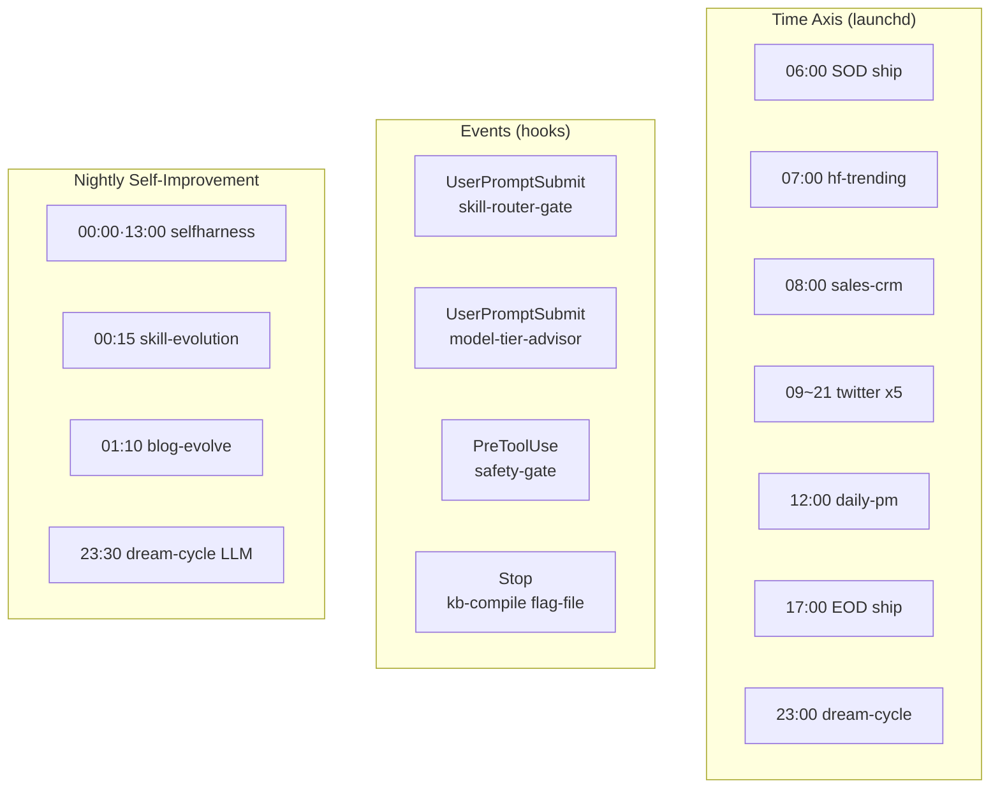
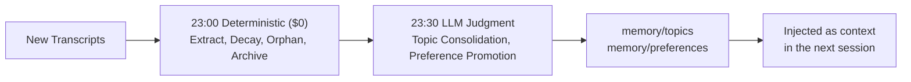

## An Honest Definition of "Automated"

Automation stories are usually inflated. So this post follows a single rule: we list only what is actually wired to fire, not what appears on an architecture diagram. And we classify each item by cost -- deterministic Python that makes no LLM calls is $0; anything that runs `claude -p` in a single pass incurs LLM cost.

One prerequisite to state upfront: every LLM runner sources the subscription OAuth token from `~/.config/claude-code/headless.env`. This avoids pay-per-use API billing and works even when the keychain is locked in a launchd environment.

The full topology divides into three axes: time-driven schedules, event-driven hooks, and nightly self-improvement loops.

## 1. Time Axis: launchd Scheduled Jobs

The plist files under `scripts/launchd/` fill the day. On weekdays, the 06:00 SOD ship opens the day with a git sync and cleanup; 07:00 hf-trending collects Hugging Face trend intelligence; 08:00 sales-crm generates the sales brief; and from 09:00 to 21:00, the Twitter timeline is summarized to Slack five times at three-hour intervals. 10:00 runs bespin news, 12:00 runs the daily-pm orchestrator, and 17:00 EOD ship reviews the day's changes and closes them with commits and PRs.

| Job | Time (KST) | What it does | Cost |
|---|---|---|---|
| sod-ship | Weekdays 06:00 | Morning git sync + ship | LLM |
| hf-trending | Daily 07:00 | Hugging Face trend intelligence | LLM (sonnet) |
| sales-crm-morning | Weekdays 08:00 | Sales CRM brief | LLM (opus pinned) |
| twitter-timeline | Weekdays 09/12/15/18/21 | Timeline classification to Slack | LLM (opus pinned) |
| daily-pm | Weekdays 12:00 | Evening pipeline orchestrator | LLM (sonnet) |
| eod-ship | Weekdays 17:00 | End-of-day review, commit, PR | LLM |
| memkraft-dream-cycle | Daily 23:00 | Deterministic memory stage | $0 |

The cost principle is visible here. We never put polling monitors in a Claude hot loop. Something like the Toss price monitor runs as `scripts/toss_monitor_tick.sh` on a 5-minute cron and pushes to Slack only when something is unusual. Cost: $0. We call Claude only when a human or an event warrants it.

## 2. Event Axis: Hooks Are All Deterministic, So $0

Every hook registered in `.claude/settings.json` is deterministic Python or shell, so the cost is zero. These hooks quietly intercept every turn and every tool call to enforce quality and safety.

| Event | Script | What it does |
|---|---|---|
| UserPromptSubmit | `skill-router-gate.py` | Injects skill candidates via BM25 (greetings/commands get 0-token SKIP) |
| UserPromptSubmit | `model-tier-advisor.py` | Injects delegation/Plan Mode advisory on exploration or risk intent |
| PreToolUse(Bash) | `pre-tool-safety-gate.sh` | Blocks dangerous commands (e.g., `rm -rf .venv`) |
| PreToolUse(Bash) | `preorder-check-guard.py` | Trading order guard |
| PostToolUse | `post-edit-format.sh` | Auto-formats edited files |
| Stop | `kb-intel-compile.py` | Flag-file pattern: recompiles the wiki only when a flag is present |

The last Stop hook is a clean pattern. Rather than running heavy work on every turn, the producer skill leaves a `.compile-pending` flag, the hook recompiles the wiki when that flag exists, then deletes it. If no flag is present, the hook exits immediately with zero overhead. It is a tidy way to trigger expensive work only after specific producer turns.

## 3. Nightly Self-Improvement Loops

At night, the system works on itself.

At midnight and 13:00, selfharness-evolve advances skill content based on real failures. At 00:15, skill-evolution autonomously creates and improves skills, capped at three new skills and two improvements per run. At 01:10, blog-evolve improves the technical blog on its own.

Layered on top of this is retro-driven model escalation. Each LLM runner records its own execution result on exit; two consecutive failures automatically promote that skill from sonnet to opus. The escalation ledger itself is $0, and only the promoted execution becomes more expensive. The selfharness loop that evolves content quality and the retro loop that evolves execution cost tier are two independent, orthogonal loops.

## 4. Memory Pipeline: Separating Determinism from Judgment

The memkraft dream-cycle organizes memory in six stages. The distinguishing design is that deterministic and judgment stages are separated by time, for cost reasons.

The deterministic stage ($0) runs at 23:00 and covers session extraction, attention decay, orphan resolution, and archive sweep. Session extraction incrementally pulls high-signal items from new transcripts into `memory/sessions/`. Attention decay lowers scores by 0.02 per day, sorting entries into HOT, WARM, COLD, and archive tiers, and adds 0.15 on access.

The LLM judgment stage runs at 23:30 and handles topic consolidation and preference promotion. Only patterns that appear three or more times with a confidence of 0.8 or higher are promoted to preferences. Running deterministic work deterministically and sending only what requires judgment to the model is the separation that captures both cost and quality simultaneously.

## The ThakiCloud Perspective: Unattended Ops Is a Trust Problem

The reason a solo engineer can run this much is not that there is a lot of automation -- it is that the automation is wired honestly. Deterministic work runs at $0, the LLM is deployed only where judgment is needed, and every unattended runner records its failures and self-corrects through retro loops.

This is the operating model we want to demonstrate to customers on our on-premises AI platform. Automation should not be a flashy demo -- it should be a system that stops safely on failure and improves itself from data. The time axis, event axis, and self-improvement loops mesh together, and each gear being cost-aware is what builds trust in unattended operations.

## Closing

The measure of automation is not how many pieces there are, but whether it runs safely without a human. We operate time-driven schedules, event-driven hooks, and loops that fix themselves at night -- classified by cost. Deterministic work runs free, judgment is applied carefully, and failures are corrected through retrospectives.

ThakiCloud turns this discipline of unattended operations into a product. More details are available on our website.
