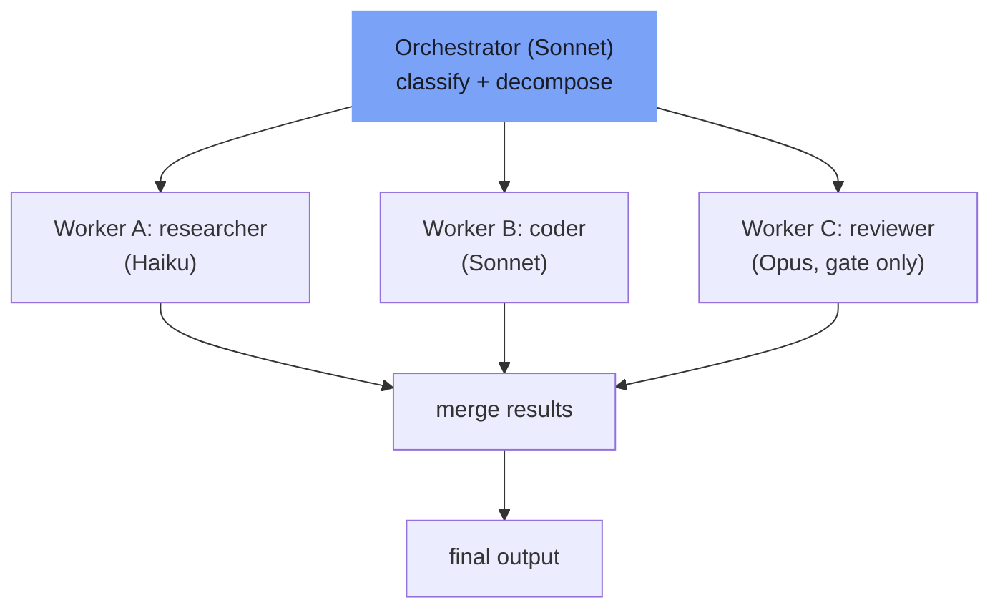

⏱️ **Estimated reading time**: 8 min

<!-- evolve-diagram -->
*Conceptual diagram*



## Why This Topic Now

As of the first half of 2026, a significant portion of production LLM workloads have shifted from single-model calls to multi-agent pipelines. With frameworks like LangGraph, CrewAI, Microsoft Agent Framework, and Google ADK reaching stable releases, the more important question is no longer "how do I wire these together" but "which pattern do I use and when."

The problem is that multi-agent systems are not free. Centralized architectures generate roughly 285% more token overhead compared to a single agent, and even independently distributed structures add about 58% more. Picking the wrong pattern does not just degrade results; it causes costs to spike while quality falls at the same time.

This post covers six patterns that are actually used in production as of 2026, along with the specific conditions under which each one fits and the situations where it should be avoided.

---

## Pattern 1: Orchestrator-Worker

This is the most widely used pattern. Industry surveys indicate that roughly 70% of multi-agent production deployments as of 2026 use this structure.

The architecture is straightforward. An orchestrator classifies incoming tasks, breaks them into subtasks, dispatches each to a specialized worker (researcher, coder, tester, reviewer), and aggregates the results.

```
Orchestrator
├── Task decomposition
├── Dispatch to Worker A -> Result A
├── Dispatch to Worker B -> Result B
└── Merge results -> Final output
```

**Use when**: Tasks can be cleanly separated and each domain requires specialized expertise.

**Avoid when**: Workers have high interdependency and the orchestrator must synchronize state at every step. In that case the orchestrator becomes a bottleneck.

**Cost note**: Pinning the orchestrator model to Opus means every routing decision runs at the highest-cost model. A more economical approach is to run the orchestrator on Sonnet and only assign Opus to worker steps that require reasoning.

---

## Pattern 2: Sequential Pipeline

A linear structure with fixed stages. The output of each stage becomes the input to the next.

A RAG pipeline is the canonical example: query rewriting, retrieval, reranking, generation, and post-processing. The order cannot change and no stage can be skipped.

**Use when**: The workflow is deterministic and stage ordering must be strictly preserved.

**Avoid when**: Some stages may be unnecessary depending on task characteristics. In that case, a dynamic pattern with conditional branching is a better fit.

**Implementation tip**: In LangGraph, fixing edges between nodes produces a Sequential Pipeline. Saving intermediate results as checkpoints at each stage means a failure does not require starting over from scratch.

---

## Pattern 3: Fan-out / Fan-in

N independent tasks are executed in parallel and their results are merged into a single output.

Example: the same document is processed simultaneously by an accuracy review agent, a security vulnerability review agent, and a code style review agent. Their individual reports are then combined into a comprehensive review.

```python
# Conceptual structure
results = await asyncio.gather(
    accuracy_agent.run(document),
    security_agent.run(document),
    style_agent.run(document)
)
final_report = merge_agent.run(results)
```

**Use when**: There are four or more independent tasks with no data dependencies between them. Parallelization reduces overall latency.

**Avoid when**: Tasks are not actually independent. Forcing tasks with dependencies to run in parallel creates result conflicts at the Fan-in stage.

---

## Pattern 4: Multi-agent Debate

Multiple agents each produce answers to the same task from different perspectives. A critic agent reviews those answers and derives a final output. This is also called the Maker-Checker loop.

Accuracy is higher than a single LLM call, but so is cost. Use this pattern when accuracy takes priority over speed.

**Use when**: The cost of errors is high, as in medical, legal, or financial domains. Also useful when generated code needs a dedicated security vulnerability pass.

**Avoid when**: Latency matters in a real-time response path. Each additional debate round adds latency linearly.

---

## Pattern 5: Dynamic Handoff

An agent determines during task execution that a request falls outside its capabilities and passes control to an appropriate agent. The routing logic is not hardcoded in advance; it is determined by the flow of the conversation.

Customer support is the classic scenario. A general inquiry agent encounters a technical issue and hands off to a technical support agent. When a billing question appears, it passes to a billing agent.

**Implementation note**: Agent handoff history must be included in the context to prevent loops. Without it, agents can cycle indefinitely: Agent A to B to A to B.

---

## Pattern 6: Adaptive Planning

Used for open-ended problems where only the goal is given and the plan itself must be discovered during execution. The agent explores the environment and determines the next action based on intermediate results.

Software engineering agents (in the style of SWE-bench) and autonomous research agents use this pattern. It is necessary when the step sequence cannot be defined in advance.

**Risk**: If the termination condition is unclear, the agent will explore far more steps than necessary. A maximum iteration count or cost ceiling must always be set.

---

## Pattern Selection Reference

| Pattern | Task Structure | Order Dependency | Parallelism | Cost Level |
|---------|---------------|-----------------|-------------|------------|
| Orchestrator-Worker | Decomposable | Low | Partial | Medium |
| Sequential Pipeline | Fixed linear | High | None | Low |
| Fan-out / Fan-in | Independent parallel | None | Maximum | Low-Medium |
| Multi-agent Debate | Same task | None | Partial | High |
| Dynamic Handoff | Unpredictable | None | None | Medium |
| Adaptive Planning | Open-ended | None | None | Highest |

---

## Cost Control Principles

Before adopting multi-agent architectures, the first question to answer is whether the task actually requires them. Forcing a simple task into a multi-agent structure only inflates cost; quality ends up the same as a single agent or worse.

There are three cases where multi-agent is justified.

First, when domain expertise genuinely differs. Code generation and security review are tasks with different characteristics.

Second, when independent parallelization is possible and reduces overall latency.

Third, when a critique-review loop demonstrably improves accuracy. In that case the additional cost of Multi-agent Debate is justified.

**Model tier separation** is the key lever for cost control. Use Haiku for exploration, grep, and file-reading workers. Use Sonnet for implementation and review workers. Reserve Opus for architecture decisions and validation gates only. Running an entire pipeline on the same model wastes both money and quality.

---

## Closing Thoughts

Choosing the right pattern matters more than choosing the right framework. Whether you implement Fan-out with LangGraph or Orchestrator-Worker with CrewAI, a framework cannot fix a mismatch between the pattern and the task structure.

The most common mistake teams make right now is applying Adaptive Planning to tasks that do not need it. Putting an open-ended exploration loop without termination conditions into production leads to cost explosions or timeouts. It is worth confirming first whether Sequential Pipeline or Fan-out is sufficient.

---

<!-- evolve-refs -->
## References

- [Anthropic: How we built our multi-agent research system](https://www.anthropic.com/engineering/built-multi-agent-research-system)
- [LangGraph](https://github.com/langchain-ai/langgraph)
- [CrewAI Docs](https://docs.crewai.com/)
