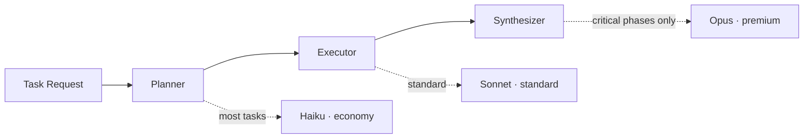

## The Next Question in Cloud: How Do You Operate Agents?

Over the past decade, cloud generations have been defined by what they manage. First came servers and infrastructure. Then data and pipelines. The question surfacing in production right now is different. The moment you start running multiple AI agents, you lose visibility into who did what, costs escape prediction, security and audit requirements go unmet, and every team rebuilds the same thing independently.

Praxis targets that gap. Traditional cloud treated compute, databases, and networking as first-class resources. Praxis treats AI agent capabilities (Skills), tools (Tools), policies (Policies), and audit logs (Audit) as first-class resources. Customers hire, manage, and audit "a full team of AI employees" without writing code. We call this category Agent-Native Cloud.


This post is not a marketing tagline -- it walks through a working PoC with real code. Every number below was verified against an actual server (`localhost:8080`).

## Core Modules: Three Things to Remember

The Praxis backend is written in Go. The architecture reads cleanly as three layers: infrastructure at the bottom, the core above it, and the capability layer on top.

- Agent Runtime (Native Loop): The single execution entry point where the ReAct loop, tool execution, cost tracking, and autonomy gates converge.
- Skill Harness: Automatically loads skills at boot and selects relevant ones using TF-IDF.
- Hybrid Knowledge Engine (HKE): A Git-based knowledge layer that ingests and queries per-team wikis.
- LLM Gateway: Abstracts multiple model providers and serves as the single source of truth for cost routing.
- Security and Policy: Autonomy matrix (L0-L3), prompt security, and full action auditing.
- Memory: Session memory, pgvector semantic search, and provenance tracking.

Sandbox execution and multi-agent orchestration sit underneath all of this. If you need to remember only three things: runtime, harness, knowledge engine.

## Adding Capability = One File

The cost of adding a new capability in Praxis is zero code deployments. Drop a single `skills/<domain>/<name>/SKILL.md` file and the server scans the directory automatically, picking it up immediately.

```markdown
---
name: competitor-digest
description: >-
  Collects and summarizes competitor news. Use when tracking competitor activity or news digests.
allowed-tools: [web_search, web_fetch]
---
# Competitor Digest
## Instructions
Gather the latest articles from the specified sources and distill the key points into bullets.
```

Save the file and it appears in `GET /api/v1/skills` with no server restart. In the PoC, 849 skills loaded automatically at boot, along with 14 default domain agents. This "thick skills, thin harness" principle means capabilities accumulate as files while the harness stays lean.

Creating a recurring task in natural language follows the same pattern.

```bash
curl -X POST http://localhost:8080/api/v1/tasks \
  -H "Authorization: Bearer $TOKEN" \
  -d '{"team_id":"dev-team","agent_id":"research-bot",
       "schedule":{"type":"cron","expr":"0 9 * * *"},
       "skill":"competitor-digest","params":{"topN":10}}'
```

Type "summarize the top 10 competitor news items every morning at 9" in chat, and the LLM translates it into this cron, skill, and parameter set and registers it. Zero lines of code.

## CostRouter: The Code Picks the Model Per Task

The "AI cost explosion" problem is almost always the same cause: using an expensive model for everything. Praxis splits a task into three phases -- Planner, Executor, Synthesizer -- and automatically assigns the right model to each.



The model tiers are managed from a single source, `models.yaml`. The price spread per million output tokens is significant.

| Tier | Model | Output $/1M | Use |
|---|---|---|---|
| economy | Haiku 4.5 | $4 | Most tasks |
| standard | Sonnet 4.6 | $15 | Balanced workloads |
| strong | GPT-4o / Kimi | Mid | Augmentation |
| premium | Opus 4.8 | $25 | Critical phases only (opt-in) |

The key insight is that most tasks are well-served by the cheapest model, Haiku, and Opus is reserved only for genuinely critical phases. Per-execution budget caps are enforced, making costs predictable and visible through Command Center in daily and weekly views. And as the system sees more usage, the routing learns which tasks can be handled by cheaper models, so the cost per execution on repeated work trends downward.

## What Makes HKE Different from Traditional RAG

Traditional RAG is essentially a one-shot retrieval bolted on at query time. Praxis's Hybrid Knowledge Engine (HKE) treats knowledge as an asset that accumulates.

| Traditional RAG | Praxis HKE |
|---|---|
| Stateless single-shot retrieval | Git-based persistent wiki (knowledge accumulates) |
| No domain boundaries | Per-agent domain scoping and isolation |
| No source trust tracking | Provenance records (who, when, which source) |
| Uncapped cost | tool-budget truncates large results or defers fetch |

Documents or code pushed in are refined and grow into a knowledge graph. Answers cite their sources. Each team's wiki is isolated so one team's knowledge is never visible to another. Underneath sits a four-layer memory stack -- session memory, pgvector semantic search, team wikis, and provenance -- so context accumulates as conversations repeat.

## Governed Agents: Control as a Moat

There is no shortage of flashy agent demos, but weak governance keeps agents out of the enterprise. Praxis treats control as the default.

- Autonomy matrix L0-L3: Execution gates before a task runs, based on task risk and permission level.
- Prompt security and personally identifiable information removal.
- Full action audit chain: every action recorded -- who, when, what.
- Multi-tenant team isolation.

Beyond that, the system is designed so that capabilities sharpen through use. A curator loop runs Propose, Distill, and Patch in sequence, and a capability trust ladder promotes skills from `system` to `learned` to `promoted` based on usage. This self-improvement loop is partially working and partially under active development -- it is an honest PoC. Without exaggeration, the direction and skeleton are already in the code.

## Three Demo Scenarios Your Sales Team Can Use Today

Praxis's strength is that the team using it internally is the same team showing it to customers.

1. A delegate that works while you sleep: Toggle Proactive ON once and the next morning's briefing lands in Slack automatically.
2. Assign work by speaking: One natural-language sentence registers as a cron and a skill.
3. Documents become team knowledge: Drag in a proposal PDF and the entire team can ask questions in chat, with source citations included.

All of this is managed from a single screen, Command Center, covering schedule, cost, collaboration, and audit.

## ThakiCloud's Perspective: Why This Direction

ThakiCloud's AI platform runs a multi-tenant environment on Kubernetes, scheduling GPUs with Kueue and serving models with vLLM. Praxis is the control plane on top of that for operating agents safely.

Three things make this combination meaningful. First, governance -- L0-L3 autonomy, full action auditing, and team isolation -- is built in, which means public-sector, financial, and enterprise environments that require security, auditing, and data separation get it out of the box. Second, the design assumes on-premises and self-hosted deployments, so organizations that cannot send data outside their perimeter can still run it. Third, CostRouter's per-task model selection with budget caps makes it possible to operate while keeping GPU and API costs under control. The cost advantage at the serving layer translates directly into a product moat.

Praxis is at the PoC stage today. The core -- conversation, skills, scheduler, Command Center, cost routing, and HKE -- is working. Some advanced features are on the roadmap. "Demo-ready today, pilot one workflow first" is our honest message.

## Further Reading

- Source: [github.com/ThakiCloud/praxis](https://github.com/ThakiCloud/praxis)
- Executive demo deck (33 slides with presenter notes): [Google Slides](https://docs.google.com/presentation/d/11E5ixfWgV6uY-akebEZ--Kwp1JmRQJG1OpPaChbJLmc/edit)

We are looking for colleagues to build with and pilot customers to work alongside. We intend to define the Agent-Native Cloud category first.
