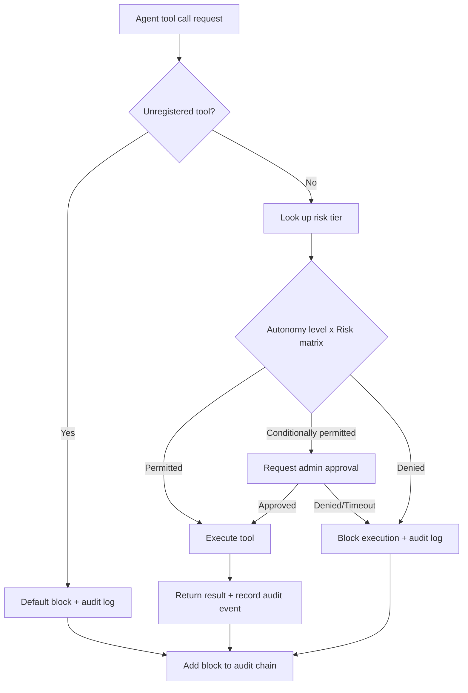

## Overview

Adopting AI agents in the financial industry is no longer optional. As applications expand -- credit assessment automation, fraud detection, customer service support -- every financial institution must simultaneously achieve operational efficiency and regulatory compliance.

The problem is that existing AI platforms do not address both goals together. Cloud-based LLM APIs are powerful, but data passes through overseas servers. Open-source agent frameworks often lack audit trails or access controls. Meanwhile, regulators require traceability for every judgment an AI makes, in accordance with the Electronic Financial Supervision Regulations, ISMS-P, and Korea Financial Security Institute guidelines.

This article uses a hypothetical domestic bank case to examine an architecture in which AI agents satisfy financial regulations while delivering meaningful workflow automation. The key elements are an autonomy control mechanism and a tamper-proof audit framework.

---

## Where Financial Institutions Get Stuck with AI Adoption

### Data Localization Requirements

Article 13-2 of the Electronic Financial Supervision Regulations and the Financial Services Commission's cloud usage guidelines in principle prohibit -- or require prior approval for -- processing or storing customer financial data on overseas servers. Using generative AI directly through an external API can transmit account numbers, transaction histories, and customer identification data embedded in prompts to data centers abroad. This single issue has halted many financial institution proof-of-concept projects.

### Absence of Audit Trails

If an AI's recommendation of a specific credit limit or automatic suspension of a suspicious transaction cannot be reproduced after the fact, it becomes a serious risk during FSS inspections or internal audits. "The AI did it" is not an answer regulators accept. A chronologically reproducible record is required: which model, with what inputs, called which tools, and produced what outputs.

### Control Uncertainty with Autonomous Agents

When deploying agents that go beyond simple chatbots -- calling external APIs, reading files, sending emails, executing system commands -- unexpected behavior can occur if the boundary of what the agent is allowed to do is not clearly defined. In finance, an autonomous agent that executes transactions with misplaced autonomy can result not only in financial losses but in regulatory violations.

### Multi-Tenancy and Internal Isolation

Even when different divisions -- securities, insurance, trust -- share the same AI infrastructure, each team's data and audit logs must be completely isolated. If an agent from one department can access customer data or transaction records of another, it violates internal control principles.

---

## Governance Architecture: Policy Engine and Autonomy x Risk Matrix

### Why a Policy Engine Must Exist

Giving an agent a tool and controlling how that tool is used safely are different problems. Simply configuring "this agent may use the customer query API" cannot prevent the agent from executing thousands of queries in succession due to a misjudgment, or reading sensitive fields excessively.

Praxis's policy engine cross-examines two dimensions before any tool call is executed.

**4 Levels of Autonomy:**

- **L0 (Fully Manual):** The agent only proposes; a human approves every execution.
- **L1 (Low-Risk Autonomy):** Only read-only, non-monetary tasks are executed automatically.
- **L2 (Medium-Risk Autonomy):** Transactions below a predefined threshold execute automatically; above threshold, approval is requested.
- **L3 (High Autonomy):** Broad autonomous execution within the scope permitted by the policy engine.

**7 Risk Tiers:**

Tool calls are classified from Tier 1 (simple query) to Tier 7 (irreversible external transaction) based on risk. For example, checking a customer balance is Tier 1; executing an inter-account transfer is Tier 6-7. Each built-in tool has a pre-registered risk tier; unregistered tools are blocked by default.

### Policy Decision Flow

### Hypothetical Case: Bank A Credit Assessment Agent

Bank A wants to deploy an AI agent for SME credit assessment. The tasks the agent performs are as follows:

1. Query corporate credit information from the NICE credit inquiry system (Risk Tier 2)
2. Query the internal loan history database (Risk Tier 1)
3. Analyze financial statements and recommend credit limits (judgment only, no external execution)
4. Draft a credit assessment opinion (document generation)
5. Call the limit registration API upon approval (Risk Tier 6)

In this case, the agent's autonomy level is set to L2. Tasks 1-4 execute automatically, but the Tier 6 limit registration API call for task 5 requires mandatory officer approval. It is structurally impossible for the agent to register the limit directly without approval.

Nine high-risk operations (account termination, bulk transfers, external system integration changes, etc.) require admin approval regardless of the autonomy level.

---

## Audit and Traceability: Hash-Chain Logs and Personal Data Masking

### How Hash-Chain Audit Logs Work

Praxis's audit framework is designed with a hash-chain structure. Each audit event contains the hash value of the previous event, so deleting or modifying a middle record causes hash verification to fail for all subsequent blocks. This structure enables detection of tampering even if a database administrator accidentally or intentionally alters logs.

More than 20 event types are recorded; key items include:

- `agent.tool.invoked`: Tool call request (agent ID, tool name, execution context)
- `agent.tool.policy.denied`: Block by policy engine (risk tier, autonomy level, decision rationale)
- `agent.tool.approval.requested`: Admin approval request generated
- `agent.tool.approval.decided`: Approval/denial result (decision-maker ID, timestamp)
- `agent.session.started`: Agent session started (team ID, agent ID, session ID)
- `sandbox.exec`: Code execution event within sandbox

Each event is keyed by `run_id`, enabling all tool calls, policy decisions, and approval history that make up a single credit assessment workflow to be queried and reproduced under a single `run_id`. Audit logs are retained for 90 days or more.

### Automatic Masking of 16 Personal Data Categories

Data processed by agents may include personal information such as resident registration numbers, account numbers, phone numbers, and email addresses. Praxis's prompt protection layer detects 16 categories of personal data patterns in real time at the input stage and automatically masks them.

For example, if a customer information query result contains a resident registration number, it is replaced with `[Resident Registration Number Masked]` before the agent passes it to the LLM. Since audit logs also record only the masked form rather than the original data, the risk of logs themselves becoming a personal data exposure vector is reduced.

The system also detects 11 types of prompt injection attack patterns in real time (role switching, instruction ignoring, escape attempts, etc.) to block attempts to cause the agent to malfunction through malicious inputs.

### Multi-Tenancy Isolation

Even when Bank A's credit department and asset management department use the same Praxis instance, wikis, sessions, settings, and audit logs are completely isolated based on team identifiers (team IDs). If an agent from the credit team attempts to access customer data from the asset management team, the data itself responds as "not found," exposing not even its existence.

---

## ThakiCloud Implementation Implications

### On-Premises + Air-Gap Deployment for Data Localization Compliance

The ThakiCloud AI Platform can be deployed directly to the internal network of a financial institution's data center on a Kubernetes basis. Since all inference computation takes place within the institution, customer financial information is never transmitted outside. The Praxis roadmap includes an air-gap deployment kit [estimate: Q1 2027], with plans to support configurations that operate independently even in closed network environments where external networks are completely blocked.

Observation infrastructure (VictoriaMetrics/VictoriaLogs) is also deployed together on the internal network, enabling real-time monitoring of agent operations, costs, and anomalous behavior.

### Keycloak OIDC RBAC Integration with Existing User Directories

Financial institutions typically operate employee directories based on AD (Active Directory) or LDAP. The ThakiCloud AI Platform integrates with existing directories through Keycloak's OIDC integration, so that employee account creation, deletion, and permission changes are immediately reflected in the AI platform as well. This prevents retired employees' accounts from retaining access to AI agents.

### Linking the Policy Engine with Internal Control Frameworks

The autonomy x risk matrix can be directly mapped to a financial institution's internal control framework. For example, the "two-person approval for critical operations" principle required by the Financial Services Commission's internal control standards can be implemented as a mandatory approval rule for high-risk operations in the policy engine.

Audit teams can query the complete processing history of a specific credit case using `run_id`, and confirm on a single screen what data the agent referenced, what decisions the policy engine made, and who the approver was. This contributes to securing post-hoc verifiability of AI behavior at the level required by FSS inspections.

### Cost Optimization through the LLM Router

An LLM router supporting more than 10 LLM providers as well as ThakiCloud's own Metis can restrict financial institutions to using only specific models that have received security approval, or automatically route between cost-efficient models and high-accuracy models depending on the task type. A hybrid configuration using on-premises Metis as the primary inference backend and external providers only as a fallback simultaneously achieves data localization requirements and cost efficiency.

---

## Limitations and Considerations

An honest assessment is necessary. No matter how sophisticated the architecture, real-world constraints exist.

**Regulatory Interpretation Uncertainty:** Domestic regulations on financial AI governance are still evolving. The AI utilization provisions of the Electronic Financial Supervision Regulations and the Korea Financial Security Institute's AI security guidelines often do not specify detailed technical requirements, so actual compliance requires prior consultation with legal teams and regulatory authorities. There is no guarantee that the audit logs and policy engine provided by Praxis satisfy specific regulatory requirements; this requires separate review for each institution.

**SOC 2 Type II Certification:** The Praxis SOC 2 Type II certification roadmap is scheduled for Q2 2027 or later. Financial institutions currently requiring SOC 2 Type II certification must take this timeline into account.

**Complexity of Policy Design:** The autonomy x risk matrix is a powerful tool, but correctly designing it to fit an organization's business processes requires considerable domain knowledge and time. If initial policy design is flawed, problems will arise where the agent blocks too many operations (excessive restriction) or has too much autonomy (excessive permissiveness). Phased deployment and data-driven policy adjustment are essential.

**Unpredictability of Agent Behavior:** The policy engine provides control at the tool-call level but does not fully control the LLM's reasoning process itself. Even when an agent uses only policy-permitted tools, it may execute them in unexpected sequences or combinations. Particularly for operations like credit assessment where judgment accuracy is critical, AI agents must be clearly defined as supporting the decision-making of responsible officers -- not holding final decision authority.

**Technical Burden of On-Premises Operations:** Operating an on-premises Kubernetes environment requires significantly more infrastructure operational capability than cloud SaaS. Specialized personnel are needed throughout the entire operational cycle -- ArgoCD GitOps, Keycloak management, model update deployment, and more. This aspect should be reviewed together with an operational support contract with ThakiCloud or an internal capability development plan.

---

Adopting AI agents in the financial sector is not a technology problem -- it is a governance problem. The core questions are: where is data stored, to what extent can an agent act autonomously, and are all of those actions recorded in a verifiable manner? The policy engine and hash-chain audit logs provide technical answers to these three questions, but it is equally important to remember that this is not the entirety of regulatory compliance.
