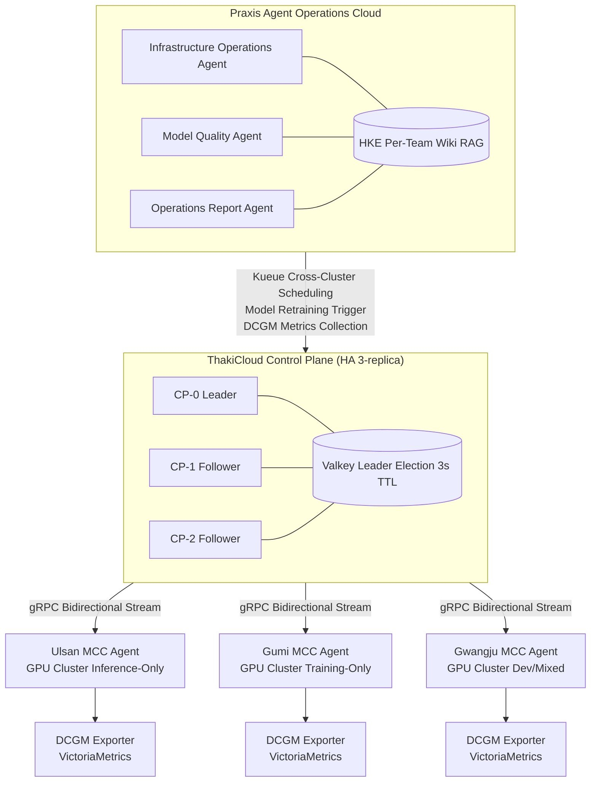

## Overview

Modern manufacturing faces a structural contradiction: high intent to adopt AI, but a critical shortage of operational personnel. Even when factories want to deploy vision inspection models on production lines, they lack the MLOps specialists to maintain, service, and retrain those models. With three factory GPU clusters each managed by different teams, resource waste and downtime repeat in a cycle.

This article explains how multi-persona autonomous agent teams resolve this problem and how GPU clusters distributed across multiple factories can be unified under a single control plane -- using the hypothetical manufacturer "HanTek" as a case study. The core technologies covered are ThakiCloud AI Platform's multi-cluster central management and the Praxis agent operations cloud.

---

## The Talent Bottleneck in Manufacturing AI Operations

HanTek is a mid-size electronics components manufacturer operating GPU clusters at facilities in Ulsan, Gumi, and Gwangju. Over the past two years, the company deployed vision AI models on each factory line, but three recurring problems emerged in operations.

**First, an absolute shortage of MLOps talent.** Model retraining, deployment, and performance monitoring require dedicated engineers. HanTek's ML team of three engineers struggled to manage the model lifecycle across all three factories. Even as model performance began to degrade, retraining requests routinely sat in a queue for days.

**Second, fragmented multi-cluster management.** Each factory's GPU cluster operated independently. Situations arose where training jobs at Gumi were queued while the Ulsan cluster sat idle, requiring manual coordination via Slack. DCGM metrics were also collected separately per factory, making it impossible to see company-wide GPU utilization at a glance.

**Third, the impossibility of 24/7 response.** When quality anomalies were detected on night or weekend lines, the ML team could not respond immediately. Alerts arrived, but actual remediation was pushed to the next morning -- with defective products sometimes advancing to the next process in the interim.

These problems are not unique to HanTek. Across the manufacturing industry, a recurring pattern emerges: AI has been adopted, but operational capability has not kept pace, cutting effectiveness in half.

---

## Autonomous Agent Team Configuration - Multi-Persona and Dynamic Tasks

The solution HanTek adopted is a Praxis-based multi-persona autonomous agent team. Praxis is an agent operations cloud that treats agents as first-class resources "like VMs on AWS." Skills, Tools, Policies, and Audit Logs are the platform's core resources, and each agent references its domain wiki (Hybrid Knowledge Engine, HKE) to make judgments based on accumulated knowledge.

HanTek configured the agent team with three personas.

### Infrastructure Operations Agent

The infrastructure operations agent is responsible for GPU cluster status monitoring, job scheduling optimization, and automatic recovery when anomalies are detected. It continuously collects metrics from Kueue and KAI Scheduler, and autonomously decides to relocate jobs to another cluster when a particular cluster's queue wait time exceeds a threshold.

This agent executes recurring tasks defined in natural language -- such as "generate a GPU utilization report every morning at 7 AM" -- through Praxis's dynamic task scheduler. Operators no longer need to write separate cron scripts; they simply enter the task specification in chat or Slack and the agent self-schedules.

### Model Quality Agent (Benchmark Analyst Persona)

The model quality agent continuously monitors the performance of vision AI models on each line. It analyzes inference latency and accuracy metrics collected from VictoriaMetrics, and automatically triggers the retraining pipeline when performance degradation exceeds a threshold. After retraining completes, it posts a summary of the benchmark results to the ML team's Slack channel.

This agent references the line-by-line model history accumulated in the HKE. Domain knowledge such as "this line's model requires retraining every three months, and the baseline accuracy standard is 98.5% or above" is documented in the wiki, enabling the agent to make contextually informed judgments.

### Operations Report Agent (Report Automation Persona)

The operations report agent automatically generates and distributes daily, weekly, and monthly AI operations reports. It aggregates GPU utilization, inference counts per model, quality anomaly detection events, and retraining status, then formats them into a form management can easily read. Through Praxis's multi-channel delivery capability, reports are simultaneously posted to Slack, email, and web dashboards.

### Agent Team Collaboration Structure

The three agents operate independently but collaborate when needed through Praxis's Multi-Agent Orchestration. For example, when the model quality agent triggers retraining, a cross-agent delegation automatically occurs -- requesting the infrastructure operations agent to secure GPU cluster capacity for training. This delegation process records all decision-making through the Policy Engine and Audit Log.

---

## Multi-Cluster Central Management - GPU Unification Across Multiple Factories

For the agent team to function properly, GPU clusters across multiple factories must be centrally managed under a single control plane. ThakiCloud AI Platform's Multi-Cluster Cloud (MCC) system fills this role.

The diagram below is a simplified representation of HanTek's actual architecture.

### Control Plane and Data Plane Separation

ThakiCloud AI Platform strictly separates the control plane (CP) from the data plane (DP). This separation matters in manufacturing environments because **inference jobs on factory lines continue running even when the CP experiences a failure**. The Ulsan factory's vision AI operates without interruption during CP network disconnections precisely because of this architecture.

An MCC Agent is deployed in each factory cluster. This agent communicates with the CP via gRPC bidirectional streaming, maintaining connectivity through Make-Before-Break reconnection even when network delays occur. Even when a WAN link is completely severed, data plane jobs are unaffected.

### Kueue and KAI Scheduler Cross-Cluster GPU Scheduling

Each factory cluster manages GPU workloads through Kueue and KAI Scheduler. KAI Scheduler calculates inter-cluster scores in order of GPU > CPU > memory > disk to determine optimal placement. The infrastructure operations agent reads this scheduler's metrics and, upon detecting signals such as "Ulsan cluster training queue wait time exceeds 30 minutes," proposes job relocation to the Gumi cluster or executes it automatically [estimate].

When GPU utilization consistently exceeds 80% of the cluster average, a VictoriaMetrics alert triggers and the infrastructure operations agent generates a capacity expansion recommendation report, posting it to the ML team channel.

### DCGM-Based GPU Telemetry Integration

Each cluster's DCGM (Data Center GPU Manager) Exporter collects GPU telemetry into VictoriaMetrics. HanTek previously had to view separately configured Grafana dashboards per factory, but now VictoriaLogs and VictoriaMetrics provide a centrally aggregated single observability layer. The model quality agent directly queries these metrics to detect inference latency anomalies.

### ArgoCD GitOps and Cluster Consistency

Model deployments and configuration changes across the three factory clusters are all managed through ArgoCD using a GitOps approach. When an MCC Agent is registered to a new cluster, an ArgoCD cluster secret is automatically created. When the operations report agent detects an update to a specific model, it creates a PR in the corresponding Git repository [estimate], and ArgoCD automatically deploys it to each factory cluster.

---

## ThakiCloud Application Implications

The practical application insights from the HanTek case are as follows.

**A substantive approach to resolving talent bottlenecks.** Multi-persona agent teams are not designed to replace MLOps engineers, but to delegate repetitive monitoring and reporting tasks. Engineers focus on high-value work such as model architecture improvements and anomaly case analysis, while agents handle day-to-day operations. The long-term value comes from the fact that the more domain knowledge is accumulated in the HKE wiki, the higher the agent's judgment accuracy becomes.

**Operational flexibility through the dynamic task scheduler.** Praxis's dynamic task scheduler allows tasks to be defined in natural language, enabling field operators to set up automation directly without going through the IT department. Specific operational requirements such as "send a summary report of the previous week's quality anomalies to team leaders' email every Monday at 8 AM" can be reflected immediately.

**Visibility through multi-cluster integration.** Multi-cluster management through a single control plane provides at-a-glance visibility into company-wide GPU utilization, job queue status, and per-cluster costs. Policies that were previously impossible -- such as "automatically allow new training jobs when the combined GPU utilization across three factories falls below 60%" -- can now be configured at the control plane level.

**Reliability of the policy engine and audit logs.** In manufacturing environments, traceability of AI-driven decisions is critical. Praxis's Policy Engine and Audit Log record all agent actions and leave an auditable record of what actions were taken based on what rationale. This provides practical assistance in meeting quality certification audits and internal compliance requirements.

---

## Limitations and Considerations

This approach does not apply uniformly to all manufacturing environments. There are practical constraints to examine before adoption.

**Initial domain knowledge construction cost.** Building out the domain knowledge in the HKE wiki that agents will utilize requires upfront investment. Tacit knowledge such as line-specific model characteristics, normal operating ranges, and retraining criteria must be explicitly documented. Deploying agents without this preparation can result in early judgment errors.

**Defining the scope of agent autonomy.** The range of decisions agents can make autonomously must be clearly defined. Model retraining triggers and report generation are well-suited to autonomous execution, but model replacements and cluster reconfigurations that affect production lines are safer to keep under human approval steps. Praxis's Policy Engine allows these boundaries to be configured.

**The reality of network environments.** In domestic heavy-industry factory environments, firewall policies are often strict for connections between internal factory networks and the cloud. It must be verified in advance whether MCC Agent's gRPC connections are permitted and whether WAN bandwidth is stable. For on-premises-only environments, a configuration deploying both CP and DP on-site should be considered.

**Complexity of agent collaboration.** Multi-agent orchestration creates more complex failure scenarios than a single agent. Rollback policies and alerting systems must be designed to handle cases where one agent sends an incorrect cross-agent delegation. While Praxis's Plan-Execute Pipeline structures execution in three stages -- Planner, Executor, and Synthesizer -- sufficient testing for anomaly cases is essential.

**Gradual acquisition of operational maturity.** Delegating all operations to agents from the outset is not recommended. A gradual approach is more realistic: start with low-risk tasks such as reporting automation, verify the quality of the agent's judgments, and expand autonomy only after trust has been established.

---

The talent bottleneck in manufacturing AI operations cannot be solved simply by hiring more people. The sustainable direction for manufacturing AI operations is a structure where autonomous agent teams handle repetitive operational tasks, multi-cluster central management reduces GPU resource waste, and people focus on more complex judgments and improvements. ThakiCloud AI Platform and Praxis provide the concrete technical means to implement this structure.
