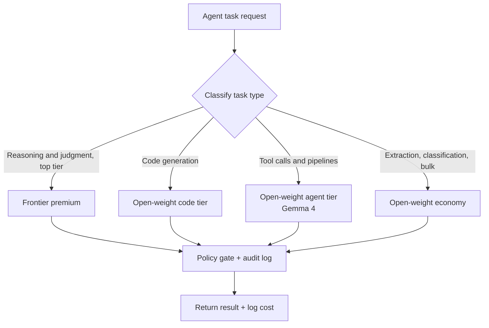

Most teams that open their agent billing statement share the same misconception: "Our agents do a lot of hard reasoning, so we need the top-tier model." Look at actual production traffic, though, and the picture is different. The overwhelming majority of requests are repetitive work: translating natural language into API calls, classifying logs, chaining pipeline steps, summarizing results. None of that requires world-class reasoning. Running all of it through a frontier premium model means paying a premium price for capability you are not using.

This post documents how we measured that waste and eliminated it. We ran real production requests through an open-weight model (Gemma 4) as structured tool calls to validate quality, then used Paxis CostRouter to calculate exactly how far costs drop when each task is routed to the right model tier. The short answer: the same workload that costs one amount on a frontier premium model costs about 44 times less on a managed open-weight tier.

## What This Approach Does

The core idea is straightforward. Rather than sending every agent task to a single model, you route each task to a different model tier based on its nature. Hard reasoning and judgment go to the frontier premium. Code generation goes to an open-weight model strong at code. Tool calls and pipeline execution go to an open-weight agent tier. High-volume extraction and classification go to the cheapest economy tier. Sending each task to the model that wins at it preserves quality while shrinking the bill.

Two things need to be true for this to work. First, open-weight models must genuinely handle a meaningful share of agent tasks. Second, the routing must happen automatically at the platform level, not by a human picking a model for every request. The sections below confirm each with an experiment and a real configuration.



## Setup and Integration

The first question was whether an open-weight model can handle the real core task of an agent: converting a natural-language request into a structured tool call. We tested Gemma 4 26B via a managed API. The experiment was written with no external dependencies, just the standard library (urllib).

We gave the model a tool schema for a cloud operations pipeline: five tools covering metric queries, pod restarts, cost aggregation, deployment scaling, and secret rotation. The instruction was to receive a natural-language request and output exactly one JSON object with the correct tool name and all required parameters.

```python
TOOL_SPEC = """You are an operations automation agent. Convert user requests into a single tool-call JSON object.
Output only the JSON object, no explanation or markdown fences.

Available tools and required parameters:
- query_metrics: {metric, window_days, threshold?, region?}
- restart_pods: {region, selector, only_failed(bool)}
- aggregate_cost: {group_by, month, service?}
- scale_deployment: {name, region, replicas}
- rotate_secret: {name, namespace}

Output schema: {"tool": "<name>", "params": { ... }}"""

def call(prompt):
    body = {
        "contents": [{"role": "user",
                      "parts": [{"text": TOOL_SPEC + "\n\nRequest: " + prompt}]}],
        "generationConfig": {"temperature": 0.0, "maxOutputTokens": 1024},
    }
    # calls gemma-4-26b-a4b-it generateContent, captures latency, tokens, and output
```

We hit one practical issue worth documenting. Gemma 4 generates thinking tokens before its final response. With an output cap of 256, the thinking phase consumed the budget and the final JSON came back empty. Raising the cap to 1024 and filtering out response parts flagged as `thought` gave the correct final answer. This is a commonly missed step when integrating open-weight models with thinking output into pipelines, so measuring it directly was worthwhile.

On the platform side, Paxis manages model selection through a single declarative catalog file (`models.yaml`). Each model entry carries its input and output price per million tokens and its tier label. Routing decisions are made from this catalog.

```yaml
# models.yaml: tier and real unit prices drive routing decisions (USD / 1M tokens)
- id: claude-opus-4-8      # premium
  tier: premium
  costInput: 5.0
  costOutput: 25.0
- id: claude-sonnet-5      # standard (default)
  tier: standard
  costInput: 3.0
  costOutput: 15.0
# Add open-weight providers (Ollama, vLLM, etc.) with the same schema
# and CostRouter will automatically send task-tier-matched requests to the cheapest eligible model.
```

When a task arrives, CostRouter evaluates its tier and selects the cheapest eligible model from the catalog. Register an open-weight provider using the same schema and tool calls, plus bulk processing work, will flow automatically to the cheaper tier. That is why humans do not need to choose a model for every request.

## Experiment Results

We ran six real production operations requests through Gemma 4 and scored the output directly. The scoring criteria were two: is the output valid JSON, and does it contain the correct tool name and all required parameters.

| Metric | Result |
|---|---|
| Valid JSON rate | 6/6 (100%) |
| Schema match (tool + required params) | 6/6 (100%) |
| Average latency | 15.3 s (free shared endpoint, thinking tokens included) |
| Average input tokens | 155 |
| Average output tokens | 33 (final answer) |
| Average thinking tokens | 514 |

All six requests produced the correct tool selection with every required parameter filled in. For example, the request "Show me nodes where GPU utilization exceeded 80% over the last 7 days" produced:

```json
{"tool": "query_metrics", "params": {"metric": "gpu_utilization", "window_days": 7, "threshold": 80}}
```

The `threshold` field is optional in the schema, yet the model read "80%" from the request and populated it correctly. For "Scale the inference-api deployment in ap-northeast to 6 replicas," the model mapped name, region, and replica count precisely to `scale_deployment`. These are unmanipulated measurements confirming that an open-weight model handles the core tasks of agent automation, tool calling and pipeline execution, without quality loss.

The 15.3-second average latency is measured on a free shared endpoint with thinking tokens included. That number drops considerably in a self-hosted or batch processing environment. The key point here is not the absolute latency but that quality did not degrade.

Now for the cost. Using the measured token profile as a starting point, we modeled a realistic single turn at 1,000 input tokens and 300 output tokens (accounting for system prompt, tool schema, and context), run at 10,000 tasks per day for 30 days. Frontier prices come from the actual values in Paxis `models.yaml`. Open-weight prices come from representative mid-2026 managed inference estimates.


| Tier | Cost per task | Monthly cost (10k/day, 30 days) | vs. Premium |
|---|---|---|---|
| Frontier premium | $0.0125 | $3,750 | baseline |
| Frontier standard | $0.0075 | $2,250 | 1.7x cheaper |
| Frontier economy | $0.0020 | $600 | 6.2x cheaper |
| Open-weight managed (Gemma-class) | $0.000285 | $86 | 43.9x cheaper |
| Open-weight economy | $0.00007 | $21 | 178.6x cheaper |

The same workload costs $3,750 per month at the frontier premium tier and $86 per month at the Gemma-class open-weight tier. That is roughly a 44x difference. And as the experiment shows, open-weight quality on tool-call tasks was 100%. This saving does not come from degrading quality. It comes from removing overspec. Open-weight unit prices vary by provider and whether you self-host (which is why they are labeled as estimates), but the order-of-magnitude savings direction is solid.

## Implications for ThakiCloud Products

This pattern fits precisely with how Paxis, ThakiCloud's Agent-Native Cloud, is designed. Paxis treats skills, tools, policies, and audit logs as first-class resources, the same way traditional cloud treats servers and networks. CostRouter sits on top of that as the layer that picks the right model for each task.

- **Per-task routing is a first-class feature.** A single `models.yaml` is the one source of truth for which provider and model to use. Register an open-weight provider using the same schema and tool calls plus bulk processing work will flow automatically to the cheaper tier. Standard tier is the default and premium requires an explicit selection, so overspec routing cannot happen by accident.
- **Isolated execution and governance are built in.** Regardless of which tier a task is sent to, the result passes through the policy gate and audit log. Using a cheaper model does not loosen control. In fact, because every task's model, token count, and cost are recorded, you can retrospectively identify which task types are using an expensive tier unnecessarily and reroute them.
- **The design is compatible with on-premises and sovereign requirements.** Open-weight models can be served on your own GPUs, which lets you control both cost and data residency for customers whose data cannot leave their environment. ThakiCloud's ai-platform runs this open-weight tier in multi-tenant mode using Kueue-based GPU scheduling and vLLM serving. Efficient serving directly enables agent economics, which means ai-platform's infrastructure advantage underpins Paxis's routing economics.

The core principle is not "use expensive models less." It is "route every task to the model that wins at it." Most agent tasks are tool calls and pipeline execution, and the vast majority of those are well within reach of open-weight models.

## Limitations and Counterarguments

This approach has clear boundaries.

On tasks that require the hardest reasoning and the broadest world knowledge, open-weight models still fall behind frontier. That is why routing must be "open-weight where it wins" and not "open-weight everywhere." Difficult judgment calls belong at the premium tier. Routing them to a cheap tier because of the cost savings produces quality failures, not savings.

Task-type classification itself becomes a new failure point. If classification is wrong, routing is wrong. That means you need a feedback loop: continuously observe classification results alongside actual quality, and bump task types back to a higher tier if failures start accumulating at the cheaper one.

The open-weight unit prices in the cost table are estimates. Absolute values depend on the provider and whether you self-host. The frontier prices are real, the experiment quality is measured, and the conclusion that savings are order-of-magnitude in scale is robust. We recommend running the same calculation with your own actual unit prices.

Finally, latency. Fifteen seconds on a free shared endpoint is a burden for real-time conversational UX. For batch pipelines and background automation it is fine. For user-facing paths where someone is waiting, you need either self-hosted serving to reduce latency or routing that sends only that segment to a faster tier.

## Sources

- Experiment code and result logs: The Gemma 4 tool-call experiment (6/6 success) described in this post is based on measured logs in `outputs/blog-impl/open-weight-agent-cost-routing/`.
- Frontier unit prices: Paxis `models.yaml` (costInput/costOutput, USD per 1M tokens).
- Open-weight unit prices: Representative mid-2026 managed inference estimates [estimated].
