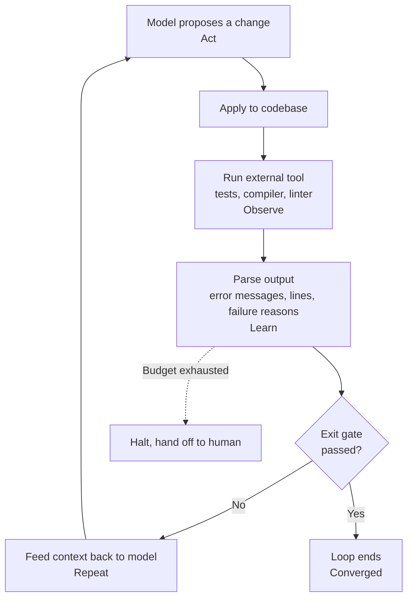

## Overview

A single sentence recently made the rounds among developers: "I don't type prompts into Claude Code anymore. I run a loop that feeds prompts to Fable, and my job is just writing that loop." It's a provocative line, but once you strip away the marketing gloss, there's a genuinely useful observation buried in it: the unit of work is shifting from a single prompt to a whole loop.

This shift has little to do with models getting smarter. Even the strongest model, faced with a one-shot request, can't push a complex task all the way through in a single pass. But wire that same model into a repeating structure, one where it calls tools, takes the results back as input, and decides its next move, and the picture changes. ThakiCloud runs a Kubernetes-based AI/ML SaaS platform, and we run exactly this kind of loop in our own internal development. So for us, "writing a loop" isn't a trend to comment on; it's a daily engineering concern. This post lays out what that loop actually consists of, and what makes it trustworthy.

## From Prompts to Loops: What Actually Changes

In the prompt-writing mindset, a person tries to extract the most accurate possible result from a single instruction. Good prompts still matter, but the limits of this approach are clear. When the result is wrong, a human has to read it, figure out what went off track, and refine the prompt again. The human ends up being both the grader and the next instructor, every single iteration.

The loop-writing mindset hands that grading and re-instructing over to the structure itself. Instead of crafting individual prompts, a human defines the goal, what to observe, and when to stop. The model acts within that frame, an external tool judges the result, and that judgment becomes the model's next input. The human's role shifts from watching every turn to designing the loop's boundaries and its exit conditions.

This difference looks small but compounds into something significant. In the prompt-based approach, the human is the bottleneck, because nothing moves forward until a person has read the whole result. In the loop-based approach, the bottleneck isn't the human anymore, it's the quality of the exit condition. When the exit condition is well defined, the loop keeps converging even while the human is away. When it's weak, no model, however capable, can escape spinning in circles. So the real core of loop engineering isn't a knack for polished prompt wording, it's the design skill of making "what counts as success" something a machine can judge on its own.

## Anatomy of a Loop: Observe, Judge, Act, Repeat

A coding loop that actually converges tends to repeat the same four steps. The model proposes a change (Act). That change is applied to the codebase, and an external tool is run to get a result (Observe). The output is parsed into context about what failed and why (Learn). That context is fed back into the model for its next proposal (Repeat). This cycle continues until an exit gate passes or the budget runs out.

The third step, Learn, is especially important here. If you summarize or compress the tool's output before feeding it to the model, the loop tends not to converge well. The compiler's exact error message, the specific file and line that failed, the precise nature of a type mismatch, all of that needs to go into the next prompt's context untouched, so the model can reconstruct "why it failed" without relying on memory across sessions. To a human, that raw output looks like verbose logging. To the loop, that verbosity is the signal that drives convergence.

## Deterministic Gates Are the Reward Signal

The place loop engineering most often goes wrong is the exit condition. If you ask the model whether the task is done and let its answer decide when to stop, the model will end the loop early with self-reports like "this looks complete." That's not verification. A trustworthy loop hands the exit decision to a deterministic tool instead of the model: do the tests pass, does the compiler build without errors, is the type checker quiet. This pass/fail signal plays the same role that a reward signal plays in reinforcement learning. There's no need to train a separate reward model; the test runner and compiler you already have can judge "is this code correct" on their own.

ThakiCloud has built this principle directly into our internal loops. The clearest example is pge-loop: it applies a model-proposed diff on the Go backend, runs `make test-short`, and feeds the entire stderr output back into the context for the next proposal. The exit condition isn't the model's own judgment, it's the test's exit code. Goal Mode works the same way: it pursues a goal autonomously until an achievement condition is met, but every step's progress is checked against a fixed verification command, and a budget (iteration count, cost, deadline) sets a hard ceiling. It doesn't spin forever, it either converges or exhausts its budget. Without these two safeguards, a deterministic exit gate and a budget ceiling, a loop becomes a tool you can't trust.

When fan-out is involved, one more rule applies. When you spin up multiple sub-agents in parallel and gather their results, you always close the loop with a verification stage before merging anything. For code output, that means a test gate. For judgment or research output, it means dispatching several skeptical verifiers with different perspectives and filtering by vote. Merge parallel results without verification, and you accumulate output that looks plausible but is wrong. When quality isn't landing, the first thing to suspect usually isn't the model's tier, it's a missing verification stage.

## Implications for ThakiCloud's Products

Loop engineering connects directly to Paxis. Paxis is the Agent-Native Cloud control plane running on top of ai-platform, and it treats Skills, Tools, Policies, and Audit Logs as first-class resources. For a loop that a person designs to become a platform-level resource rather than staying confined to a personal dev environment, the pieces that make up that loop need to be exposed in a manageable form. Paxis selects from roughly 960 skills using BM25, runs them in isolated sandboxes, and passes every action through policy gates and audit logs. In other words, once a person designs "what to observe and when to stop," Paxis supplies the underlying infrastructure that isolates, records, and controls that loop's execution.

From this angle, the deterministic gate maps naturally onto Paxis's policy gate, tool execution maps onto sandboxed isolated execution, and the loop's observation log maps onto the audit log. A loop that verifies itself follows the same principle Paxis emphasizes: fan-out closed by verification.

On the infrastructure side, the ai-platform lens fills out the rest of the picture. Running more loops means more repeated inference calls and test executions. ai-platform absorbs that repeated load cost-effectively through Kubernetes and Kueue-based GPU scheduling, vLLM serving, and multi-tenant isolation. Low serving cost is what makes running loops frequently economically viable, and that economics is what turns an agent into something you can operate continuously rather than occasionally. Low-cost serving (ai-platform) is what creates agent economics (Paxis), and that connection holds here. For customers with on-premises and sovereignty requirements, being able to run this entire loop inside their own infrastructure carries particular weight.

## Limits and Counterarguments

Presenting loop engineering as a cure-all wouldn't be honest. First, for tasks where you can't construct an exit gate, a loop is actually dangerous. Without a command that can automatically judge pass or fail, the loop has no idea where convergence is and just burns through budget. In that case, a single-shot approach is better, and it's better to admit that plainly.

Second, the deeper a loop runs, the more people tend to trust the result and stop reviewing it. The attitude of "the loop will catch it anyway" is the most quietly dangerous failure mode there is. Automation is a tool that supports thinking, not a replacement for it, and the core outputs still need periodic sampling review by a human. If a verifier never catches anything, that doesn't mean everything passed, it more likely means the verifier itself is broken.

Third, cost. A loop, by definition, consumes multiple rounds of inference calls. Without a ceiling, budget disappears fast, and if you keep a strong model attached at all times, cost doesn't scale linearly, it multiplies. In practice, you need routing that uses a cheap model for exploration and repeated execution, and reserves the expensive model only for verification stages where accuracy is critical. The principle of "cheap workers, expensive gates only" applies here just as much as anywhere else.

To sum up: "I don't write prompts, I write loops" is a provocative sentence, but there's substance inside it. That substance doesn't come from a flashier model, it comes from the unglamorous work of designing a system where a machine can judge what counts as success. That's the same lesson ThakiCloud has learned from pge-loop and Goal Mode: a good loop comes from a good exit condition.

## Sources

- Miles Deutscher, post on X (formerly Twitter), commentary on coding agent loops
- ThakiCloud's internal loop-engineering practice: pge-loop, Goal Mode (verification gate + budget ceiling)
- [ReAct: the foundational paper on reasoning-and-acting agent loops (arXiv:2210.03629)](https://arxiv.org/abs/2210.03629)
- [Anthropic, Building Effective Agents: tool use, evaluator-optimizer loop, orchestrator-workers](https://www.anthropic.com/research/building-effective-agents)
