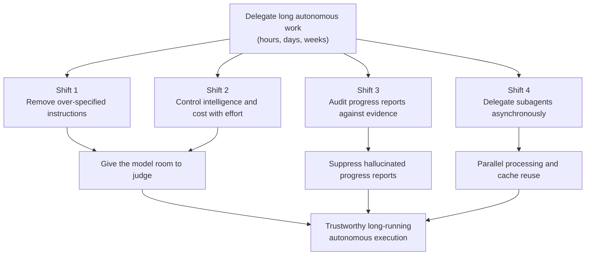

## Overview

There is a document worth reading before you open Claude Fable 5 again. Anthropic quietly added an official prompting guide for Claude Fable 5 and Claude Mythos 5 inside its prompt engineering docs. It arrived as a single documentation page rather than a headline announcement, so many people missed it, but the content asks you to reverse a lot of the habits you built for handling previous generations of models, so it is not something to skim past.

Let's start with the least intuitive point. The guide's throughline is not "write better," it is closer to "write less." Detailed instructions you stacked up to get good results from earlier models can actually degrade quality on Fable 5. Fable 5 is designed to take on work complex, long, and ambiguous enough that a person would need hours, days, or even weeks to finish it, and a model built for that kind of delegation gets in its own way when it is handed too many controls. ThakiCloud runs a Kubernetes-based AI/ML SaaS infrastructure and the agent platform on top of it, and we deal with these long-running autonomous agents every day, so each recommendation in this guide is, for us, a question of operating rules. This post walks through the four shifts the guide lays out with their documented evidence, and looks at how they land on our product.


## What This Guide Is

This document is the "Prompting Claude Fable 5" page inside the prompt engineering section of Anthropic's official platform docs. It covers prompting and scaffolding patterns specific to Fable 5 and its higher-tier sibling Mythos 5, organized into fourteen sections. Rather than a general prompting document for the previous generation, it reads as a migration guide focused on what has changed for this model family.

The premise running through it is a capability jump. Fable 5 is built to handle problems that were too complex, too long, or too ambiguous to hand off with earlier models. So using it well is not about tighter control, it is about moving toward giving the model room to judge while building a scaffold of verification and delegation so that judgment does not run off the rails. The guide's recommendations read as four main threads.



## Shift 1: Delete Prompts, Do Not Add to Them

The first recommendation is to reread your existing prompts and skills and delete instructions that are no longer needed. The guide explains that prompts and skills built for older models are often too prescriptive for Fable 5, and that over-specification can actually degrade output quality. The moment a model's capability jumps significantly is exactly the right time to clean out past instructions.

This advice sounds unfamiliar because we have mostly learned prompt engineering as an additive discipline. When you hit an edge case you add a rule, when you see a mistake you bolt on a prohibition, and the prompt keeps growing. But many of those rules were added to patch a specific model's weaknesses. If the model has already moved past that weakness, the rule that remains is not help, it is a constraint that narrows the model's judgment. That is why the guide emphasizes deletion.

Of course, misreading this as "delete everything in your prompt" is dangerous. As covered below with verification instructions, there are still instructions that should be added explicitly. In practice this is closer to an audit: remove instructions one at a time and check whether quality drops, and distinguish between clauses that were patching a specific model's flaws and constraints that are genuinely intrinsic to the task.

## Shift 2: Effort Is the Primary Control for Intelligence, Latency, and Cost

On Fable 5, the primary lever for balancing intelligence, latency, and cost is the effort parameter. The guide recommends starting most work at high, reaching for xhigh on workloads where capability especially matters, and using medium or low for repetitive, well-defined tasks. In other words, instead of squeezing performance out through longer prompts, the default operating method becomes raising and lowering effort to match the nature of the task.

This shift matters from an operations standpoint. Raising effort makes the model do more reasoning, so latency and cost rise together. So effort should not be treated as a value to maximize, but as a budget concept allocated to match task difficulty. Running well-defined tasks at xhigh just leaks cost, and running hard judgment calls at low collapses quality. The precision of your effort allocation, more than the sophistication of your prompt wording, is what governs both your results and your bill.

## Shift 3: Audit Progress Reports Against Evidence

The failure mode that bites hardest in long-running autonomous work is a model confidently reporting that unverified work is done. If a model says "this step is finished" during an hours-long loop with no basis for that claim, the report cannot be trusted, and the next task can easily build on a false state.

The guide gives a concrete instruction sentence for this problem: audit each claim against tool results from the current session before reporting progress, report only work you can point to evidence for, and say so when something has not yet been verified. Here is the guide's own wording.

```text
Before reporting progress, audit each claim against a tool result
from this session. Only report work you can point to evidence for;
if something is not yet verified, say so.
```

Anthropic states that this instruction nearly eliminated fabricated progress reports in its own testing, even on tasks specifically designed to induce hallucinated reporting. Two things matter here. First, this does not contradict shift one's call for deletion. Outdated rules patching a model's flaws should be deleted, but instructions like this one, which protect the trustworthiness of autonomous execution, should be added explicitly. Second, the basis for verification is placed not in the model's own confidence but in the external evidence of tool results. This lines up exactly with a principle we have held for a long time: never treat a model's self-report as a loop's exit condition.

## Shift 4: Orchestrate Subagents Asynchronously

The fourth shift is about multi-agent structure. According to the guide, Fable 5 is far more stable at dispatching and maintaining parallel subagents, and it reliably manages long-running subagents and continuous communication with peer agents. The recommendation is clear: use subagents often, give explicit guidance on when delegation is appropriate, and prefer asynchronous communication over having the orchestrator block while waiting for each subagent to return.

There is a practical cost and performance case behind this. Long-lived subagents that maintain context across multiple subtasks save time and money through cache reuse, and avoid the bottleneck where the whole system is held hostage by the slowest subagent. Handing independent subtasks off to subagents while the orchestrator keeps working in the meantime resembles how a person runs a team. And the recommendation to use independent verification subagents rather than relying on self-criticism alone lifts shift three's evidence-based verification up to the multi-agent layer.

## Implications for ThakiCloud's Products

This guide lands especially directly on Paxis, which we operate. Paxis is ThakiCloud's Agent-Native Cloud: an agent control plane that selects from over 960 skills using BM25, runs them in isolated sandboxes, and routes every action through policy gates and audit logs. The guide's four shifts each map onto this structure.

Shift one's deletion philosophy aligns with the design principles behind Skill Harness. We already keep the harness thin and stack domain knowledge thick inside the skill body, treating unnecessary sentences as context cost to be trimmed. Anthropic's official confirmation that Fable 5 dislikes over-specification gives us grounds to strip out clauses in older skills that were only patching the flaws of a specific past-generation model. Shift three's evidence-based verification is already the job policy gates and audit logs do. A model claiming completion is different from that completion being backed by tool results and an audit trail, and Paxis treats the latter as a first-class resource. Shift four's asynchronous subagent orchestration is exactly the same picture as DAG-based multi-agent execution. An orchestrator streaming independent work in parallel without blocking, then closing it through a verification node, overlaps directly with our principle of closing fan-out with a verification stage.

We also need to look through the ai-platform lens on the infrastructure side. Raising effort to xhigh increases reasoning tokens, which drives up GPU compute demand, and running many parallel subagents creates bursts of GPU fan-out load. ThakiCloud's ai-platform is designed with Kueue-based GPU scheduling and multi-tenant isolation to absorb this kind of variable load. The guide's point that cache reuse in long-lived subagents cuts cost lines up with our own goal of lowering serving cost in on-premises and sovereign environments. Low-cost serving is what makes agent economics work, and that economics in turn enables more aggressive parallel delegation, a virtuous cycle.

## Limitations and Counterarguments

Before taking this guide as gospel, a few things need to be clear. First, this document is specific guidance for Fable 5 and Mythos 5. Carrying the deletion strategy or effort defaults recommended here directly over to other vendors' models or earlier generations could actually degrade quality. The recommendations should be read as scoped to this model family.

Second, the advice to "delete your prompt" is easy to misapply. There are instructions that must remain regardless of model performance: safety constraints, domain regulations, organizational policy. Deletion should not be indiscriminate cleanup, it should be an audit that distinguishes clauses patching an older model's flaws from constraints intrinsic to the task. The guide itself says to add verification instructions explicitly, so its actual message is closer to "write less, but keep what needs to stay clearly."

Third, the figure claiming near-elimination of hallucinated progress reports is Anthropic's own internal test result, not something we reproduced independently in this piece. We agree with the direction that verification instructions are effective, but each organization should measure its own actual failure rate on its own workloads before deciding how much to trust this. Finally, the recommendation to default effort to high raises both cost and latency together, so teams on tight budgets need to actively push well-defined tasks down to medium and low to find their own balance.

To sum up, the value of this guide is not a new magic phrase, it is a shift in attitude toward handling a more capable model. Instead of adding control, give it room to judge, and keep that judgment from running off the rails by verifying with evidence and parallelizing through delegation. For anyone actually operating long-running autonomous agents, this is not a trend statement, it is a realignment of operating rules.

## Sources

- Anthropic, "Prompting Claude Fable 5", Claude Platform Docs: [https://platform.claude.com/docs/en/build-with-claude/prompt-engineering/prompting-claude-fable-5](https://platform.claude.com/docs/en/build-with-claude/prompt-engineering/prompting-claude-fable-5)
