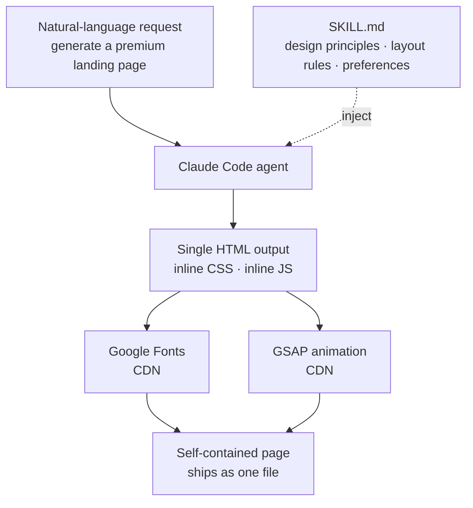

Recently a developer shared on X that they "built a skill so Claude Code creates premium landing pages in one shot," claiming all three sites in the video were one-shot outputs ([@the_cyw](https://x.com/the_cyw/status/2075338024406409239)). The reaction was strong because of how polished the results looked, but the more interesting point for an engineer is elsewhere. Give the same model the same prompt, "build me a landing page," and you get something ordinary; add one skill and an agency-grade page comes out in a single pass. This post takes apart how that skill actually works and validates it from the operating perspective of ThakiCloud, where skills are treated as first-class resources.

## Overview

A Claude Code skill is not magic but a **standard operating procedure (SOP)**. It does not make the model smarter; it strongly constrains capabilities the model already has toward a specific direction, raising average quality. For a landing-page skill, that constraint is precisely the design principles, layout rules, and output format.

This view lines up exactly with how ThakiCloud operates agents. Agent quality comes not from the model tier but from the contract structure wrapping the model. A landing-page skill is a good example of concentrating that contract structure into the narrow domain of frontend design. It is also a textbook skill design: reduce degrees of freedom to raise the average.

## What This Technique Is

A Claude Code skill is essentially a single markdown file called `SKILL.md`. Inside it live the principles and rules the agent should follow for a given task, along with the user's preferences. When the user makes a natural-language request, the relevant skill is injected into the agent's context, and the agent follows those instructions like an SOP while generating HTML, CSS, and JavaScript locally.

The shape of what landing-page skills produce is consistently observed across several public skills. It is a single self-contained HTML file, with all CSS inlined in `<style>` and all JavaScript inlined in `<script>`. External dependencies are limited to Google Fonts and the GSAP animation library loaded via CDN ([Claude Directory](https://www.claudedirectory.org/skills/claude-skills-landing)). One file is all you need to host and serve it anywhere.

The key word is "one shot." When the user describes what they want in plain sentences, the agent produces the whole page in a single pass without many round trips. This works not because the model gets creative, but because the skill has already made most of the decisions about "what makes a good landing page" on the user's behalf.

## The Decisions the Skill Makes for You

When you request a landing page without a skill, the result is generic for a clear reason: the agent has to decide layout, spacing, typography, color contrast, and animation timing from scratch each time, and those decisions converge to a safe average. Public premium landing-page skills fix exactly these decisions up front ([MindStudio analysis](https://www.mindstudio.ai/blog/claude-code-landing-page-generator-skill-city-service-matrix-seo)).

The design philosophy such skills encode is largely consistent. It lays down a base of intentional restraint that strips out the unnecessary, uses asymmetric layouts that break symmetry to steer the eye, and adds psychological triggers on top to lift conversion. It aims at both brand authority and conversion so the result reads as human-crafted rather than template-driven. Some skill authors describe this as "transplanting the expertise of a top-tier design agency into the agent."

The lesson here is not limited to frontend. A good skill does not give the model freedom; it gives it a validated skeleton and lets it fill in the inside. The more you fix design tokens, layout grids, and output format like code, the smaller the variance per call and the higher the average quality. Conversely, a prose plea like "make it look great" yields a different result every time.

## Things to Watch When Building Your Own

If you write such a skill yourself, a few things matter. First, nail down the output format explicitly. Specifying the structure as "single HTML, inline CSS/JS, external dependencies limited to fonts and GSAP" keeps deployment and portability simple. Second, reduce design judgment to rules. Writing spacing scales, typographic contrast, an allowed color palette, and a rule to favor compositor-friendly `transform` and `opacity` for animation into the SOP means the agent does not re-deliberate each time. Third, include failure cases. The densest information in a skill is the "do not do this" list. Items like no layout-shifting animations and no violations of accessibility basics are what actually protect output quality ([Ryan Doser guide](https://ryandoser.com/claude-code-landing-pages/)).

One more note: a skill is also a tax. From the moment a skill loads into context it costs tokens, so every sentence must pass the test of "would the agent be wrong without this?" Unnecessary flourish is a net loss.

## Implications for ThakiCloud Products

This case resonates with ThakiCloud in particular because we operate a platform that treats skills as first-class resources.

**Paxis view (agents and skills).** Paxis is ThakiCloud's Agent-Native Cloud, which treats Skills, Tools, Policies, and Audit Logs as first-class resources. A unit capability like a landing-page skill is exactly what the Paxis Skill Harness manages. We select from hundreds of skills via BM25, inject only the relevant ones into the agent context, run them in an isolated sandbox, and pass every action through a policy gate and audit log. The fact that a single landing-page skill works well also means the same pattern can extend to other domains such as slide generation, document rendering, and infrastructure deployment. The images and documents for this very blog are generated on the same skill harness.

In particular, the principle this case demonstrates, "code owns the format and the model only fills in the content," maps directly to the Paxis design philosophy. The more you fix the output structure deterministically and narrow the model's room for judgment, the more consistent the quality across model tiers.

**ai-platform view (infrastructure).** Some customers want to run these generation workloads on their own infrastructure rather than depending solely on external APIs. ThakiCloud's ai-platform serves generation models on top of K8s and Kueue-based GPU scheduling, so even in on-premises or sovereign environments you can self-host such skill-based pipelines. The more repetitive and standardized the task, like landing-page generation, the more a low serving cost translates directly into agent economics.

## Limitations and Counterpoints

Of course we should be wary of overstatement. The phrase "a premium page in one shot" holds best under demo conditions. A real product landing page carries overlapping requirements such as brand assets, copy review, accessibility compliance, a performance budget, and A/B testing, so a one-shot output is an excellent draft, not a final. In particular, a single HTML with everything inlined is convenient for fast deployment but may need to be split again for caching and maintenance on a real site where multiple pages share assets.

Also, the design taste baked into the skill is the ceiling of the result. If a skill is optimized for a particular aesthetic, it will resist requests that stray from it. This is not a bug but a designed trade-off. It gave up the extremes in exchange for raising the average by reducing freedom, so a team that must handle many brands is better off splitting skills by aesthetic rather than keeping one.

In conclusion, the real value of this case is not "a pretty page comes out in one shot" but that it visibly proved the principle that **agent quality comes from skill design, not the model**. And Paxis is precisely the productization of that principle into a form operable at the platform level.

## Sources

- [@the_cyw, "I built a skill to let my Claude Code build premium landing pages"](https://x.com/the_cyw/status/2075338024406409239)
- [Claude Directory: Landing Page Skills](https://www.claudedirectory.org/skills/claude-skills-landing)
- [MindStudio: Claude Code Landing Page Generator Skill](https://www.mindstudio.ai/blog/claude-code-landing-page-generator-skill-city-service-matrix-seo)
- [Ryan Doser: How to Build Landing Pages With Claude Code](https://ryandoser.com/claude-code-landing-pages/)
