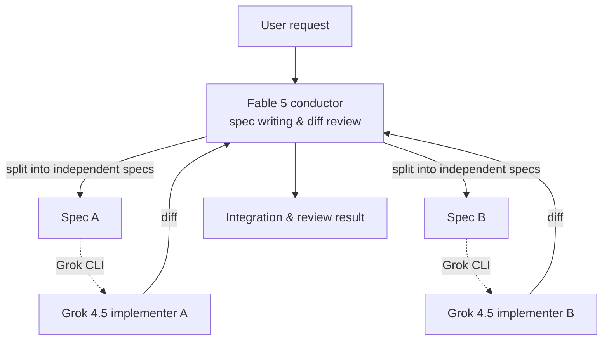

Anyone who has used a coding agent for a while eventually arrives at a natural question. Writing a precise spec and sharply reviewing a resulting diff is a different kind of work from actually typing out code line by line, so why should the same single model have to do both? The recently released and widely discussed `fable-advisor` plugin answers this question head on. It is a cross-vendor workflow in which **Claude Fable 5 does nothing but conduct, while Grok 4.5 handles all of the actual implementation**. This post breaks down that structure and examines what this design suggests from ThakiCloud's operational perspective, where multi-agent systems and model routing are treated as first-class resources.

## Overview

Until now, multi-agent coding workflows have largely stayed within a single vendor. In Claude Code, Opus conducts while Sonnet or Haiku runs as subagents. What makes `fable-advisor` interesting is that it structures this division of labor **across vendor boundaries**. Anthropic's Fable 5 handles the orchestration layer, while xAI's Grok 4.5 handles the implementation layer.

The core insight of this design is straightforward. Conducting and implementing demand different capabilities, and they have different cost structures. Spec writing and diff review are matters of judgment and reasoning, so they require a model suited to conducting, whereas bulk code typing is where throughput and cost efficiency matter most. `fable-advisor` places each of these two roles on models from different vendors, letting each layer use whichever model fits it best. The fact that it is free and open source, with routing logic that can be customized directly, also lowers the barrier to real-world adoption.

## What This Technology Is

`fable-advisor` is a plugin layered on top of Claude Code that enforces a three-way separation of roles.

First, the **conductor (Fable 5)** writes specs and reviews outcomes. It takes the user's request, breaks it down into an implementation spec, and reviews the resulting diff once implementation is done. The important point is that the conductor **never writes code directly**. It focuses entirely on judgment and contract definition.

Second, the **implementer (Grok 4.5)** handles all the actual typing. It receives the spec passed down by the conductor and writes code through the Grok CLI, powered by Grok 4.5. Looking at the repository's history, starting with v3 the existing Sonnet/Opus implementation agent was replaced by `grok-implementer`, making Grok 4.5 the default typing lane. In other words, this plugin was not cross-vendor from the start; it is the result of an evolution that moved the implementation lane toward a lower-cost, higher-throughput model.

Third, there is **parallel execution**. Independent specs are run simultaneously as parallel agents. When the conductor breaks work down into units that do not depend on each other, each unit proceeds concurrently as a separate implementation agent. This is not simple sequential delegation but closer to a division of labor shaped like a DAG (directed acyclic graph).

The overall flow looks like this in diagram form.



## Installation and Integration

Installing the plugin takes one line. You add the repository to Claude Code's plugin marketplace.

```bash
claude plugin marketplace add DannyMac180/fable-advisor
```

The Grok CLI, which handles the implementation lane, requires separate authentication. Logging in with `grok login` sets up OAuth authentication based on a SuperGrok or X Premium+ subscription, and according to the repository description, this path lets you run the implementation agent **without per-token API charges**, purely through your subscription. This is the crux of the cost structure. The conductor makes only a small number of judgment-heavy calls, while the bulk of code typing happens within the subscription plan, minimizing exposure to usage-based billing.

From an integration standpoint, it is worth noting that the routing logic is open. You can adjust directly which task goes to which model and under what conditions work gets parallelized, so a team can reconfigure the lanes to fit its budget and quality requirements.

## How This Design Actually Performs

`fable-advisor` is not a tool that touts benchmark numbers but a workflow pattern, so instead of reproducible performance figures, this section covers the structural effects the design produces. Since the repository does not present quantitative metrics, this post also avoids inventing numbers and sticks to structural benefits.

The biggest effect is the **separation of cost and quality**. When orchestration that requires judgment goes to the conductor and implementation that requires throughput goes to a low-cost implementer, the overall workflow's unit cost drops while judgment quality is preserved. The arrangement "call the conductor sparingly and cheaply, call the implementer often but not expensively" falls into place naturally.

The second effect is **cross-verification**. The fact that the implementer and the reviewer are models from different vendors produces an interesting side effect. When the same model reviews its own code, it tends to overlook the same mistakes it made in the first place, but when a model from a different lineage reviews the diff, there is more room for it to catch the other's blind spots. The conductor-worker split becomes more than a simple division of labor; it functions as a kind of mutual verification mechanism.

The third effect is **reduced latency through parallelization**. When independent specs are implemented at the same time, total working time converges not to the sequential sum but to the length of the single longest chain. The better the conductor breaks work down, the larger this benefit becomes.

## Generalizing the Conductor-Worker Pattern

If we look at `fable-advisor` not as an individual plugin but as a design pattern, a broader context comes into view. The essence of this pattern is "the main session only conducts, and heavy work gets delegated." Crossing vendors is just one variant of this pattern; it also holds within a single vendor. For example, a setup where Claude Code uses Fable 5 as the conductor, routes exploration to Haiku, implementation to Sonnet, and complex reasoning to an Opus subagent is already widely used. What `fable-advisor` did was extend the target models of this delegation beyond the vendor boundary.

Seen from this angle, the selection criteria for the conductor model become clear. Since the conductor is responsible for judgment, branching, and aggregation, accuracy and reasoning quality matter, but call frequency is relatively low. The implementer, by contrast, cares about throughput and unit cost. Good orchestration, then, is not "put the most expensive model in the conductor seat and route everything through it," but rather "place at each layer the model whose characteristics that layer actually requires." The v3 evolution that moved `fable-advisor`'s implementation lane to a low-cost subscription model is exactly the result of following this principle.

One thing worth watching is that this pattern only works if the boundaries of delegation are clear. If the conductor hands off an ambiguous spec, the implementer fills in the gaps by guessing, and the resulting review burden actually grows. The gains of delegation are realized only when the spec is sufficiently concrete. This is no different from division of labor in human organizations. The clearer the specification, the better delegation works.

## Implications for ThakiCloud's Products

This design overlaps strikingly with how ThakiCloud operates its own agents.

It is most directly relevant from a **Paxis perspective**. Paxis is ThakiCloud's Agent-Native Cloud control plane, and it treats DAG-shaped multi-agent execution as a core capability. The "spec writing to distributed implementation to cross review" structure that `fable-advisor` demonstrates shares the same skeleton as Paxis's skill harness, which breaks work into subtasks, runs them in parallel inside isolated sandboxes, and closes the loop with a verification stage. In particular, the principle that the conductor focuses on judgment and contract definition rather than writing code directly matches exactly with our own design philosophy of drawing capability from surrounding contract structures rather than model tier. The flow where the conductor reviews results produced by a different model also lines up with our own operating principle of closing multi-agent fan-out with a verification stage, so that hallucinations do not accumulate unchecked.

It also holds up from an **ai-platform perspective**, particularly around cost structure. ThakiCloud's ai-platform schedules GPU workloads on K8s and Kueue, serving the inference and training workloads of its customers. The idea behind `fable-advisor` of delegating the implementation lane to a low-cost model to bring down overall workflow unit cost is a pattern that GPU cloud customers can apply directly when designing their own workloads. When the small number of judgment steps that need heavy inference and the larger number of execution steps that need throughput are placed on resource tiers matched to each, the same result can be obtained at lower cost. Since low-cost serving is what makes agent economics work in the first place, ai-platform's cost efficiency and Paxis's agent orchestration complement each other.

## Limitations and Counterarguments

This design comes with clear trade-offs. The first is **operational complexity**. Weaving two vendors' models into a single workflow means managing two authentication systems, two pricing plans, and two points of failure. If one vendor's CLI changes or its authentication expires, the entire workflow can stop. This is a trade against the simplicity of a single-vendor workflow, and whether the benefit justifies the complexity may differ from team to team.

The second is **the risk of delegating quality**. Delegating implementation to a low-cost model means that if the conductor's spec and review are not tight enough, low-quality implementation can pass through unchecked. The quality of this workflow ultimately depends on how strict the conductor's review gate is. If the review is a formality, the cross-verification benefit of cross-vendor division of labor disappears, and what remains is a low-quality pipeline that merely saved on cost.

The third is **the constraint of subscription-based authentication**. The fact that the Grok CLI runs on subscription-based OAuth is a cost advantage for individuals or small teams, but for large-scale automation or unattended pipelines, subscription limits and authentication renewal can become bottlenecks. The advantage of having no usage-based billing is, flipped around, also a statement that scaling stops the moment usage exceeds the plan's limit.

Even so, the message `fable-advisor` sends is clear. The future of coding agents lies not in one all-purpose model but in orchestration that combines the model best suited to each layer. This points to exactly the same direction as ThakiCloud's approach of treating multi-agent systems and model routing as first-class resources.

## Sources

- [fable-advisor (GitHub)](https://github.com/DannyMac180/fable-advisor)
- [Grok CLI (x.ai/cli)](https://x.ai/cli)
