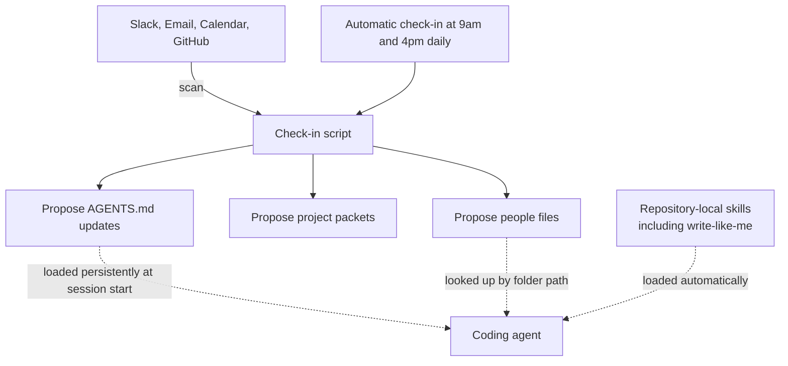

Anyone who uses a coding agent daily runs into the same wall over and over. Decisions made yesterday, conventions set last week, a particular colleague's way of working: the agent asks about all of it again every session, as if hearing it for the first time. A repository that solves this problem without an expensive vector database or dedicated memory infrastructure, using nothing more than **a plain folder structure and a single markdown file**, has recently gone public and stirred up developers. It is `personal-monorepo-template`, released by jxnl (Jason Liu), the creator of the `Instructor` library. This post breaks down that structure and examines what this design implies from ThakiCloud's operational standpoint, where we treat skills and knowledge as first-class resources.

## Overview

The common approach to an agent's memory problem is a vector database: embed conversations and documents, store them, and retrieve them via semantic search when needed. It is powerful, but the operational burden is significant. You have to manage an embedding pipeline, a vector index, and a reindexing schedule, which is a lot of infrastructure for an individual to bolt onto their own workflow.

`personal-monorepo-template` takes the opposite direction. It reframes memory not as a search problem but as **a file-structure problem**. People live in a `people/` folder, projects live as project packets, and recurring ways of working live as skills inside the repository itself. The agent loads this entire structure persistently through `AGENTS.md` every time a session starts. Instead of the approximate matching of vector search, memory is accessed through the exact address of a folder path.

The background of the person who built this adds weight to the design. jxnl is the creator of `Instructor`, a structured-output library downloaded millions of times a month, reportedly cited by OpenAI as an inspiration for its own structured output feature. He currently works as a Developer Experience engineer on the OpenAI Codex team, which makes this a tool built by someone who runs coding agents in daily production use to solve their own problem, giving it real reference value.

## What This Technology Is

The core idea is simple. **Represent an agent's memory as plain folders and markdown inside a monorepo, and load it automatically every session.** It breaks down into three parts.

The first is **a record of people and projects**. The repository scans Slack, email, calendar, and GitHub to generate `people` files and project packets, and proposes updates to the persistently loaded `AGENTS.md`. Mention a particular colleague's name, and the agent reads that person's file and instantly restores the context. Without any vector database, it locates "who this person is" through an exact folder path.

The second is **repository-local skills**. Recurring ways of working are placed as skills inside the repository, loaded automatically every session so the agent follows those procedures. A notable example is the built-in write-like-me skill, which learns from a user's sent emails and Slack messages to write in that person's own voice. The user's past output becomes the training data for the skill itself.

The third is **automatic check-ins**. The repository is designed to run automatic check-ins at 9am and 4pm every day, summarizing that day's project status and people-related context and proposing updates. Rather than waiting for a manual invocation, this is a loop where the agent refreshes its own memory on a fixed schedule.

The overall flow looks like this in diagram form.

This design is interesting precisely because it connects to the "Codex-maxxing" philosophy the repo's author laid out in a separate post. Rather than bolting a better model onto the agent, the direction is to **build up the surrounding structure** so the agent never starts from a blank slate.

## Installation and Integration

This repository is exactly what its name says: a template. You integrate it by cloning it into your own GitHub account and configuring your coding agent (Codex or a similar CLI) to use the repository root as its working directory. The core entry point is `AGENTS.md` at the repository root, which the agent reads at the start of every session to understand the folder structure, the people and project context, and the list of skills it should load.

The key integration point here is that `AGENTS.md` is **not a plain document but a persistently loaded contract**. Because this file lands at the front of the context every session, what you write in it defines the agent's default behavior. Since the folder structure is fixed, the agent accesses memory deterministically, in the sense of "if I need context on colleague A, I read `people/A.md`." Unlike the probabilistic approximation of vector search, a file path always points to the same place.

Automatic check-ins are integrated by hooking the check-in script to a scheduler (a cron-style job) so it runs at a fixed time every day. This mechanism keeps the agent's memory current without requiring a human to invoke it each time, and it is also an important design decision from a cost standpoint. Because it runs a finite number of times a day rather than polling continuously, it does not burn tokens in an infinite loop.

## How This Design Actually Plays Out

This repository is not a tool that leads with benchmark numbers; it is **a workflow pattern**, so here we examine the structural effects it produces in practice. The repository does not offer reproducible performance figures, and the author himself points to improvements in day-to-day workflow rather than quantitative metrics as the justification. So this post does not invent numbers either and sticks to the structural advantages.

The biggest effect is **eliminating the cost of context restoration**. A vector database lookup runs an embedding computation and a similarity search on every query, while a folder-path lookup is a single file read. When a person says "that project from last time," the agent reads the corresponding project packet directly and restores the exact context, with no false positives from approximate search. The precision of memory now depends on the quality of the folder design rather than the quality of retrieval.

The second effect is **auditability**. Because all memory is stored as human-readable markdown, a developer can open it directly to check, and correct, what the agent knows. Vector embeddings are hard for a human to verify by eye, but `people/A.md` is just a text file. Being able to fix the agent's memory on the spot when it is wrong makes a real difference in practice.

The third effect is **portability**. Because it isn't tied to any specific vector database vendor or embedding model, the repository itself is a complete, self-contained memory. Move it to a different machine or a different agent and the folders and markdown still work as-is. This lack of infrastructure lock-in connects directly to the on-premise and sovereign-cloud angle discussed below.

## Implications for ThakiCloud Products

This design touches both of the axes on which ThakiCloud operates agents.

The most direct connection is to **Paxis**. Paxis is ThakiCloud's Agent-Native Cloud control plane, which treats Skills, Tools, Policies, and Audit Logs as first-class resources. The pattern `personal-monorepo-template` demonstrates, "repository-local skills plus a persistently loaded contract (`AGENTS.md`)," maps precisely onto the direction of Paxis's skill-harness design. Paxis already selects among many skills via BM25 and runs them in an isolated sandbox, and this repository's approach answers a step upstream of that, "what knowledge should sit persistently in the session context," with a clean answer expressed as folder structure. In particular, keeping memory as human-readable files with every update auditable is the same philosophy as Paxis's principle of routing every agent action through a policy gate and an audit log. The very idea of drawing an agent's capability from its surrounding structure rather than its model tier is isomorphic to our own design of treating skills as first-class resources.

From the **ai-platform** angle, the infrastructure-burden perspective is what stands out. ThakiCloud's ai-platform is K8s-based AI/ML infrastructure that serves workloads for on-premise and sovereign-AI customers. For these customers, a memory architecture that requires running a vector database at all times represents extra infrastructure surface and management cost. A memory expressed as folders and markdown, by contrast, runs on the filesystem alone with no separate state store, which is a much lighter operational burden in regulated environments or air-gapped networks. The angle of "minimizing memory infrastructure while still giving the agent persistence" could be a genuine selling point for customers who require sovereign AI.

## Limitations and Counterarguments

This design is not a silver bullet. The clearest limitation is **scale**. Folder-path access is powerful when the person or the agent already knows the address of the memory. But when you need to find information "you don't know the location of" among tens of thousands of documents, semantic vector search is still superior. This repository assumes a relatively small, clearly structured memory space consisting of one person's people, projects, and experiences. Scale it up to a team's entire, sprawling knowledge base, and folder structure alone starts to hit its limits.

The second counterargument is **the privacy of the scanning process**. Scanning Slack, email, and calendar to build people files also means that sensitive conversations get stored as plain-text markdown. That's convenient for personal use, but bringing it into an organization requires access control and retention policy without question. Auditability is a strength, but with no control over who can access those files, it becomes a liability just as easily.

The third is **the reliability of automatic updates**. If a twice-daily automatic check-in writes a wrong summary into a person file, that error keeps getting injected into every subsequent session. This is exactly why the repository frames updates as "proposals" that assume a human will confirm them. Push all the way to full automation and memory can quietly get corrupted, so leaving a human review gate in place is the safer approach.

Finally, this approach is pitched as "a free alternative to a human assistant's salary," but actually sustaining this level of workflow requires substantial engineering skill to design and refine the repository structure yourself. The tool being free and the cost of operating it well being free are two different things.

Even so, the core message this repository sends is clear. An agent's memory does not have to be heavy infrastructure, and a good folder structure paired with a persistently loaded contract can deliver a surprising amount of persistence. That points in exactly the same direction as ThakiCloud's own approach of treating skills and knowledge as first-class resources.

## Sources

- [jxnl/personal-monorepo-template (GitHub)](https://github.com/jxnl/personal-monorepo-template)
- [Codex-maxxing (jxnl.co)](https://jxnl.co/writing/2026/05/10/codex-maxxing/)
