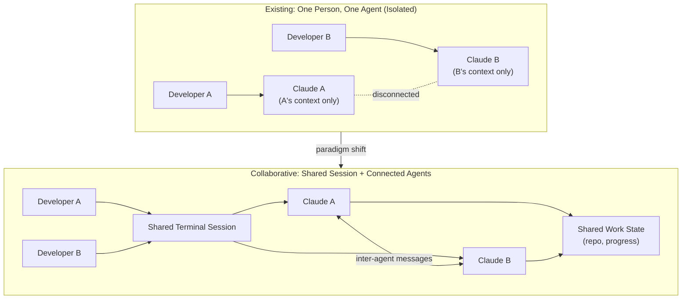

Anyone who has used a coding agent on a team runs into an odd wall. The agent belongs to you alone. Even when a colleague sitting next to you is working in the same repository, your Claude has no idea theirs exists. People collaborate through Slack and screen sharing, but the agents that actually touch the code on our behalf sit isolated on their own islands. **Multiplayer Claude Code**, recently released and widely discussed, takes direct aim at this wall. It is an experiment in letting multiple people share the same terminal and connecting each person's Claude so the agents can talk to each other. This post uses that release as a starting point to break down the design challenges collaborative coding agents need to solve, and examines what this direction implies from ThakiCloud's operational perspective, where multi-agent systems and policy are treated as first-class resources.

## Overview

Up to now, the basic unit of a coding agent has been **one person, one agent**. Claude Code lives in your terminal, understands your codebase, and takes your instructions. This structure is excellent for individual productivity, but it clashes with the fact that software has always been a team effort. Developer Dorsa Rohani's release of multiplayer Claude Code flips that premise. According to the announcement, the tool enables two things. First, multiple people can work together in **the same terminal session**. Second, each person's Claude can be **connected to talk to each other**.

What stands out is that this is not a one-off toy but part of a larger trend. Around the same time, several projects emerged that bring multiple coding agents from multiple people into a single workspace: `oh-my-claudecode`, which bills itself as team-first multi-agent orchestration; `claude_codex_bridge`, which mixes several agents including Codex and Claude in one workspace; and `codeg`, a collaborative workspace that aggregates multiple agent sessions. The direction is converging on one idea: **treating agents not as isolated terminals, but as participants who communicate with each other**.

Why this trend matters is clear. In real development organizations, a large share of the value comes from coordination: who is touching which file, whether this change breaks that module, what the reviewer is worried about. If agents cannot take part in that coordination, we end up having to manually stitch together the separate outputs each agent produces on its own. Collaborative agents are an attempt to reduce the cost of that stitching.

## What a Multiplayer Coding Agent Is

The word multiplayer comes from gaming, but here it points to two distinct axes at once. One is the **person-to-person** axis, where several developers share the same session and jointly direct a single agent. The other is the **agent-to-agent** axis, where each person's agent exchanges messages with the others and splits up the work. What makes multiplayer Claude Code interesting is that it addresses both axes together.

The diagram below shows the difference between the existing isolated structure and a collaborative one.

In the existing structure, even when two developers' agents touch the same repository, they have no awareness of each other. Because each one reasons only within its own context, Claude A can refactor an interface while Claude B, unaware of the change, keeps calling it with the old signature. In the collaborative structure, session and state are shared, and because the agents exchange messages directly, there is room to catch this kind of mismatch nearly in real time.

That said, based on what has been made public so far, it is hard to say exactly how deep this connection goes. Whether the shared terminal is essentially screen streaming, or whether the agents actually exchange their plans and editing intentions in a structured form, makes a big difference to how practical it is. This post focuses on the design challenges implied by the published concept and does not assert anything about internal behavior that has not been verified.

## Why Now

There is a reason collaborative agents are appearing now. As models have grown more capable, the size of the task a single agent can handle has grown with them, and as a result, **situations where multiple agents make large changes at the same time** have become genuinely common. It is already routine for one person to spin up parallel subagents to split up file edits. Taking just one more step from there, you reach the moment where different people's agents overlap in the same codebase. Without coordination, that moment quickly becomes a conflict.

Another driver is fragmentation in the tooling ecosystem. On most teams, some people use Claude Code, others use Codex, and others use Cursor. The multi-vendor workspace projects mentioned above are an attempt to absorb this fragmentation into a coordination layer. In other words, collaborative agents are not simply a feature that adds more people to the mix; they are growing into **infrastructure for dealing with the reality that heterogeneous agents now coexist**.

## Design Challenges Collaborative Agents Must Solve

Behind an appealing concept sits a considerable amount of engineering. To bring collaborative agents into real practice, at least four problems need to be solved.

First is **concurrency and conflict**. You need to define what happens when two agents edit the same region of the same file at the same time. Human collaboration absorbed this problem with git branches and merges, but a real-time shared session requires coordination on a much tighter cycle. Whether to use locking, optimistic edits followed by merging, or to distribute work so it never overlaps in the first place is a fundamental design fork.

Second is **the scope of context sharing**. To let agents talk to each other, you need to decide what gets shared. Passing the entire conversation history wholesale causes token costs to explode and pollutes context. Share too little, and the point of collaborating disappears. What is actually needed is a **summarized, structured exchange of state**: intent such as "I plan to change this function in this file this way" needs to be passed as compressed information, not raw text.

Third is **trust boundaries**: how much an agent should trust a change proposed by someone else's agent. Just as people do not merge a change without review, agents should not accept another agent's output without verification. The long-standing lesson from multi-agent systems is clear: **merging the results of multiple agents without a verification stage causes hallucinations to accumulate.** The more collaborative the agents, the more essential it becomes to have a gate that adversarially verifies each participant's output.

Fourth is **audit and accountability tracking**. When multiple people and multiple agents have touched the same code, if you cannot trace which change came from whose (or which agent's) judgment, you cannot trace the root cause when something goes wrong. As collaboration increases, an audit log stops being optional and becomes mandatory.

## Implications for ThakiCloud's Product

These design challenges overlap precisely with problems ThakiCloud is already addressing head-on in **Paxis**. Paxis is the Agent-Native Cloud control plane running on top of ai-platform, treating Skills, Tools, Policies, and Audit Logs as first-class resources. Here is how Paxis's architecture responds to the questions raised by multiplayer coding agents.

The backbone of agent-to-agent collaboration is Paxis's **DAG multi-agent** orchestration. Instead of releasing multiple agents into a shared space with no structure, work is decomposed into a directed acyclic graph so that each node owns a defined area of responsibility, which structurally avoids much of the concurrency conflict discussed above. Rather than merging overlapping edits after the fact, work is distributed so it never overlaps to begin with.

The trust boundary problem is answered by Paxis's **policy gates and audit logs**. Before one agent's output flows to another agent or to a live system, it must pass through a policy gate, and every action is recorded in an audit log. This is, in effect, an infrastructure-level enforcement of the principle that "the results of multiple agents are never merged without verification." The value of this gate only grows as collaboration increases.

The cost of context sharing is eased by Paxis's **Skill Harness** and its knowledge engine. Selecting from over 960 skills via BM25 and running them in isolated sandboxes is designed so agents pull in only the capability they need at that moment, instead of carrying the full context every time. This aligns directly with the requirement that collaborative agents exchange summarized state rather than raw, wholesale context.

Underpinning all of this with execution resources is **ai-platform**. Having multiple people and multiple agents run code simultaneously in isolated sandboxes requires multi-tenant isolation and elastic compute. K8s- and Kueue-based GPU scheduling and multi-tenant isolation provide the foundation collaborative agents actually need to run on. The fact that this collaborative structure can be built safely on premises and in sovereign environments matters in particular for organizations concerned about data leakage.

In short, Paxis structures at the control-plane layer, with policy, audit, and orchestration, the same collaborative concept that multiplayer Claude Code is experimenting with at the individual-tool layer. The two layers are not competitors but complements. For collaborative agents to move from an entertaining demo to reliable operation, they ultimately need a control plane equipped with policy gates, audit logs, and resource isolation.

## Limitations and Counterarguments

Collaborative agents should not be viewed with pure optimism. The biggest counterargument is that **coordination overhead can eat into the gains from collaborating**. Just as meetings do among people, an increase in messages exchanged between agents becomes latency and token cost in its own right. It is entirely possible for two agents to spend so much time confirming each other's plans that they never actually produce code. Collaboration is not always faster than working in parallel and independently.

Second is **the coupling of failure modes**. Once agents are connected, one agent's mistaken judgment propagates to another. In an isolated structure, one person's mistake stays contained to that person; in a connected structure, an error can chain and spread. Without verification gates, collaboration can amplify incidents rather than prevent them.

Third, it has not yet been verified exactly what level of state exchange the currently released multiplayer tool actually implements. Whether the shared terminal is closer to screen sharing or is a genuine structured agent-to-agent protocol changes its practicality substantially. The direction of the concept is clear, but before putting it into production, trust boundaries and audit trails must be confirmed. There is still considerable distance between an interesting demo and reliable infrastructure.

Even so, the direction itself is hard to reverse. As long as software remains a team effort, the agents standing in for that team will eventually need to talk to each other too. The question is not whether to turn collaboration on, but whether that collaboration is **built on a structure backed by policy, verification, and audit**.

## Sources

- Dorsa Rohani, "We made Claude Code multiplayer!" (X, 2026-07-08): [https://x.com/dorsa_rohani/status/2074963064231952832](https://x.com/dorsa_rohani/status/2074963064231952832)
- Claude Code (Anthropic's official repository): [https://github.com/anthropics/claude-code](https://github.com/anthropics/claude-code)
- oh-my-claudecode (team-first multi-agent orchestration): [https://github.com/yeachan-heo/oh-my-claudecode](https://github.com/yeachan-heo/oh-my-claudecode)
- claude_codex_bridge (multi-agent CLI workspace): [https://github.com/SeemSeam/claude_codex_bridge](https://github.com/SeemSeam/claude_codex_bridge)
