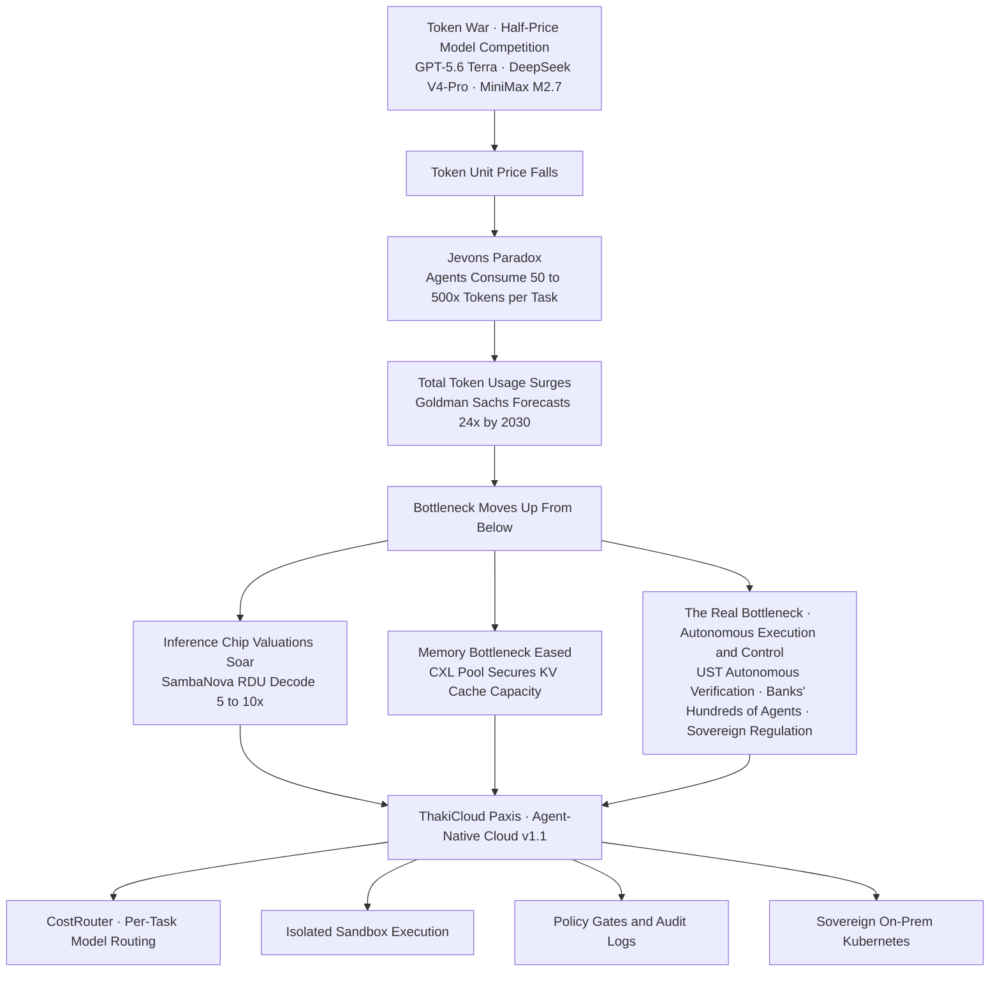

## Two Opposite Pieces of News, Arriving in the Same Week

This week's AI headlines carried two pieces of news that appear to contradict each other. One says prices are falling. OpenAI released GPT-5.6 across three pricing tiers, Sol, Terra, and Luna, pricing the mid-tier Terra at half the price of the previous generation. DeepSeek V4-Pro matched Claude Opus 4.7's coding performance at 10 to 20 percent of the price, and MiniMax M2.7 offered up to one-third the price of comparable models. The industry has taken to calling this moment a "token war."

The other says prices are rising. SambaNova, an inference-chip startup, closed the first tranche of its Series F at $1 billion, valuing the company at $11 billion, roughly 16 trillion won. Just five months earlier, at its Series E, the company was valued at $2.2 billion, meaning its valuation rose fivefold in five months. The price of a single token is being cut in half, while the valuation of the company making the chips that mint those tokens has gone up fivefold. Is one of these wrong? No. The two stories are photographs of the same underlying trend, taken from the front and the back.

## The Old Law That Cheaper Prices Mean More Consumption

In the 19th century, economist William Jevons overturned the conventional wisdom that a more fuel-efficient steam engine would reduce coal consumption. As fuel got cheaper, people did not conserve it, they ran more machines, and total coal consumption actually rose. This paradox, that as the unit price of a resource falls, total consumption of that resource rises, is now playing out almost like a textbook case in the inference market.

DigitalDaily's "token paradox" captures exactly this dynamic. Token prices have steadily declined since 2023, yet the total AI cost enterprises feel is surging. The culprit is the AI agent. An agent that searches on its own, calls tools, and completes work across multiple steps consumes at least 50 times and as much as 500 times more tokens per task than a chatbot that answers a single question once. Goldman Sachs projects that global monthly token consumption will grow 24 fold, from 5 quadrillion tokens per month this year to 120 quadrillion tokens per month by 2030. If the unit price is halved but usage jumps twentyfold, the bill goes up tenfold. The fiercer the price cutting competition, the larger total spend becomes.

## The Bottleneck Moves Up From Below

At this point, it becomes clear why SambaNova's valuation has jumped. If token consumption is set to become effectively limitless, the value of hardware that can mint each token more cheaply and quickly rises in the opposite direction. SambaNova's proprietary RDU architecture, built instead of GPUs, delivers 5 to 10 times the LLM inference decode performance of Nvidia GPUs on its latest SN40 and SN50 chips, the company says, lowering the cost per token. It is especially telling that JPMorgan Chase has decided to use these chips to build on premises inference infrastructure in its own data centers to process sensitive financial data. It signals that inference, not training, and specifically on premises inference in regulated industries, has become a place that draws in large amounts of capital.

The same pressure is showing up in memory as well. Samsung Electronics' CXL evaluation results, released this week, reveal a bottleneck: as the KV cache requirements for storing AI inference's conversational context balloon into the hundreds of gigabytes, HBM attached to GPUs alone can no longer cover the capacity. 512GB of DRAM saw performance collapse once the KV cache overflowed, but a 1TB CXL memory pool held 92 percent of DRAM's performance even in an 8 GPU environment. Market research firm Yole expects the CXL market to grow from $2.1 billion this year to roughly $16 billion by 2028. If HBM solved the bandwidth problem, CXL is establishing itself as the complementary technology solving the capacity and cost problem.

This surging demand is also confirmed by real world indicators. Taiwan's June exports reached $74.8 billion, the third highest monthly figure on record, driven by a 72.3 percent year over year surge in shipments of information and communications items, which include graphics cards and AI servers. Behind that lies demand for HBM and CoWoS advanced packaging. SK Chairman Chey Tae won laying out an AI semiconductor blueprint centered on HBM leadership in front of global investors belongs to the same context. The cheaper tokens become, the more precious the chips and memory that carry that load become. It is a picture in which the bottleneck, right beneath the layer where prices are falling, keeps pushing upward.

## What's Truly Expensive Isn't the Token, It's Autonomous Execution

But the real signal in this week's news is that the bottleneck doesn't stop at hardware. Consider UST's partnership with Anthropic to apply Claude to semiconductor verification. Claude Code directly reads chip pinouts and hardware schematics, writes and runs the regression tests engineers used to write by hand, and automatically catches defects by comparing real equipment data against a digital twin. Verification turnaround that typically took four days has been compressed to 48 hours, and the verification cycle time has been cut by 50 to 70 percent. The agent is no longer a code autocomplete tool, it has become a worker that autonomously runs a real engineering process in a closed loop.

Korea's banking sector is running in the same direction. Woori Bank invested 88.4 billion won to attach more than 175 agents to 29 tasks across five areas, and KB Financial Group plans to build roughly 300 agents across 59 tasks by year end, aiming at "Agentic Banking." Hana Bank has cut the time to draft corporate credit assessment opinions from an average of 30 minutes to about 10 seconds, and expects to save more than 27,000 hours a year as a result. Once agents start putting their hands directly on core operations at this scale, such as credit review, asset management, and internal controls, the question that keeps executives up at night changes. It is no longer "what does a token cost," but "who controls and audits these hundreds of autonomous executions, and how." That is exactly why figuring out how to weave these agents into the dual approval principle the financial sector has long upheld has emerged as the next challenge.

The weight of control is also growing on the regulatory side. China's Measures for the Administration of Anthropomorphic Interaction in Artificial Intelligence, jointly drafted by five agencies, take effect on July 15, and ByteDance and Alibaba have begun rolling back customizable chatbot persona features in response. This is a case where safety requirements have pushed directly into the service design stage, and domestic operators cannot treat it as someone else's problem. Layered on top of this is the discussion around sovereign AI. The United States restricted, then restored, overseas access to Claude Fable 5 on national security grounds, and China is reviewing similar restrictions on overseas access to its own models, signaling the fading of an era in which frontier AI could be used anywhere. Building frontier grade models domestically requires enormous capital and time, yet the convenience of cheaply borrowing models from abroad is now colliding head on with the sovereign impulse to keep sensitive data within one's own borders.

## A Flood of Cheap Tokens Needs Plumbing

Big Tech's own math backs up this pressure. The combined 2026 capital expenditure of Alphabet, Microsoft, Meta, and Amazon is set to hit an all time high of roughly $725 billion, about 30 percent of revenue, while their combined free cash flow has fallen to its lowest level in nearly a decade. Amazon's trailing twelve month free cash flow plunged 95 percent, from $25.9 billion a year earlier to $1.2 billion. An organization that simply lets the flood of cheap tokens pour through unmanaged will be brought down by its bill first. What's needed is not a bigger pipe, but well designed plumbing that safely distributes the flood.

ThakiCloud's Paxis is precisely that plumbing: our formal product, Agent-Native Cloud v1.1. The half price models unleashed by the token war are not a threat from CostRouter's vantage point, they are a weapon. Routing simple, repetitive tasks to cheap, lightweight models and reserving frontier models for complex reasoning, task by task, can structurally suppress the bill created by the Jevons paradox. For an agent like UST's that reads circuit schematics directly, isolated sandbox execution is the safeguard; for a deployment of hundreds of agents like Woori Bank's, policy gates, audit logs, and an autonomy governance scheme spanning L0 through L3 are what stand in for the dual approval principle. The on premises inference demand demonstrated by SambaNova and JPMorgan, and the sovereignty debate around sovereign AI, map directly onto Paxis's design, which treats Skills, Tools, Policies, and Audit Logs as first class resources on sovereign on prem Kubernetes.

To sum up: the cheaper tokens get, the more of them we use, and the more autonomously we use them, and as that happens, the bottleneck and the risk shift upward, away from unit price and toward execution and control. That is why the news of a price war and the news of a fivefold valuation are not a contradiction, they are one and the same story. In a world where prices have gotten cheap, the winner will not be whoever conserves tokens most carefully, it will be whoever governs the overflowing tokens most safely.

## References

- [The Token War Sweeping the AI Industry, and the Paradox of Lighter Token Prices and Heavier Bills (DigitalDaily)](https://www.ddaily.co.kr/page/view/2026071016360758815)
- [OpenAI GPT-5.6's Three-Tier Pricing in Detail (eesel.ai)](https://www.eesel.ai/blog/gpt-5-6-pricing)
- [SambaNova Draws $1B at $11B Valuation in Series F First Close (TechCrunch)](https://techcrunch.com/2026/07/08/sambanova-draws-1b-at-11b-valuation-in-series-f-first-close/)
- [SambaNova SN50 RDU, a Chip Purpose-Built for Agentic Inference, and JPMorgan's On-Premises Adoption (SambaNova)](https://sambanova.ai/blog/introducing-the-sn50-rdu-purpose-built-for-agentic-inference)
- [Solving the AI Inference Bottleneck With CXL, Samsung Accelerates Toward the Next HBM (Herald Business)](https://biz.heraldcorp.com/article/10805245)
- [Taiwan's June Exports Hit $74.8 Billion, Lifted by AI Servers (Seoul Economic Daily)](https://www.sedaily.com/article/20066169)
- [Chey Tae-won: Investing Hundreds of Billions of Dollars in AI, HBM Shortage Will Persist (Financial News)](https://www.fnnews.com/news/202607110443238428)
- [UST and Anthropic's Claude Partnership for Semiconductor Verification (Anthropic)](https://www.anthropic.com/news/ust-claude)
- [Woori Bank Builds 175 AI Agents With an 88.4 Billion Won Investment (BIkorea)](https://m.bikorea.net/news/articleView.html?idxno=45433)
- [China Enforces AI Anthropomorphic Interaction Management Measures, Chatbot Persona Features Halted (ZDNet Korea)](https://zdnet.co.kr/view/?no=20260707224246)
- [Big Tech's $725 Billion AI Investment Pushes Free Cash Flow to a Decade Low (Financial News)](https://www.fnnews.com/news/202605111154590244)
