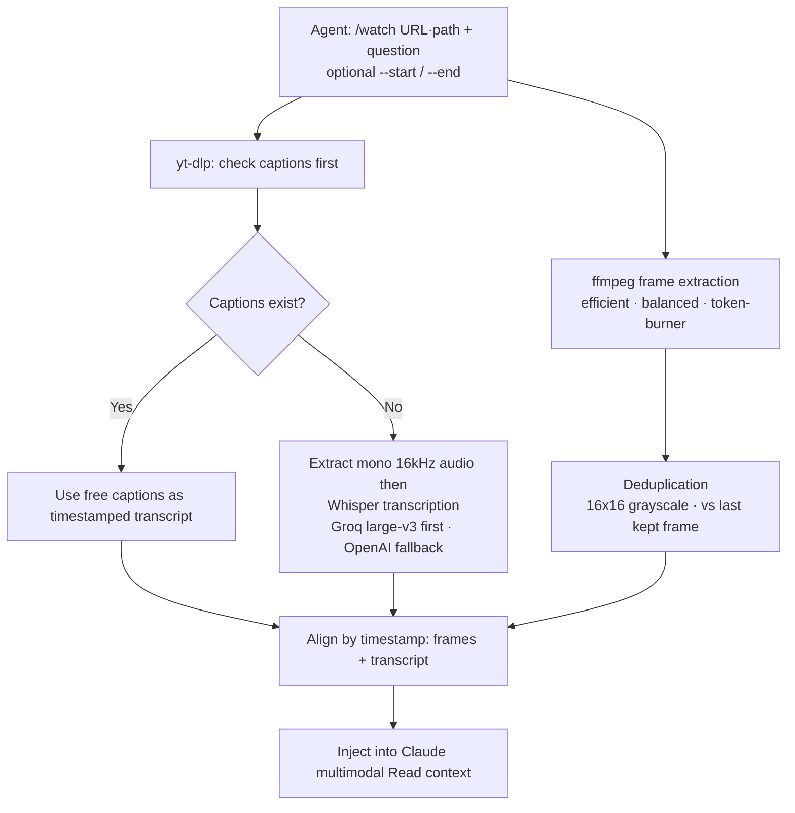

## Overview

Coding agents have read only text until now. Source files, logs, docs, API responses, all of it was characters. Yet in practice, a large share of what matters lives inside videos. Product demo recordings, bug repro screens, meeting captures, lecture videos, competitor release clips. A human opens one and says "the screen breaks around 2:30," but to an agent that video was just an unopenable binary.

`claude-video` thinly tears down that wall. In one line it "gives Claude the ability to watch videos," and what it actually does is turn a video into frame images and a timestamped transcript, then push them into Claude's multimodal Read context. As of July 2026 it has passed 5,400 GitHub stars, and some counts put it as high as 7,000, making it one of the more talked-about projects of the moment.

The audience for this post is clear. Developers and platform engineers who use coding agents like Claude Code, Cursor, Copilot, and Gemini CLI in real work and wonder how to get video material into their pipeline. And anyone curious about what this technique means for agent platform design beyond mere convenience. The short answer: claude-video is a fine example of how "a thin harness plus a combination of proven tools" attaches a new sense (sight) to an agent, and it lines up exactly with the direction ThakiCloud pursues in Paxis.


## What This Tool Is

claude-video does not build a new model. It is a skill that thinly wires together three already-proven open-source tools. `yt-dlp` handles video download and caption retrieval, `ffmpeg` handles frame extraction and audio conversion, and `Whisper` handles speech transcription when captions are missing. Final assembly and judgment are done by Claude's multimodal Read tool. What is newly written is the pipeline joining these four pieces and the deduplication logic that intelligently thins out frames.

The core interface is a single `/watch` slash command. The user passes a video URL or a local path, attaches a question, and specifies a range if needed. The agent then "watches" the video and answers. The input sources are broad. Not just YouTube but Instagram, X, Vimeo, and generally any site yt-dlp supports, plus Zoom and Loom recordings and local mp4 files.

The full flow looks like this.



The difference from prior approaches is clear. Until now, "an AI summarizes a YouTube video" mostly meant reading only the title, description, and caption text and guessing. claude-video does not guess from the title. It sees the actual frames as images and reads the captions or transcript alongside, combining sight and hearing. Questions like what is on screen, or when exactly the UI breaks, cannot be answered from text captions alone; you have to see the frames.

## Installation and Usage

Installation goes two ways. Claude Code users attach it through the plugin marketplace.

```bash
# Claude Code: register the marketplace, then install the watch skill
/plugin marketplace add bradautomates/claude-video
/plugin install watch@claude-video
```

On the 50-odd agent hosts including Cursor, Copilot, and Gemini CLI, install it globally under the Agent Skills spec.

```bash
# Agent Skills spec (common across ~50 hosts)
npx skills add bradautomates/claude-video -g
```

No extra configuration is needed to start. If `yt-dlp` and `ffmpeg` are absent, they auto-install via brew on first run on macOS, and on Linux and Windows the exact install commands are printed. A Whisper API key is not always required; it is only needed when a video has no captions at all. Many public videos ship with captions and are handled on the free path.

Usage is a single command line.

```bash
# Ask a question about a local file
/watch tutorial.mp4 "What language is used in this tutorial?"

# Focus on a specific segment of a YouTube video
/watch https://youtu.be/VIDEO "What happens around 2:30?" --start 2:00 --end 3:00
```

`--start` and `--end` matter. Tearing an entire long video into frames blows up context and cost. Narrowing the range downloads only that portion and extracts frames from it, saving tokens. In practice the standard move is to narrow the scope, such as "only the 12-minute demo segment out of a 45-minute meeting recording."

## Internals: Captions First, Frame Extraction, Deduplication, Transcription

The reason claude-video is interesting is that practical judgment is baked into how the pieces are joined. Let us walk through the documented design step by step. The figures and parameters below are the design values published by the project, not benchmarks I measured in this environment.

First, transcription is captions-first. yt-dlp checks for existing captions first, and if present it uses them directly as a timestamped transcript without downloading the video body. It is immediate and free. Only when captions are absent does it extract mono 16kHz audio and hand it to Whisper. Here, for speed and cost, it prefers Groq's whisper-large-v3 and falls back to OpenAI whisper-1 if that is unavailable.

Second, frame extraction offers three detail levels. `efficient` decodes keyframes only and finishes almost instantly. `balanced` prefers scene-change frames but supplements with duration-aware uniform sampling when they under-produce. `token-burner` runs scene detection without a cap to pull maximum fidelity, burning tokens accordingly. You choose "skim fast, or look carefully" by purpose.

Third, deduplication is the small highlight of this project. Each extracted frame is scaled to a 16x16 grayscale thumbnail, and the mean absolute difference is computed not against the immediately preceding frame but against the **last kept frame**. If that value is at or below a threshold of 2.0, the frame is dropped. The reason for comparing against the last kept frame rather than the previous one is the key. Comparing frame to frame keeps passing very slow fade-in/out as "barely changed," but comparing against the last kept frame catches the moment when cumulative change crosses the threshold. It is a genuinely useful design for things like lecture videos where slides advance slowly.

Fourth, final assembly. Frame images and the transcript are aligned by timestamp, so frames enter Claude's context as images and the transcript as time-stamped text. Claude reads "at this moment the screen shows this, and this was said then" together and answers.

## What I Verified: Documented Behavior and a Reproduction Note

Let me be honest. The authoring environment for this post has external video downloads blocked, so I could not run a live benchmark that installs claude-video and actually tears a real YouTube video into frames. Therefore I invent no latency or accuracy figures. Instead I lay out the project's published design and behavior faithfully and leave reproducible verification points.

What is consistently confirmed across the docs and multiple user reports is the following. Public videos with captions are transcribed for free without downloading. Frame detail has three levels, efficient/balanced/token-burner, each differing in speed and fidelity. Deduplication uses 16x16 grayscale comparison with a threshold of 2.0. The transcription fallback path is Groq whisper-large-v3 then OpenAI whisper-1. The fork `mathiaschu/watch` offers a variant that swaps the transcription step for local `mlx-whisper`, running fully on-device with no API key.

To verify directly, I recommend this. Cut a short public video that has captions to a sub-one-minute segment with `--start`/`--end`, throw it at `/watch`, and run it at efficient and token-burner detail respectively, comparing frame counts and response tokens. This comparison most intuitively shows the effect of "range narrowing plus detail selection" on cost. Rather than citing numbers without measurement, measuring these two axes in your own environment is more accurate.

## Implications for ThakiCloud Products

claude-video naturally meshes with the two axes ThakiCloud is pushing.

First, the **Paxis lens**. Paxis is ThakiCloud's Agent-Native Cloud control plane, treating Skills, Tools, Policies, and Audit Logs as first-class resources. What claude-video demonstrates is exactly the "thin harness, thick skill" structure Paxis aims for. Without training a new model, it wires proven tools (yt-dlp, ffmpeg, Whisper) through a skill harness to attach a new sense to the agent. The Paxis Skill Harness selects from over 960 skills via BM25 and runs them in an isolated sandbox, and a multimodal skill like claude-video is a candidate to sit right on that harness. In particular, since video download and ffmpeg execution deal with arbitrary URLs and binaries, Paxis's sandboxed execution and policy gate plus audit logs pay off directly. When it is recorded in the audit log which video was processed, up to which range, at which detail, cost and data access can be controlled at once.

Next, the **ai-platform lens**. claude-video's transcription path fundamentally depends on external APIs (Groq, OpenAI). For customers with on-premises or sovereign requirements, that part is a risk as-is. Here ThakiCloud's ai-platform provides the answer. If you serve Whisper-class STT in-house on K8s with GPU scheduled by Kueue, you can finish video transcription inside a closed network without sending it out. It is the same direction the fork took by choosing mlx-whisper for local transcription, implemented at organizational scale. A pipeline that batch-transcribes large volumes of caption-less meeting recordings on an in-house GPU cluster, with agents consuming the results, is a textbook use case for the ai-platform, whose strengths are multi-tenant serving and cost efficiency.

The two lenses complement each other. When ai-platform backs low-cost, closed-network transcription and frame processing, Paxis orchestrates multimodal skills on top with policy and audit. The structure of "cheap infrastructure makes an agent's new sense economical" holds here as well.

## Limitations and Counterpoints

A few things must be stated plainly.

First, token cost. The moment frames enter the context as images, tokens pile up fast. Running a long video whole in token-burner mode can incur substantial cost per question. The discipline of narrowing with `--start`/`--end` and starting at efficient detail is essential. Used carelessly for the sake of convenience, the bill responds first.

Second, deduplication is not a panacea. 16x16 grayscale with a threshold of 2.0 fits videos with discrete change like slides and demos well, but on handheld footage with constant camera shake or screens where subtle text changes matter, it may miss or over-retain. The threshold is a candidate for tuning by video character.

Third, source trust and legal issues. Downloading videos from arbitrary sites with yt-dlp can conflict with the target service's terms and copyright. When putting it into an organizational pipeline, you must nail down by policy which sources are allowed, and this is precisely why a policy gate like Paxis is needed.

Fourth, external API dependence. If the transcription of caption-less videos goes out to Groq or OpenAI, data leaves the premises. For sensitive internal meeting recordings, that is exposure as-is unless you switch the path to the in-house Whisper serving mentioned above.

Even so, the big picture holds. claude-video broke the premise that "coding agents only read text" in a thin, practical way. The approach of extending a sense through a combination of proven tools rather than a new model is a pattern worth continually referencing from the standpoint of designing agent platforms.

## Sources

- [bradautomates/claude-video (GitHub)](https://github.com/bradautomates/claude-video)
- [claude-video/README.md (GitHub)](https://github.com/bradautomates/claude-video/blob/main/README.md)
- [mathiaschu/watch, mlx-whisper local transcription fork (GitHub)](https://github.com/mathiaschu/watch)
- [claude-video: Let Claude Watch Videos with /watch (knightli.com)](https://knightli.com/en/2026/07/08/claude-video-watch-video-transcript-frames-skill/)
- [Claude Video: The Open-Source Tool That Lets AI Coding Agents Watch and Analyze Any Video (CoddyKit)](https://www.coddykit.com/pages/blog-detail?id=512902&slug=claude-video-the-open-source-tool-that-lets-ai-coding-agents-watch-and-analyze-a)
