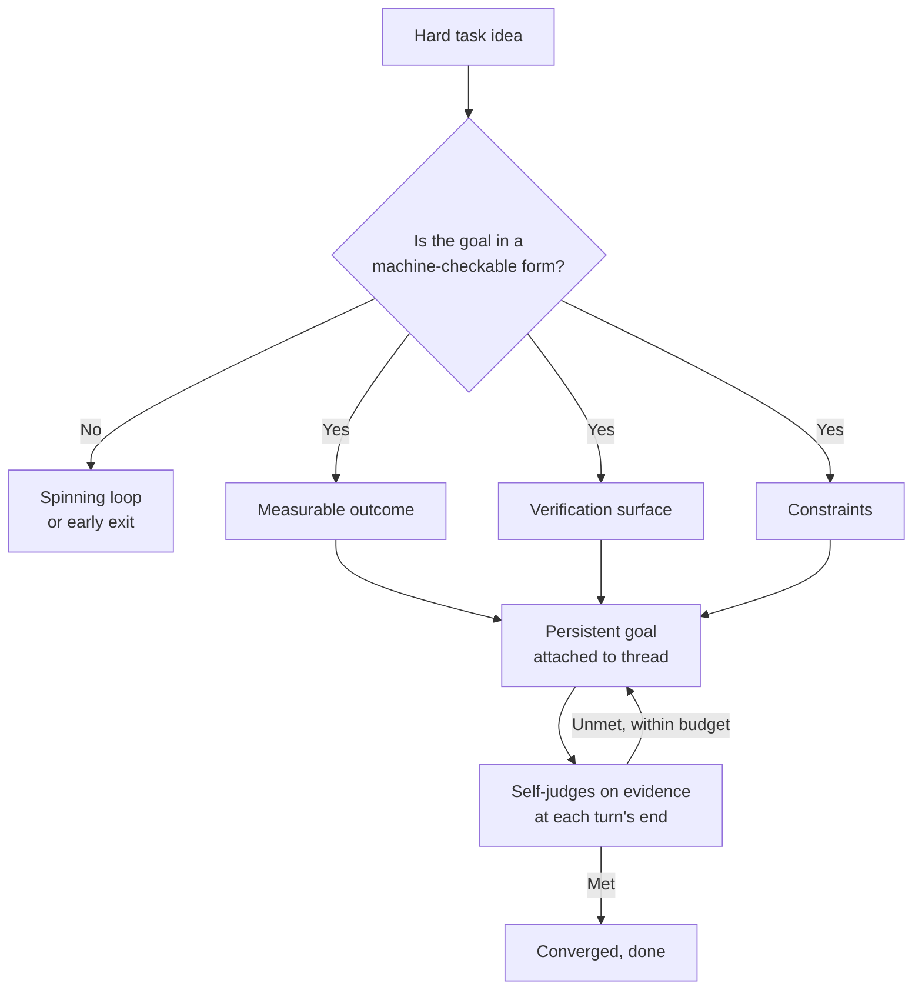

## Overview

A short tip has been circulating among developers who lean on coding agents. When you hand Codex a truly hard `/goal`, do not tell it to start working right away. First ask it to "write the goal so that another thread can achieve it." Read once, it sounds like a play on words. What difference does it make to ask the model to write the goal instead of achieving it?

Yet this tip lands squarely on something anyone who has run agents for a while knows in their bones. Hard tasks usually fail not because the model is weak, but because the goal was never written in a form a machine can judge. People think a sentence like "clean up this refactor" is a goal, but to an agent it leaves everything blank: when to stop, what counts as success, where the boundary is. So this post takes the "have it write the goal" technique apart piece by piece, and shows how ThakiCloud, which runs a Kubernetes-based AI/ML platform and an agent platform, already enforces the same principle in code.

## What Codex goals are

First, look closely at the raw ingredient. Codex's `/goal` attaches a persistent objective to a thread. According to OpenAI's published cookbook "Using Goals in Codex," a goal should be described in three parts: a measurable outcome, a verification surface that lets you confirm progress, and constraints. Once those three are present, the goal becomes a durable target attached to the thread.

The mechanics matter. At the end of each turn, Codex inspects the evidence so far and judges for itself whether the objective is satisfied. If not, and the goal is still active and within budget, it continues from the latest state. In short, instead of a single response, it repeats observing and judging until the goal, a termination condition, is met. The appeal is that a long-running task can turn into a set-it-and-forget-it workflow.

The key point here is that the quality of the goal decides everything. If the verification surface is blurry, Codex cannot tell when to stop; without constraints, it wanders past its scope and touches unrelated files; without a measurable outcome, it fixes one file and declares itself done. Writing a good goal is therefore its own skill, and when that skill is lacking, hard tasks fall apart.

## The technique: "write a goal for another thread"

Now back to the tip. Facing a hard task, a person rarely writes a good goal on the first try. Filling in what the measurable outcome is, what will verify progress, and which constraints to set is itself a non-trivial design task. What this tip proposes is to delegate that design to the model first.

Concretely, it flows like this. The first thread is told to "write a goal that lets another thread autonomously achieve this hard task." The model does not do the work here. Instead it understands the task and produces a goal spec that states what success is, how to verify it, and where the boundary lies. The person reviews and sharpens that spec, then feeds it as the goal into a new thread to run the actual execution. The execution thread starts with a well-defined termination condition, so it is far less prone to the spinning loops or early exits described above.

This technique works for two reasons. First, it separates writing the goal from achieving the goal. The two are different in character. Writing a goal is about understanding the problem broadly and fixing success criteria in language; achieving a goal is about drilling narrowly toward those criteria. When one thread tries to do both, it lurches into implementation while still deciding the verification criteria, and ends up grading itself against criteria it never even set. Separated, each thread focuses on one thing.

Second, it creates a review point for the person. The goal spec the model produces is an artifact a person can read and edit before execution. If the verification surface is weak, you can reinforce it at this stage; if the scope is broad, you can add constraints. Discovering a mistake after execution starts is expensive; catching it at the goal-spec stage is cheap. In other words, this is not a prompt trick but a structural device that inserts one layer of cheap review.

Of course it is no cure-all. One developer newsletter framed this approach as turning "a four-hour task into a set-it-and-forget-it workflow," but that is an impression of a case that fit well, not a guarantee. Even if you succeed at making the model write a good goal, whether the execution thread actually converges toward it is a separate matter. So the technique only pays off when it is paired with the verification gates discussed below.

## Implications for ThakiCloud's products

There is a reason this technique does not feel foreign: ThakiCloud already enforces the same principle, not as a prompt request but as a code discipline. Since the subject is agent operations, we center the perspective of our agent platform Paxis here, while also connecting it to the ai-platform infrastructure beneath it.

Paxis is ThakiCloud's Agent-Native Cloud, a control plane that treats skills, tools, policies, and audit logs as first-class resources. Inside it is an executor called Goal Mode. When we create a goal in Goal Mode, we have written the rules so that `check_cmd`, `success_criteria`, and a budget cannot be left blank. Those three map almost one-to-one to the three parts of a Codex goal: `success_criteria` is the measurable outcome, `check_cmd` is the verification surface that judges progress, and the budget is the constraint. If a goal is created as an empty shell, it is designed to fail the gate on the first iteration, so the code guarantees a state where "if you do not write the goal well, it will not even start."

The delegation structure of "write a goal for another thread" also lives inside us. When a complex request arrives, the main agent decomposes it into subtasks and delegates each to a separate subagent. The one who decomposes and the one who executes are separated, which is exactly the same idea as this article's split between the goal-writing thread and the goal-executing thread. Decomposition needs judgment, so a higher-tier model handles it; execution is narrow work, so it is sent down to a cheaper model. The principle of cheap workers, expensive gates comes from here.

Above all, we never merge fanned-out results without verification. However well you write and delegate a goal, whether the result is correct must be judged by a separate verification stage, not the executor. Code artifacts are judged by actually running tests and reading the exit code; content or judgment artifacts are filtered by a majority vote of several verifiers with different perspectives. A sentence where the model reports "this looks done" cannot be the termination condition of a loop. This discipline shows how we harden Codex goal's "judge yourself on the evidence at each turn's end" into a trustworthy form.

There is a connection through the infrastructure lens too. A loop that slices goals finely and runs them with verification steadily consumes compute. The ai-platform is the layer that provides Kubernetes and Kueue-based GPU scheduling, vLLM serving, and multi-tenant isolation, building a floor where these agent loops can run cheaply and reliably. Low-cost serving creates agent economics, and on top of it Paxis's goal delegation and verification loops become practically viable. The two lenses complement each other.

## Limitations and counterarguments

To avoid overrating this technique, let us take the other side.

First, the goal-writing step itself can fail. If the model produces a plausible but unverifiable goal, the execution thread still starts without knowing what counts as success. There are many cases where a person writing a short, solid goal directly is better. So the goal spec the model writes must have a human review point, and handing it straight to execution without review throws away the very cheap review point you gained.

Second, the overhead is not justified for every task. Writing the goal for it and splitting threads on a single-file fix or a quick question is overkill. This technique only pays off on hard tasks where the termination condition is blurry, the run is long, and autonomous execution is genuinely valuable. Our internal rules likewise draw a line: use loop tools only for iterative implementation or convergent work, and do not force them onto one-off edits.

Third, the longer autonomous execution runs, the more people tend to trust the result and stop reviewing. The comfort of having delegated the goal well is itself the danger. If the verifier filters out nothing, that is not a signal that everything passed but more likely a signal that the verifier is broken. So core outputs must be sampled and checked by a person periodically, and verifiers should be designed to aim at refutation, not confirmation.

In sum, "on hard tasks, write the goal first" is not a prompting knack but structural advice to separate writing the goal from executing it and to insert a review point in between. If Codex's goal feature put this into the hands of individual developers, ThakiCloud enforces the same principle at team scale through Paxis's Goal Mode and verification loops. That writing a good goal is what it means to run an agent well does not change, whatever the tool.

## Sources

- OpenAI Cookbook, ["Using Goals in Codex"](https://developers.openai.com/cookbook/examples/codex/using_goals_in_codex)
- Original tweet: nickbaumann_, tip post on delegating Codex goals (X/Twitter fetch restrictions prevent automated verification, source not machine-verified)
