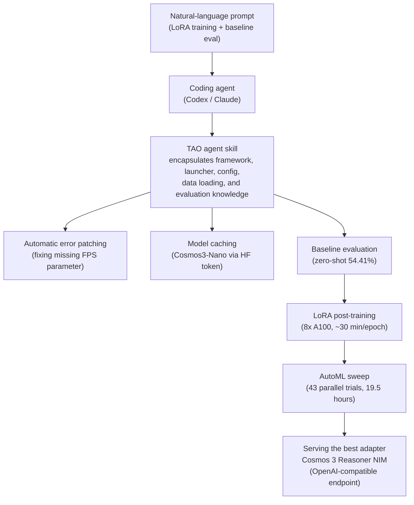

Last week, our design-system UI generation experiment led us to the conclusion that you need to
build the gate before the model. NVIDIA's newly published Cosmos 3 post-training case study is the
other half of that story. Here, instead of a human hand-building the gate, encapsulated knowledge
called an **agent skill** is handed to a coding agent, and that agent drives fine-tuning,
evaluation, and hyperparameter search on its own. The intended audience is ML and platform
engineers who want to post-train foundation models on their own infrastructure. To cut to the
conclusion: the real protagonist of this case study is neither the model nor the GPUs, but the
**harness that hardens workflow knowledge into a skill and lets an agent run it repeatedly**.


*Agent skills conduct the repetitive labor of GPU training, evaluation, and tuning. The human only supplies the goal through a prompt.*

## What Cosmos 3 and Agent Skills Are

Cosmos 3 is a foundation model NVIDIA built to handle the physical world. It uses a
Mixture-of-Transformers architecture that unifies text, images, video, ambient sound, and motion
tracking, combining an autoregressive reasoning tower responsible for logic and planning with a
diffusion transformer that predicts future states. NVIDIA states that this model ranks first on
multiple benchmarks including VANTAGE-Bench, PAI-Bench, Physics-IQ, RoboLab, and RoboArena. It
comes in two sizes, the 64B Cosmos 3 Super and the 16B Cosmos 3 Nano, and this case study uses
Nano.

The key here is not the model but the **TAO agent skill** attached alongside it. A TAO agent skill
is a bundle of knowledge that automates the post-training workflow for vision models. It
encapsulates task-specific knowledge such as framework details, launcher behavior, config
structure, data loading conventions, and evaluation workflows, so that a coding agent like Codex
or Claude can orchestrate a training pipeline on its own with minimal human intervention. In other
words, a skill is not a single-line prompt but a reusable unit that packages an executable
procedure together with failure recovery.

## Post-Training That Finishes with Two Prompts

What makes this case study striking is that the only human input was two natural-language
prompts.

The first prompt instructs LoRA post-training. It asks the agent to train
`nvidia/Cosmos3-Nano` with LoRA on Toyota's Woven Traffic Safety dataset, but to run a baseline
evaluation first for comparison.

```
Perform LoRA post-training of the Cosmos 3 model on the Woven Traffic
Safety dataset. Training data: /home/.../WTS_dataset/wts_data_train
Validation data: /home/.../WTS_dataset/wts_data_val
Base model on Hugging Face: nvidia/Cosmos3-Nano
Also perform a baseline evaluation first, to compare with the post-trained model.
```

With this single prompt, the agent handled several tasks in sequence. It found and patched a
missing FPS parameter in the data pipeline on its own, cached the model using a Hugging Face
token, measured a pre-training zero-shot baseline of 54.41%, and then ran LoRA training. What
stands out here is the instruction to "run a baseline evaluation first." Instead of trusting a
self-reported result after training, the agent pinned down a pre-training number as a measured
baseline and actually measured the improvement. This is exactly the same principle we learned from
our experiment last week.

The second prompt is an AutoML sweep. It leaves the search strategy and which hyperparameters to
tune up to TAO, and asks the agent to optimize validation accuracy and summarize the best models.

```
Run an AutoML sweep to improve the LoRA result. Let TAO choose suitable
search strategies and tune the important training hyperparameters. Optimize
validation accuracy and summarize the best models.
```

Looking at the overall flow as a diagram, the human appears only at both ends, while the skill
fills in the repetitive work in between.



Environment setup is three tokens and one install script line. Set `HUGGINGFACE_TOKEN`,
`NGC_API_KEY`, and `AUTOML_LLM_API_KEY` in the terminal, then install the agent skill with the
script below.

```bash
export HUGGINGFACE_TOKEN="your_hf_token"
export NGC_API_KEY="your_ngc_key"
export AUTOML_LLM_API_KEY="your_llm_key"

curl -fsSL https://raw.githubusercontent.com/NVIDIA-TAO/tao-skills-bank/main/scripts/install-codex-agents.sh | bash
```

The training data is Toyota's Woven Traffic Safety dataset, a video question-answering task with
over 8,000 training and validation samples. It consists of four-choice questions about road
structure, road type, and traffic safety situations.

## The Numbers Two Prompts Produced

Performance improved clearly. All the figures below are values NVIDIA published, not results we
reproduced.


*Two prompts raised validation accuracy from 54.41% to 93.35%. NVIDIA published figures.*

The zero-shot baseline was 54.41%, and the single-prompt LoRA run raised it by 32.73 points to
87.14%. On top of that, the AutoML sweep tuned hyperparameters with Bayesian optimization and
pushed it to 93.35%, a gain of 38.94 points over the baseline. The key point is that these numbers
came without a human touching a single hyperparameter by hand; the agent chose the search strategy
and ran the repeated training itself.

To be honest about it, we also need to look at the cost numbers. LoRA training took about 30
minutes per epoch on 8x A100 80GB GPUs, and the AutoML sweep ran 43 trials in parallel across
multiple A100 nodes, taking 19.5 hours. A full-parameter SFT run used as a comparison took 3h34m
on H100, and NVIDIA states that LoRA cut GPU time to roughly one-seventh of that full SFT run.
Once training finishes, Cosmos 3 Reasoner NIM serves the LoRA adapter through an
OpenAI-compatible endpoint, a structure that deploys directly as a prebuilt microservice without
requiring manual setup of vLLM dependencies or CUDA configuration.

## Did We Run This Ourselves

To be honest, we did not reproduce this workflow in our own environment. The Cosmos 3 family of
weights sits behind a gated Hugging Face repository, it requires 8 A100 GPUs plus NGC and AutoML
LLM keys, and the parallel sweep used in the case study assumes multiple GPU nodes. We did not
secure this combination of resources for this post. So every number above is a quote of a value
NVIDIA published, and we do not present it as something we measured ourselves. We hold to the
principle of never fabricating a benchmark without reproducing it. What we can do instead is
dissect the structure of this case study and precisely contrast it with what is already running
on our own platform, noting what matches and what differs.

## Implications for ThakiCloud Products

This case study is a rare topic where the perspectives of both our products interlock.

**From the Paxis lens, this is external validation of our thesis that skills should be treated as
first-class resources.** Paxis is ThakiCloud's Agent-Native Cloud control plane, and it treats
Skills, Tools, Policies, and Audit Logs as first-class resources. The Skill Harness selects from
over 960 skills using BM25, runs them in an isolated sandbox, and routes every action through
policy gates and audit logs. What NVIDIA's TAO agent skill proves is that when a skill
encapsulates framework details all the way down to failure recovery, a coding agent can reliably
repeat a complex workflow. This is exactly the direction we have been defining skills in: not as
prompts, but as units of execution. The difference is just as clear, though. TAO skills are
tightly bound to the NVIDIA stack, so they are hard to use as-is outside the TAO launcher, Cosmos
models, NGC, and NIM. The Paxis skill harness is designed to avoid dependency on any specific
vendor or model, and that is exactly the core of the value we aim to deliver in on-premises and
sovereign environments.

**From the ai-platform lens, this is exactly the GPU training and serving we schedule every
day.** Throwing 43 AutoML trials in parallel across multiple nodes directly overlaps with how
Kueue manages the GPU queue on our platform. NIM serving a LoRA adapter through an
OpenAI-compatible endpoint solves the same problem our vLLM serving path solves. And the fact
that LoRA cuts GPU time substantially compared to full SFT supports our thesis that low-cost
serving and low-cost training are ultimately what make agent economics work. When a customer
wants to post-train a foundation model on their own data, we offer a path where they slice GPUs
with Kueue and serve adapters with vLLM on their own cluster, rather than going through a gated
external cloud.

Put the two lenses together and the picture is complete. ai-platform underpins low-cost training
and serving, and on top of that Paxis drives the agent with skills, policies, and audit. NVIDIA's
case study, using someone else's benchmark, shows that this combination actually leads to real
performance gains.

## Limits and Counterarguments

To avoid overstating this case study, four things need to be kept in view together. First, "in
one day" is a wall-clock measure, not a GPU-time measure. A 19.5-hour sweep across 8 A100 GPUs
and multiple nodes is by no means cheap, and one-seventh is a relative figure against full SFT,
not a claim of absolute cheapness. Second, 93.35% is a number from a narrow task: four-choice
traffic-safety video QA. It should not be inflated into a claim that general physical reasoning
ability improved by that much. Third, automation hides vendor lock-in. The reason the agent could
patch errors "on its own" is that the skill bank already knew that exact framework's error
patterns in advance. That smoothness disappears once you step outside the stack. Fourth,
"minimal intervention" is not zero intervention. A human still has to enter API keys, specify
dataset paths, and install a skill bank suited to that task in the first place before the flow
can begin. What the agent removed is repetitive labor, not judgment itself.

Even so, the direction is clear. Hardening workflow knowledge into a skill, having an agent
execute that skill repeatedly, and confirming improvement through a measured gate rather than a
self-report is not one vendor's strategy but a common design pattern of the agent era. That
structure is exactly what we are building with Paxis and ai-platform.

## Sources

- NVIDIA Developer Blog, "Post-Train NVIDIA Cosmos 3 in One Day Using Agent Skills" (<https://developer.nvidia.com/blog/post-train-nvidia-cosmos-3-in-one-day-using-agent-skills/>)
- GitHub: NVIDIA/cosmos, NVIDIA-TAO/tao-skill-bank
- Hugging Face: nvidia/Cosmos3-Nano, nvidia/Cosmos3-Super
- Dataset: Woven Traffic Safety (WTS), Toyota
