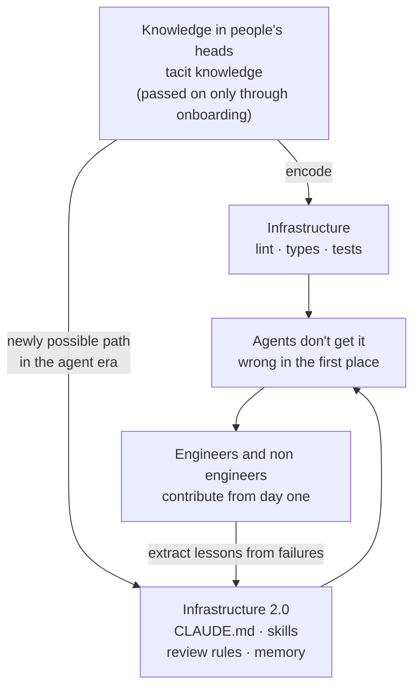

## Overview

Boris Cherny, who built Claude Code at Anthropic, recently shared an idea worth sitting with. His starting point is simple. The best engineers have always spent a large share of their time automating their own work: better editor macros, lint rules that catch recurring mistakes, e2e suites that remove the need to smoke test by hand. This kind of automation was the highest leverage activity available because it multiplied output.

His observation goes one step further. In the agent era, this same automation matters even more than it used to. This post unpacks that claim in three parts, then closes with an honest audit of how much of it ThakiCloud actually practices, measured against our own repository. This is not self congratulation. It is a check on whether the infrastructure we built genuinely carries domain knowledge, or merely looks like it does.

## Why automation's standing has changed

The arrival of agents raised the value of automation for three reasons.

First, infrastructure and developer experience automation increases speed, and if you are running several agents at once, each of those agents also gets faster. More automation means more output per unit of time, except now the entity producing that output is not one person but several agents. The multiplier itself has changed scale.

Second, moving work into code raises efficiency. An agent can fix the same problem by hand every time it appears, but that burns tokens and still misses edge cases. Instead, once an agent writes a lint rule, a CI step, or a routine a single time, that entire class of problem is automated forever. This is the real meaning behind what people call a "loop." It is not about solving one instance of a problem, it is about automating the whole category of problem. None of this is a new idea. Engineers have worked this way for a long time.

Third, and most importantly, automation makes it easier for other people to contribute to a codebase. A scene that shows up more and more often is an engineer contributing on their very first day, carried by an agent's ability to navigate the codebase for them. Non engineers contribute just as effectively as engineers do. What used to block both groups was never a lack of automation. It was domain knowledge sitting only inside people's heads, the tacit knowledge you had to learn during onboarding.

## What it means to encode domain knowledge as infrastructure

Here is the core shift agents brought about. The domain knowledge that can be encoded into infrastructure is no longer limited to what lint rules, types, and tests can express.

In the past, only rules like "this function must never return nil" could be hard coded. Knowledge like "our team always checks this permission before calling this API," "this migration is only safe inside a deploy window," or "this screen must follow this architecture pattern" lived in a document somewhere, or only in a senior engineer's head.

Now nearly all of that knowledge can be captured in code comments, skills, CLAUDE.md rules, and memory. If I open a PR against an iOS codebase I don't know and a reviewer rejects it for using the wrong framework, or a designer built a feature that gets rejected because it doesn't follow the architecture pattern, these are not human mistakes. They are automation failures. If that knowledge had been embedded in the infrastructure, the agent would never have gotten it wrong in the first place.

This gives us a test to apply. Every rule, every sentence in a skill, has to pass the question: would the agent get this wrong without it? A sentence that fails that test is pure loss, paid for every session in context cost. A skill is not free. It is a tax.

The last arrow in this diagram is the important one. When an agent gets something wrong, the goal is not to patch it once and move on, but to re encode "why it went wrong" as a rule or a skill. That way the same class of failure disappears for good. Without this feedback loop, the system cannot keep improving on its own over time.

## What ThakiCloud actually does

That covers the argument. Now we turn the same question on ourselves. Does ThakiCloud's agent infrastructure really carry domain knowledge, or does it just look like it does. We measured the repository directly.

Our backend monorepo carries 52 always loaded standing rules (`.claude/rules/`), 3,536 lines in total. These rules are not generic coding style guidance. Most of them are lessons pulled out of specific incidents. The "macro data source" rule, for example, exists because a specific library once returned an exchange rate that was 25 won too high and a day stale, which caused a morning briefing to report the wrong number. Since then, code enforces that exchange rates come only from a designated authoritative source. A large share of our 52 rules open with a header like "incident on such and such date," and 18 of them carry a dedicated gotchas section. That is evidence that the loop from failure to documentation to enforced rule is actually running, not just described.

The skills that load on demand, including external plugins, number over 1,800. They package recurring workflows, report generation, code review, paper writing, deployment pipelines, into reusable form. A skill is not the same thing as a plain prompt. It is version controlled, it bundles scripts, templates, and known failure cases together, and it gets reused end to end from input through error recovery. The principle is to build capability into fat skills rather than a thin harness.

We have 63 role specific subagents, 13 auto triggered hooks, and 41 unattended automations (launchd) that run at fixed times with no human involved. Morning briefings, news digests, blog evolution, and self improving skills all fall into this bucket. The pipeline behind this very post is one of them. The workflow that produced the sentence you are reading right now enforces, in code, the process of drafting, stripping AI tells, unifying tone, and translating into three languages before publishing. The format is not improvised by the model. It is owned by deterministic code.

CLAUDE.md is not confined to a single top level repository. Counting submodules and sub packages, it exists in more than 20 locations. The frontend monorepo, the multi cluster mesh, and the AI assistant product each declare their own rules through their own CLAUDE.md. An agent working on the backend reads the backend's CLAUDE.md on demand, and an agent working on the frontend reads the frontend's. Knowledge is not piled into one place, it is placed where it is needed, following a pattern of progressive disclosure.

Taken together, the four encoding channels Boris Cherny names (code comments, skills, CLAUDE.md rules, memory) are all alive in our system. In particular, the loop that "feeds failures back as rules" is not decoration. It is genuinely fed by real incidents, and that is the strongest evidence we have that we are practicing this principle rather than just imitating it.

## What's still missing, and the counter case

In fairness, we should also look at the other side. This approach is not an unqualified good.

First, the infrastructure itself is a cost. 3,500 lines of always loaded rules consume tokens every single session. As rules accumulate, context bloats and the code that actually matters gets crowded out. That's why we delete any rule that fails the "would the agent get this wrong without it" test, and demote knowledge that isn't always needed from a standing rule down to an on demand skill. Encoding is not something to keep growing without limit, it is something that needs continuous dieting.

Second, encoded knowledge goes stale. A rule born from an incident six months ago can rest on an assumption that no longer holds. One of our own rules, in fact, was an absolute ban on "averaging down," rooted in an old story about trading a small speculative stock. It no longer fit our current portfolio context, so it was deleted and replaced with a different principle. Infrastructure needs weeding just as much as it needs planting.

Third, 1,800 skills are, by themselves, a source of noise. The more candidates there are, the higher the risk of loading the wrong one. Loading a skill just because its name partially overlaps degrades accuracy. That's why we narrow candidates through retrieval based routing and an explicit rule against forced matching. The sheer volume of encoding is never the same thing as quality, and that's a tradeoff we have to keep watching.

None of these limits undercut the principle itself. If anything, they show that practicing the principle properly means treating encoding and pruning as equally important work.

## Closing

Boris Cherny's conclusion is understated. Every team should write the CLAUDE.md, review rules, skills, and documentation that let an agent work productively in a codebase without any extra context. It sounds like an odd thing to ask for, but it is also a natural extension of what engineers have always done: automate, and turn domain knowledge into infrastructure.

As models get smarter and harnesses mature, this work gets easier. In the meantime, what every team needs to do is clear. Move the domain knowledge scattered across people's heads and documents into infrastructure that an agent can read and follow. Do that, and Claude writes better code, code review catches problems automatically, and the next person who works in this codebase can contribute more easily. ThakiCloud is building its platform, and the automation that runs it, on top of this principle.

## Source

- Boris Cherny, "Automation and the infrastructure of domain knowledge," X (formerly Twitter), [original post](https://x.com/bcherny/status/2077460395279692197)
