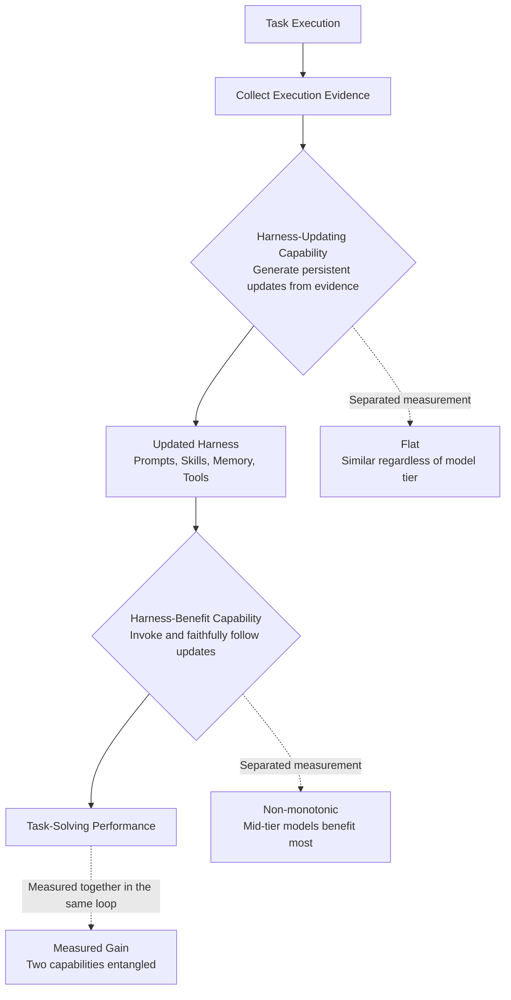

Anyone who has run agents for a while has probably seen a graph like this: an agent revises its own prompts, skills, and memory over time, the benchmark score climbs, and the team concludes that "the self-evolving harness works." A recently published study argues that a large part of that graph may be an illusion. Until now, evaluation methods could not tell whether the rising score reflected a genuinely better harness or simply a model that was already good at following instructions. This piece is written for ML and platform engineers who run agents and evolve their skill libraries and harnesses in production. The bottom line up front: the reflex of saying "let's move up a model tier" whenever performance stalls turns out to be only half right, once you look at this study's data.

## Overview

The paper is titled "Harness Updating Is Not Harness Benefit." Read literally, updating a harness and benefiting from a harness are two different things. Most systems that work with self-evolving agents have measured these two as a single blob. An agent solves a task, extracts prompt or skill edits from the execution trace, runs the next task with the revised harness, and if the final score goes up, the system declares that "evolution worked."

The problem is that this verdict conflates two distinct abilities: the ability to produce a useful, durable update from execution evidence, and the ability to actually put that updated harness to work when solving a task. Both abilities live inside the same model, but they are fundamentally different in character. And because prior evaluations measured both **inside the same execution loop at once**, looking at the final score alone could not tell you where the improvement came from. The authors propose an experimental design that untangles this conflation, and the result runs directly against conventional wisdom in the field.

## What This Research Asks

First, some terminology. Here, a **harness** refers to the entire set of editable, external components that shape an agent's behavior without touching the model's parameters. Prompts, skills, memory, and tool definitions are all part of the harness. Self-evolution is the process by which an agent reviews its own execution outcomes and revises this harness on its own. The model stays fixed; only the surrounding knowledge and tooling change.

The study splits this evolution process into two abilities.

The first is **harness-updating**: the ability to look at evidence from a completed task and produce a useful, reusable, persistent update. Extracting a lesson from a failed case and writing it into a skill document, or noticing a recurring pattern and hardening it into a prompt rule, both fall under this category.

The second is **harness-benefit**: the ability, given an updated harness, to actually retrieve it and follow it to raise task performance. A good skill sitting unused in the library, or a skill that gets invoked but whose instructions are not followed through to the end, both produce zero benefit.

The key insight is that these two abilities must be **measured separately**. If you pair the model that produced the update with a different model that uses the update, you can tell whether an improvement came from the quality of the update or the quality of how it was used. The diagram below shows the structure of the conflation and where the separation happens.

## What Separating the Two Abilities Reveals

The result of the separated experiment comes down to two sentences. Both run against practical intuition.

First, **harness-updating capability is flat across model tiers.** Harness updates produced by models of very different capability tiers delivered surprisingly similar gains. In the authors' own words, updates produced by a small 9B-scale model matched the gains delivered by updates from a top-tier frontier model. In other words, "who wrote the skill" barely moved the quality of the update. Extracting a rule and hardening it into documentation turns out to be a cheaper cognitive task than expected.

Second, **harness-benefit capability is non-monotonic across tiers.** Given the same updated harness, weak-tier models saw almost no gain, mid-tier models gained the most, and top-tier models gained less than the mid-tier models did. Rather than a curve that keeps climbing as you move up, it is a curve that bulges in the middle.

Overlay these two results and the picture flips. Assigning an expensive frontier model to the **evolver** role, the one that produces updates, in a self-evolving system is close to wasted budget, since update quality is flat regardless. Assigning an expensive model to the **agent that actually solves tasks** is not necessarily optimal either, since benefit is non-monotonic. A strong model already has its own habits set, and tends to follow an external harness's instructions less closely.

## Why Weaker Models Don't Benefit

The most practically useful part of the paper analyzes why weak-tier models fail to benefit. The authors point to two failure modes.

The first is **activation failure**. Even when a skill in the library is a perfect match, the model fails to retrieve it. The judgment required to connect a relevant harness artifact to the current situation simply does not fire. The skill exists, but gets dropped at the retrieval and selection stage, so no amount of accumulated updates helps.

The second is **unfaithful execution**. The model successfully retrieves the skill, but fails to follow its multi-step instructions through to the end. When the ability to hold a long chain of instructions is weak, a good harness gets derailed into a partial, drifted execution partway through.

This diagnosis points to a clear prescription. To raise self-evolution performance, don't raise the evolver's intelligence, target **harness invocation (activation) and faithful execution of long instructions**. Your capability budget buys more when spent on the side that uses updates, specifically on these two bottlenecks, rather than on the side that produces them.

## Implications for ThakiCloud Products

This study's conclusion lines up closely with the discipline we've built running Paxis. Paxis is ThakiCloud's Agent-Native Cloud, and it treats skills, tools, and policies as first-class resources. We select from more than 960 skills using BM25 and execute them in isolated sandboxes, and our self-evolving skill loop extracts lessons from failures and revises skill documentation. In other words, we already run a "harness-updating" loop every day.

The first lesson this study offers is: **don't attach an expensive model to the evolver.** A nightly evolution loop that improves skills and logs retrospectives can run on a low-cost tier under the premise that update quality is flat. In fact, our skill model policy already starts evolution and orchestration stages on sonnet by default, pinning a higher-tier model only for the small set of skills where content quality is itself the deliverable. This study gives that choice an evidentiary basis: it was **optimization with no quality loss**, not just cost savings.

The second lesson is the diagnosis that the bottleneck is "activation and execution." In our environment, this is precisely the problem of **skill routing and gate compliance**. No matter how many skills exist, if the right one is not retrieved at request time, that is activation failure, and if a skill is invoked but its deterministic gates are not honored, that is unfaithful execution. Paxis's decision to strengthen skill retrieval with a BM25 router, and to have format and validation owned by code gates rather than the model's own prose judgment, targets exactly these two bottlenecks. Performance is decided less by piling on more good skills and more by the plumbing that retrieves the right skill precisely and enforces its instructions to the end.

There is an infrastructure implication too. ai-platform serves multiple model tiers on top of K8s and Kueue. This study suggests that when deploying a self-evolving pipeline, it is reasonable to place **different model tiers in different roles** for the evolver and the task solver. A mixed deployment, a cheap model as evolver and a mid-tier model as the task solver, is a design that can save substantial cost in multi-tenant GPU scheduling while holding quality steady.

## Limitations and Counterarguments

Before carrying this study straight into practice, a few caveats are worth naming.

First, the conclusions of "flat" and "non-monotonic" are tied to the task distribution and harness types the experiments covered. Rule-extraction work like revising skill documentation may show flat updating capability, but updates that involve implementing complex tools or generating long orchestration code may well reopen the gap between model tiers. Whether our own updates lean toward the former or the latter is something each team has to measure for itself.

Second, the finding that top-tier models benefit less from an external harness can also be read as a ceiling effect: a strong model is already good, so there is less room left to improve. This does not mean the harness is useless. Absolute performance can still be higher for a strong model; the harness is simply a marginal gain layered on top.

Third, for an organization like ours that already practices "evolve cheap, gate expensive," this study reads less like a new direction and more like quantitative backing for an existing discipline. For a team that has been reflexively raising the evolver model's tier whenever self-evolution performance stalls, on the other hand, this data is a clear signal to reallocate budget.

## Conclusion

In the end, this study leaves us with one practical rule. Don't look at a self-evolving harness's performance as a single score. **Decompose it into two axes, updating and benefit, and measure each separately.** Only once you separate them does it become clear where your capability budget should actually go.

## Sources

- Harness Updating Is Not Harness Benefit: Disentangling Evolution Capabilities in Self-Evolving LLM Agents, arXiv 2605.30621: [arxiv.org/abs/2605.30621](https://arxiv.org/abs/2605.30621)
- Hugging Face Papers page: [huggingface.co/papers/2605.30621](https://huggingface.co/papers/2605.30621)
- Related background: Agentic Harness Engineering, arXiv 2604.25850: [arxiv.org/html/2604.25850v3](https://arxiv.org/html/2604.25850v3)
