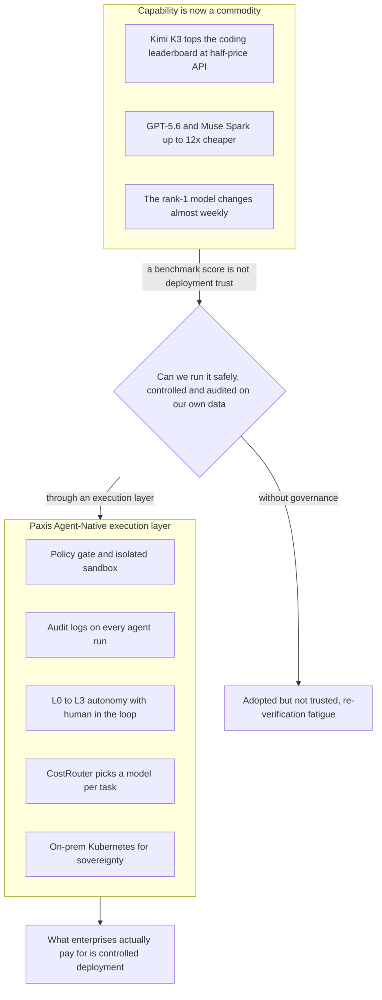

There is a moment worth screenshotting on a leaderboard: a fresh new model pushes past a familiar number one and climbs to the top. In July 2026, Kimi K3, the open weight model from China's Moonshot AI, created exactly that moment. It took the top spot on the Arena AI evaluation platform's frontend coding leaderboard, overtaking Anthropic's Claude Fable 5, and at 2.8 trillion parameters it is the largest open weight model released to date. Its API price is also less than half. Yet the reaction from Silicon Valley, as reported by Digital Today, was not applause but a single sentence: "It won the benchmark, but still."

That coldness is today's real news. And the same week saw one more scene unfold in the opposite direction.

## Two Scenes That Paused at the Summit

Google pushed Gemini 3.5 Pro back to July after delaying it three times, even though CEO Sundar Pichai had personally promised a June launch at a developer event in May. According to a Newsroad report, the company scrapped its existing architecture and undertook a full rebuild from scratch, and the key cause cited was that coding performance fell short of internal targets. After news of the delay, the stock briefly dropped about 4 percent, and over the past six days four core Gemini researchers moved to Anthropic.

Newsroad did not point to technical difficulty alone as the backdrop for the delay. It also noted that a structure in which multiple organizations, Google Cloud, DeepMind, and Android among them, each build their own separate AI coding tools and duplicate resources, plus an internal engineering culture that insists important code must be written by hand, slowed things down. In other words, even at the frontier of performance, it has not yet been settled how far humans should stay involved and what should be handed to automation.

On one side, a fresh open weight model reached the top of the leaderboard, yet the market did not open its wallet. On the other, even the frontier leader delayed its next version three times. The two scenes look like a contradiction, but they tell the same story: at the peak of the performance curve, the gap between benchmark numbers and actual deployment has widened more than ever.

## As Price Falls, the Question Changes

Capability itself is becoming more commoditized. Looking at the model price table compiled by Chosun Ilbo, the axis of competition has already shifted from raw performance to cost efficiency. OpenAI's GPT-5.6 split its lineup into the high performance Sol and the lower cost Tera and Luna, while Meta's Muse Spark charges roughly one twelfth of Anthropic Fable 5's price on an output token basis. SpaceX's Grok 4.5 claims to use more than four times fewer output tokens than competing models on coding evaluations. Kimi K3's half price API is one more branch of this same trend.

As prices head toward the floor, the question changes. It shifts from "which model is the smartest" to "can we run this capability on our own data and work safely, under control, and in an auditable way." This is why the leaderboard's number one does not sell. What enterprises pay for is not an intelligence score but deployability. A benchmark proves capability, but it does not prove trust.

## Those Who Have Already Adopted It Speak First

The most honest witnesses to this gap are not skeptics but the people who have already adopted the technology. Adoption itself is exploding. Hana Tour linked its multi AI agent H-AI to a ChatGPT window inside KakaoTalk, letting users get travel recommendations without installing a separate app, and after applying generative AI search optimization, traffic coming through ChatGPT rose about 850 percent. AI is pushing into familiar messenger surfaces at this steep a pace, yet how much an organization actually trusts and hands over the results follows a completely separate curve.

Major retail conglomerates have started deploying AI agents in real work. Lotte Chilsung Beverage combined generative AI, OCR, and RAG to cut product label review time by more than half, and Dongwon Group has introduced AI employees at its affiliates, with plans to add roughly 50 more by the second half of the year. But the key point in this rollout story, reported by Weekly Hankook, is the recommendation Deloitte added: in the early stage of rollout, keep a human in the loop system in which people verify and approve the results.

Even sharper is the confession from Wrtn CEO Park Min jun, who went public with an experiment replacing executives with AI. He ran a structure where role specific AI agents debated to produce opinions and the CEO synthesized them into a decision. It felt convenient at first, he said, but after about a month it actually took more time to re verify the AI's answers. He compared AI to a smart new hire, stressing that it only does its job properly once it has been trained enough on company data and organizational culture.

One company turned this same pain point into a market. The solution from Jiran Security, designated as an outstanding information security technology by the Ministry of Science and ICT and KISA, checks in real time at the endpoint whenever an employee types something into ChatGPT or Claude, blocking personal information and corporate secrets from leaking out, and it unifies audit of prompt input history and outgoing mail records. It does not sell capability, it sells a framework for using capability safely. All three cases point in the same direction. A model getting smarter and an organization trusting that model enough to hand over work are completely different problems.

## Nations Call the Same Value by a Different Name

This signal, visible at the level of individual companies, takes on the name sovereign AI once it rises to the level of a nation. Deputy Prime Minister Bae Kyung hoon, in a policy briefing, said developing a frontier model on the level of Anthropic's Mythos would require roughly 10,000 GPUs and previewed a government led expansion of computing, and the government decided to launch Modu's AI, a free service for all citizens, in December. The LG AI Research consortium ranked first across the board, benchmark, expert, and user evaluation, in the first round evaluation of its proprietary foundation model, and it has been applied in a demonstration project for the Ministry of the Interior and Safety's services. In Japan, the Noetra consortium, funded by 44 companies including Sony, SoftBank, and Honda, has secured roughly 27,500 Nvidia Rubin GPUs to build national AI infrastructure.

Reading this trend as simple nationalism only gets you half the picture. The real reason nations are pouring enormous sums into their own models and their own computing is that as capability becomes commonplace, the resource that actually grows scarce is controlled execution. On whose infrastructure, under what policy, with what recorded, does the model run. What a nation calls sovereign AI and what a company calls audit logs and human in the loop are the same value, differing only in scale.

## Money Is Starting to Grow Cautious Too

At this stage where capability is becoming commonplace, even the capital that had been piling up without limit is changing its expression. As Global Economic pointed out, new bonds from the hyperscalers that have propped up AI capex have fallen an average of 3.3 points below issue price, an unusual weakness for investment grade IT bonds. Large financial institutions like Goldman Sachs pushed back against early bubble talk, arguing these companies' fundamentals are strong enough that there is no default risk, but forecasts also came out projecting that North American cloud operators' capex growth rate will slow from 83 percent this year to around 23 percent next year. It is a signal that the era of building without limit is ending and an era of selection is opening.

That cost is already spreading elsewhere. According to Digital Today, second quarter shipments in India, the world's second largest smartphone market, fell 10 percent, the steepest drop in six years, and the cause cited was that hyperscalers' AI infrastructure investment has been eating into DRAM and NAND supply, pushing up memory costs for low cost smartphones. The bill for a world that treats capability like a raw material has arrived all the way at the consumer of a 210 dollar smartphone in India. The shift where margins thin on the side of piling up more capability and thicken on the side of handling capability better is showing up simultaneously across several indicators like this.

## From an Era of Choosing a Model to an Era of Owning the Execution Layer

The picture becomes clear once you layer in Meta's negotiations to lease its own computing to Anthropic for around 10 billion dollars, instead of advertising. Computing becomes a commodity, models become common at half price, and the leaderboard's number one changes almost every week. In a world where capability becomes a raw material like this, value moves not to the capability itself but to the execution layer that wraps around it. Competitiveness is decided not by which model you choose but by under whose control that model runs.

The figure below summarizes this shift in a single image. It shows why commoditized capability cannot be deployed by itself, and why it must pass through the gateway of an execution layer to become the controlled deployment enterprises actually pay for.

ThakiCloud's Paxis is the Agent-Native Cloud that turns exactly that execution layer into a product. It treats Skills, Tools, Policies, and Audit Logs as first class resources, designing the re verification fatigue that the Wrtn CEO experienced and the human in the loop that Deloitte recommended into autonomy governance staged from L0 to L3. It decides how far people can let go, not by feel, but through policy and gates. The audit function that Jiran Security sells is the default attached to every agent run in Paxis, and the policy gate and isolated sandbox become the framework that keeps secrets from leaking even while adopting a half price open weight model. The model competition that has shifted to cost efficiency is absorbed by CostRouter, which attaches a different model to each task, and the demand for sovereignty that sovereign AI calls for is handled by the on premises Kubernetes based ai-platform.

Flip the reason the leaderboard's number one does not sell, and it becomes the answer. What enterprises buy is not the peak score, it is controlled execution. The trust that a benchmark cannot buy is what the execution layer builds instead.

## References

This article was written by synthesizing the news items below.

- WikiTree, [Meta sells computing instead of ads, early talks on a $10 billion lease with Anthropic](https://www.wikitree.co.kr/articles/1147052)
- WikiTree, [SpaceX in talks to supply the Pentagon with AI computing, deal worth billions of dollars](https://www.wikitree.co.kr/articles/1147053)
- Good Morning Economy, [A 550 trillion won bet on AI infrastructure, reshaping everything from power grids to semiconductors](https://www.goodkyung.com/news/articleView.html?idxno=289308)
- AI Times, [Japan builds national AI infrastructure with Nvidia's Rubin, betting on physical AI](https://www.aitimes.com/news/articleView.html?idxno=212885)
- Newsroad, [Google's next generation AI, Gemini 3.5 Pro, launch delayed by months](http://www.newsroad.co.kr/news/articleView.html?idxno=61703)
- Digital Today, ["It won the benchmark, but still," how Silicon Valley views China's Kimi K3](https://www.digitaltoday.co.kr/news/articleView.html?idxno=684999)
- Chosun Ilbo, [AI model competition shifts from best performance to cost efficiency](https://www.chosun.com/economy/tech_it/2026/07/17/VQDA7CI2ERF4LG2YLQ76R6JG2A/)
- Hans Biz, [Travel recommendation AI inside KakaoTalk, Hana Tour expands the service](http://www.hansbiz.co.kr/news/articleView.html?idxno=850868)
- Weekly Hankook, [Retail's "work innovation," AI agent adoption goes into full swing](https://weekly.hankooki.com/news/articleView.html?idxno=7173721)
- Dong-A Ilbo, [Wrtn CEO Park Min jun: "We will replace executives with AI first"](https://www.donga.com/news/Economy/article/all/20260717/134316474/1)
- Edaily, ["Bold investment in Mythos level AI," Deputy PM Bae Kyung hoon expands advanced infrastructure](https://www.edaily.co.kr/news/newspath.asp?newsid=02696166645515504)
- Cheonji Ilbo, [[Korea's AI national team (1)] LG AI Research's K-EXAONE clears the big tech wall for AI sovereignty](https://www.newscj.com/news/articleView.html?idxno=3417568)
- Maeil Business, ["AI for all citizens" with no cost or capacity limit arrives in December, but funding remains uncertain](https://www.mk.co.kr/article/12100854)
- Maeil Business, [Japan launches sovereign AI with 44 participants including SoftBank, foundation model to be unveiled this year](https://www.mk.co.kr/article/12100992)
- Global Economic, [Signs of AI investment catching its breath, big tech's funding burden becomes a variable for HBM demand speed](https://www.g-enews.com/view.php?ud=202607180708261959fbbec65dfb_1)
- Newsroad, [Micron grabs the car's brain, forms a three to five year memory alliance with Hyundai Mobis and Qualcomm](http://www.newsroad.co.kr/news/articleView.html?idxno=61704)
- Digital Today, [India's smartphone shipments fall 10 percent amid AI memory demand fallout, steepest drop in six years](https://www.digitaltoday.co.kr/news/articleView.html?idxno=685002)
- Maeil Ilbo, ["Preventing SME data leaks with AI security technology," Jiran Security's AI security](https://www.m-i.kr/news/articleView.html?idxno=1392577)
