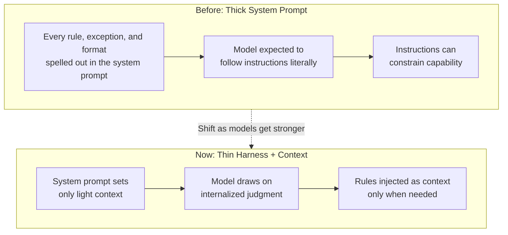

## Overview

A short piece of news has been getting quoted a lot lately in developer circles: Anthropic apparently cut Claude Code's system prompt by roughly 80 percent. What made it interesting wasn't the size of the cut so much as the reasoning behind it. Anthropic's Tariq Shihipar (@trq212) said the new Fable 5 family of models "wants a smaller system prompt," and that loading it up with instructions and examples can actually work against the model. His explanation: the model is often more imaginative than the rules we write for it.

That single line isn't just a product optimization note. Prompt engineering has spent the last few years drifting toward "write down everything, don't leave anything out." Packing the system prompt tight with what not to do, which formats to follow, and every edge case to watch for was treated as the mark of a good harness. Now there's a signal that once a model gets strong enough, all that density stops being an asset and starts being a liability.

ThakiCloud runs a Kubernetes-based AI/ML SaaS platform, and on top of it we operate Paxis, our agentic control plane, which manages over 960 skills and dozens of always-on rules as a harness. So "how much goes in the system prompt" isn't a trend headline for us, it's a design decision we make daily. This post covers what the cut actually signals, why stronger models want a thinner harness, and how we've translated that principle into our own operations.

## What Changed

The reported story comes down to two points. First, the sheer length of Claude Code's system prompt dropped substantially. Second, the reasoning behind it runs in the opposite direction from what you'd expect: not "the model is weaker, so we add more," but "the model is stronger, so we add less."

According to Anthropic's own account, newer models internalize behavioral norms during training to a much greater degree than before. Things that previously had to be spelled out line by line in the deployment-time system prompt are now, to some extent, already baked into the model's weights. The natural reading is that the system prompt's role is shifting, from "a rulebook that contains everything" to "a light context setter." There was also mention of steering the model through context rather than rigid prohibitions, such as "don't do this."

The diagram below sketches out the structure of this shift. The thick rulebook approach on the left and the thin context-setting approach on the right build capability in different places.

There's a catch worth flagging here. "Shrink the system prompt" doesn't mean "get rid of the instructions." What shrank is the standing harness that's always loaded at deployment time. The domain knowledge and reasoning behind those instructions still have to live somewhere. What changed is where that knowledge sits.

## Why Smarter Models Want Thinner Prompts

This isn't a hunch floating around without evidence behind it. There's a growing body of research showing that adding more agent scaffolding (harness) doesn't necessarily improve performance, and can instead create interference between components. "More Is Not Always Better: Cross-Component Interference in LLM Agent Scaffolding" (arXiv 2605.05716), for instance, examines the point at which adding more harness components starts causing them to interfere with each other and drag overall performance down. Piling on more instructions isn't a monotonically increasing benefit.

The intuition works like this: every rule you add to a system prompt becomes something the model has to treat as a constraint it must satisfy at every single moment. When there are only a few rules, this constraint acts as a useful guardrail. Once there are dozens of them, they start conflicting with each other, or instructions unrelated to the current task muddy the model's judgment. A weaker model wanders without explicit instructions, so paying that cost used to be worth it. A stronger model, though, has gotten much better at reading the situation on its own, so at some point the interference cost of unnecessary instructions starts to outweigh the benefit those instructions provide.

This is exactly where the line "the model is more imaginative than the instructions we give it" starts to make sense. A dense set of rules sets a floor that keeps the worst outputs from happening, but it also becomes a ceiling that suppresses the best possible output at the same time. Once the model is capable of climbing higher than that ceiling, stripping the rules away is what opens up the performance headroom.

That logic isn't unconditional, though. Remove the floor and the average can go up, but the variance goes up with it. The guardrail that used to catch the occasional bad output disappears too. In practice, this means what you strip out matters more than how much you strip out.

## From Rules to Context

The most practically useful part of this story is the shift from "rigid prohibitions" to "steering through context." There are two ways to express the same intent.

The first is a hard rule: something like "don't use jargon" or "you must follow this exact format," phrased as a prohibition or a mandate. It's clear, but stacked up as a standing harness it produces exactly the interference described above. The second is context setting: describing the state you want the output to be in, something like "write this so a sixteen year old can follow it easily." For a strong model, the second approach tends to be more stable in practice. Not because the model can't parse negative instructions, but because a positively framed goal gives the model room to fill in the details itself.

There's an important distinction here. This isn't about pulling all knowledge out of the system prompt, it's about separating the standing harness from on-demand knowledge. Keep only what's needed at every single moment as the standing baseline, and pull in knowledge that's only relevant to a specific task as context when that task actually starts. That way the standing harness stays thin, and domain knowledge gets supplied thickly at the moment it's actually needed.

That said, anything where consistency of format can't be allowed to waver should still be owned by deterministic code. Instead of asking the model to "always answer in this exact JSON format," it's safer to let code enforce output structure and aggregation while the model only generates content. Making prompts thinner and fixing format through code aren't in tension. If anything, they reinforce each other. What can't wobble gets pushed down into code, what requires judgment gets handed to the model, and the standing harness sheds weight on both fronts.

## Implications for ThakiCloud's Product

This trend lines up directly with the design philosophy behind Paxis, ThakiCloud's agentic platform. Paxis is the agent-native cloud control plane that runs on top of ai-platform, treating skills, tools, policies, and audit logs as first-class resources. One of its core design principles is exactly this: thin harness, fat skills. Keep the model loop, permissions, and security minimal as the harness, and stack domain knowledge, judgment, and lessons from failure thickly into the skills.

Paxis's skill harness doesn't load all 960-plus skills into the standing system prompt. Instead, when a request comes in, BM25 search pulls in only the relevant skills as context at that moment. That's essentially an implementation of what this news calls "a light context setter." The standing harness cost stays thin, while thick domain knowledge gets supplied only for the specific task that needs it. Once a skill gets indexed, its name and description cost tokens on every single session, so we judge whether each sentence earns a permanent seat by asking: would the agent get this wrong without it.

The context-steering principle connects to our operations too. Paxis's policy gates and audit logs enforce anything that can't be allowed to waver through deterministic code. Areas that involve content quality or judgment, on the other hand, get handed to the model, guided only by a thin rule that sets direction. Since standing rules cost tokens on every single turn, we keep only what's always needed as standing rules and push what's occasionally needed down into skills that load on demand. What Anthropic learned from its system prompt, we apply daily in how we draw the boundary between skills and rules.

There's an infrastructure angle too. A thinner system prompt means fewer input tokens, which has a direct effect on serving cost and latency. In an environment where ai-platform serves models through vLLM in a multi-tenant setup, trimming the standing harness isn't just a quality question, it's an economics question. Lower serving cost creates room to run agents more often and at greater scale, and that room in turn is what makes agent economics work.

## Limits and Counterarguments

Generalizing this trend without qualification would be a mistake. A few honest counterpoints are worth stating.

First, "thinner is always better" is a dangerous conclusion to draw. Trimming a prompt only opens up performance when the model is strong enough, and that threshold varies by model and by task. Strip the harness away too aggressively on a weaker model, or in a high-stakes task, and the floor disappears with it, letting more bad outputs through. In our own operations, when a lower-cost model wobbles on content quality, we respond by locking format down harder through code, not by cutting the harness further.

Second, the specific figures in this story are based on public statements from an Anthropic representative and the media coverage that summarized them, not on published before-and-after prompt lengths or benchmark numbers. The "80 percent" figure is the number that was reported, but we want to be clear that we haven't independently reproduced or measured its performance effect.

Third, what fills the space left behind matters. Pulling instructions out of the system prompt doesn't make the knowledge disappear. That knowledge has to move somewhere: into the model's weights, into a skill loaded on demand, or into a deterministic code gate. Delete without arranging a place for it to land, and the thinner harness just turns into uncontrolled output. In the end, this isn't a competition to write less, it's a design question of what goes where.

To sum up, this cut is one data point showing that the center of gravity in prompt engineering is shifting. As models get stronger, the standing harness gets thinner, and rules get split and redistributed between context and code. ThakiCloud has already been running on this principle through Paxis's thin harness and fat skills, and this news confirms that the direction isn't just our own preference, it's where the industry is heading together.

## Sources

- Anthropic, summarized public remarks from Tariq Shihipar (@trq212), reported by the-decoder.com
- "Anthropic Slashes Claude Code System Prompt by 80%", ClaudeAINews
- "More Is Not Always Better: Cross-Component Interference in LLM Agent Scaffolding", arXiv 2605.05716
