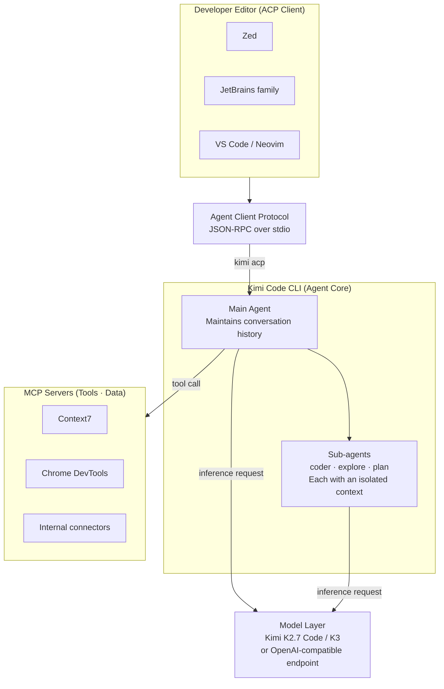

Last week Moonshot AI released the open-weight model Kimi K3 and took the top spot on the coding leaderboards. But something that touches developer workflows even more directly slipped out quietly alongside it: **Kimi Code CLI**, an open source terminal coding agent that Moonshot released under the MIT license. LinkedIn timelines were full of posts framing it as "features Claude Code doesn't have." We didn't take that line at face value and instead checked the official repository and documentation ourselves. The short version: half of the pitch holds up, and half is overstated. The genuinely interesting part turned out to be something the marketing didn't emphasize at all.

This post covers what Kimi Code CLI is, what it actually delivers, and why it is worth watching from the perspective of a team running a Kubernetes based AI platform. We spend a good part of it on why Agent Client Protocol, an open standard, is a piece that could reshape the agent ecosystem.

## What Kimi Code CLI Is

Kimi Code CLI is an agentic coding tool that runs in the terminal, in the same family as Claude Code, Gemini CLI, and Codex CLI. The official repository is [MoonshotAI/kimi-code](https://github.com/MoonshotAI/kimi-code), and it evolved from the earlier project [MoonshotAI/kimi-cli](https://github.com/MoonshotAI/kimi-cli), carrying existing sessions and configuration forward. Both repositories are official Moonshot projects, so be careful not to confuse them with similarly named third-party projects.

Here is the first correction worth making. The tool's official name is not "the CLI for Kimi K3" but **Kimi Code CLI**. It is not tied to a single model. By default it pairs with Moonshot's coding-specialized model, Kimi K2.7 Code, but configuration lets you switch to K3 or other models as well. K3 is one of several models the CLI can attach to, not a model the CLI was purpose-built for. K3 itself is a 2.8 trillion parameter open MoE model that Moonshot released on July 16, 2026, built around Kimi Delta Attention and up to a 1 million token context window. This launch was covered jointly by CNBC, Bloomberg, and Forbes, among other major outlets.

Establishing the full picture first makes the details land much better later. The core idea is that Kimi Code CLI plays a dual role: on one side it is an MCP client connecting to tools and data, and on the other side it is an ACP server connecting to editors.



## Sub-agents: Splitting Context to Keep the Main Thread Clean

Kimi Code CLI ships with three built-in sub-agents. **coder** is the general engineering agent that reads and writes files and runs commands to make actual changes. **explore** is read-only and dedicated to surveying the codebase. **plan** produces implementation plans and architectural designs without running any shell commands. This split is spelled out in the official [Agents and Sub-Agents](https://moonshotai.github.io/kimi-code/en/customization/agents.html) documentation.

What matters here is not the naming but the context isolation. Each sub-agent gets a fully independent context window and sees only the task description the main agent explicitly hands it. The main agent's conversation history is never exposed to a sub-agent, and the intermediate reasoning and tool call logs a sub-agent produces never leak back into the main history. A sub-agent returns only its final conclusion. That is why the main context stays thin instead of bloating with logs over a long session. Background and parallel execution are also supported, so multiple exploration tasks can run at once and their results flow back automatically once complete.

This pattern is not unfamiliar to us. The internal orchestration harness behind this blog also delegates exploration to low-cost sub-agents and pulls back only summaries to protect the main context. The principle that context hygiene is both a cost and a quality lever holds regardless of which tool implements it.

## MCP: A Configuration Experience Without Hand-Editing JSON

Model Context Protocol integration is managed through two paths. The first is the CLI subcommand set: `kimi mcp add`, `kimi mcp list`, `kimi mcp remove`, and `kimi mcp authorize` manage servers. For example, you can attach a documentation search server over HTTP transport, or a browser automation server over stdio transport.

```bash
# HTTP transport (with optional OAuth)
kimi mcp add --transport http context7 https://mcp.context7.com/mcp

# stdio transport connecting to a local process
kimi mcp add --transport stdio chrome-devtools -- npx chrome-devtools-mcp@latest
```

The second path is the interactive slash command `/mcp-config` inside the TUI, which lets you add, edit, and authenticate servers without touching a JSON config file directly. `/mcp` shows the currently connected servers and the list of loaded tools. The claim that "you don't need to edit JSON directly," which the LinkedIn post emphasized, is accurate. That said, this convenience by itself is not something Claude Code lacks either; we return to that point later in this post. See the [MCP configuration](https://moonshotai.github.io/kimi-cli/en/customization/mcp.html) docs for details.

## Agent Client Protocol: The Most Important Piece of This Tool

This is the most interesting part of this article. Agent Client Protocol, abbreviated ACP, is an open standard built by the Zed editor team. It is Apache licensed and runs JSON-RPC 2.0 over stdio, with the editor spawning the agent as a child process and communicating through standard input and output. The transport mechanism itself is identical to the Language Server Protocol.

An analogy helps a great deal here. Before LSP existed, every editor needed a separate integration for every language. LSP turned that M-times-N problem into M-plus-N: an editor only needs to implement the standard once, and it benefits from every language server anyone builds. ACP does exactly the same thing for agents. Once an editor implements ACP, any agent built by anyone plugs into it through a standard interface. This concept is explained in [Zed's introduction to ACP](https://zed.dev/acp) and in [Marc Nuri's write-up](https://blog.marcnuri.com/agent-client-protocol-acp-introduction).

It is easy to confuse ACP with MCP, but the direction is reversed. MCP flows from the agent toward tools and data, with the agent acting as the MCP client. ACP flows from the editor toward the agent, with the agent acting as the ACP server and the editor acting as the ACP client. The same agent can play the MCP client role on one side and the ACP server role on the other at the same time, which is exactly why the diagram above draws that dual role.

Kimi Code CLI supports this protocol natively through the `kimi acp` subcommand, with no separate installation required. Zed connects natively, JetBrains connects through a plugin, and based on Zed's ACP registry, several other editor integrations are already listed. Developers can drive a Kimi session without ever leaving the editor they already use.

## Image and Video Input: What Actually Works

The LinkedIn post claimed you can "feed a screen capture directly as input." This needs a correction. The feature Moonshot actually markets front and center is not a static screenshot but **screen recording video input**. The repository description says that dropping a screen recording or demo clip into the chat lets the agent directly see and understand behavior that's hard to describe in words. Pasting images into the CLI input is also supported, and the default model, Kimi K2.7 Code, is natively multimodal with a 400 million parameter vision encoder called MoonViT, so it accepts text, images, and video all together. That said, when you attach a custom model, that model's modalities must explicitly declare image support for this to work correctly. To summarize, image input does work, but the feature actually marketed as the real differentiator is video input, and the word "screenshot" is somewhat inaccurate here.

## Installation Is Really Three Steps

The installation flow is as simple as advertised. The commands below follow the [official getting started guide](https://moonshotai.github.io/kimi-cli/en/guides/getting-started.html). Our internal sandbox does not have access to the relevant distribution domain, so we did not run these ourselves and are not logging execution output. We are not fabricating any benchmark numbers here; we are only citing verified commands.

```bash
# 1) Run the install script (also installs uv)
curl -LsSf https://code.kimi.com/install.sh | bash

# 2) Run it from your project directory
kimi

# 3) Set up authentication
/login
```

macOS also supports `brew install kimi-code`, and Windows has a PowerShell script. Building from source requires Node 24.15 or later and pnpm. The license is MIT, which puts few restrictions on reading the code, forking it, or deploying it internally.

## Model and Provider Openness

Context length tops out at 256,000 tokens for the K2.6 line, and Moonshot's marketing claims up to 1 million tokens for K3. More important is provider openness. In `~/.kimi-code/config.toml` you can register multiple providers, including OpenAI-compatible endpoints, an Anthropic API key, and Google GenAI or Vertex AI. That means the CLI is not locked into a single model. It also automatically handles the `reasoning_content` field from third-party reasoning models. See [Providers and models](https://moonshotai.github.io/kimi-cli/en/configuration/providers.html) for the details.

## Is This a Feature Claude Code Lacks? An Honest Comparison

The most widely circulated pitch was "this gives you features Claude Code doesn't have." After verifying it, that framing turns out to be mostly overstated.

Sub-agents and context isolation are already offered by Claude Code through its own sub-agent feature, in the same way. MCP is also mature in Claude Code, which already supports stdio, SSE, and HTTP transports. Image pasting exists in Claude Code as well. None of these three are actual differentiators.

The real differences sit in two places. First, how ACP support is delivered. Kimi Code CLI bakes ACP into the CLI itself as a first-class feature through the `kimi acp` subcommand. Claude Code, by contrast, connects through a separate adapter package built by Zed, currently in beta. From a user's perspective, the former just works once you turn it on, while the latter requires bolting on an additional bridge. Second, model openness. Kimi is open across its open-weight K series with the ability to switch providers, while Claude Code is limited to Anthropic's own models. A third difference follows from this: self-hosting potential. Kimi combines an open source CLI with open-weight models, making on-premise serving possible, whereas Claude Code has an open CLI but a model that is API-only. The relevant evidence is in [Zed's post on the Claude Code ACP beta](https://zed.dev/blog/claude-code-via-acp).

## Implications for ThakiCloud's Products

This topic touches both the agent tooling axis and the open model and on-premise infrastructure axis, so we apply two lenses together.

Through the Paxis lens, Kimi Code CLI's structure overlaps quite a bit with our product's design direction. Paxis is ThakiCloud's Agent-Native Cloud control plane, treating skills, tools, policies, and audit logs as first-class resources. The way Kimi's coder, explore, and plan sub-agents run in parallel with isolated contexts shares the same underlying philosophy as the way Paxis's skill harness selects among more than 960 skills with BM25 and runs them in isolated sandboxes. ACP in particular, as a vendor-neutral standard, is a direct opportunity for Paxis. Any agent we deploy, including ones running our own fine-tuned models, could plug into a customer's development editor such as Zed or JetBrains through a standard interface simply by implementing ACP. The combination of MCP for connecting to data and ACP for connecting to editors is exactly the kind of integrated picture we are aiming for.

Through the ai-platform lens, openness translates directly into deployment freedom. Running an open-weight K-series model on top of our cluster's Kueue GPU scheduling and vLLM serving, and routing the CLI to an internal endpoint, would let us build an internal coding agent without depending on an external API or exporting data outside our environment. That aligns well with on-premise security requirements in domains like finance or the public sector where code cannot leave the organization, including requirements tied to Korea's National Intelligence Service. As capability becomes commoditized and cheaper, what enterprises actually end up paying for is a controlled execution environment, a point we have made in earlier posts as well. Kimi Code CLI matters precisely because it opens up that execution layer as open source.

## Caveats and Counterarguments

A few things deserve a colder look. First, some third-party deep dives reference internal engine names or layer structures that don't appear in the official documentation, which suggests they may be the product of reverse engineering. It is safer to treat the official docs as the source of truth before citing those as fact. Second, there are community reports that the ACP path produces better response quality than other connection methods, but this is anecdotal rather than benchmarked, and we don't treat it as verified data. Third, even with open weights, actually serving a 2.8 trillion parameter class model on-premise requires substantial GPU resources. Openness does not automatically mean easy self-hosting, and the API route remains the practical choice for small teams. Fourth, the maturity and stability of the tooling ecosystem may still favor Claude Code or Codex CLI. Being open source does not by itself mean production ready.

## Conclusion

Even so, the direction toward agents and editors loosely coupled through open standards is a clear trend. A world where developers aren't locked into a single vendor's CLI, and can swap out the model and the editor independently, is a better world for developers. Kimi Code CLI is one of the pieces bringing that world closer.

## Sources

- [MoonshotAI/kimi-code (official repository)](https://github.com/MoonshotAI/kimi-code)
- [MoonshotAI/kimi-cli (previous repository)](https://github.com/MoonshotAI/kimi-cli)
- [Kimi Code CLI getting started guide](https://moonshotai.github.io/kimi-cli/en/guides/getting-started.html)
- [Agents and Sub-Agents documentation](https://moonshotai.github.io/kimi-code/en/customization/agents.html)
- [MCP configuration documentation](https://moonshotai.github.io/kimi-cli/en/customization/mcp.html)
- [Zed - Agent Client Protocol](https://zed.dev/acp)
- [ACP: The LSP for AI Coding Agents](https://blog.marcnuri.com/agent-client-protocol-acp-introduction)
- [Zed - Claude Code via ACP (beta)](https://zed.dev/blog/claude-code-via-acp)
- [MarkTechPost - Kimi K3 launch](https://www.marktechpost.com/2026/07/16/moonshot-ai-releases-kimi-k3-a-2-8-trillion-parameter-open-moe-model-with-kimi-delta-attention-and-1m-context/)
