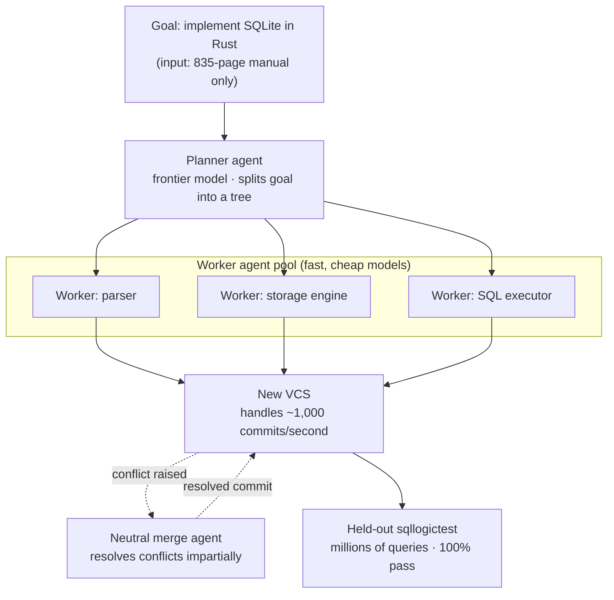

Over the weekend Cursor published a striking demo. It handed a swarm of agents the task of rebuilding SQLite from scratch. No source code, no existing test suite, no internet. The only input was SQLite's 835-page official manual. The swarm read that document and wrote a SQLite replica in Rust, and that replica passed a separately held-out test suite (sqllogictest) at 100%.

The numbers grab attention, but the point of this post is not the spectacle of the demo. LinkedIn and X timelines carried a single sentence: "AI rewrote SQLite." We did not just repeat it. We checked Cursor's official blog and the original announcement directly. The real story is not "it worked" versus "it failed," but that **the same result cost up to 15x more depending on how the models were composed**. For anyone actually operating multi-agent systems, what that 15x means is the heart of this article.

## What happened

The task Cursor used for validation was "implement SQLite in Rust, from scratch, using only the documentation." This task had already defeated an earlier swarm once, so it served as a litmus test of whether the system had genuinely improved. In official figures:

- **Correctness**: The Rust replica the new swarm produced passed a held-out sqllogictest suite at 100%. That suite consists of millions of queries.
- **Progress speed**: With a Grok 4.5 configuration it reached the 80% mark in four hours. The earlier swarm, on the same task, saw its progress collapse and had to be paused before the second hour.
- **Cost spread**: Achieving the exact same goal cost **15x** more or less depending on the model mix. The cheapest combination, an Opus 4.8 planner with Composer 2.5 workers, cost $1,339, while running every role on GPT-5.5 cost $10,565.

That last item is the real headline. If the quality of the output is the same but the bill swings by 15x, then the variable that decides multi-agent outcomes is not "which model is smartest" but "which model goes where."

## What the swarm looks like

Cursor's swarm is built from two kinds of agents. **Planner** agents, run on the smartest frontier models, break the goal into a tree and delegate the pieces. **Worker** agents, run on fast and cheap models, execute the delegated fragments. Cursor describes this as a superset of more rigid orchestration systems: rather than imposing a fixed topology, the swarm's shape grows to fit the contours of the problem, and compute and context scale in proportion to task complexity.

Up to here it is a familiar picture. The part with real engineering in it comes next: **version control and merge-conflict handling**.

## Why build a new version control system

One number explains the decision entirely. The earlier swarm, building a browser, peaked at roughly 1,000 commits per hour on Git. The new system peaks at roughly 1,000 commits per **second**. The time unit shifted from hours to seconds, about 3,600x. Standard version control tooling cannot handle that rate, so Cursor built its own version control system from scratch.

Speed was not the only problem. When many agents touch the same codebase at once, merge conflicts explode. According to Cursor's official figures, the old approach accumulated more than 70,000 conflicts by the time it was paused, and that count accelerated rather than stabilizing. The new run logged fewer than 1,000 conflicts across the full four hours.

What made the difference is a **neutral merge agent**. A third-party agent intervenes on merge conflicts and resolves them on behalf of all parties. Its only goal is to be impartial and efficient, similar to how an engineering team's merge queue works. In other words, what actually made the swarm run was not smarter individual models but the **orchestration infrastructure** that absorbs conflict.

## What was actually validated

It is honest to separate what the announcement confirmed from what it did not.

Confirmed: rebuilding SQLite-grade systems software from documentation alone is now within reach for a swarm, and that rebuild was validated by an independent held-out test. Passing a held-out suite at 100% is some assurance that the agents did not overfit to the tests, because it was validated on queries never seen during the run.

At the same time, some caution is warranted. "It rewrote SQLite" is true within the range of SQL semantics that sqllogictest covers. It does not mean the swarm reproduced everything real SQLite has handled over decades: file-format compatibility, crash recovery, extreme concurrency, and subtle performance paths. This demo is evidence that a swarm can fill a specification expressible as tests, not evidence of a 1:1 drop-in replacement for production SQLite. Cursor itself framed it as a benchmark task, not a product launch.

## What this means for ThakiCloud

This case nearly confirms the design assumptions behind **Paxis**, our Agent-Native Cloud. It also connects to the economics logic of the **ai-platform** (our K8s-based AI/ML infrastructure) beneath it.

**Paxis lens: orchestration is the capability.** Cursor's lesson, in one sentence, is that "better orchestration, not a smarter model, produces the result." Paxis stands on exactly this assumption. Paxis is a control plane that treats Skills, Tools, Policies, and Audit Logs as first-class resources: it selects among 960+ skills with BM25, runs them in isolated sandboxes, and decomposes work with DAG-based multi-agent orchestration. Cursor's planner/worker split has the same skeleton as Paxis's DAG orchestration. In particular, the way Cursor absorbed merge conflicts with a neutral agent comes from the same concern as Paxis passing every agent action through **policy gates and audit logs**. When many agents touch shared state at once, what prevents chaos is not individual intelligence but coordination rules.

**ai-platform lens: the 15x is a placement problem.** The fact that cost swung 15x by model mix means multi-agent economics ultimately come down to **where you place which model**. A frontier model on the planner and a cheap model on the workers costs $1,339; pushing every role to the priciest model costs $10,565. ThakiCloud's ai-platform is aimed exactly at making that placement cheap at the infrastructure level. Kueue-based GPU scheduling packs the worker tier densely at low cost, vLLM serving and multi-tenant isolation lower the unit price of large-scale parallel inference for cheap models, and on-premises and sovereign deployment secure self-hosted economics instead of pay-per-call API billing. If Cursor cut 15x with a mix of cloud APIs, an organization with its own infrastructure can push that curve down once more by moving the worker tier to self-hosting. Low-cost serving (ai-platform) is what creates agent economics (Paxis).

In short, Cursor's demo is not a story about agents doing something amazing. It is a story that the infrastructure to orchestrate agents cheaply is where the contest is decided. And building that infrastructure into a product is what we do.

## Limits and counterarguments

Start with the strongest counterargument. All of these figures were published by Cursor itself. The composition of the held-out suite, the failing cases, and the details of the paused run have not been independently verified externally. The 15x cost spread is also specific to Cursor's particular swarm implementation, a particular task, and model prices at a particular moment, and is unlikely to transfer directly to other workloads. Model prices change quarterly, so the multiple itself is unlikely to last.

Second, the "it rewrote SQLite" framing leaves room for overstatement. As noted, filling a specification expressible as tests is different from replacing a production database with decades of accumulated edge cases. In systems software, there is a wide gap between "100% of tests pass" and "trustworthy in production."

Third, building a version control system from scratch for 1,000 commits per second means this approach presumes a **massive infrastructure investment**. For most teams, the bigger barrier is not running the swarm but standing up the VCS, isolation, and merge infrastructure to sustain it. This is paradoxically exactly why a control plane like an Agent-Native Cloud is needed. The value of a swarm comes not from individual agents but from the infrastructure to run it, and for organizations that cannot build that infrastructure themselves, a productized orchestration layer becomes the alternative.

Finally, for balance, the other direction. Despite all these caveats, the fact that SQL semantics of SQLite-grade software passed held-out validation from documentation alone is a result a skeptic would have dismissed a year ago. The direction is clear. The remaining question is not "is it possible" but "how cheaply and how reliably can you orchestrate it," and the answer to that question lives in the infrastructure.

## Sources

- [Agent swarms and the new model economics (Cursor official blog)](https://cursor.com/blog/agent-swarm-model-economics)
- [Cursor official announcement (X)](https://x.com/cursor_ai/status/2079256614238814551)
- [Cursor's AI Swarm Rebuilt SQLite From Scratch at 15x Lower Cost (AlphaSignal)](https://alphasignal.ai/news/cursor-s-ai-swarm-rebuilt-sqlite-from-scratch-at-15x-lower-cost)
