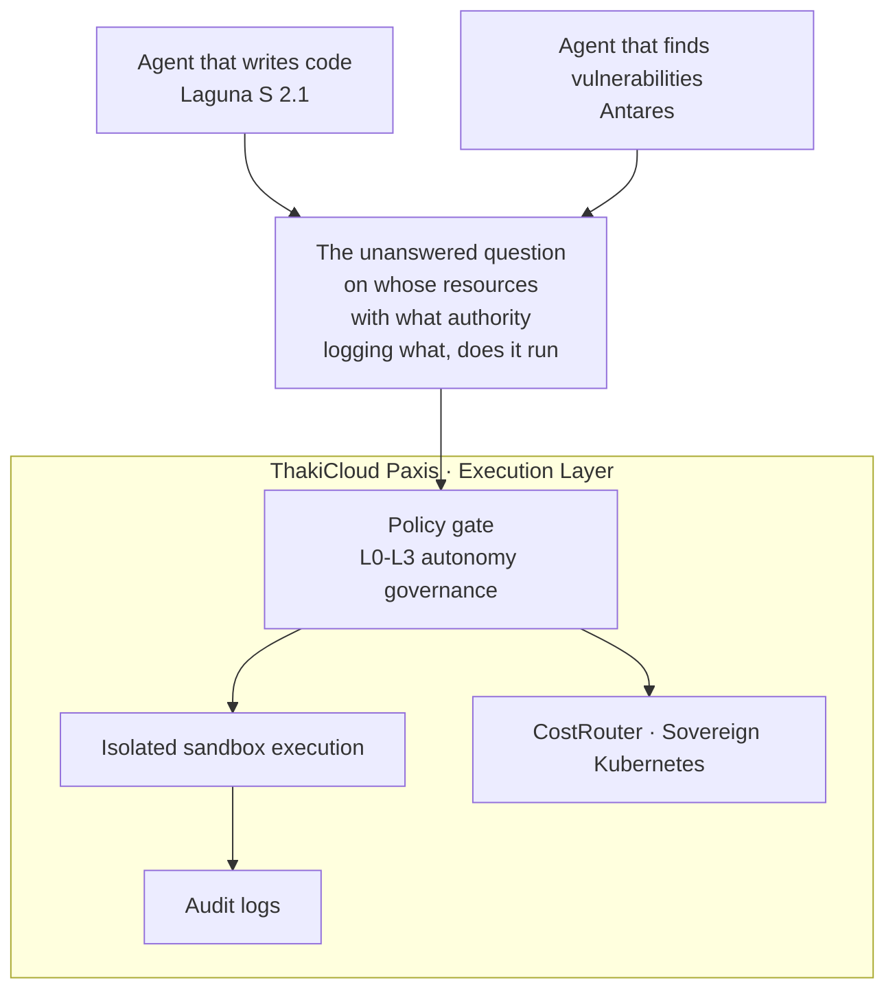

The symmetry is too precise to be coincidence. On July 22, 2026, two open weight models with opposite personalities arrived on the same day. One writes code. The other finds vulnerabilities in code. Poolside released Laguna S 2.1, a model built for self hosted coding agents, and Cisco introduced Antares, a small open weight model specialized in detecting code vulnerabilities. It is as if a sword and a shield were hung side by side in the same display case.

Read separately, these two releases are unremarkable news items each in their own right. Read together, the story changes. It means that both the side that builds software and the side that audits it are moving to agents at the same time. And the moment you put both models on your own infrastructure, a question remains that no one else will answer for you. On whose resources, under what authority, and leaving what record do these agents actually run.

## The Same Day, From Opposite Ends

Poolside's Laguna S 2.1 reads like a Western answer card. The announcement is aimed squarely at the trend where Chinese open weight models such as DeepSeek and Qwen had been pulling ahead in the coding agent space. Foreign outlets described it as the most credible Western open weight option released over the past year for self hosted agentic coding. What stands out is not the performance but the size. With a low activation architecture of only 8 billion active parameters, it reportedly matched competing models several times its size on benchmarks, and the real message is that it cuts both inference cost and the burden of running on premises. The fact that it can run on a single piece of DGX Spark class hardware means a dedicated coding agent can now fit onto even a small GPU partition.

Cisco's Antares makes the same case from the opposite side. A small on device language model, it argues, can beat huge general purpose models in security work on both cost and accuracy. Cisco claims Antares outperforms more than a dozen large open and closed models on benchmarks while running far more cheaply. What matters most here is where it executes. Because it runs locally, source code never has to leave the building. For financial institutions and public agencies under strict rules against exporting source code, that single fact can decide whether the tool gets adopted at all.

The two models point in opposite directions yet share the same design philosophy. Build small, release the weights openly, and run it on your own infrastructure rather than someone else's cloud. Even the deployment strategy matches. Releasing the core model as open weight while keeping the best performing version locked inside your own product has become the common grammar shared by security startups and large vendors alike these days. Generation and auditing are being rewritten side by side under the same rule of self hosting.

## Where Open Weights Rewrite the Rules of Auditing

In the past, scanning code for vulnerabilities usually meant calling a frontier model. That created two problems. Cost made continuous scanning hard to sustain, and the source code being scanned had to flow out to an external API. That is precisely why many Korean security teams gave up on continuous scanning under budget constraints. Antares addresses both bottlenecks at once. Running locally eliminates the export problem, and the small model size lowers the cost. This is also the context behind Cisco explicitly naming universities, the public sector, and under resourced small and mid sized security teams as target users.

The same logic applies directly to the generation side as well. The fact that Laguna S 2.1 pairs a permissive license with open weights widens the room for building self hosted coding assistants in finance and public sector environments that must satisfy network segregation rules or National Intelligence Service requirements. It is one more option for cutting reliance on closed APIs. Naturally, this freedom comes with homework attached. Because the domestic distribution and support ecosystem and its handling of Korean language code comments have not yet been verified, real world adoption will first need to clear benchmark reproduction and Korean environment fit testing.

Cisco, however, drew its own boundary. The model does not replace dependency analysis, secrets scanning, or dynamic testing, and it is meant to sit at the initial filtering stage. That is an honest limitation. And this limitation leads straight into today's real subject. Both the generation model and the audit model each handle only a slice of their own role, and stitching those two slices into one accountable flow is a separate problem entirely.

## The Gap Neither Generation Nor Audit Fills

Another story from the same day shows that gap precisely. Imweb, a Korean e-commerce platform, said it had deployed AI across development and operations broadly enough to shrink four years of work into three months. It even maintains the conservative practice of cross checking with OpenAI, Anthropic, and Google models simultaneously. But one sentence stands out. It performs automatic rollback immediately after detecting an infrastructure anomaly, without human approval. From a productivity standpoint that is something to boast about, but from a governance standpoint it is an alarm bell. An agent that can revert production without approval is, by the same token, an agent that can do other things without approval too.

A signal from the public sector points to the same conclusion from the opposite direction. In rolling out its generative AI service, the Korea Deposit Insurance Corporation set building a data catalog and an AI risk management framework as prerequisite tasks ahead of model selection. An institution handling the public's assets choosing to build a control framework before choosing a model reveals plainly that the real gatekeeper for AI adoption in regulated industries is not performance but explainability and audit trails. On one side autonomy is racing ahead, and on the other control is settling in first. Right at the point where these two demands meet, a standardized layer is currently missing.

The generation model makes code, and the audit model finds its flaws. But recording what level of autonomy an agent moves with, under whose policy's permission it executes, and what it touched and when, falls under neither model's mandate. This is not a problem of the model. It is a problem of the execution layer.

## Hardware Sovereignty Alone Doesn't Close It

It might seem like this gap could be closed simply through the scale of infrastructure, but today's news says otherwise. On the very same day, three business leaders, Lee Jae-yong, Chey Tae-won, and Lee Hae-jin, met Jensen Huang in Silicon Valley to restart an Nvidia centered AI supply chain alliance, a major move that could reshape the landscape of domestic sovereign AI infrastructure. Samsung SDS launched NPUaaS built on FuriosaAI's domestically made NPU, bringing a homegrown alternative to what had been a GPU only inference infrastructure into commercial deployment for the first time. For the public and financial sectors, this means one more sovereign option for reducing dependence on foreign GPUs, and it also raises the possibility that domestic NPUs could later appear as a requirement in government cloud procurement bids.

Sovereignty at the level of chips, data centers, and supply chains is filling in this quickly. But hardware sovereignty only answers half the question. A self hosted coding agent running on a domestic NPU does not automatically define what that agent is authorized to do or what it must leave behind as a record. Blocking data export and controlling execution are problems at different layers. The more sovereign infrastructure gets completed, the more clearly it exposes the absence of a software layer that defines the autonomy and auditing of the agents running on top of it.

## The Answer Lives in the Execution Layer

The whole picture, generation, audit, and the gap between them, looks like this.

ThakiCloud's Paxis is built to handle exactly this missing layer. Paxis is a cloud for agents, a full fledged product that treats Skills, Tools, Policies, and Audit Logs as first class resources. Whether you attach a coding agent like Laguna S 2.1 to the backend or put an audit model like Antares in front of a scan, the agent still has to pass through a policy gate, run inside an isolated sandbox, and leave every action in an audit log. If the unapproved automatic rollback in the Imweb case read as unsettling, Paxis's autonomy governance spanning L0 through L3 is the counterweight to that unease. You can declare, as policy rather than as code, the boundary where some tasks are left fully autonomous and others require mandatory human approval.

The sovereignty requirement meets Paxis at the same layer. Just as Antares only makes sense if it runs locally without exporting source code, Paxis operates on sovereign, on premises Kubernetes and includes a CostRouter that picks the right model for each task. Narrowing down suspect files with a low cost local model and calling in a larger model only when needed is precisely Cisco's own recommendation, to position Antares as an early filter, implemented at the infrastructure level. Adding new models and tools through MCP connectors and a skills marketplace does not change the rules of execution and record keeping. The data governance and risk management framework that the Korea Deposit Insurance Corporation wanted to build ahead of choosing a model is likewise absorbed into the policy and audit layer the platform provides by default, rather than being rebuilt from scratch for every individual project.

A fair objection could be raised here. Isn't this just piling on yet another layer of control, tying back up the speed and autonomy that open weights had hard won, under the name of policy and audit? If Imweb finished four years of work in three months precisely because it rolled back instantly without human approval, then that very speed could be the source of its competitive edge. That is a valid point. But the purpose of autonomy governance is not to eliminate autonomy, it is to draw an explicit boundary around how far that autonomy extends. Declaring in advance which tasks may roll back without approval and which tasks must go through a human actually lets teams delegate more boldly within the safe zone. When the boundary is blurry, a team suspects every piece of automation, but when the boundary is fixed as policy, the team runs freely inside it. Control and speed are not opposites, they grow together once the boundary is clear. The Korea Deposit Insurance Corporation building its control framework before its model was likewise not a choice to slow adoption down, but a choice to make adoption sustainable.

The two releases from July 22 announce that agents have begun to acquire the ability to write code and the ability to watch over it at the same time. That is welcome progress. But as capability grows, the gap in accountability grows right along with it. The more common agents that build code and agents that audit code become, the scarcer what actually becomes is the place where those agents run safely and leave a complete record. Once you have both the sword and the shield, one question remains. Whose rules do the two of them ultimately fight under. Choosing a model keeps getting easier, but taking responsibility for what that model produces remains just as hard. What the sword and shield hanging side by side today tell us is that the next stage for competition will not be bigger models, but the execution layer where those models live and move safely.

## References

This article synthesizes the following news coverage:

- Global Economy, [엔비디아, 차세대 AI플랫폼 '베라루빈' 본격 공급 통해 "선두 수성"](https://www.getnews.co.kr/news/articleView.html?idxno=875704)
- Money Today, [LGU+·LS일렉트릭, AI 데이터센터 800V DC 공동 개발 나선다](https://www.mt.co.kr/tech/2026/07/22/2026072207035073681)
- Global Economic, [HPE, 슈퍼컴퓨팅 개발환경 통합…소버린 AI 인프라 간소화](https://www.g-enews.com/view.php?ud=202607212059199803112616b072_1)
- Newsworks, [[#클라우드 월드] 삼성SDS-퓨리오사AI 'NPUaaS' 출시·LG CNS 'AI 캠퍼스'...](https://www.newsworks.co.kr/news/articleView.html?idxno=847787)
- ZDNet Korea, ["SKT, AI팩토리에 가장 적극적인 통신사...풀스택AI·전국망 경쟁력"](https://zdnet.co.kr/view/?no=20260721191819)
- Yakup News, [BMS‧엔비디아, 생명공학 최강 AI 팩토리 구축](https://www.yakup.com/news/index.html?mode=view&cat=16&nid=330043)
- Global Economic, [미국 데이터센터 전력 수요 급증… 호남 반도체 허브, 전력망·용수가 ...](https://www.g-enews.com/view.php?ud=202607220659395424fbbec65dfb_1)
- Digital Today, [풀사이드, 코딩 에이전트용 오픈웨이트 모델 '라구나 S 2.1' 공개](https://www.digitaltoday.co.kr/news/articleView.html?idxno=685807)
- Etoday, [키미 쇼크에 ‘AI 2강’ 험로…'특화 AI' 키우고, 경량화 모델로 차별화...](https://www.etoday.co.kr/news/view/2605803)
- Digital Today, [포티투마루, 예금보험공사 데이터 관리체계 고도화·생성형 AI 서비스 구...](https://www.digitaltoday.co.kr/news/articleView.html?idxno=685817)
- News2Day, [밖에선 AI 인재 찾고 안에선 업무 혁신…NHN의 AX '승부수'](https://www.news2day.co.kr/article/20260721500191)
- Byline Network, [“4년 걸린 일을 3개월에”…아임웹이 안팎으로 AI 쓰는 법](https://byline.network/?p=9004111222612588)
- IT Chosun, [내년 지원 불투명한데…정부 '모두의 AI' 출시 서두르나](https://it.chosun.com/news/articleView.html?idxno=2023092166202)
- EBN, [이재용·최태원·이해진, 美서 젠슨 황 만난다…AI 공급망 동맹 재가동](https://www.ebn.co.kr/news/articleView.html?idxno=1717215)
- Digital Today, [시스코, 코드 취약점 탐지 특화 오픈웨이트 소형 모델 '안타레스' 공개](https://www.digitaltoday.co.kr/news/articleView.html?idxno=685800)
- News Journalism, [AI가 바꾼 보안 공식…에스원 '현장 데이터'로 승부](https://www.ngetnews.com/news/articleView.html?idxno=551683)
