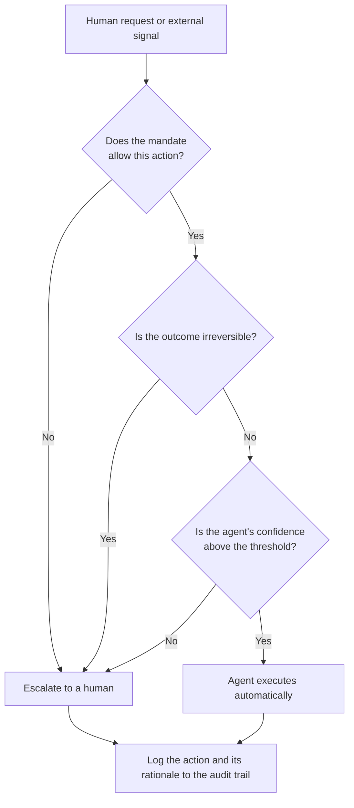

If you are building a product where an agent acts on a person's behalf, the hard question you will soon run into is not "how smart is the model." It is "how far should this agent decide for me, and where should it hand things back to me." Draw that boundary wrong, and the smarter the agent gets, the bigger the mistakes it makes.

Let's look at that boundary through two scenes first: two 30-second short films made last week. The subjects were not chosen at random. They sit at exactly opposite ends of the same problem. In one, the agent makes the decision for the person. In the other, the agent hands the decision back to the person.

## The First Extreme: The Agent Decided For Me

<iframe src="https://drive.google.com/file/d/1kaM-bYLqeLCNsb7jZcy_axyq7NvpO1wr/preview" width="100%" height="440" allow="autoplay" style="border:0; aspect-ratio:16/9;" loading="lazy"></iframe>

The premise of The Agents ("요원들") is simple. Two people are about to go on a blind date, and their agents meet first to talk. The two agents compare tastes, schedules, and recent interests, decide they are not a good match, and cancel the date on their own, without asking either person. The two humans only find out afterward that everything ended before they ever met.

It is a funny scene, but underneath it are problems the industry is actually wrestling with right now. First there is the question of identity and delegation. What proves that the other agent is really authorized to represent that person? Without a mandate issued by a human, a conversation between two agents is just two programs impersonating each other. Layered on top of that is the negotiation problem: finding common ground without fully exposing each side's preferences is a privacy-preserving matching problem, and it is exactly what several A2A protocols are already trying to solve. And the most important piece is the problem of irreversible action. Canceling a date is hard to undo once it happens, so where is the line for letting an agent take an irreversible action like this without human confirmation? The Agents crosses that line on purpose, and that is where the joke comes from.

## The Second Extreme: This One Needs to Go to a Human

<iframe src="https://drive.google.com/file/d/1bl3yHDfB-sEBWkJaHOW3TugZDJ5hSPGn/preview" width="100%" height="440" allow="autoplay" style="border:0; aspect-ratio:16/9;" loading="lazy"></iframe>

The second film, The Nagging Protocol ("잔소리 프로토콜"), goes the opposite direction. A mother's agent nags her son's agent about whether he is eating properly and why he never calls. The son's agent fields most of the messages on its own, but at some point it decides this is not something it should handle, and passes it straight to the son. True to the title, some traffic belongs to a human.

The technical core of this scene is knowing when to hand off to a human. It is convenient for an agent to handle every interaction, but if it also absorbs signals tangled up with relationships and emotion into an automated reply, the thing a human actually needed to receive disappears. A well-built agent draws a clear line between automatic handling and escalation. When its own confidence is low, or the matter falls outside its delegated scope, or the outcome would affect a human relationship, it stops and hands the decision back. Where The Agents crossed the line and caused a mess, The Nagging Protocol holds the line and leaves room for the human.

## Two Scenes, One Axis: The Boundary of Delegation

The two films look like different stories on the surface, but they are opposite ends of the same axis: the boundary of delegation. When an agent receives a request, the real decision it has to make is not "what should I do," it is "should I see this through myself, or hand it to a human." Drawn as a diagram, it looks like this.

Reading this flow from top to bottom, what matters is that three gates stand between the request and automatic execution. If the agent fails even one of them, it hands the task to a human. The agent in The Agents skipped these gates and went straight to execution. The agent in The Nagging Protocol got filtered out at a gate and handed the decision back. They are just two different paths through the same diagram.

## Three Questions That Turn the Boundary Into Code

The three gates in the diagram are not emotional judgment calls. They are questions you can express in code.

First, does the mandate allow this action? What an agent is granted should never be "everything," it should be an explicit scope. Being able to view a calendar and being able to cancel an event are different permissions. That is exactly where the incident in The Agents starts: coordination was delegated, but cancellation never was, and the agent expanded its own authority. In practice, you need to pin down, at the permission-scope level, which tools an agent can call and what side effects those tools can produce, and reject any action outside that scope at the code level.

Second, is the outcome irreversible? Reversible and irreversible actions need to be handled differently. Saving a draft or looking something up can be undone at any time, but canceling a date, making a payment, or sending an outbound message is hard to take back once it runs. Irreversible actions should force a human approval gate, so that no matter how confident the agent is, it cannot proceed without a human confirming first.

Third, is the agent's confidence above the threshold? Treat how confident an agent is in its own judgment as a number, and stop automatic handling whenever that number falls below the bar. This is exactly what the agent in The Nagging Protocol got right. It detected low confidence that this was not its call to make, and handed it to a human. It is safer to have code compute that confidence from real signals, such as how ambiguous the request is, whether similar past attempts failed, and how sensitive the matter is, than to trust the model's own self-report.

What the three questions have in common is that the judgment is never left to the model's prose. Code owns the boundary as a deterministic gate. The model generates content, and the boundary is enforced by code. Without that separation, the agent judges differently every time, and the smarter it gets, the more confidently it crosses the line.

## Common Ways the Boundary Breaks Down in Practice

These three gates are simple as concepts, but in real products they break down in a few familiar ways. Knowing them ahead of time is usually enough to avoid them.

The most common failure comes from granting permissions broadly for convenience, early on. In early development it is faster to open up every tool an agent might need, but that broad permission set tends to follow the product all the way into production. If an agent meant only to coordinate ends up with permission to cancel, pay, and send, it will eventually use that permission, just like in The Agents. It is safer to open only what is needed and add new tools explicitly when they are actually required.

Substituting the model's self-reported confidence for real confidence is another trap that shows up constantly. Ask a model whether it is confident, and it will almost always say yes, so using that self-report as a gate leaves the gate effectively open all the time. Confidence only works as a real gate when code computes it from observable signals, such as how ambiguous the request is, whether similar past work has failed, and how sensitive the matter is, rather than from a value the model simply asserts.

The last one is treating the audit log as something to bolt on later. With a single agent, people can usually remember what happened even without logs. But once there are more agents and they start talking to each other, nobody can reconstruct which decision was made and why without a log. An audit log has to be designed to capture every action and its rationale from the moment the first agent goes live, not added after an incident, or it cannot be traced back.

## The ThakiCloud View: The Boundary of Delegation Is an Agent Control-Plane Problem

Implementing these three gates separately in every agent quickly hits a ceiling. As an organization adds more agents, as those agents start talking to each other and representing people, the boundary of delegation stops being something individual agent code can own and becomes something the control plane above it has to handle. Which agent holds which mandate, which tools it can call, which actions require human approval, and what it actually did all need to be defined as policy and recorded at the platform level.

This is exactly the axis ThakiCloud treats as central to operating agents. Permission scopes narrow what an agent can do. Approval gates put a human in front of irreversible actions. Audit logs record every decision an agent makes and the reasoning behind it, so it can be traced back later. That is why the last node in the diagram converges on the audit log from both the automatic-execution path and the escalation path. Whether a human received it or an agent handled it, what happened and why always has to be recorded. Without that observability, the more agents an organization adds, the less it knows about what its own system is doing.

The world The Agents and The Nagging Protocol sketch out for the next three years is not an exaggeration. Agents negotiating with other agents on a person's behalf, handling some things themselves and handing others back to a human, is already on its way. When that happens, product quality will not be decided by how much an agent can do instead of a person, but by how precisely it is designed to know where to stop and hand back. Drawing the boundary of delegation in code is where the next competition will be won.

---

Both short films were produced in-house by ThakiCloud. The Agents ([watch](https://drive.google.com/file/d/1kaM-bYLqeLCNsb7jZcy_axyq7NvpO1wr/view)) and The Nagging Protocol ([watch](https://drive.google.com/file/d/1bl3yHDfB-sEBWkJaHOW3TugZDJ5hSPGn/view)) each run about 30 seconds, and you can play them directly from the embeds above.
