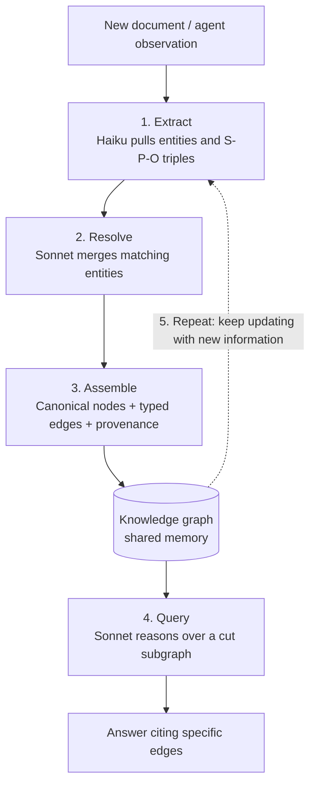

## Why This Matters

If you build multi-agent systems or long-running agent products, this piece might make you set aside the question of whether you need a bigger model. The core conclusion up front: agent memory dies with the context window, and only a knowledge graph used as shared memory keeps it alive. A senior Anthropic engineer recently laid out graph engineering for multi-agent systems in a twelve-page document. Its backbone is five steps, Extract, Resolve, Assemble, Query, and Repeat. This post breaks down why that backbone matters now and how to wire it into a real system.

## Overview

Anyone who has run agents for a while hits the same wall. What a worker learned yesterday, today's worker does not know. As a conversation grows longer, earlier turns fall out of the context window, and the moment they do, the agent forgets what it knew a second ago. Memory evaporates on a per session basis.

The usual fix is vector RAG: embed documents and pull back similar chunks. That solves "find something similar," but it stays fuzzy on "who did what, and what does it connect to." If the same person shows up under different names across documents, vectors will not merge them into one. Reasoning two or three hops across relationships is not reliable with embedding similarity alone either.

Graph engineering answers this differently. Instead of storing information as a blob, it records the relationships between entities as an explicit graph. Agent memory then becomes a queryable structure rather than a pile of sentences.

## What This Technique Is

The core idea is simple. Pull out what the agent has read and observed as subject predicate object (S-P-O) triples, accumulate them in a knowledge graph, and query a slice of that graph whenever needed. Nodes are entities, edges are typed relationships, and every triple carries provenance pointing back to where it came from.

If the context window is "what's visible right now," the knowledge graph is "what has been confirmed so far." The former disappears when the session ends, the latter stays. That separation is more or less the whole idea behind graph engineering.

Below is the cycle the five steps form.

## The Five Steps in Detail

**1. Extract.** When a document comes in, a cheap model (Haiku) pulls out entities and S-P-O triples. One call per document is enough. What's interesting here is that no separate training data is needed. A single Pydantic schema defines what gets extracted and in what shape. The schema itself is the only training signal. Because code owns the output format and the model only fills in content, the results stay consistent.

**2. Resolve.** Entities that point to the same real world thing get merged into one. A slightly smarter model (Sonnet) handles this step. "Edwin Aldrin" and "Buzz Aldrin," for instance, share no overlapping characters yet refer to the same person. String matching would never catch it. The model judges "these two are the same" using the description attached to each entity as context. The quality of entity resolution determines how trustworthy the whole graph is.

**3. Assemble.** Merged entities become canonical nodes, connected by typed edges, with provenance stamped into every triple, assembled into one connected graph. Carrying provenance matters: being able to trace which document a fact came from later on is what lets you track down and remove wrong information.

**4. Query.** When a question comes in, the relevant subgraph is serialized and handed to a model (Sonnet), which reasons over the triples. Every answer cites a specific edge. Because the reasoning behind an answer is traceable to a specific relationship in the graph, the answer becomes verifiable.

**5. Repeat.** When a new document or new observation arrives, the cycle returns to step one. The graph is not a one time artifact, it is a living memory that keeps updating.

Worth noting: model routing differs by step. Bulk extraction goes to cheap Haiku, while the judgment calls in entity resolution and query reasoning go to Sonnet. The expensive model is not smeared across every step, only used where judgment is actually required. That is exactly the principle we follow in our own internal batch jobs: keep workers cheap, spend only on the gate.

## How It Fits Into Multi-Agent Systems

The real value of a knowledge graph shows up when multiple agents share the same memory. Worker agents write what they learn into the graph. An evaluator agent checks a worker's claims against the graph. And an overnight loop picks up yesterday's progress today, through that same graph.

This lines up with something we've learned from running several automation loops ourselves. Results from fanned out subagents have to close through a verification stage, but without a shared fact store to anchor that verification, each agent starts from scratch. The graph serves as that anchor. Workers write to it, evaluators check against it, and the next loop inherits it, naturally.

## Implications for ThakiCloud Products

This technique fits particularly well with our **Paxis** platform. Paxis is an Agent-Native Cloud control plane running on top of ai-platform, treating Skills, Tools, Policies, and Audit Logs as first class resources. The five steps of graph engineering map directly onto several of its axes.

Start with the knowledge axis. Paxis's wiki knowledge engine already treats documents and entities as connected knowledge; layering S-P-O triples and entity resolution on top turns it into shared memory agents can query. Next, the orchestration axis. When a DAG multi-agent system fans out, having each worker write to the graph and the evaluator check against it closes the verification loop with data, not just prose. Finally, the audit axis. Stamping provenance into every triple runs in exactly the same direction as Paxis's policy gates and audit log philosophy. Being able to trace which evidence an answer came from is a competitive advantage in itself in environments with heavy regulatory or on premise requirements.

From an infrastructure angle, our **ai-platform** lens applies too. Extraction calls a cheap model at scale, while querying selectively calls a larger one, a structure well suited to splitting serving by model tier and running it on K8s. Scheduling batch extraction jobs with Kueue and serving small models cheaply with vLLM keeps the cost of continuously updating the graph under control. Cheap serving, through ai-platform, lowers the cost of keeping the graph alive, and that in turn is what makes the economics of agents, through Paxis, work.

## Limitations and Counterarguments

Graph engineering is not a cure all. The most painful failure mode is a wrong entity resolution. Merge two distinct entities into one by mistake, and that error spreads across the entire graph, contaminating every query that follows. Split the same entity apart instead, and memory fragments. As long as model judgment sits in this step, full automation is difficult, and periodic auditing is needed.

Hallucination at the extraction step is also a problem. If the model invents a triple that is not in the document, provenance being attached does not by itself confirm the relationship actually exists in that source. The schema enforces format, not the truth of the content.

At scale, the graph grows heavy and query latency rises. Cutting out the relevant subgraph becomes a search problem in its own right, and if the cut piece is too large, you are back at the context window limit. And if the task never needed relational reasoning to begin with, plain vector RAG is cheaper and faster than a heavy graph. The order of operations matters: first decide whether the problem is "find something similar" or "follow a relationship," before reaching for a graph.

## Summary

Giving an agent persistent memory is not solved by buying a bigger model. You have to change the structure where memory dies with the context window, and treating a knowledge graph as shared memory is the most practical answer available so far. Extract to pull facts out, Resolve to merge them, Assemble to build the graph, Query to answer with grounded evidence, and Repeat to keep it updated, those five steps are the method.

You do not need to start big. Define a small Pydantic schema around the handful of entities and relationships that matter most in your domain, and run extraction on a single document with a cheap model. The graph grows from there. The next time an agent says "I knew that yesterday but forgot it," remember that the answer is not a bigger model. It's a better memory structure.

## Sources

- [Codez (@0xCodez), "Graph Engineering for multi-agentic systems" (X)](https://x.com/0xCodez/status/2080250266851463209)
- [Anthropic Engineering, "How we built our multi-agent research system"](https://www.anthropic.com/engineering/multi-agent-research-system)
